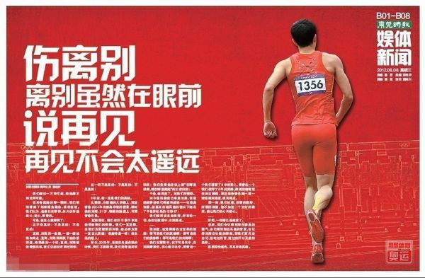

<!-- # 七星视点：明星运动员：体育市场投资学 -->

2012年，当伦敦奥运会正在如火如荼的开展时，C罗在奥运赛场外的征战同样炽烈。第十四届欧洲足球赛于不久前刚刚落下帷幕，2012/13赛季的西班牙足球甲级联赛的战幕又即将拉开，其间，C罗与梅西、伊涅斯塔的欧洲金球奖争夺战逐渐进入白热阶段。此时，历经曼联、皇马两大毫门的C罗在为俱乐部创造辉煌战绩的同时，还将自己的身价拔高至9000万元以上的惊天数字，位列欧洲第一。与战绩和身价比肩的是C罗的人气。三年前，当C罗正式以皇马球员亮相伯纳乌球场时，受到8万名球迷的热烈欢迎。而在2011年度金球奖评选阶段的民意调查中，C罗的支持率达到66.84%的顶峰——虽然在本年又下跌惨重。但可以推想，C罗在全球范围内都拥有大量的观众，影响力遍及球迷、球迷的女友、女友的老妈，后者经常目睹这位27岁的葡萄牙帅气小伙，在清扬去屑洗发露的广告上。在遥远的东方甚至组成了号称“后援会”的强大团体，似乎枕戈待旦的准备在梅西再捧金球奖的时候把他干翻。总之，C罗作为一名运动员，已经超越足球的圈子而成为一名世界级巨星。

依靠本身直观的特点与强烈的视听冲击力，再借助于电视等主流传媒的渲染与传播，竞技体育在今天已经成为一项主流的文化消费品，乃至与影视、歌舞比肩。而竞技体育的商业化与社会化，导致的是新的一轮品牌效应的来袭。与影坛、歌坛相似，体坛的发展需要偶像的塑造，自然而然就诞生了一个新的群体——明星运动员。明星运动员作为竞技体育在媒体上的图腾，已经成为了当今世界竞技体育运作中不可获缺的要素。

### 社交奥运OR市场奥运？

国际奥委会社交媒体主管霍特说：“如果说2010年温哥华冬奥会，微博还只是一片雪花，那么到了伦敦奥运会，它就成了一个大雪球了。”伦敦奥组委主席塞巴斯蒂安科也表示：“置身事外消极被动看比赛，这样的历史过去了。”

再引用一段有关伦敦奥运之社交媒体的数据：1）全球共分享了3060亿条信息2）每秒分享高达208333条3）脸书是社会化分享冠军，其中共产生了包括照片及视频在内的1020亿条信息4）推特共产生了50亿条推文5）博尔特在完成百米的9.63秒中，全球共产生了200万条分享5）菲尔普斯最牛逼，每天相关的分享大约有300万条。（Gemini娱记）

以上的数据引用只是为了印证对于本届奥运会的一项民间定义：社交奥运会。社交网络与新型媒体在奥运期间的突出表现，不由得让人产生了对奥运社会化的更高期待。在社交奥运中，奥运观众将更进一步的参与到体育盛会当中，而运动员与观众的交流也更加广泛与密切。奥运在传播上可能实现运营模式的跳跃性转变。这种转变，似乎是美好的。

当然，在另一角度上，社交奥运却呈现给人不同的观感。瑞士男足国奥队后卫米歇尔莫加内拉，在奥运男足小组赛瑞士队１：２负于韩国队的比赛之后，发布了一条针对全体韩国人的攻击性信息。结果除了被驱逐出奥运会之外，他的推特账号还被“人间蒸发”。

言论的滥用也在另一侧发生。７月３０日，一个名为“赖利＿６９”的推特用户发誓要淹死所有的英国跳水员，还恶语攻击１８岁的英国跳水名将[戴利](http://info.2012.163.com/athlete/1917.html)，说这位刚刚在男子双人１０米跳台比赛中失利的选手“对不起你死了的爸”，戴利愤慨地回应说：“我尽力了……你个白痴居然发这个给我。”第二天一早，英国多塞特郡警方在一个家庭旅馆里逮捕了涉案的１７岁少年。

奥运的社交化缔造了一种奇异的信息交换格局，一方为观众，一方为运动员，双方处在一种看似平等但丝毫不对等的关系中，而且无法明确哪一方处在优势地位，毕竟观众人数众多，而运动员更掌握话语权。社交网络也许拉近了运动员与观众，但大量的、不受控制的信息交换却似乎在助长一种相互消费的发生。双方在彼此身上满足需要，消费改造着社交。于是我们很难定义，社交奥运OR市场奥运？

一些数值也在证明奥运的市场化远甚社交化。在奥运期间的广告投放上面，50%的品牌广告完全没有触及数字领域；只有10%的广告含有Facebook, Twitter 或YouTube 链接；而上述3个品牌没有在奥运会黄金时段投放广告。（艾瑞网）

其实，哪怕在社交性的领域里，依然潜藏着大量的市场因素。运动员的社交参与，本身就存在自我包装与自我营销，再与运动员背后的庞大商业链条挂钩，社交网络再难维护纯粹性。甚至，奥运的社交是聚焦于运动员的圈形的社交模式。社交奥运无疑在加剧运动员的明星效应。

### 国有运动员OR私有运动员？

现今世界上大致存在两种体育发展模式。一种是商业运作，一种是传说中自苏联舶来的举国体制。前者意味着体育运动和运动员由民间管理培养，运动员基本上是“自生自长”的，组织参加奥运会的奥运理事会也都是非营利民间团体。代表为美国。后者则是以世界大赛的冠军为最高目标，统一动员和调配全国有关的力量，包括精神意志和物质资源，来夺取比赛运动的好成绩的工作体系和运行机制。代表为前苏联、前东德、中国、朝鲜等。前者催生了一批具有相对独立性与自主权的运动员个体以及背后的商业运营、培养团队，运动员的明星效应来源于市场反应。后者则铸就了国家包办培养下代表国家利益又服务于国家的运动员单位，明星效应与爱国主义、民族感情、政治利益、国家形象等紧密相连。我们甚至可以这样定性：前者是私有运动员，后者是国有运动员。

_[雷颐](http://rrurl.cn/0wQH56)_：体育举国体制谁是最大受益者？最大的受益者是体育总局与各省体育局。国为“举国”，所以大量资源由其掌握，才有权力。如果取消举国体制，许多体育行政官员不仅捞不到好处，还可能要喝西北风了。所以，他们坚决抵制、反对取消举国体制。举国体制的实质是以“国家”之名，谋部门、甚至是个人利益。

崔永元：一个有脑子的中国人怎么可能把中国得多少奥运金牌特当回事儿？除非与之有利益瓜葛。一个用举国体制搞体育国家,说白了就是国家圈养一些运动员代表你锻炼身体,把多数本该用来全民健身钱都挪用。只是锻炼身体这事能由别人代表吗？而且体育举国体制是特残酷一件事,背后满是肮脏和腐败。

_[胡锡进](http://rrurl.cn/lAM76i)_：奥运会结束之时，我想问：真的有人嫌这届奥运会上中国金牌和奖牌得多了，为此很生气吗？印度只得了2银4铜，真的有人认为印度这样更光荣吗？奥运会同时是国力的综合验证，真的有人认为这很反常吗？举国体制肯定有需改革之处，但真的有人认为如果印巴也搞个举国体制就能金牌第二第三吗？中国人别骗自己。

_[安普若-安校长](http://rrurl.cn/jk89ng)_：中国主要以少年体校培养运动员，培养一个运动员约需7-8年，费用都由国家负担，如果这些费用也算在内，则每一枚金牌费用十分昂贵，奥运备战年约耗费50亿。1988年汉城奥运时体育总局的经费约10亿，2000年悉尼奥运时已涨到50亿。雅典奥运备战4年约耗费200亿，以中国夺得32面金牌计，每枚金牌成本超6亿。

_[参考消息](http://rrurl.cn/txMrtS)_：在美国，培养一名少年体操运动员，家庭要付出什么代价？《福布斯》说：每月费用1000美元，父母一年300天接送训练。运动生涯的最大障碍可能不是没能力，而是没钱。那么，与运动员“为了脱离贫穷而拼搏”的举国体制相比，“做运动员便意味着贫穷”的商业逻辑是否同样值得怀疑？

李克难：在一个开放的市场体制里，哪里有民众的快乐，哪里就有商机。竞技体育的提供者，在利益诱惑下会积极地寻找那些能为民众带来最多快乐的项目，并给予其巨额资金赞助，而那些缺乏娱乐性的项目，则难以吸引资金投入。

路安：商业化绝对是美国体育运动发展的动力，而且也十分成功，这也是美国政府绝不插手体育的原因，我以为恐怕这是美国与其他国家“政治体育”的最大区别。

其实，无论私有运动员或国有运动员，争执双方都有一个共同的癖好——算帐。投入与产出比成为论定举国体制与商业运作孰优孰劣的重要依据。的确，经济收益是体制选择的一个重要标准，但无形之中我们也在默认一点：运动员是盈利工具。当一个运动员成为明星时，也就意味着利润高峰的到来。

**运动员明星化OR运动员商品化？**

运动员在历经苦训、夺取胜利从而获得社会声誉的同时，自身的商业价值也在极速增长。刘翔在2004年雅典奥运会夺金后，就一直是毫无争议的“代言王”。2005年，其代言的广告总收入达4.61亿元，代言单价1500万元，是中国体育商业价值的高峰。据福布斯杂志统计，2008年之前，林丹的年收入仅为170万元；夺得北京奥运冠军后，他的收入便飙升千万元，当年进账1250万；2009年，林丹的年收入甚至高达1475万元。而在今年伦敦奥运会后，美国权威游泳杂志《游泳世界》预测，孙杨明年的代言收入极有可能突破2000万美元(约1.14亿人民币)。（新浪财经）巨大的商业价值前，孙扬与游协由于分红问题产生的矛盾也逐渐浮上水面。商业价值几乎成为衡量运动员的全新指标。由于运动员的商业价值主要集中在广告代言，而广告代言又借助于运动员自身的明星效应。可以说，只有明星运动员才具备真正的商业价值，运动员收获社会声誉跻身明星行列的同时，也完成了价值商业化的跳跃。而运动员的商业化，同样使之成为争议的焦点。

网易视界：带伤出征可能不是你的本意，但中国人那些日复一日的梦想还是需要你，他们只是把你当成了一个符号。所以你不必自责，更不要愧疚。其实本来这一切都是我们欠你的。只是我们太善忘，忘了你曾带给我们的好。

_[胡紫微](http://rrurl.cn/5lwarO)_：1刘翔时代结束了。2在赛场上，跌倒并不是什么丢人的事。3跑出差成绩和摔倒在第一个跨栏边，对于刘翔作为运动员的价值和对于赞助商的商业价值都是无缘晋级挥别赛场，所以说表演策划之类未免想多了。4刘翔上次的表演赛，会让他这次背负不应有的羞辱，也是一种还债。5姐从不喜欢刘翔，但今也生惜别之心。

_[我是闻正兵](http://rrurl.cn/0n5Pmn)_：关于刘翔大家无需用悲情、煽情、同情来掩盖刘翔及其团队的算计和愚蠢。刘翔只是一个被商业绊倒摔跤的孩子。刘翔如果要道歉、他的教练孙海平如果要像4年前再哭一次，都应该只针对赞助商。作为一个运动员，刘翔尽力了；作为一个商业代言人，他应该为自己被高估的商业价值道歉。

在社会舆论中，从正方到反方，都或明或暗的把刘翔表述成为一个商业棋子、盈利工具。作为棋子兼工具的刘翔，或为此遭致忌恨，或以此博取同情，但无论如何，当一个棋子和工具肯定不值得高兴。此时，运动员已不再是商业结构中独立的能动的主体，反而萎缩为商业利益链中一个关键而零件的环节。远动员从属于商业运作，引发了社会的广泛忧虑，尤其近期被普遍认为商业潜力巨大的孙扬，不少国人就担忧他会成为灌注商业气体的泡沫，娇贵且易碎。商业机器的强势推进下，我们似乎已经很难分辨，运动员究竟是在商业营销中成为明星，抑或是在明星包装下沦为商品。

**总结：说体育，道市场**

如何发现、培养、建设、经营一个运动员？这个问题的答案十有八九是商业化。商业化是大势，以市场为导向在一定渠道中拼搏厮杀争取生存立足已经成为社会生产与分配的主流模式。体育本身的属性决定了它适于采取商业化运作，而它潜在的巨大商业价值也决定了它能够商业资本的追逐。

体育的商业化命运，是否无可回避？

肯定有人的脑海里会闪过一片举国体制下春暖花开万物和谐的美好景象。先撇开举国体制在金牌到手之后的举国谋利体制不谈，再撇开举国体制在运动员身上疯狂植入广告的举国赞助体制不谈，最后撇开举国体制背后的举国无投票权体制不谈。我们单纯地谈一谈，举国体制究竟是否化解了体育商业化的症结？

6月30日，退役已经13年的前亚洲青年田径锦标赛冠军徐伟利到医院看病，因为交不起600元的治疗费泪流满面。目前徐伟利无正常工作和经济来源，也没有医保等保障，身患肾脏疾病的他经常向朋友借钱治病，但根本无法应付治疗费用。（中国广播网7月1日消息）

另外：全国举重冠军邹春兰退役后只能在澡堂里为人搓澡,曾经是亚洲举坛“巨无霸”的才力因为无力支付基本的医疗费用英年早逝,技巧世锦赛冠军刘菲退役6年一直失业,一些足球、篮球运动员因俱乐部欠薪一再罢训,一位大名鼎鼎的世界冠军居然连汉语拼音都不会,一位亚洲冠军的学历仅是小学六年级,“泳后”戴国宏卖服装、卖菜,马家军“第一金”刘丽至今待业……

（光明网）

事实上，商业化本身是无罪的。如果把运动员视为一种消费品，任何一种消费品都有其生命周期，其商业价值或许巨大，但不可能无限。一旦价值面临枯竭，自然会有淘汰的危险。不幸的是此一进程被大大的加速了，而加速这种进程的责任者绝非运动员自身，而是运作整套商业体育的“投资各方”。投资方不合理的运作方式和过度的价值榨取是摧毁运动员的罪因，而运动员在商业运作中缺少话语权又让他对此无能为力。

在美国，商业化的体育运作已经成就了人类历史上的一段段传奇。在商业化运营的前提下，我们更应该关注的或许是——如何运营。尤其是，我们需要在体育与商业、运动员与运营者之间找到微妙的平衡。承认趋势，并且努力在技术上寻求改进，或许才是克服问题的真正办法。我们应该相信，这无损于奥林匹克圣火的圣洁，而在人类的共同努力下，圣火的光辉将日益灿烂。

（编辑：魏烨

钟欣格；责编：张舸）
