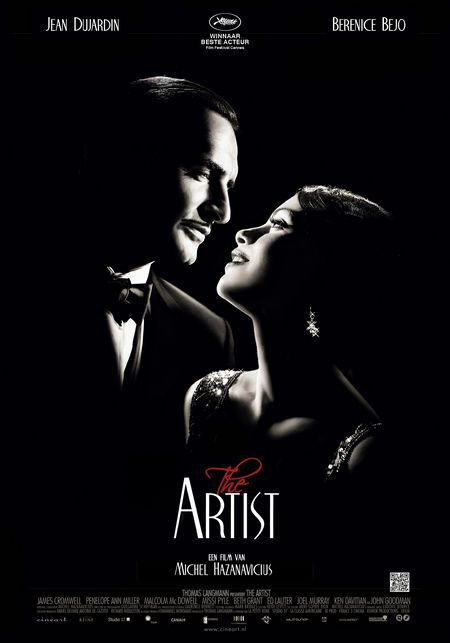

<!-- # ＜摇光＞艺术、自由意志与生活 -->

**国内的编剧、导演，由于其所受的教育背景以及业内审查等因素导致，他们对人类的自由意志是普遍淡漠的，因此也不会在故事中尊重角色的自由意志，而是都做着皇帝梦，希望在编导的层面就树立起一种观念表达的极权，乖离地安排所有的角色都按照预设的路线去走——当然他们可以有一万种理由去粉饰，但潜意识里就是如此——而这，才正是他们常常说不好故事，甚至十几年来都不会讲故事的根本原因。**

# 艺术、自由意志与生活

## 文/Leeforce（北京邮电大学）

今天看了一部好电影，奥斯卡最佳得主《艺术家》。作为一部默片，它讲述了一个非常精彩的故事，让我全程没有打瞌睡。男主角还当选了影帝。这个角色为何动人？他在最后的时刻做了一个关键的抉择：要么守住尊严，吞枪自杀；要么接受女人的帮助，重返事业。对于曾经辉煌的他，这是一个困难的抉择，也是一个痛苦的抉择。正因为这个抉择的出现，主角的灵魂才在最后一刻得到升华，并迎来了完美的结局。

这里面可以看出：一个成功角色的真正树立，最终靠的不是他的外形、动作、言谈举止，也不是看他究竟打败了多少敌人，或有多强大，而是看他最终做出了什么样的选择。而好莱坞的金科玉律，正是“两善取其一，两恶取其轻”，这种两难的选择，才是真正戏剧冲突的本质，而并非什么正义与邪恶的抗争，因为故事里的正义本来就必将战胜邪恶。

从前端来看，一个两难选择的出现，可以极大程度地挑起故事线的未知性和不确定性，调动观众强烈的好奇心和各种预期，并在角色做出选择之后让他们的心理压力得到释放，形成愉悦的体验。而从后端来说，编剧、导演之所以创作这样的故事，其实也是暗含了一个基本的朴素价值观，即：为了让故事更有活力，创作者应该在最大程度上尊重角色的自由意志，尽可能不要为他或她预设既定的路线，而是要让他或她自己做出选择，尽管他或她是虚拟的。

尊重角色的自由意志，也就是尊重演员的自由意志，观众的自由意志，甚至是人类的自由意志。我以为，这应当不是刻意为之，而是作为创作者的一项基本信念而存在。

国内的编剧、导演，由于其所受的教育背景以及业内审查等因素导致，他们对人类的自由意志是普遍淡漠的，因此也不会在故事中尊重角色的自由意志，而是都做着皇帝梦，希望在编导的层面就树立起一种观念表达的极权，乖离地安排所有的角色都按照预设的路线去走——当然他们可以有一万种理由去粉饰，但潜意识里就是如此——而这，才正是他们常常说不好故事，甚至十几年来都不会讲故事的根本原因。

这个原理，也不仅仅适用于电影。电影、电视被电子游戏打败，而后者从五年前就已经成为世界第一大娱乐产业，正是因为电子游戏是完全迎合消费者的自由意志，玩家在游戏的故事里虽然可能被打死，但他至少可以更好地控制自己的命运。这种自我实现的愿望，也是电影、电视节目里面那种简单的代入感远远无法比拟的。

人类社会发展到今天，虽然生活越来越富足，普通人的选择看似越来越多，但也随着社会竞争的压力越来越少。并不是每一个人都能选择自己想做的事情、想要的生活。太多人过着没有选择的人生，一辈子碌碌无为。而一些人就算获得表面上的成功，但也无法获得自己喜欢的爱好、喜欢的女人和喜欢的家庭，同样是失败。“选择权”在我看来，已经是世界上最大的奢侈品。人们在现实中得不到“选择权”，就只好像抽烟一样，到故事里去寻找，这也是人们热衷于看电影、玩游戏的真正原因。

几个月前参加慈善活动，给贫困小学的孩子们做“模拟人生”的社会学实验，当时我们就发现：在一个具备充分就业机会的环境中，每个人都有机会选择自己想做的事情，就根本没有人愿意去看电影、玩游戏，没有人选择去虚拟世界麻醉自己。在现实中“选择权”的面前，一切虚幻的、精彩的、华丽的影像，都显得那么廉价、不堪。

那么，今天无比向往成功和奢侈的各位，你们是否每天也在描绘自己心中的故事，扮演着故事中的那一个主角？身为自导自演的创作者，你是否也尊重了自己的自由意志？你每天做多少个选择？你是有很多选择的人吗？如果没有那么多的选择，你怎么能保证自己的回忆录足够好看，你的故事足够动人？

或许，我们终其一生，所能获得的最大满足感，不是我们积累了多少金银财宝、名誉满堂，而是——请允许我借用并篡改一下保尔·柯察金的名言：“人最宝贵的东西是生命。生命属于我们只有一次。一个人的生命应该这样度过：当他回首往事时，他不因虚度年华而悔恨，也不因过去碌碌无为而羞耻——这样，在他临死时，可以说：_____________________。”

原文链接：[http://www.douban.com/note/217874353/](http://www.douban.com/note/217874353/)

（采编：佛冉，责编：佛冉）
