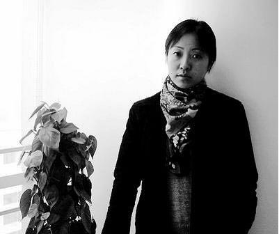
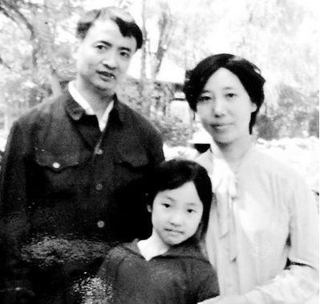

<!-- # ＜玉衡＞读马雁 -->

**她必死，就像你我必死一样，作为有限的生命，我们的死亡都不过是寻常的样子，而偏偏是在他人的死亡中，我们遭遇自身最大政治的事物，并为之感到，人生仿佛第一次，获得了分享的经验和思想，就像马雁写给卓青的那首诗一样。**

# 读马雁

## 文/芬雷

马雁为卓青而作的那首诗名为《世界下着一夜的雨……》，写作时间是2007年12月9日。在这一天，诗人也许刚刚获知卓青于一个月前去世的消息，致使记忆中与卓青有关的全部生活细节涨潮般涌起……在那个相聚的夜晚，世界下着一夜的雨，一切都是寻常的样子。一切都是寻常的样子，并没有什么特别的东西促使彼此去留意、去倾听彼此的伤痛，更何况，即便就在那个下雨的夜晚，诗人努力着告诉朋友自己也正遭遇着几乎同样的生活的伤痛，对于朋友而言，又能如何呢？“如果把生活中的伤痛/呈现给你，也许会有变数。但也许不，他人的愈合与你无关。”更不必说，几乎所有的“他人的愈合”对他人自己来说，都是打了折扣的。诗人在那个与朋友相聚的夜晚所忆起的寻常样貌，让她产生了深深的迟疑，这个迟疑跟生死判然无关，这个迟疑是关乎我们如何在世界下着一夜的雨的时刻分享我们彼此。于是，诗人揣想卓青爬山归来，刚刚度过一场危机的时刻，在这样的时刻，不管你是活着还是死去，在这个世界上，在这个下着一夜的雨的世界上，你都不是第一个，也不是最后一个。“我坚信：/那一刻我与你同在/那一夜的雨同样淋湿我。”在对死亡的不可揣想的揣想里，诗人重拾与朋友之间的那份友爱，并有意承担起镌刻记忆的工作。

网上找到马雁在2003年拍摄的照片

#### 雨，作为分享之物

雨，这个意象，在马雁的诗歌里，似乎始终跟分享有关。从写于2001年夏天《傍晚，看一场雨……》中“成为所有陌生的事物”的热望，到写于2003年春天《这些天一直下雨——给凌越》中“这些天一直下雨，但没有人分享”的落寞，雨，作为分享之物，既是对分享的诉求，也是对分享的练习。写于2002年夏天的那首《雨后》，或许可以帮助我们理解“分享”在马雁诗歌中的重要性。“记忆正在变得琐碎，更加琐碎。连昨天的琐碎都难以达到了，代词越来越多，渐进地。形容词，表示相关，任何的事都有联系。”诗人在诗歌开篇的第一节，指出了记忆正在变得琐碎，这种琐碎导致诗人几乎不再能通过记忆本身来达成诗歌分享的可能，记忆似乎注定是琐碎的并始终琐碎下去，而我们能做的仅仅是于代词的自我繁殖中，寻得那种任何事都有的联系。尽管诗人并未明确说明这种联系具体是什么，但是从整首诗来看，诗人在一首名为《雨后》的诗歌中，所要寻得的联系不是别的，正是诗句所能达成的那种分享的联系，正是这种联系，允许我们从一个记忆延及另一个记忆，并借由一个琐碎连缀起更多的琐碎。整首诗借“雨后”这个标题所表达的，乃是一种关于分享在诗歌中的诉求与练习的事后感。因此诗人说：“只一个晚上，一场去除闷热的雨，/我忽然忘记怎么找那条密径。”也许根本不存在那条密径，那条密径只是一种事后感而已。对于一个诗人来说，为了找到这条莫须有的密径，不得不一次又一次地出现在记忆的岔道口，并一遍又一遍的练习分享，寻觅那种任何事都有的联系，从而完成一篇可供分享的诗作。

这种关乎分享的经验以及思想，在2003年的时候，发生了一个微小的变化，或许我们可以称之为诗人于诗歌之中自我技术的微调。最明显的是“雨”这个意象变成了“暴雨”。写于2003年7月31日的《暴雨将至》乍看起来，颇为费解。在这首诗中，一共出现了三个人称代词：她，我，他，似乎分别指称三个人物，然而仔细阅读整首诗，就会发现一个奇怪的现象：不仅这里面的“她”是幻想出来的，“他”是臆想出来的，就连诗歌中的“我”也是不真实的。在对“她”这个“铁色的墙在转角处/分娩出的一个女人”的描述上，诗人有意将其刻画为一个自我繁殖的意象：“她细长的双腿/如同交尾的蜻蜓/互相缠绕”。这与诗人对“他”这个“楼上，窗帘背后/患抑郁症的男子”所刻画的意象一致。那个患抑郁症男子的自我与自我做爱，与那个在转角处分娩而出的女人的自我繁殖，是分享经验与思想一种内在化的体现。所以在整首诗中，连续出现了几处从写作上来说相互抵牾的地方。第一处是“这一刻她走来，/我激动不已”，“我”的闯入就像一个镜头置入镜像之中，这种感觉，仿佛是电影刚刚发明之时，火车向观众驶来一样，只是后者的激动不已更为强烈。第二处是“他呢喃着，她扭动着”，这种错位感，将自我与自我做爱的“他”和铁色的墙在转角处分娩出来的“她”放在了一个连续反应的句子里，仿佛这场热烈的欢爱，正是由“他”与“她”一起完成一样。诗人动用这样抵牾的手段，不仅强化了分享内在化的冲撞，而且更进一步地将分享经验彻底地推向了一个内在化的境地，在如此境地之中，诗歌中的“我”遭遇了千亿个碎片的撞击，而引发这样撞击的，仅仅来自于那个幻想的分娩而出的女人抬起盲目的眼睑这样一个动作。她看见她看不见的，因此我将面临自我绝对的内在化。

诗人马雁小时候与父母的一张合影

#### 分享，作为内在化体验

2003年4月，为了照顾病重的母亲，马雁离开北京回到成都。在从北京到成都的路上，也许是将近成都的傍晚，马雁似乎第一次看到了暮色中的土地，为此她写下了《四月的黄昏》：

我还没有看过暮色中

这片土地，广漠的绿色

铺卷过地面，平坦，均匀。

紫色的暮霭，稀释着，

渐渐漫过整个平原……

散发出可疑的鲜明，

在即将倾泻的黑暗边缘，

闪烁着，发出幽光。

这景色说不上美，

一切陌生的色彩展露出来。

一瞬间，黑夜就来了。

我们被迅速裹进安全的无知。

马雁的诗歌自然是以叙事诗而见长的，因为她总能于琐碎的记忆、繁多的代词之中，拾掇起任何事之间看似寻常却不可抹除的联系。然而，在整本《马雁诗集》中，我最爱的诗歌却是这首《四月的黄昏》，它平静而不平息，沉稳而不沉重，似乎在这样一个路途中，她已准备好迎接所有可能到来的事物，哪怕我们将被迅速地裹进那安全的无知。同样写于2003年春天的《母亲——向北岛致敬》，几乎和这首《四月的黄昏》写于同一个时间，甚至比《四月的黄昏》在时间上还要靠前。如果说《四月的黄昏》写于她从北京到成都这段路途之末，那么《母亲——向北岛致敬》这首诗更像是写于这段路途之始：

午夜，我穿过蒙霜的北京，

踏过地面，不留下脚印。

我愿逆流而上，寻你的爱情，

寻我不存在的出生证明。

在这午夜，我将穿过

大半个中国。飞跃过秦岭，

摘二十四年前的花，献你。

我采摘我一生的花束。

这里没有滚烫的物质，

我只葆有这午夜的青春。

我们共有的肾以及心脏，

是锁链两端的兽。

母亲，我捆绑自己，为你

做一个祭奠。你是一根鞭子。

在与此相同的时刻，我不能不

抽打自己，舔我们喷涌的血。

是的，这是一个午夜，诗人从午夜的北京出发，中间经过大半个中国，只为了看望重病之中的母亲。诗人要飞跃秦岭，采摘二十四年前的花，因为在2003年，诗人刚好二十四岁。在这首诗中，诗人表达了追寻母亲生命痕迹的愿望，仿佛二十四年来，她第一次愿意逆（青春的河）流而上，寻找母亲的爱情，寻找在自己不存在时即已存在的出生证明。她在出发之际，让自己的青春也像午夜的北京一样，蒙上一层清冷的白霜，好让那些滚烫的物质安静下来，哪怕无论如何，“我们共有的肾以及心脏/是锁链两端的兽”，欲念的拨动，总是让我们东奔西突，彼此冲撞，我们或许早已厌倦那种锁链的锒铛声响。在诗歌结尾，诗人的施虐-受虐共同体，见证了自己重回母体的那一刻。可以说，这首诗从一开始就是表达一个重回母体的诉求，但是在这种诉求之下，诗人反复觉察那个不安的自己，最终的自我捆绑与自我抽打，正像诗中所说，也不过是对母亲的一个（存活的）“祭奠”，说白了，是个仪式。这个在2003年春季发生的仪式，在2003年夏季达到了一种欢愉，这就是为什么在2003年的时候，马雁的诗歌完成了一次蜕变，但在这层蜕变之中却有着不安的成分。

整体而言，马雁的诗歌在2003年之后，那种独特的分享经验和思想变得越来越内在化，就像她自己所说，记忆越来越琐碎而代词越来越繁多。如果我们认真阅读作者写于2002年的几首诗歌，包括《雨后》、《这些故作神秘的小东西》以及《玩笑、讽刺、嘲弄和更深刻的意义》等诗，我们或许会发现，在颇具预言体验的《暴雨将至》这首诗中，那个患有抑郁症的自己与自己做爱的男子，其实正是“我”，其中的三个人称代词所指代的是一种自我的分享经验与思想的内在化体验，而不管是面对那个在转角处分娩而出的女人，还是面对那个独自做爱的抑郁症男人，“我”的欢愉始终没有停歇，直到它成为一种可以称为最大政治的事物，即死亡。她必死，就像你我必死一样，作为有限的生命，我们的死亡都不过是寻常的样子，而偏偏是在他人的死亡中，我们遭遇自身最大政治的事物，并为之感到，人生仿佛第一次，获得了分享的经验和思想，就像马雁写给卓青的那首诗一样。

原文链接：http://www.douban.com/note/230655572/

（采编：徐海星；责编：徐海星）
