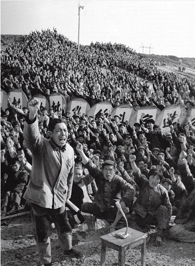
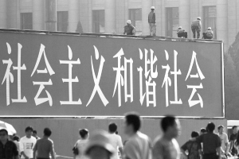

<!-- # ＜摇光＞斗争、和谐及其他 -->

**今天的我们看文章一开始的那种“斗争”说辞，都会从直觉上感到荒唐。但我们必须明白，之所以能成功地抵御这一种意识形态话语，不是因为我们足够的聪明，而是因为有幸不是生活在那种革命话语所泛滥的年代。否则就无法解释为什么文革时代的人们就那么心甘情愿地走进了这种语言的陷阱之中。须知要从根本上识破这种“双重表意”的宣传伎俩，才能抵御极权主义不断翻新的宣传花样。等今年的十八大开完，可能明年就会有一套新的意识形态话语体系出炉，至于这套体系用来替代“和谐”的核心词汇是什么，姑且让我们拭目以待。**

# 斗争、和谐及其他

## 文/丰钊（华中科技大学）

**“斗争”——特指与泛指**

今天中午上线，无意间看到一位朋友的签名有了更新：

“在音乐中所用的音，是人们在长期的生产斗争和阶级斗争中为了表现自己的生活和思想感情而特意挑选出来的。——李重光《音乐理论基础》”

李重光是谁？对于学习乐理的人而言，李重光之于音乐理论就如同谭浩强之于C语言。这位老先生出生于1929年，而他的权威著作《音乐理论基础》一书最早的版本成书于1965年。那个年代的“斗争”一词，就如同今天的大学教科书前言中“和谐”、“科学发展”遍地开花一样，是意识形态语言在他那个时代打下的烙印。这部本来与政治毫无瓜葛的乐理书籍，同样无法逃脱这个命运；我们也有幸从这本书的只言片语之中，依稀嗅到了那个“斗争”口号满天飞的时代所特有的味道。

现在对于这种“万物皆由斗争生”的说法，可能不少人都会本能地从心底感到有问题，想反驳，却又不知道从何说起。那么为什么我们会有这种奇怪的感觉？本文的分析，就要从李老先生的这句话开始。

首先我们把目光集中在“斗争”的使用上。“斗争”在引述的那段话中出现了两次，一次是“生产斗争”，一次是“阶级斗争”。对于“阶级斗争”一词，概念是很明确的。它既可以指马克思历史唯物主义中的一个重要的，特指的概念，也可以指

“马克思主义中国化”之后，中国人更为熟悉的那种“阶级斗争”：在49年以前，这个词指的是农民和工人在共产党的领导下，对地主和资本家所进行的土地改革以及提高待遇等行动；在49年以后，这种“阶级斗争”则往往指代对各色“无产阶级敌人”所进行的检查历史问题、游街、批斗、戴高帽等各种“人民民主专政”手段。无论是哪一种，大家在写作和阅读时对它的理解都不会有太大的偏差。

问题就出在“生产斗争”上。什么是“生产斗争”？“边生产边斗争”？显然不是。而在马克思的著作中，只有“生产力”、“生产关系”这两个概念，并没有“生产斗争”一说。所以李重光所说的“生产斗争”，实际上指的就是“生产”；而这里之所以要加上一个“斗争”，是因为在《音乐理论基础》初版的那个时代，“斗争”一词已经随着国家机器的宣传而在整个大陆被滥用，成为了一个泛化的概念。

回顾历史不难发现，大跃进到文化大革命期间，为了响应伟大领袖“与天斗，与地斗，其乐无穷”的号召，上至各层宣传机构，下至街头巷尾的普通百姓，在政府公文和日常用语中，都刻意增加了“斗争”一词的使用频率，在一些原本和斗争无关的概念后面加上一个“斗争”的词缀，就是一种有效增加该词使用次数，保证行文说话政治正确，又不显得过于生硬的好办法。（这一点和今日的各级宣传部门想尽办法提出各种与“和谐社会”和“科学发展”沾边的口号，可谓是一脉相承。）在那个时代的人们，不仅要在大局观上正确认识到中央关于反帝反修的各种斗争的正确性，甚至在私人领域，也出现了“狠斗私字一闪念”的说法。“斗争”一词已经从最开始仅仅局限于“阶级斗争”，变为了一个类似于“做事”这类词汇的泛指词语。

如果这种局面延续到今天，“斗争”一词仍在泛滥，肯定还会出现“消费斗争”、“升学斗争”、“旅游斗争”，以至“刷怪斗争”、“推塔斗争”和“爆头斗争”等层出不穷的新说法。这一些加上“斗争”后缀的行为有一个共同的特点，那就是它们都带有各种类型的“互动”：既包括人和人之间的互动、也包括人和社会、自然之间的互动。也就是说，泛化以后的“斗争”一词，已经涵盖了人类一切具有互动性的活动。

明白了这一点，我们就可以把李老先生的那句话还原为一个正常的表达方式：“在音乐中所用的音，是人们在长期的生产和生活中为了表现自己的生活和思想感情而特意挑选出来的。”

把“生产斗争”改为“生产”，把“阶级斗争”改为“生活”，整句话是不是看着舒服了很多？

而在这一部分的最后，我们也可以回答文章一开始提出的问题了：我们之所以对这一句话觉得奇怪，就是因为“音乐”这一领域，本来就和特指意义上“阶级斗争”是不沾边的。而那个年代的人们，已经习惯使用泛指意义上“斗争”，写下的文字在我们今天从特指意义来解读“斗争”一词的人的眼中看来，无疑是非常别扭的。

**再来聊一聊“和谐”**

如果仅仅是就事论事地谈李重光先生的那句话，前文就近于废话了。为了真正引出本文想要揭露的一种意识形态宣传伎俩，在做出最后的结论之前，我们再用特指/泛指二分的方法来分析与“斗争”类似的例子，它就是这个时代的流行词汇，当局从十六大以来力推的概念——和谐。

抛开“斗争”与“和谐”这两个官方宣传中常用词汇在价值取向上的差别不论，从本文的角度看，“和谐”和“斗争”是异曲同工的。一方面，“和谐”会有一个泛指倾向，力图涵盖普通人生活的方方面面。我们可以先一起检讨这几年“和谐”一词的使用：社会要和谐，军民关系要和谐，民族关系要和谐，细到个人，生活方式要和谐，与大自然相处的方式要和谐，人际关系也要和谐，乃至XXX也要和谐。随着“和谐”这一概念外延的扩大化，意识形态也悄悄达成了对个人生活和视听渠道的全面染指。

另一方面，“和谐”又有一个特指含义，就是四核当政期间所提出的重要思想，这个概念是一种以国家强力作为后盾的狭义特指，其本身也就代表着一种政权的合法性。那么狭义的“和谐”到底是指什么？这里可以引用构建和谐社会的纲领性文件《中共中央关于构建社会主义和谐社会若干重大问题的决定》里开宗明义的一段话来说明：

“社会和谐是中国特色社会主义的本质属性，是国家富强、民族振兴、人民幸福的重要保证。构建社会主义和谐社会，是我们党以马克思列宁主义、毛泽东思想、邓小平理论和“三个代表”重要思想为指导，全面贯彻落实科学发展观，从中国特色社会主义事业总体布局和全面建设小康社会全局出发提出的重大战略任务，反映了建设富强民主文明和谐的社会主义现代化国家的内在要求，体现了全党全国各族人民的共同愿望。”

可以看出，狭隘意义上的“和谐”一词是指一种政治目标，其基本含义是指中国共产党领导下的，达成“全面建设小康社会”和“建设社会主义现代化国家”目标后的一种状态。如果单从这段话来看，“和谐”在这里的含义，与我们日常生活经验中的“和谐”是大相径庭的。

与“和谐”对应，“不和谐”也带上了特指和泛指两种含义。这个词可以用来形容音律，形容家庭关系，形容夫妻感情，这些都是泛指意义下的“不和谐”。然而大家现在可能对“不和谐”的特指含义更加熟悉，那就是“与政府不合作，或者与政府的宣传步调不一致”。帖子内容可以被形容为不和谐，人的思想可以被钉为“不和谐”。而由“不和谐”反推，我们也不难理解特指的所谓“和谐”的真正内涵：别看官方围绕它的发挥多么汪洋肆恣，说穿了，就是三个字——要配合。

作为狭义概念上的“和谐”与“斗争”一词一样，都散发着一股国家机器的腐锈味，最典型的一个体现，就是“和谐”一词今天的论坛里的动词用法。“楼主要被和谐了，细软跑吧”、“和谐前留名”，这种用法背后所透露出的辛酸与无奈，和70年代的革命小将们动不动威胁要对“反动学术权威”进行“人民民主专政”的豪迈，算是花开两朵，各表一枝了。

要说“和谐”与“斗争”在构建宣传话语时有什么区别，只能说，“斗争”一词在传统的中国文化中并不是“显式”的。以儒家经典所构建起的一套传统话语体系中，只有“忠恕”、“慎独”、“中庸”这些平和的概念，“斗争”一词并不能堂而皇之地招摇过市。这并非是说古代中国人就不搞斗争，而是说在古代，这些东西从来都只是帝王术和厚黑学的范畴。作为一个儒者，如果对标榜阴谋与权斗的法家思想公开表示赞同，会是一件很耻辱的事情。（有兴趣的可以看一个例子，《宋史》的《李诚之传》）

而49年以后，“斗争”一词借助暴力机器作为后盾，将一切不适应这个话语体系的人从肉体和思想上进行全面镇压与改造，从而硬生生地扭转了中国传统话语谦和抑己的叙述方式。如果说“和谐”只是因势利导地利用人们的认识观推销官方的意识形态话语，那么“斗争”则是代表了一种对人们的认识观和话语体系双管齐下式的再造运动。这种近乎强奸的手段太过于残暴，以至于只能在特殊的“革命年代”使用。在今天这个时代，理想既然已经去魅，那么就只能换一套说辞了。要知道，意识形态宣传永远都只有工具价值，对于“斗争”与“和谐”这两个同时存在于官方宣传中的词是否存在矛盾，是不必太较真的。

**双重表意下的宣传效果**

无论是“和谐”，还是“斗争”，都可以从中提炼出“特指”和“泛指”两方面的含义。以带有“双重表意”的概念为核心，构建一整套意识形态话语体系，从49年以来，似乎一直就是当局宣传部门的一种“自然法”。看一看共和国的历史，几十年过去了，“大民主”被大大咧咧地写入宪法，然后又被急匆匆地删除；对一个领袖的绝对效忠被写入宪法，领袖死后又立刻被撤下，历次政治运动如旋风般的强劲数年，过后就立刻被扫入历史的垃圾堆，唯独各种意识形态的话语依旧风光，几十年屹立不倒，在今天中小学的语文、政治和历史课本中，还能看到“阶级斗争”、“三个代表”这类词汇神出鬼没、巧兮盼兮的身影。而在这些如过江之鲫的词汇中，最核心的总是本文关注的这种具有双重表意效果的概念，这些概念构成了整个意识形态宣传体系的核心，并非没有原因的。

首先不难看出，双重表意词汇中泛指的一面，实现了对其治下的社会及个人的全面覆盖和干涉，从而让它的臣民从思维到语言上都不知不觉地进入预先设定的宣传话语体系之中，并利用人们的生活经验，诱使人们在潜移默化之中在内心产生对宣传的认同。“和谐”难道不对吗？你觉得社会不需要和谐吗？既然日常的生活经验给了我们一个“需要”的答案，那么自然而然，我们就会对以“和谐”为核心的话语体系慢慢产生一种接纳感。

而另一方面，“和谐”的狭义特指又是在位者合法性的理论支撑。利用概念外延的不确定性，特指的“和谐”与泛指的“和谐”之间搭起了一座桥梁，民众的生活经验被用来给政权的合法性保驾护航，宣传上的诡辩让极权统治甚至在道理上都无懈可击。很多时候面对他们的宣传，我们只能从直觉上感觉到它不对劲，细究起来，却又总说不出问题在哪儿，说穿了，就是这个原因。

如此，也难怪这么多年的宣传里，被各套意识形态作为核心的那些词，包括“斗争”、“改革”、“先进性”、“和谐”、“科学发展”，以及那些宣传话语中的次级概念，如“大局观”、“稳定”、“政治原则”、“党性”、“清污”等，在具体的使用上总是显得有点模棱两可，甚至稍微带点形而上的味道。其实想一想就能释然：若非含义模糊，如何有随意发挥的空间？这就是为什么70年代的那些“斗争”尽管在大部分场合都意味着狭义的“批斗”，但宣传机器却宁肯使用“斗争”，而不用后者去替代使用的原因。而若是不用那些稍微形而上的概念，而使用太过于贴近生活经验的概念，就会让普罗大众也都有能力去检验概念与自己的实际生活是否匹配。这也是为什么某组织在上世纪末总喜欢把“先进性”这样一个乍听上去莫名其妙的词挂在嘴边，而从不肯用“清廉、高效，让人民有饭吃”一类平白朴实的说法的原因之一。

回顾过往，之所以这种宣传手法能够屡屡得逞，一个很重要的原因是非自然科学领域的概念的外延往往具有太大的不确定性。而中文本身也是一种逻辑语法非常不严格的语言，更是让这种宣传伎俩的泛滥大行其道。然而最根本的原因，还是当前政治格局下，既得利益集团对宣传的全面干涉与洗脑式的意识形态灌输，非此，也无法解释为什么民族语言的语法逻辑相当严谨的德国和俄罗斯，也会在纳粹与苏共这两个极权怪胎的宣传战争下匍匐在地。

本文的目的，是希望让读者，还有作者本人对这种政治宣传在逻辑上的狡诈跳跃保持足够的警惕。今天的我们看文章一开始的那种“斗争”说辞，都会从直觉上感到荒唐。但我们必须明白，之所以能成功地抵御这一种意识形态话语，不是因为我们足够的聪明，而是因为有幸不是生活在那种革命话语所泛滥的年代。否则就无法解释为什么文革时代的人们就那么心甘情愿地走进了这种语言的陷阱之中。须知要从根本上识破这种“双重表意”的宣传伎俩，才能抵御极权主义不断翻新的宣传花样。等今年的十八大开完，可能明年就会有一套新的意识形态话语体系出炉，至于这套体系用来替代“和谐”的核心词汇是什么，姑且让我们拭目以待。

（采编：佛冉；责编：佛冉）
