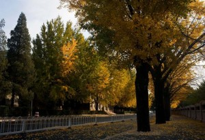

<!-- # ＜玉衡＞小赵:诗人及保安 -->

**于是他也就毫不留恋地用力把肩往回一撤，顺势栽下城楼。这副景象配上纷飞的白色诗篇想必更加动人。他真蠢，提前放飞了那些鸽子，现在它们头朝下贴在满地的泥水里，和治疗性病的小广告没什么两样。生前死后，谁也不知他是诗人。**

# 小赵:诗人及保安

## 文∕曾璐 (清华大学\)

下午四点，小赵——诗人兼保安——走在从地下室宿舍通往地面的台阶上，准备去毁灭世界。在此之前他觉得应该先和监控录像告别。

黑白屏幕像往常一样被切分成十二格，其中十格亮着，五格映出门外，五格映出门内，一成不变。人们一成不变地匆忙出入。铁门被甩开后也一成不变地独自小心地慢慢合拢，好像在向人赔罪。

“真是个好意象。”小赵模模糊糊地想。

“我是那守门人，那……”

“大白天的你出来溜达干什么？老王他们也都起了吗？”值班的女保安回头向他搭话。

“嗯。”小赵回答。

“这么早就起了？起来干什么呢？”

“打牌。”

女保安哦了一声低头玩手机了。小赵又站在那里兀自玩味了一阵，觉得话里决绝的意味不够浓郁。倒是女保安的嗓音高亢得有如警笛。

一个穿着黑丝袜（小赵下意识地把手往棉大衣袖子里缩了缩）踩着短靴的姑娘从屏幕左上的格子里下来了。另一个同样穿着黑丝袜踩着短靴的姑娘在右边一个五个格子里同时出现。她们通常也都长得差不多。小赵不动声色地看着门外的姑娘刷响了卡。一，二，三，四，五，五秒钟后第二个姑娘从门外的格子移进了门里的格子。于是她们在门里的楼梯口“突然碰面”了。

——哎呀！你怎么在这儿！

——嗨！怎么是你！

语气仿佛是在一场劫后余生中的大惊喜中浴火重生。然后一，二，三，三秒钟后门里的姑娘变到了门外。在可预见的时间范围内，她会像先前的姑娘一样在门外的楼道里重新出现。如果那时楼内录像中反映出另一个人影，那么她们又将在可预见的时间与可预见的地点“突然碰面”。她们在惊喜中大呼，仿佛全宇宙在此收缩成为一点并爆炸出一瞬间的机缘巧合。小赵只是不动声色地看着，并下意识地捏捏口袋。笔还在。

“我是那守门人，那醒觉者……我监视着……”

诗不妨留到路上慢慢想。小赵把自己夜班使用的砖头状的对讲机和积满污泥的白色扩音器轻轻搁在桌子上，巴望着女保安能注意到这仪式性的交接示意动作，所以收回手后他又额外站了三十秒钟。在此期间女保安一直低头玩着那只粉红色的手机，上面拴的小坠子哗啦啦乱响。

小赵由是知道自己该走了。

这天早上小赵终于鼓起勇气去听了他们说的写作训练课。五号楼里住着人文学院的女生，她们在门口和小伙子们谈论“意象”像谈论炒菜用的八角茴香。在偶尔掉到地上的只言片语中，小赵偷偷拾起“写作训练课”的时间地点揣进兜里，好似掖起一张扑克牌的大王，小心翼翼地生怕折了角，每到夜深人静时就掏出来端详一会儿。而让他终于打定主意的是前天深夜。在他毫无征兆地加入了一对夜归的情侣的讨论并鬼使神差地发表了整整半小时观点后，他辗转反侧了一整个白天，觉得是时候去听一听那门课怎么说了。为此他特意换了最贵的一身便装。一路上他不住回忆着那夜自己演讲的场面。金色的灯光从头顶打下，四壁间烟腾雾绕，他滔滔不绝地就军事、政治、哲学和文艺发表演说，每一个见解都让黑衣笔挺的小伙子连连点头，发出赞许的鼻音。

而平日里午夜十二点到早上七点之间，小赵闭着嘴，拿着砖头对讲机在四五六三栋楼之间走来走去。时候早的话碰见了女保安还能讲上几个段子，到了两三点，楼道里外都不见什么人影了。小赵就悄悄找栋楼在门口的椅子上坐下，把灰绿色棉大衣脱下来披着，一个人趴到桌子上，在桌面压的玻璃上吹出两道白雾。

他的手在大衣兜里那本黑色记事簿的边缘上细细摩挲。他的头脑在构思诗歌，这秘密无人知晓。诗歌让他与一切人根本区别开来。

黑暗是容易看见的。不论在哪儿，闭上眼就是拉了灯。这些白色的黑夜适于怀想妻子。女人是一口黑箱子，在这里你猛然发现了世界的边缘。男人行走到这里便放下身体，用手指摸索大地的裂纹，才知道常轨之下还流着猜不透的泉水还是熔岩。你可以尝试在这边缘上行走，但要记得伸开双臂保持平衡，因为下一秒你就可能一头栽进那深不可测的黢黑洞穴，不知所终。

小赵把脸埋在妻子胸前，极力想从她身上找到女性。他在发皱的诗集里已经读透了她们身上的每一部分——水珠一样的乳房，火焰般的唇。女性。她们在夜间像鱼一样浮上水面，带着湿滑的鳞片和嘴唇，到白天重又没入水中，留下一具人形的蛇蜕。但一切小赵真实感受到的却是发动机式的机械重复。有那么一瞬间他摸索着的食指和中指像是夹住了一片鱼鳍，可那“女性”的闪光瞬间后就滑脱溜走了。小赵抬起脸，眼前是一张因为贴近而显得极其巨大的强笑着的憔悴面容，两绺头发搭在额上，干枯蜷曲。

“睡吧。我累了。”

那是个无比遥远的夜晚。小赵这时想起：如今妻子怀胎已有九个月了。

小赵坐在教室的角落里。花枝招展的年轻姑娘们在前排交头接耳，不时咯咯嬉笑，长发甩成一片绿波。他的手心微微出汗，指肚捏着熬了一个上午抄写出来的旧作，（值班时禁止看书写字，违者罚款）其中也包括他精选出的一首夜深孤寂时怀恋妻子的诗。

老师迈步走进来了。他相貌年轻但头顶霜白——这是作家的样子——讲课时一直二十五度角面朝天花板，想必从他眼皮下面扫过的满堂学生全是一张张压扁的画片。这位作家让小赵回想起自己人生中最后一位班主任，而那是小学五年级。这位作家不谈诗歌，让小赵极为失落。在种种小赵闻所未闻的遣词与例证中，这一句由于异常浅显而突出：

“时至今日，文学还能表现什么？”

小赵竖起耳朵。这位先生说道：

“也就只有孤独感了。

“——谁还要看孤独感！”

一点哄笑让小赵顿时满脸涨红。尖锐的铃音接着乌泱泱一片人声，姑娘们影影绰绰向他走来，到他面前轻巧地转了个身，走出门去。小赵坐在原处，一直等那位作家出去了，才捏着稿纸站起来，虚浮地走回公寓地下室，蒙头睡去。

“……尖儿！”

“顺儿！”

“不管。”

“炸！”

“你他妈又出老千！我明明看见那张牌出过了——”

小赵醒来后在床上坐了半个多小时，躺下，再坐起来，感觉嗓子眼像是要逼出什么，又好像不算什么。于是他爬下铁架床，闷不做声地披上棉大衣，把结算的工资按票面大小理好装进兜里，拿起对讲机和扩音器，然后从打牌的五个人中间穿了出去，走上了通往地面的台阶。他想那位作家说得对。

小赵把东西轻轻搁在门口桌子上后撩起门帘走了出去。阳光干冷刺眼。他一路向西南走去，上坡时身体前倾，下坡时则向后，一直走到圆明园地铁站的自动售票机前，扯出一张平整的十元钞票放了进去。他要去天安门。当他俯下身捡出叮叮当当散进出币口的一堆钢镚时，忽然生出一种深刻的卑贱与屈辱感。

人们顶着清早画上睡前卸下的麻木不仁的脸。小赵麻木地盯着隧道壁上闪烁的动态广告。手里抡着斧头的诗人。肚子硌着铁轨的诗人。面孔埋进淤泥的诗人。头颅炸开血花的诗人。也许那些警卫会拦住他，禁止他爬上城楼。他要把他们的鼻子打出花，攀上去，站在观礼台正中央朗诵自己的诗歌，然后任他们把他押走。——不，一旦他念完了就会跳下去。这一瞬间将成为一个时代终结的标志。他的脑中充满了诸如此类的明快想法。

安检让他兴奋。大檐帽也让他兴奋。明黄色的警戒线逼仄得像要在他的眼球上划一道口子。他想被搜身但可惜没能成功。穿过通道，走到空旷的广场地面，过往游人稀稀落落——毕竟这一天连双休日都不是——尸首一般缓慢地四处游荡。他们一向如此。你可以准确无误地预测到他们将要走到哪里去，在哪里碰面，说些什么又怎样分别，但很快这种预测游戏的娱乐性就会降到大檐帽和枪支之下。他雄心勃勃地径直向天安门城楼进发。

很快他发现不对劲，因为与他同路的人过于多了。这时有人拦住了他。

天安门城楼居然是卖票的。十块钱一张。

他掏了仅有的一张十块钱，然后恍恍惚惚地跟着人流向上走。他捏紧兜里的诗稿就像捏紧一把匕首。而根本没人注意到他。事实是，这件灰绿色棉大衣让他看起来更像攒下半个月盒饭钱，专程来参拜毛主席的农民工。不多时，眼前露出了《开国大典》中描绘的城楼观礼台——所有火红的灯笼穗的延长线都向主席一人身上辐集，而这个台子如今在北京十有六七的惨白天空下看起来既狭窄又凋敝。一个念头在他脑中一闪而过：他想站在这里向下面撒尿。

他腹部贴着护栏在那里站了五十多秒，羽绒服不时在他的后背擦过。五十多秒后当他放弃了并准备走开时，一股尿意却忽然止不住萌生出来。

“你！干什么呢！”

背后有声音吼道。他一阵心虚转过身，看见警卫正对他嗔目怒视。

他们对视良久。这种对视，在逐渐擦亮的时间里，在小赵心中渐渐唤起一种残忍的快意、灵感和勇气。他顿了顿，缓慢而清晰地说：

“从今天起，这个国家不再需要诗人。”

出口后他才觉出这话的迂腐可笑。他就自己轻轻笑了笑，随即把棉大衣里折着的一沓诗稿捧了出来。每一张都长26厘米，宽19厘米，用均匀的细线割出二十行，乖巧得像一群鸽子。它们在瞠目结舌的警卫面前四散开来，婆娑纷飞，直到覆上了石灰白的广场。他的刚一扑拉拉飞起就被射落了的鸽子。

他双手撑住护栏，接着把右腿搭上去，并停顿片刻。他在犹豫是应该把大腿压在上面还是把脚踩在上面，因为他隐约觉得自己应该能站在护栏上保持平衡，不过两腿之间的一阵小风很快打消了他的念头。他扯扯身体，发现是腹部把棉大衣的一角压住了——这时他才意识到自己看上去仍然是个保安，于是他做出了一个缓慢而滑稽的动作：骑在栏杆上双手脱去外衣。他怕衣服被背后人抢了去，于是一甩手扔下了城楼。它盖在一辆黑亮的轿车顶部，显出一个匀速平移的脏绿色大字形人体，十分富有观赏价值。

然后他撑住护栏，继续把左腿跨出半空中。现在他成功地坐在了城楼观礼台的护栏上。天安门周边不允许建设高层建筑，因此视野格外开阔，死鱼肚一般惨白的天空尽收眼底。在一片哑然岑寂中，小赵的心情明朗起来，这让他很想再发表一次时长半小时的演说。他志得意满地张开嘴，却没半点声音出来。

自行车与汽车不断从诗稿上碾过。

他的嘴唇终于动了：

“……时至今日，文学还能表现什么？”

他接不下去了，因为笑意汹涌而来。想到幸好（不幸）这话也没人听见，他耸耸肩——同时感到肩膀被人从背后扳住了；这破坏了他晃荡双腿悠闲赏景的计划。于是他也就毫不留恋地用力把肩往回一撤，顺势栽下城楼。这副景象配上纷飞的白色诗篇想必更加动人。他真蠢，提前放飞了那些鸽子，现在它们头朝下贴在满地的泥水里，和治疗性病的小广告没什么两样。生前死后，谁也不知他是诗人。

……想到这里，小赵更捏紧了大衣里的稿纸。首尾两面已经黏在了手掌上。

“干什么呢！说你呢！”

警卫仍在怒呵。小赵一阵心虚转过身，对方正对他嗔目怒视——仔细一看那目光稍有偏斜，因为旋即有个穿羽绒服的小个子闻声而逃，让观礼台尽头的楼梯一片吵嚷。小赵发现自己似乎成为了一桩小偷小摸案件的当事人。尽管如此，这在天安门城楼上仍可称为历史罕见。警卫正一步步向他走来。

说点什么。

说点什么。

“我是……”

“没丢什么吧？”警卫向一侧问道。小赵惊回身，一个穿着艳紫色羽绒服的年轻女孩开始喋喋不休地尖声抱怨。奇的是她下身竟也穿着黑丝袜和短靴。

一分钟后警卫才听出她其实并没有丢失什么财物，便转身向回走了。小赵忙叫道：“等等同志——”

“什么事？”警卫不耐烦地瞟他一眼。

“……”小赵陷入了一段痛苦挣扎的沉默的泥潭。半晌，他开口说：“请问……厕所在哪儿？”

“下面。”警卫随手一指。

“谢谢。”小赵谄媚地笑笑。

小赵六神无主地站到小便器前面，拉开裤链，开始了长久的发呆，期间他仿佛又看到诗稿旋转着被吸进下水道的模样。这一切直到他被一阵单音铃声吵醒为止：

“大哥！嫂子……要生了！”

小赵从公共汽车上下来，重新走上夜晚的街头。他想像自己随着步伐有节奏地将诗稿一一抛向身后的风中，它们环绕在半空，发出乳白色的光晕守护着他；但事实是他的汗液已经模糊了封面的字迹。那是他这天熬了一上午精心抄好的。晚上八点，小赵——诗人兼父亲——站在这家不知名的医院门口。它门脸很小，只有一张被甩开后邦地一声撞回门框的小铁门。人们一成不变地匆忙出入。小赵有十二只黑白的眼睛，其中十只亮着，五只映出门外，五只映出门内。这时他又觉得自己仿佛就是这门：人们向他走来，只是为了将他推开。

事情是这样的：有一次我回到女生宿舍时已是后半夜了。当时同行的朋友只顾发表关于二战德国海军的高谈阔论，两人就这么在门口站住，没注意背后有个身披军绿色棉大衣，腰揣对讲机，呲牙笑着的陌生男保安正伺机而动。

我完全不记得这个保安是怎么对我们开始他的演讲的。他从历史战争谈到国际局势谈到内外政策谈到领导人语录谈到人生哲学谈到万物宇宙和老天，他神采斐然脸上黧黑的褶子像波纹或云彩一样流畅地聚来散去手势高低开合孔武有力好似第一代国家领导人。我当时早已支不起眼皮，在这股无形的威压下又不敢轻举妄为，生怕亵渎了什么，幸好全过程里有我那朋友充分配合的诺诺声牵制他的注意，我才得以不时如履薄冰地换一条承重腿，或是如靠针毡地靠到墙上去，咬紧牙关把呵欠吃进肚子里。凌晨两点到两点半，他长达半个钟头的演讲以这句话作结：

“我只上过五年学，——但我是个诗人。”

说着，挤挤眼睛。

朋友后来悄悄问我对那保安的言论作何评价，我叹口气没应声，只知道自己打那以后就立下了回寝时限的个人纪律，怕的是再被那人见到给拦了下来。朋友想来也差不多。等到我半个月后的某日终于穷极无聊，想起可以好事去讨一首“大作”来瞧瞧，便上白天值班的女保安那里打听这位咧嘴笑着的“保安诗人”时，对方却表示全然不知还有过这么号人。

紫荆公寓的安保岗位流动性极强，三两月一换。我想他或许已经走了也说不定。

又一周后的深夜我破例独自一人走回宿舍。你知道深夜晚归的女性的脚步总是拍节饱满并且十分快速。门边响起的招呼声吓得我一个寒战——可不正是那位自诩的大诗人在守着？我立刻挂出一张溢满歉意的笑容招牌，上书“本店打烊”四个大字，暗求老天让他放我一马，同时刷了门卡去拉把手，猝不及防被拍了一下，一愣之间，就被塞了鼓囊囊的仿佛是一信封的钞票。我当时既惊且惧，一心想逃之夭夭，竟不敢抽出来看一看，忙往回推。

他只是看着我，摇摇头。

我再推，他仍只是摇头。

这时我当机立断地点了头，收回手，坚决地打开门并镇静地迅速上楼，还感到那中年男人的目光一直钉在我背上。我检查了三遍寝室门是否锁好，确认电话簿里存了楼长的号码，然后抽出信封的内容物——

那竟是一沓稿纸。

而上面所写的，如你所见，便是以上这篇小说。这大约可以被视为他的自传。我特别注意到他的字体大而歪扭，但稿面极清洁，像是特意眷抄过的。全篇鲜有一两处错别字。

这位保安第二天似乎的确是走了。由于就连“赵”也未必是他的真姓，我至今不知该如何向人打听他去向何方，近况如何，妻子是否顺利生产。——不过倘若你问我他的小说怎样，我也只能叹一口气，不说什么。

原稿最末另附了一首诗，字迹却异常潦草，这里我一并忠实录出，不作评论：

我是那守门人，那不眠者

监视所有黑框方格打开和关闭的命数

午夜，每个人蜷缩在铁架床上

听锈蚀的水管里淋巴液的流动

胃酸从八方涌来，压溃天花板，渗过背靠的墙体

吞噬你也溶解我

门把手不停移动位置

一株盆栽长成钟罩的形状

一只枯手向人造的光源探出

人们独自呓语、咒骂，捧起面庞的幻象，隔着厚壁

贴合掌纹或耻骨

是墙壁搭建起我们的居所

故而一切私自拆毁者必将坠落

但大门始终开着

我将把警哨吹到满脸通红，日夜不休

为了唤起一次有序撤离，

一场末日逃亡——火球在天空升起

我是那扇门。人们向我走来，只是为了将我推开

脚步声像池塘的金光堆起又散去……楼宇空空

我独留下在这牢狱体内，耳贴水管，做着

淋巴液、花鹿与满山雾霭的梦

致五号楼下的诗人

（采编：孙梦予

；责编：徐海星）
