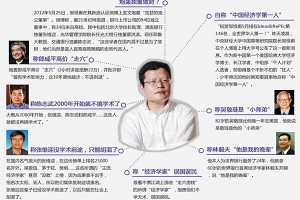
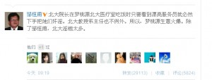

<!-- # ＜天枢＞民主困境：记邹恒甫流氓事件 -->

**你可以质疑精英观念与精英群体的存在，但从你有限的道德判断出发，能不能也会有个适当改进，使自己的行为别再那么丢脸；你可以反感被引导、被说教，但前提应是你能自我省思、自我觉悟，作为一个成熟独立的个体在社会中生存和发展。我还是良善地希望，先去改变我们每一个人，再去重塑我们这个社会的整体生态，最终才能建立完善出一套保证能够公民社会良性运作的制度设计，而不是使我们这个国家在动荡心理日趋剧烈、精英流失不断加速中与向上提升的美好愿景渐行渐远。**

# 民主困境：记邹恒甫流氓事件

## 文/Polemarchus

最近一段时间，燕园内外很不平安。一位自称华人经济学界第一人的前北大教授邹恒甫先生，在其微博上声称北大院长、系主任在一家院属餐厅里逢美女服务员必奸淫，引起舆论一片哗然。发布消息后，邹先生又称曾经多次致信校方，不能得到复言。尽管邹的说法已遭多位相关人士驳斥，北大方面仍然成立了纪检小组，并向外界宣称将联系邹先生彻查此事，要求后者明确指认、给出证献。昨日，邹先生称将对北大方面的回应不予理睬，而只配合中纪委对此开展调研。在一般认为中纪委不会轻易插手校方事务的现实状况下，邹的所谓举报无从核实，此事似乎只能就此句点。至今晚，邹先生的个人主页再次活跃，原因在于其转引了署名为北大光华学院一零级学生计某的一篇日志，对北大学生会的选举制度、内部运作进行尖锐抨击，除继续延烧其之前发布的所谓学生会挥霍百万外联款的话题外，更直指校会主席戴某选前行贿、前主席张某接受贿赂、学生会上下污秽不堪。日志发表后数小时后，身在新加坡的计某本人愤怒回应此文章纯系伪作，绝不代表本人意见。

事件本身的是非曲直不难判断。你说通奸强暴也好，行贿受贿也罢，都是性质恶劣、触及刑罚的大事，对当事人的名誉、荣誉与正常生活、个人发展影响甚巨，绝非语焉不详、轻描淡写而可一笔带偏。你自视学界精英，却急于引用来源不明、未经证实的举报材料，头脑何存？不惜牺牲无辜学生来为一己利益与情绪贴票，良心在焉？至于遭到解聘五年之后仍以北大教授身份活动，更是明显违背事实、欺骗公众的非义之见。如此恨之切切、害之重重，联系到其之前竞争院长落选，并最终因为不能履行教职、不给学生上课而遭院方开除的种种经历，倒也或是逻辑成线。这里唯二的不解之处在于，假使真如你邹恒甫本人所说，并不考虑回北大就职，又何必一次次给闵维方、许智宏、朱善璐、周其凤写信要求清算前院长张维迎，并转而对并不支持你做法的继任院长蔡洪斌极尽打击能事？假使真如你邹恒甫本人所说，在世界银行收入颇丰，也并不曾惦念离职后遭校方收回的家属楼房产，又何苦每月都要发出几回碎碎念、骂骂几次张维迎，并最终决计从个人生活作风问题出发找寻到赢得网民注意的炒作热点？只是发动社会资源来泄私愤，实为严肃学界所深不齿，而又在邹已不光彩的个人履历中记录上新的一件。

我们更应关注和反思的，是整个事件过程中所呈现出来的网路舆情变迁。考虑到不满社会、反感精英、唾弃中国教育和仇视北大等思潮在相当一部分媒体人和网民心中的普遍存在，可以想见这部分人对本群体的认知倾向与价值偏好进行展现。可是对于受过高等教育，并且还自命对政治发展、社会进步具有高度使命感的这些精英而言，是不是应当自我检视：要求证据第一、程序正义、对自己的言论和行为负责任，还是我们所追求与坚持的底线？是不是只要我们有疑问、有情绪，就可以不经分析、不加判别地选择相信和支持某种流行说法，并以此作为我们行动合法性、合理性的来源？倘是那样，今天我可以明目张胆地黑北大，明天你就敢于理直气壮地诽谤任何一家公司；我今天可以把污名扣在张维迎、蔡洪斌或随意一个北大教授、北大学生身上，你明天就可以向任何一位当官的张三、做生意的李四或者穷苦人家的王五赵六去泼粪倒酸。难道只要有人信、只要有人跟着骂，这种行为就是正义、就应被接受而奉为真言？我们甚至可以悲观地预见，在一个只重感觉不重规范、为达目的不择手段的社会环境下，网络愈发达，空间愈开放，误解与造谣可能就愈猖狂，个体的正当权益就愈得不到基本保障，各群体间就愈加不能在增进了解、相互妥协、彼此包容、保持稳定之前提下践行民主理念，而演化为城乡撕裂、地域撕裂、行业撕裂与全社会割离对抗的可怕梦魇。

对于民主，对于许多人所争议辩论的普世价值，我的信仰并不激烈，却极韧坚。所谓不激烈，是我并不主张将民主的挫败简单归因于历史或现实中的某个组织、某个人、某次偶然际遇，也并不认为我们推翻掉某个万恶的黑势力、创造出某个伟大的新机会，就能一蹴而就成为民主典范（故而一些暴力革命者视我为五毛）。所谓极韧坚，是我盼望并努力地点滴改良我们周遭与现代民主社会不相适宜的历史惯性、文化习惯，最终成就我们社会更进步、个体更完善（故而一些左派和民族主义分子视我为公知）。在一个有上千年专制传统的社会中，我们可能常常太过适应所谓明主治下的威权稳定与亲民宣示，又往往太过乐于相信反对势力的蓝图描画与革命动员，最后在历史长河中不断循环，却从未真正跳出暴君与暴民间的怪圈；我们惧怕以个体为单位投入市场竞争与参与社会治理，而情愿依偎在以亲缘、地缘和各种权力、利益关系为纽带的组织与网络中获得保护，建构自己虚拟而脆弱的安全感；我们的现实主义导向使我们天不怕、地不怕，厌恶受到任何看似形式主义的制约，失去对于底线最起码的把握，不知如何在社会交往中分别约束各自的行为，使群体之间互不信任、彼此仇恨和伤害、时刻酝酿着冲突暴乱的危险，这才是我们走向市场经济与自由民主的最大羁绊。

受教育，守规矩，是中产阶级形成、公民意识培育的关键一点。我从不推崇任何精深奥妙的理论，却只希望人们都能遵守公共秩序，尊重多元价值，在充分保有个体空间与共同维护社会规范之间划定一条明确界线。这就好比说，你的儿女愿意娶谁嫁谁、找什么工作，你的邻居是不是又泡了夜店弄了小三，你又如何在电视上听说安乐死、在街角遇到同性恋，那都是人家自由所在，跟你没有半毛钱关系，也不该由你去管；可是你过马路不按红绿灯，上地铁不知两边站，公共场所吸烟，随地吐痰，网络上肆意造谣与人身攻击，盗用别人的知识产权不给钱，就都是损害了公共利益、侵犯了他人权益，应当得到最鲜明最强烈地抵制与批判。你可以质疑精英观念与精英群体的存在，但从你有限的道德判断出发，能不能也会有个适当改进，使自己的行为别再那么丢脸；你可以反感被引导、被说教，但前提应是你能自我省思、自我觉悟，作为一个成熟独立的个体在社会中生存和发展。我还是良善地希望，先去改变我们每一个人，再去重塑我们这个社会的整体生态，最终才能建立完善出一套保证能够公民社会良性运作的制度设计，而不是使我们这个国家在动荡心理日趋剧烈、精英流失不断加速中与向上提升的美好愿景渐行渐远。

（采编：彭程；责编：佛冉）
