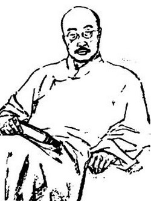
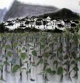

<!-- # ＜天权＞蝇翅之轻，生命之重——病后周作人的心境：从<苍蝇>（1924）读起 -->

**换言之，周作人从佛书与一茶的诗中体会的并非一种人类在居高临下的距离中造就的慈悲心，相反地，万物相亲才是现世的真正意义：因为现世最应是具体而微的，是小到一只苍蝇也同样担负着生命的个性，温度，趣味，梦想，乃至道德。从苍蝇之小到宇宙之大，都在一个凡人现世的心里。**

# 蝇翅之轻，生命之重

# ——病后周作人的心境：从<苍蝇>（1924）读起

## 文/夏小雨（复旦大学）

周作人曾多次写到苍蝇，这固然可以笼统地对应于他的“趣味主义”，但我们也应注意到周作人身上某些旧式文人的积习。而这就意味着，无论是贵族式的对其所占有的文化资源的夸炫，抑或是遗民式的“日常化书写”，甚或看似不很雅驯的“恶趣”，实则都隐括并暗示了这一“趣味”所引动和兴寄的人生体认与身世境遇。——周作人所念兹在兹的苍蝇，或亦可作如是观。

在1924年的这篇<苍蝇>中，作者一面嗟阔伤远，追思儿时乐景，一面闲聊掌故，细数古今中外我辈与苍蝇的恩怨。质言之，<苍蝇>写的并非“苍蝇之可爱”或“苍蝇之可恶”，而是“苍蝇小史”——这是苍蝇与作者个人相处的历史，也是苍蝇与人类共处的历史。

然既是写“史”，则总免不了史家的个人之见。文中作者曾引三年前卧病时所写<苍蝇>（1921）一首，以示“对于他们很有一种恶感”：诗末云“我诅咒你的全灭，/用了人力以外的/最黑最黑的魔术的力。”虽言欲灭之而后快，但这“最黑最黑的魔术的力”却仍像是小儿櫆寿在与苍蝇“决战”前的誓言：或者，周作人所意欲消灭的乃是那个代表破坏之力的“符号之苍蝇”，而非这个与自己从小玩到大的“事实之苍蝇”？又或者，他是“一面承认苍蝇是与我同具生命的众生之一，但一面又总当他是脚上带着许多有毒的细菌，在头上面爬的痒痒的，一种可恶的小虫，心想除灭他。这个情与知的冲突，实在是无法调和，”（<山中杂信>）——正如其<爱与憎>（1921）中那样矛盾——“但我虽然不全憎，也不能尽爱”？

爱憎尚在其次，我们还总想在这“史”中读出这位隐于传主身后的太史公的本事，即，周作人缘何对苍蝇如此情有独钟？在1921年与孙伏园的<山中杂信>中，周作人自道从佛教中读出“普亲观”、“平等观”；而在同年的<山中杂诗·七>中，他更写道：“‘苍蝇纸’上吱吱的声响，/是振羽的机械的发音么？/是诉苦的恐怖的叫声么？/‘虫呵，虫呵！难道你叫着，业便会尽了么？’/我还不如将你两个翅子都粘上了罢。”这不禁让人猜想，周作人对苍蝇的关注，或许与其当时的心境有关；而又是怎样的心境使得他竟能在“昆虫界的这些悲喜剧”中，“仿佛是听说远亲——的确是很远的远亲——的情感，正是一种迫切的动心，令人想起种种事情来”（<法布耳昆虫记>1923)？

事实上，1921年正是他因肋膜炎卧病的一年。诗集《过去的生命》记录了他这一年的悲观与绝望：他不再是时代潮头积极追索意志与自由的五四知识人，他只是无力而苦楚地看着生命“在床头走过去了”（<过去的生命>）；此时，他站在人生的“歧路”前，一方面认识了自己的懦弱（<歧路>)；另一方面又怯懦而顾惜地要在“果园的周围”“添种许多有刺的荆棘”（<荆棘>）；甚至，他在迫切而尖细的虫声里竟也能听见“恋之歌”与“死之歌”（<山居杂诗·四>）……——如果说作为思想者的周作人在过去的工作里，尚自信能够以思想的方式进入历史，那么此刻的病痛或许让他真正直观地懂得，不管精神有着怎样的超越性，肉身与现世永远是我们与这个世界最切己的关联：这一次，他纸面上的“现世主义”真正地被拖回了沉重的现世；而现世生命的沉重也并非形而上的，它是在于这些具体的无明的病苦和爱恋。正是在这样的心境里，周作人从苍蝇的叫声中，听到了有情众生无告无尽的“业”；在苍蝇卑贱而执著的挣扎里，他是否也自嘲似地看到了自己？

不仅是自己，周作人在苍蝇身上或许也看到了这个喧嚣而徒劳的时代：一方面，他恨不得替他们将“翅子”粘上，不愿再见到他这一代人为了赎祖先的业而为后代造下自己的业，——“历史循环”的“故鬼”，又一次重临他悲观的内心；另一方面，他也看到那些同样挣扎在“苍蝇纸”上的被侮辱与被损害的生命，那些如同苍蝇般被忽视的微弱的人。

为了后者的缘故，病中与病后的数年间，周作人在悲观绝望之外一再于诗文中写到儿童、妇女与个人的既往生命。这或许正如他在《儿童文学小论》中所言：“中国还未曾发见了儿童，——其实连个人与女子也还未发见。”因此，在其涉及此类题材的作品中，我们读到的往往不止是这些个体本身的历史，而实在是“人”这个全体如何对待这些特定的同类的历史。换言之，周作人既是在为儿童、妇女与个人作史，也是通过展现历史暴力下人类共处的方式，为“人”作史。

如果回到“苍蝇”的话题，那么周作人的“苍蝇小史”作为人类对苍蝇的“接受史”，便也同样自成为一种“人”的历史。而在这“苍蝇与人”的历史中，周作人又向我们展现了什么呢？在1924年的这篇随笔里，他提到了在自己的童年乃至人类的童年（古希腊）时，苍蝇总是我们的玩伴；但紧接着，他提到了“科学的洗礼”：科学所带来的现代知识让我们与苍蝇不复相亲。而这，是否必然意味着作者对科学持有否定态度呢？

诚然在这样有限的篇幅里，我们无法公正地探讨周作人对于科学的态度，正如我们不便在此展述其对宗教、道德、革命等等问题的复杂立场；但我们至少能够达成这样一个共识，即，科学、宗教、革命，凡此种种都是时代宏大叙事的一部分，它们往往意味着众数的真理，象征着人生的超越，并时而沦为某种“圣人教诲”的口实：“众数”难免走向对个人的消解，“超越性”难免被用于否定现世，而在“圣人”的鼓吹下，在信条、主义、黄金世界的鼓动下，“凡人”与“庸人”看似得到了超升的救赎，实则被异化为“非人”：正如周作人在<酒后主语小引>（1926）中所说的国人的“疯狂”与“痴呆”。

而在<自己的园地·旧序>中，周作人更是以一种虽怀希望但难掩悲观的口吻说自己还在寻求一个“能够理解庸人之心的读者”。——本应是斯世同怀的“庸人之心”、“凡人的悲哀”，在中国何以会如此孤独而无人能解？周作人所谓的“凡人”、“庸人”，又究竟是怎样的人？

凡人庸人是那些真正知道现世生命的重量的人。而以此理解1924年的这篇随笔<苍蝇>，我们会发现作者除了提到希腊人以及古时候的中国人对苍蝇的礼遇之外，更是指出苍蝇在日本的俳谐中“很能表出温暖热闹的境界”，——还有比“温暖热闹”更能形容现世的词语么？继而他再度聊起小林一茶，认为他能“以一切生物为弟兄朋友”，——这又何尝不是周作人昔年从佛教中读出“普亲观”、“平等观”的再现？换言之，周作人从佛书与一茶的诗中体会的并非一种人类在居高临下的距离中造就的慈悲心，相反地，万物相亲才是现世的真正意义：因为现世最应是具体而微的，是小到一只苍蝇也同样担负着生命的个性，温度，趣味，梦想，乃至道德。从苍蝇之小到宇宙之大，都在一个凡人现世的心里。

但，周作人在文末却又写道：“中国人虽然长久与苍蝇同桌吃饭，却没有人拿苍蝇作为名字，以我所知只有一二人被用为诨名而已。”中国人是太久地忘怀了这些共渡现世的故友与同侪：我们不懂得小如苍蝇也是沉重的生命，如同我们不能懂得别的人的生命之重，甚至不能懂得自己的生命之重；正因不能懂得，人类也是太久地忘怀了自己了，——而这正如<小孩的委屈>（1921）中所云，“至于或者说，中国人现在还不将人当人看也不知道自己是人。”也因此，周作人要在<心中>（1926）中写道：“中国人似未知生命之重，故不知如何善舍其生命而又随时随地被夺其生命而无所爱惜。”

（责编：应鹏华）
