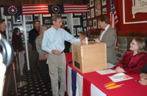
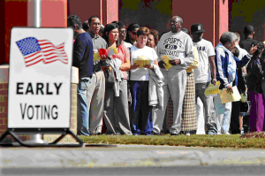
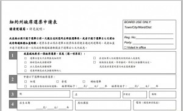
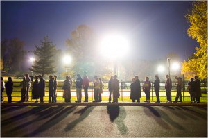

<!-- # ＜天枢＞提前投票，早投早好？ -->

**有不少人都觉得应该彻底废除“投票日”这个方式，毕竟，仅限于一天的投票机制限制性因素实在太多。在俄亥俄州，议会的这项法案无疑在和整个大趋势争锋相对。但是不管怎么说，俄亥俄州的这项法案可以看成一种提醒：是时候改革我们的投票方式了。比如说，为什么不把“投票日”改成“投票月”呢？甚至说，为什么不能在“投票月”中，允许我们发封邮件、点一下鼠标、甚至在手机上完成投票呢？**

# 提前投票，早投早好？

## 文/高涵（中国人民大学）

参加过托福考试的人都知道，等成绩的日子非常难熬——一边盘算着自己考了多少分，一边还得忙不迭地为了申请修改PS和推荐信。我曾经天真的认为，如果成绩在考试结束时候就能立刻显示出来，生活肯定会好更多。这种想法，直到我参加了GMAT考试，才被证明是错误的。

总统候选人也是如此。每四年一次的总统大选，共和党和民主党通常最迟在当年8月确定两方的总统、副总统候选人。随后，历时百日的总统大选拉开帷幕，双方全国巡回演讲，豪掷资金投放广告。在两对候选人看来，选民就如同托福考试的判卷系统，他们需要等待三个月的时间，直到最后的大选日（Election Day）才能知道自己的“成绩”，从某种程度上说，这也是种“煎熬”，如果能早点知道自己的“成绩”，会不会能减轻一些压力呢？

事实上，提前投票（Early voting）让他们这种期待成为了可能。只不过，这种可能有时候不完全是好事。看来，筹备大选的“准总统”和忙于出国的学生，有着相似的苦恼呢！

远在大洋彼岸的我们，可能对于所谓的“提前投票”并没有感性的认识。为什么要提前投票？选民在大选日投票难道不是义务吗？难道不是一种统一一致的政治行为吗？我也有这样的疑惑，因此，我向南加州大学研究政治传播的Tom Hollihan教授发了一封邮件，询问提前投票的种种问题。他在回信中说道：

Many voters in the US can vote by absentee ballot. Normally because they are ill, will be traveling, have disabilities, etc. Those ballots usually go out a week before the election and are due on Election Day. Now some states are permitting any voter to vote up to two weeks or so before the election. California is not one of them. Oregon is one of them. It is thought that it will increase turnout and it may also diminish the impact of the flurry of negative ads that come at the very end of the campaign.

这段话基本概况了“提前投票”的概念和初衷。选择提前投票，选民就不用担心大选日的天气情况，也不用担心望不到头的投票队伍，家里当天有急事要处理，诸如此类的问题，都可以迎刃而解。

在美国，多达31个州允许提前投票。根据《彭博商业周刊》的报道，今年这个数字将会是32个州。选民在大选日——11月的第一个星期二——前往投票站投票。在艾奥瓦州，今年的大选投票更是提前到了9月27日，假如你看一下今年的总统大选辩论日程表，你会发现，如果选择那时投票，你还没有见过奥巴马和罗姆尼针锋相对的辩论呢！

除了提前投票，还有一种名为缺席选票（Absentee ballot）的投票方式，简单来说，就是委托投票。如果你预计大选当日没有时间去投票，甚至你的时间“宝贵”到连自己提前投票都做不到，那你大可通过委托的形式，让别人代你投票。例如，如果你在纽约州，你就可以填写一份这样的表单，写清楚缺席的理由和受托人的情况，从而行使自己的投票权利。

超过三分之二的美国人所居住的州允许提前投票。2008年的选举，在1.31亿张选票中，有30%的选票属于提前选票和缺席选票，要知道，上世纪90年代初，这个数字还不到10%。懒得排队，提前规划，不影响自己的日程，人民越来越多地选择提前投票这个方式了。

不过在政客眼中，提前投票有时候只是“看上去很美”。如果你把奥巴马和罗姆尼拉到自己面前，邪恶地问他们“想不想让选民提前投票啊？”得到的答案一定不一样。

在俄亥俄州，共和党控制的州议会通过了一项选举法案，对提前投票的选民群体进行了限制。新条例规定，只有服役军人和身在海外的选民有资格提前投票。奥巴马竞选团队已经就此法案发起了诉讼。

当然，两方都打着自己的小算盘，而且这个小算盘都是基于同样一个目的：提前锁定目标选民的选票，并尽可能多得拉上摇摆选民，以免夜长梦多。在对奥巴马指控的回应中，共和党方面声称，缩小提前投票的选民群体只是为了防止选票舞弊事件的发生。其实，在美国政治界，大家都知道军队和海外美国公民向来是共和党的大票仓。当然，奥巴马的小九九也是尽人皆知的。上次大选中，民主党成功说服包括西班牙裔、非洲裔和低收入选民在提前投票阶段走出家门，投出自己的一票，倘若没有提前投票的机会，单单在一天的时间里，这些选民的投票率无疑会大打折扣。

同样的故事还发生在佛罗里达。面对来自共和党相似的发难，民主党全国委员会主席代比•舒尔茨（Debbie Wasserman Schultz）愤怒地认为：“让所有人挤在同一天投票简直是太疯狂了！”

看到了吧，俄亥俄，佛罗里达，都是每次大选至关重要的摇摆州，民主党和共和党在这些地方的争执，从来都是堪称白热化。尤其是涉及到选票的分布和走向，争斗更加不能避免了。

不妨让我们把“政客的归政客，选民的归选民”，既然政客在这个议题上纠缠不清，倒不如听听选民的意见。

Huffington Post专栏作者史蒂芬·克兰德（Steven Kurlander）认为，提前投票早就是司空见惯的投票方式了，这种方式让投票变得更加方便、人性化。

他甚至表示，有不少人都觉得应该彻底废除“投票日”这个方式，毕竟，仅限于一天的投票机制限制性因素实在太多。在俄亥俄州，议会的这项法案无疑在和整个大趋势争锋相对。但是不管怎么说，俄亥俄州的这项法案可以看成一种提醒：是时候改革我们的投票方式了。比如说，为什么不把“投票日”改成“投票月”呢？甚至说，为什么不能在“投票月”中，允许我们发封邮件、点一下鼠标、甚至在手机上完成投票呢？

虽然态度诚恳，大部分观点值得参考，但是我真觉得，这位作者发表在有自由派倾向的Huffington Post的这篇文章，想法确实有些狂野了。

(转自“正谈”

源地址：[http://www.zhengtan.me/?p=1980](http://www.zhengtan.me/?p=1980)）

（采编：彭程；责编：马特、佛冉）
