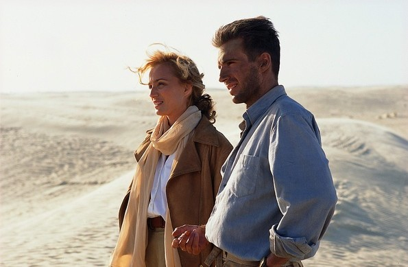
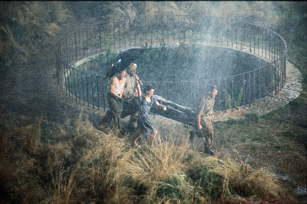
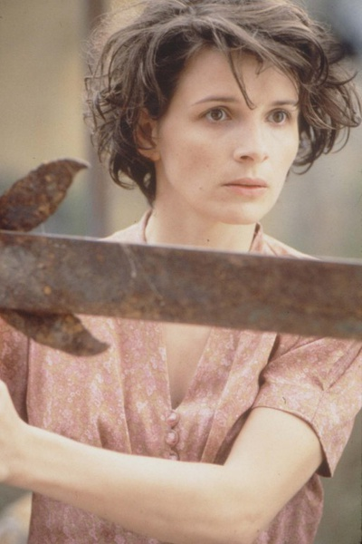

<!-- # ＜玉衡＞《英国病人》：爱火焚心，战火焚城 -->

**人类对生命的悲悯是无穷的，即使是受伤的心灵，在一个受伤的时代、受伤的地点，隔着重重叠叠的时间跨度，也在互相扶持着进行自我和相互的疗治。战争与爱情的创痍总需要时间来弥补，那些混杂着希望和绝望的故事，许多人喜欢称之为史诗。**

# 《英国病人》：爱火焚心，战火焚城

## 文/李维恩（香港浸会大学联合国际学院）

**1．**

圣经里说，爱比死更冷。

但我还是想求你，“求你将我放在心上如印记，带在你臂上如戳记。”

--雅歌 8：6-7

在《英国病人》缓缓滑向故事尾声的时候，当男主人公Almasy颤抖着用手指把吗啡推给护士Hana的时候希望她结束自己的生命之时，剧情的走向被推往高潮。

或许这样的结局也是注定的，当Almasy失去了自己的恋人K之后，当他驾驶着英式涡轮飞机载着K的尸体穿越沙漠之后，当他的飞机被德国军队的炮火击落之后，我们其实早就无数次幻想了Almasy的必然死亡。可是，当结局到来的那一刻，当这场发生在亚平宁与开罗之间、发生在二战的盟军与德军战火之下的爱情史诗最终破灭的时候，我们还是会自然而然的流下眼泪。

用《英国病人》的伟大导演安东尼·明格拉的话说，那是一种令人放弃一切的爱情。

影片的结局是悲恸感人的，这让许多人记住了爱情是怎样升华，却忘记了爱情是如何萌芽的，忘记了爱情的火花渺小却能永恒。电影就是在这种讲不清楚的情感接触中让一段超越了伦理、战争、生死的爱情旅程。

我们付出所有去交换遗忘的权力，可是却忘记了我们曾经的付出已经衍生出无法抹去的记忆。“她得到了她的幻想”，Virginia Woolf在《To Lighthouse》里写道。在这个记忆褪色的世界里，这种竟是获得如此美好。

那一刻，我静静的看着那片海，那个古老的半岛，那个大洋中的孤岛，那个繁琐的拼写，那本希罗多德的书籍，那个叫游泳者山洞的地方。我开始相信Almasy与K曾经在一起，或者根本不曾经历分离。开始相信有一天我们会到达他们相爱的地方，不是地图上的一点，而是到达我们的感情世界。

我想起了在《恋爱的犀牛》中，马路对明明说：遇见你是我一生中最美好的事情。对于Almasy而言，遇见K应该是他一辈子最幸运也最痛苦的事情。

当我陷入爱情之中的时候，有人问我，你觉得一生中最快乐最痛苦的时刻是什么?

我告诉她，就是现在。

**2.**

整部电影是用倒叙的方式开始的。

一架英国飞机在飞越撒哈拉沙漠时被德军击落，飞机上的机师面部被全部烧伤，当地的人将他救活后送往了盟军战地医院。这个机师由于受伤，不能想起自己是谁，因此只被叫做“英国病人”。

Hana是战地医院的一名护士，战争使她失去了男友，在伤员转移途中由于误入雷区，又失去了最好的朋友，这使她身心交瘁。于是她决定独身留下来照顾那个“英国病人”。这是意大利的一个废弃的修道院，远离战争的喧嚣，“英国病人“静静的躺在房间的木床上，他原本选择去试着忘记一切，但在面对Hana的真诚时，窗头的一本旧书，渐渐唤起了他的思绪。“英国病人”虚弱得躺在床上，曾经的面容尽数毁去，呈现于眼前的只是一张极度烧伤后似绝境老人的脸，就像一张橡胶皮被火烤后自然萎缩的模样。他的述说断断续续，使得这段曾经的故事更加模糊，但K的脸总是清晰的。

他不是“英国病人”，他原本是匈牙利籍的历史学者、皇家地理学会会员Almasy伯爵，跟随探险家朋友深入撒哈拉沙漠进行考察。在那里，他结了前来绘制地图的“飞机师”和他美丽的妻子K。K的风韵和才情深深地吸引了Almasy，并对她产生了无法抗拒的爱慕之情。在这段时间里，K与Almasy共同发现了沙漠深处的绘有原始绘画的“游泳者”洞穴。在洞穴的墙上，绘满了原始人类自由游泳的样子，这里其实是导演明格拉精心设置的一个隐喻，用这种不加拘束的自由与K和Almasy的爱情相对。他们的爱慕是注定的，无论是在篝火旁K为大家讲述希罗多德笔下盖希的故事时，又抑或是他们第一次见面关于car、love与ownership的那段争论时，还是一起经历沙漠风暴的来袭时，明格拉导演都在一步步把我们引入这个爱情的圈套中。

沙漠里绝望的爱情，废墟里深情的回忆。

曾经意气奋发的皇家地理学会会员，无所不能。因爱而生的自卑，因自卑而生的骄傲，因为害怕受伤的自我保护,有时候克制，有时候放纵。在回到开罗之后，Almasy和K的感情终于升华，他们再也无法彼此克制，她穿着一袭白裙来到他的住处，清雅美丽，他控制不住自己的情感，抱着她的腿，疯狂地吻她，她推开他、捶打他，最终也被自己的感情淹没。他们一起泡在浴缸里，感受彼此肌肤的接触。他们躺在床上，他半侧着身子，摸着她锁果上方凹陷的一块，将其命名为“Almasy海峡”。

古老的埃及、无垠的沙漠、史前洞穴里精致的壁画、空灵的匈牙利民歌、战争来临之前最后的放纵和疯狂，所有激发爱情与毁灭爱情的元素都已经集结，就当我们为他们燃烧着的爱情感到痴狂时，其实这个故事才刚刚开始。

**3.**

沙漠，变幻莫测。此刻繁星闪耀，下一刻，沙尘就把天空完全遮盖。自然的力量如此伟大，身在其中的渺小的人，无论是谁，无论他本来多么冷酷，都会产生感情。而回到开罗，那个已经被文明侵蚀的城市，产生于自然的感情很可能会被所谓的文明和理性束缚。

K是有夫之妇，尽管和Almasy的感情真实而炙热，她仍然无法走出道德伦理观念的藩篱。在第一次偷情之后，K只对Almasy说：“请忘掉我。”但是，这是不可能的，爱情，总是要带上“占有”的调子，不论你愿不愿意，不论有意无意；相爱的两个人，总心心念念希望在一起，身体与身体的占有，精神与精神的占有。It’s all about ownership and label. 将人辗转折磨于其间。

后来，K终于无法忍受感情与道德的折磨，选择在电影院与Almasy分手。似乎电影院是最适合分手的地方吧，昏暗的灯光笼罩，谁也看不清楚对方脸上伤痕累累的表情；周围人声喧闹，谁也听不到对方的心脏陡然破碎的声音。

然而，知道真相后，K的丈夫无法磨灭对Almasy的恨意，驾驶飞机载着K冲向Almasy，欲三人同归于尽。

飞机坠毁后，K的丈夫死亡死亡，Almasy抱着全身多处骨折的K行走在悬崖侧，她戴着他们一起去集市买的顶圈，白色的丝绸随风舞动，K轻轻在他耳畔说：“傻瓜，我一直以来都深深的爱着你”。他哭了，男人的方式，风吹起她身上的白纱。他张大嘴，想要释放出所有的悔恨和痛苦，他没有大叫，只是张嘴，做无声的呐喊，他深爱着也深爱着他的女人，他曾经是那样讥讽过她，他的痛苦，他的挣扎让他不能负荷，他就这样一来抱着她走向那个发现游泳者图形的洞穴，迎着过往无情的风。Almasy要拯救K，可是那里没有人烟，他必须步行走出沙漠求救。他将K安置在山洞里后，对他许诺一定会回来救她。

Almasy在沙漠里走了三天三夜,他的信念支撑着他克服一切阻力。他终于找到了英国军队。他要一个医生和一部车。他要去救他的女人。但由于Almasy可笑的姓，英军把他当成了德国人。他们不顾他的解释，抓住他。他无奈而痛苦的大喊着K的名字。

盟军把他押上去战俘营的火车。他找准机会打伤看管他的士兵，跳下车。他要回去。他遇见了德国人。他用他绘制的沙漠地图换回了一架飞机。他还是来不及。当他再次迈进那个山洞时，K已经安静的睡在地上，一动不动。他躺到她的身边，抚摸着她的脸。

他用白纱将她包裹。他把她放在飞机前座。飞机绝望的升空。整个红色的沙漠尽收眼底，辽阔而沧桑，冷竣而美丽。

可是爱情终究挑战不了战争。飞机被击落。K被火海吞噬。他被阿拉伯人从残骸中救起，皮肤残破的送入英军医院，成为垂死的英国病人。

战争产生了爱情，战争又毁灭了爱情。那是美丽而又残酷的爱情，而它的美丽又注定了它悲惨的结局。Almasy为了爱情，他付出了一切，甚至背叛了他的国家。他把情报卖给德国人，为的就是见他最爱的女人的最后一面。

亲爱的，请你等着我回来。我一定会回来，哪怕是和魔鬼交易。

**4.**

明格拉是个天才，他把爱情和战争如此统一的结合在了一起，丝毫不给人突兀感。他完成了一次艰难的工作。把一部畅销小说完美的搬上了大荧幕，处理得相当沉稳而不留雕琢的痕迹，每一个镜头都极尽窒息的美丽。

当汉娜在修道院弹着巴赫的歌德堡变奏曲时，当凯瑟琳在沙漠中、影片响起拉赫马尼诺夫第二钢琴协奏曲第二乐章那段慢板时，明格拉下意识透露出自己的政治意识—一种由来已久的无政府主义。他用这种无国界性质的音乐来淡化电影中Almasy背叛国家的心理冲突。

由于Almasy将地图与德国人的汽油交换，德国人最终攻陷了开罗，数不清的无辜人不得不为Almasy与K的爱情悲剧殉葬。

那是爱情。一种令人放弃一切的爱情。

在那个炮火纷飞的战争年代里，个人的悲剧与时代的悲剧紧紧相连。Almasy是匈牙利人，他对于政治与战争漠不关心。他更像是一个艺术家，热爱考古、偶尔冒险、字斟句酌地研读小说。这个外冷内热、敏感细腻的男人为爱而生，甘愿成为爱情手中的俘虏。当K像只骄傲的孔雀一般从天而降，Almasy便在没有硝烟的战场里被彻底地征服，从此他的心里只有爱情，因爱自卑、因爱骄傲、因爱疯狂、因爱压抑、因爱放纵、因爱背叛信仰、因爱藐视世界。

爱里延伸出来的自私与占有欲令世俗的伦理道德退却到一旁，他关心一个人的生死甚过千千万万个在战火中挣扎的人的生命。这也是一种真实的人性和生活，绚烂一季，结局却注定了毁灭。我无法言说任何Almasy的好，却不能不对他念念不忘，就好像我喜欢晕黄沙漠里的那轮落日，明明知道它将西沉，却仍然贪恋地对它凝望。

这不是爱情的错误，而是时代的错误。

我也因此明白了K在最后写在希罗多德文集上的那句话：

有一天这个世界的版图将不再按照强人的意志而划分，每个自由的灵魂都可以在上面尽情的驰骋。

**5.**

每部电影都有主角配角。每个爱情故事都有男人或是女人。

所有美丽或不美丽的爱情都有足可以让人痛哭的瞬间。即使仅仅是片刻的短暂。

我不敢想象忘记全身骨折、奄奄一息的K是抱着怎样的心情在寒冷的洞穴里等待Almasy归来的，但是我永远无法忘记她在自己将死之前写给Almasy的那些话。

“ My darling. I'm waiting for you.

How long is a day in the dark? Or a week?

The fire is gone now. And I'm cold, horribly cold. I really want to drag myself outside but then there'd be the sun. I'm afraid I waste the light on the paintings, and I'm not writing these words.

We die. We die, we die rich with lovers and tribes, tastes we have swallowed, bodies we have...entered and swum up like rivers. Fears we have hidden in ---- like this wretched cave. I want all this marked on my body.

We're the real countries, not the boundaries drawn on maps with the names of powerful men. I know you'll come and carry me out into the Palace of Winds. That's what I've wanted: to walk in such a place with you, with friends, on the earth without maps. The lamp has gone out and I'm writing in the darkness.”

“亲爱的，我在等着你。黑暗中的一天有多长呢，或者，黑暗中的一个礼拜呢？这会儿火已经熄了，我冷得要命。我真应该把我自己拽到外面去，不过，也得外面有有太阳才行。恐怕我现在是在浪费那亮光绘图，浪费那亮光写这些东西。我们会死。但我们死的好富有。我们拥有着自己的爱人和部类；拥有我们曾经吞咽过的美味；拥有我们进入的身躯，我们在其中就像在河里游啊游。我们把恐惧埋藏在这里面，像这个凄凉的洞穴。我要把所有的这一切，都铭刻在我的身躯上。我们会有着真正的国度，可不是地图上勾画的边界，或者强权者的名字所代表的那种。我知道你会回来，把我带出去，带我走进风的宫殿。在这样的地方和你，和朋友们一起漫步，那就是我所想要的一切了，一个没有地图的地球。灯光也熄灭了，我现在是在黑暗中书写。”

二战结束之后，照顾“英国病人”的护士Hana兴奋地和Almasy一起狂欢，疗养院里的人们用担架抬着Almasy，在滂沱的大雨里唱着、跳着。雨水打湿了疗养院圆栏，打湿了Almasy的脸庞，也打湿了他沉默孤苦已久的心。

在影片的最后，盟军的间谍找到在意大利疗养的“英国病人”—Almasy，他想让Almasy为其背叛的行为付出代价。但在了解了一切的故事后，那个间谍放弃复仇，选择了离开。但Almasy无法原谅自己，他用颤抖的手指将吗啡推给了Hana，祈求她结束自己的生命。当Almasy抱着K的尸体迎风屹立的时候，他的灵魂就已经追随爱人而去了，他的身体只是一具行尸走肉而已。K的寓言不知何时才会成为现实，但体无完肤的Almasy知道自己已经看不到这一天。

故事结束了，飞机升空，绝望的飞翔，划过依然没有尽头的沙漠。

满目红色，爱情已经无法继续。

太阳从树林间的缝隙中透出，一明一暗。

在深夜打开《英国病人》这幅血红的画卷，相信爱情曾经来过，即使在黄沙遍野的边陲。

人类对生命的悲悯是无穷的，即使是受伤的心灵，在一个受伤的时代、受伤的地点，隔着重重叠叠的时间跨度，也在互相扶持着进行自我和相互的疗治。

战争与爱情的创痍总需要时间来弥补，那些混杂着希望和绝望的故事，许多人喜欢称之为史诗。

（采编：安镜轩；责编：安镜轩）
