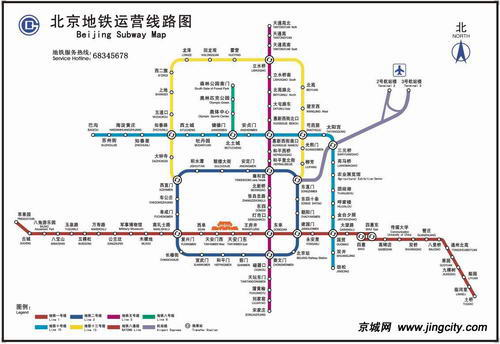
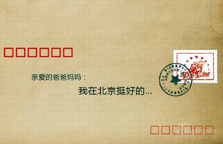

<!-- # ＜七星人物＞第十三期：毕业几年，我们走在各自的路上（2）——瓢虫君专访北漂、警察和外企白领 -->

<!-- # 毕业几年，我们走在各自的路上（2） -->

<!-- # ——瓢虫君专访北漂、警察和外企白领 -->

上期北斗人物描述了三位毕业生，一位在欧洲院子研究中心，一位研究生毕业后去了华为，还有一位正在准备自己第二次的考研（原文地址：[http://blog.renren.com/blog/362359989/870091714](http://blog.renren.com/blog/362359989/870091714)）。有读者留言问到，为什么没有直接工作的毕业生，这主要是因为我们在编排稿件时，出于“便于比较”的考虑，把相似方向的毕业生优先组成一个稿件（如上期稿件找中的人物都和“进一步学习”相关）。本期和下期毕业生的稿件将会重点关注工作了的毕业生。相比留在校园里或出国读书，选择工作无疑意味着需要面对更大的挑战，这种挑战不单源于物质生活或工作上的压力，更在如何balance工作圈里的人际关系、父母养老、成家立业和个人幸福等很多问题。很多时候，由于前面几种挑战给毕业生带去了很大的压力，因此我们甚至在现实生活中找不到“个人幸福或个人空间”之类的东西。

曾经有句话说，不要向这个操蛋的世界投降。笔者相信，大多有梦想的年轻人都不会想投降，但我们着实被生活、被这个国家强奸了。物价，房价，环境质量，父母养老，工作压力，不健全的保障制度，高额的“强制”税收，没完没了的加班，拥挤的公共交通，躁动的心态，看不完的领导眼色，从未出现过的企业文化，司法不公等等等等，你我都知道上面这个单子可以列得很长，但生活却依旧只能继续，于是吐槽成了一种解压的“无奈之举”。我们总在期望有一天这个国家可以变成我们想要的那样，但我们却一直失望、一直被压抑着，偶尔的发声更像是深夜里的叫床——纵然划破了寂静的夜，但曲终之时，却很少有人可以记得，或者在云雨之时直接被警察带走。

本期人物，采访的三位对象分别是北漂者、警察和外企白领，希望本期人物可以让你更多地看到他们相同的活不同的世界~~在那里，每个人都有着自己的欢愉与抱怨，但不管怎样，他们只能在不断的“自我校订”中去适应这个社会。是的，被改变，一直只能是“被改变”。

阅读提示：毕业生选题共分3期，本期为第2期，选取的三个采访对象分别是：北漂者，警察和外企白领。本期文章依旧分为三部分，第一部分是对每个人和相应选择的简介，第二、三部分是采访问题，由General question 和 Specific question构成。其中8道General Questions是一样的，将以“一个问题，三个答案”的方式给出；文章第三部分，是针对每个人不同的选择而设计的6-8个Specific Questions。我们知道这样的分类可能略显粗糙，可能不够考虑每个被访者自身的经历，但我们总希望通过他们的答案看到一些一样、或不一样的答案，所以希望这次人物组新的采访和组稿方式，您能喜欢，也能包容其中出现的一些问题。

### 一、人物简介

**北漂者：**

湖北人潘言，毕业于武汉工业大学室内设计专业，毕业之后她来到了北京，至今已有两年，这个女孩只是真实北漂人群中一个小小的缩影。

**国防生：**

陈思勤，一位80后的民警，他爱音乐、爱街舞，也爱生活，但同时他的职业决定他不会有太多的自由时间和自我选择，学会容忍，学会坚持，也许当你在和朋友对酒当歌的时候，他们却不得不奋战在第一线。

**外企白领：**

麦静则是一位令人羡慕的外企白领，她性格开朗，思想独立，同时拥有良好抗压能力。然而在这些背后，她也和其他人一样，需要在工作中，创立新的交流圈，克服各种障碍，这个中国姑娘在安利（中国总部）的工作生涯才刚刚起步……

### 二、常规问题

**Q1: 能描述一下你现在的生活状态么？**

**北漂者：**我现在做的是市场工作，每天过得很充实，偶尔要加班，有一定压力。这种压力主要表现为：每月的KPI是否有完成。刚开始工作的时候，感觉很好，生活很充实，后来发现越来越忙，忙到脑子都要爆掉，偶尔会突然短路不知道该做哪件事；后来就突然变得很闲，没有什么事情可以做，这种变化让人比较不适应。

我个人平时的生活很规律，每周打球，和朋友聚会，吃饭，聊天，经常锻炼身体。我想象中的生活是有份喜欢的工作，休息时做自己喜欢的事，和朋友保持适当的联系。以前认为工作没什么压力，轻轻松松就能完成，更没考虑过人际关系、办公室如何生存这些问题，后来发现，办公室文化确实是需要去适应的。

**警察：**我现在一个月休息6天，一个月2个双休，2个单休。每四天值一个24小时的班，从8点半到第二天8点半，在这24小时期间负责辖区内的110接处警；第二天8点半值班完了，继续正常上班，到下午5点半下班。

警察的办事要求不同于其他工作，都是有时间限制的，比如一般的打架等事情传唤进来8小时就要让人走，所以虽然已经是下班时间了，你也必须把事情办完再下班，你不能把人丢里面，等明天上班再做，所以生物钟全是乱的，很累。除了累，就是琐碎，有时也觉得挺烦。接处警最多的就是邻居、夫妻吵嘴打架，还有就是买卖消费纠纷。百姓缺少法律知识，无论什么事都报警，很多事情其实不属于我们的工作范畴。不过除了那些琐碎的事，有时也特别危险。

**外企白领：**我目前是一家美国的快消公司的管理培训生，还在轮岗期，在不同的部门学习体验。每天的生活相对规律，基本上是十点上班，七点下班，没有多少加班，回家以后就看两三个小时的书，感觉还蛮好的。

**Q2:你以前对这个选择的想象是怎样的？当初这个选择对吸引你的地方是什么呢？**

**北漂者：**之前没有想过自己会进入到这一行，上学时候也没具体想过要做什么，但是当时不喜欢做设计，所以后来就选择了市场。这份工作吸引我的地方主要是工作的挑战性。

**警察：**警察这个职业对普通人而言有点神秘。我当初对警察的理解和你们一样，觉得很帅，很威严，很有正义感，这是当初最吸引我的地方。但实际情况是，有的警察其实很腐败，会刑讯逼供等等。

**外企白领：**以前我会把外企想象得比现在可怕，觉得有点像什么资本主义血汗工厂啦，加班加到死啦，内部各种竞争激烈啦（“麦旋风”了，麦静说话风格的旋风）……但是它吸引我的地方是，我觉得它能够让一个人发挥自己的能力、证明自己的价值；我觉得我特别没办法忍受去一个小机关单位，过那种“清闲地喝一天茶、看一天报纸”的生活；而且外企朝十晚七的上班时间也比较适合我这种夜猫子，让我八点上班不如叫我去死……

**Q3:你选择这个方向，是自己的想法还是听取了他人的意见？你对现在的生活满意吗？会后悔己毕业前做出的这个选择吗？**

**北漂者：**是我自己的想法，当时想来北京闯一闯。我对生活是55%满意，同时对现在自己的状态不满意，总是很有惰性。不过这种选择我不后悔，因为每个选择都有其必然性。

**警察：**是我自己的选择。高中时，我希望自己大学，学经济或者法学，但高考之后根据自己的实际情况，对比完就业形势后，就毅然报了警校。我大学时学的是警察管理专业，公安政工方向，一开始打算报反恐专业的，感觉那个会很帅，但父母害怕那个专业太危险，最后就念了政工，我的这个选择父母是同意的。

对于现在的生活，我其实并不满意，但是警察这个职业决定了这个群体基本上是一种很宽大豪迈的性格，不会斤斤计较。我最大的不满是对社会环境的不满，现在的人民群众越来越离谱，没事都报110。很多明显不归公安部门管辖的事情都要报警，比如家里漏水、停电、路上积水等等。我们有规定，报警了必须到现场。所以到了现场也只能告知报警人联系其他部门解决，警察不能帮你家里修水龙头、修电器啊，但这样的话群众特不乐意，还要投诉你。不过我们只要做的合乎法律合乎规定就不怕投诉的，但出警的这些汽油费，人力物力，都是很大的浪费。

**外企白领：**选择这个方向多多少少还是偶然因素比较大，因为去年考研忘记了现场确认报名（“麦旋风”第二弹，麦静的生活作风）……不过如果谈及工作的话，我其实从很早开始就留意外企了，因为比较喜欢这种相对自由的工作气氛。现在还是挺满意的，觉得外企的工作方式很适合自己，公司的环境也很让人满意。

**Q4: 对生活或现实有什么抱怨吗？有感受到什么压力吗？比如购车，生活压力，居住条件差，购房，恋爱，结婚，照顾父母etc:**

**北漂者：**肯定有抱怨，比如恋爱和婚姻，不知道另一半什么时候出现；不能就近陪伴父母很惭愧；对物质要求不是很高，我认为只要努力工作该有的就都会有；对于以后买房也会有压力，如果生活在北京就买不起啊！

**警察：**也没什么压力，就是工作很忙。现在局里事情多，我基本上是通宵在单位，也就周末回家吃几顿饭。过年春节人家休息7天，我们休息3天，而且休息的是哪三天是由组织安排的，自己决定不了。不过还好，父母都挺理解的，他们也给予了我很多，车子、房子都是父母帮我买的。要真说压力，就是差个媳妇了，警察适合做男友，但不适合做丈夫。

**外企白领：**工作后最大的感受就是现在物价好高啊！特别是在市中心的写字楼上班，压力就更加明显了，吃个饭、喝个咖啡什么的，一个月下来都能花掉不少。不过还好我家就在本地，没什么租房和买房的压力。以前伸手向家里拿生活费就可以了，但工作以后不光要给生活费，还会有各种人情往来，其实还挺不习惯的。

**Q5: 在这一段时间里（小于半年）遇到过的最大的挫折是什么，有没有思考过这个最大挫折的来源或者本质又是什么？**

**北漂者：**最大的挫折就是发现不喜欢工作了，心情相当不好。当时就觉着一定要找一个自己喜欢的工作，我觉得这种“挫折”的来源于是由于对现实认知不清，而且和人的天性中本身不满足一种“一成不变的东西”有关。

**警察：**最大的挫折就是分手了，当时差点崩溃。主要是自己当时没有好好把握，是自己的过错造成的，以后绝不会让这种事情发生。具体细节就不讲了。

**外企白领：**最大的挫折可能还是跟家里的矛盾吧，他们希望我一直留在广州，不交外地的男朋友，也不到外地工作。我其实还觉得挺困扰的，因为我不是一个想一直呆在家乡的人。而且工作以后，我的家人反而更想控制我，比如想让我把工资都交给他们去存起来什么的，我会觉得很愤怒，觉得不被尊重。我觉得这种问题最大的来源还是现在中国家长落后的不得了的思想吧，总不把孩子当做独立的个体。

**Q6: 从毕业到现在所有的经历对你产生的最大影响是什么？**

**北漂者：**最大的改变是发现自己的耐心变得越来越好。

**警察：**天天和社会各个阶层的人、和人类最阴暗的人打交道，让我认识了我们这个社会、认识了人类这个种群，很多观念发生了改变。因为每天都要面对人世间的各种悲欢离合，我渐渐对一切都麻木了，看透了生命。好好的人，突然间就不在了，一切物质、名誉、权利、金钱，甚至信仰，都不过是虚空，我觉得活着、幸福最重要。很多时候，很多人，不知道忙的些什么，忙到最后什么也没有得到，最后连最珍贵的亲情、爱情都丢失了。除了思想发生改变外，我觉得自己的承受能力也更强了，因为每天都要处理那些“生离死别”。

**外企白领：**变得越来越独立！不管是从精神上、物质上，还是从生活方式上，个人意识觉醒得更加彻底。

**Q7: 如果能再做一次选择，你愿意改变吗？**

**北漂者：**如果再选一次，我还是会来北漂的。不过我希望能重新选择行业，因为我中间换过行业。如果时间倒回，我希望自己能在原先那个行业中坚持下来吧。这也是我经常对自己说的：戒骄戒躁，对于刚毕业的岁学生而言，这或许是最重要的建议。

**警察：**虽然前面我已经说了我不满意，即使如此，我也不愿改变，也不想改变了。因为到目前为止，我依然觉得这份工作很有意义，很有成就感。不管是帮助别人，还是把有违法行为的人绳之于法，让毛贼、瘾君子回归正途什么的，这都比那些天天在网上耍嘴皮子的人对这个社会更有益。我以前也是在网上很活跃的人，每天都愤世嫉俗地批判一切，到后来才发现，你写再多的文章还不及做一件实事对这个社会的改变来得有意义。

**外企白领：**如果能的话，当然想过一种不同的生活了。可能还是想好好高考，如愿以偿去读中文系，然后一直搞学术吧。大学这四年自己有很多不同的生活轨迹，如准备考研，准备出国，准备工作，其实我几乎什么都干过，不断去寻找最适合自己的选择。

**Q8：对于可能选择和你相似路线的后来人，有什么想说的吗？或，通过这个采访，你最想对他人说些什么呢？**

**北漂者：**如果是我的闺蜜要来北漂，我想我会反对。但是如果只是来北京工作几年做一个积累，那样我是支持的，因为这对她们肯定有帮助。北京不像上海和广州，政治氛围比较重，工作环境不是很好。所以对要来人，我希望在这个方面要做好长远的打算。另外，我还是想说工作中要戒骄戒躁，精益求精。

**警察：**警察有风险，入警须谨慎。希望人们珍惜别人的劳动成果，不要站着说话不腰疼，天天在网上骂遍世间的一切事，踏踏实实做事才是改变这个社会的唯一可行路径。

**外企白领：**外企的工作其实是挺累的，但我觉得对年轻人来说，这是可以保全自己精神气和斗志的地方。选择了外企，就不要指望能够兼得闲散稳定的生活。没有哪一种职业是可以提供所有东西的，应当给你的价值取向做一个排列，然后去最适合你的地方。

### 三、专门性问题

#### 3.1 北漂者

如果在北京的地铁上采访十个人，相信有八个是外地人。无论是在这读书毕业后留下工作的，还是怀揣着梦想从外地赶来、想要在此大展身手的，他们的身上都多少有些北漂的影子。很多人一听到北漂一词，便有所胆颤，恶劣的空气，高昂的房价，拥挤的地铁，还有蜗居的生活……

**Q1: 是否有未来定居北京的想法？做出这个选择的原因是什么呢？**

**A：**没有具体想过是否定居，随缘。来北京的目的是这边机会多，这里让人不得不努力，不得不学习，不得不进步。北漂对未来的作用肯定是有的，每一段经历都会对未来造成影响。

**Q2: 对目前从事的工作是否满意？当初是来了北京才找工作，还是因为这个工作来北京？你未来一段时间内是否有想跳槽的计划？如果是，跳槽的理由是是什么。**

**A：**是来北京后找的工作。不清楚是否跳槽，看情况！尽量不跳，对职业生涯不利。

**Q3: 之前南方周末有一期的封面文章，讲到在北上广生活习惯了的人们，因为压力大、没有归宿感等原因选择回到家乡生活，然而几个月后就因受不了小城市的不便捷、无趣以及慢节奏的生活，又回到了北上广。对此你有什么看法？**

**A：**这个社会、这个年代让人变成那样，城市发展的差异化越来越显著，适者生存，回到北上广大部分是必然选择，只能说这是个悲催的年代。

**Q4: 那你愿意回去吗，有什么理由吗？感觉自己现在在北京生活得习惯吗？**

**A：**愿意回去的想法占49%，理由是离父母近，让他们老有所依，晚年幸福。不愿意回去占51%，因为这里有好的工作机会、学习机会，现代化设施齐全，而且在北京生活得很习惯。

**Q5: 曾经听过一句话：没有梦想谁还来北漂。你是否也是怀着梦想来北漂？梦想是什么呢？你觉得他们能在北京实现吗？**

**A：**好远，梦想变的实际了，有个喜欢的工作，有份简单的生活，有个爱你的人。这些最基础的奢求都不确定是否能实现!

**Q6: 请问你在北京的生活压力大吗？有人说，北京是权力的世界，你对此有什么看法或者有什么切身的感受吗？**

**A：**压力是有的，比如在北京有了自己的圈子，就会想要留在这里，可是留在这里，房子、户口就全部都是问题：压力就是物质决定的。我完全同意北京是权力的世界。

**Q7: 那里有中南海、中央军委，那里有北大、清华、人大，那里也有天上人间、俏江南，那里还有798、德云社、富二代俱乐部、二环十三郎等等…:北京在外界看来总是那么的多样，那么的复杂，甚至在仅仅说出那些词汇后就给人一种巨大的压抑感。和那种宏大叙事的北京不同，在你眼中和你生活里的北京是怎样的呢？能跟我们分享下，你生活里的北京吗？**

**A：**我生活的北京，市井，热闹，有人情味。这里有说学逗唱的相声，有丰富的话剧、表演，有各种美食，而那些所谓的宏大的事物不在我的视线范围内，我所看到的都是我想要看到的。

#### 3.2 国防生、警校生

高考填志愿时不少学生选择了军校或者当国防生，在大学期间也有不少人选择参军。他们做出这样的选择可能出于军人情节，可能是对那个职业的向往，也可能出于父母所愿和对未来生活的考虑，但无论是哪种考量，都改变不了他们中绝大部分的人未来都会走上这个国家的“防卫”之路。

**Q1：警察这个职业似乎是很多男孩从小就向往的职业，但很多父母会觉得警察这个职业很危险，不愿自己的孩子走这条路。在坚持自己的梦想和满足父母的意愿二者之间，你觉得应该如何选择？**

**A：**这个职业确实有危险，但如果父母实在不同意，我会选择尊重父母的意愿，我觉得这是一种责任。如果梦想和责任相背时，我会选择责任，等时机成熟了再去实现梦想，当然也可能就没有实现梦想的机会了。

**Q2：之前你说从事警察这个职业让你的承受能力越来越强，能说下你至今印象最深刻的一件事么？**

**A：**被普通百姓殴打、辱骂，对我喊，有种把警服脱了跟我单挑。其实我遇到过比这件事危险得多的事，但那是和犯罪分子较量，而这个是普通百姓，精神上的委屈比肉体上的疼痛更能使人难过。

当时事情的背景是这样的，有个人在银行开了个户，存了100元。到了第二年，他去继续存钱，发现只有95了。银行说扣了5元的小额存款手续费。那个人就报警，我们就到了现场，那个人叫我们帮他跟银行讨钱。我们告知报警人可以找银行负责人反映情况，也可以到人民法院进行民事诉讼。但报警人不肯，说国家花钱养你们干嘛，就是要为人民办事的之类的话。我们依然以不在公安机关管辖范围答复之，叫他通过以上告知他的两种渠道解决问题。他就扛了自行车把银行的门堵起来，并掀翻了银行的接待用的桌椅。我当时警告他，如果再这样的话，我就以扰乱单位秩序对他进行控制了。他就跟我吵起来，要找我单挑，对我各种人生侮辱。其实，我在公安学校集训的时候，连龙虎突击队的都能打，何况这种人。但是没有办法，现在的群众碰不得，后来没有办法，跟银行协商了，退还他5元的手续费；但他不答应，非要银行补偿他的误工费等等费用。后来我们联系到了他的妻子，才把他劝走。

**Q3：因为警察是个比较特殊的职业，所以我想问问看，你对国家这个概念怎么看。是因为想报效祖国才从事这个行业的么？**

**A：**国家这个概念只是社会强行灌输给我们的，是个很虚的概念。我干这一行一来是养家糊口，如果不给我工资，我肯定不会做下去；二来就是服务人民，人民就在身边，每天都能看到，不像国家这个概念那么虚无。谈到国家还想说一点，以前读书的时候，我以为自己能改变这个国家，但工作后我发现，我连自己都改变不了。

**Q4：听说警察的离婚率很高，如果你的职业与婚姻相矛盾，并且需要取舍，你会如何选择？**

**A：**警察的离婚率确实很高，说实话，我觉得警察适合做男友，但不适合做丈夫。关于取舍的问题，鉴于我目前还是单身，没有遇到这个情况，所以无法回答。

**Q5：现在网上有不少埋怨国家的言词，对于这些，你有什么看法？**

**A：**是的，现在有不少人，包括一些意见领袖，在网上翻云覆雨，到了现实社会，却极其窘迫，什么都做不了，甚至自己都照顾不了自己。我觉得理想得存活于大脑，但人却存活于现实。无论人类社会走到哪一步，理想都会和现实有差距。我们能做就是，怀抱理想，脚踏现实，慢慢改变现实，而不是成天埋怨却无所作为。

#### 3.3 外企白领

高大的写字楼、闪亮的衣着、高额的薪资收入，在他人看来，外企白领无疑是光鲜亮丽的一个人群。文化差异的阻隔，办公室文化的多样，稀少的升迁机会，外企白领也有自己不为人知的苦恼。

**Q1：外界看来，往往觉得外企不好进，你觉得你为什么有资格进入外企呢？**

**A：**近年来外企的招聘竞争还蛮激烈的，像我们公司今年在全国收到了两万多份简历，最后招了23个人。外企很强调一个人的逻辑思维和表达能力，当然，英语水平也是挺重要的。不过我觉得最重要的还是性格吧，因为外企的工作压力还是挺大的，这就意味着你不光要有高效率处理工作的能力，还要有很好的化解压力的能力。目前来说，我遇到的大多数同事，都属于那种工作上特别较真进取，但是平时也特别能开玩笑，特别能玩的类型。“Work hard, play hard”，我觉得这是外企的价值观，想进入外企你首先要认同这种生活方式。

**Q2：如今各种职场剧吸引了不少人的眼球，让不少人以为你们的生活就是在各种争斗中收获幸福，你能还原一个真实的外企白领生活吗？**

**A：**就我个人来说，还真的没感觉到一丁点职场斗争的气氛，公司内部的气氛特别和谐，即使是总监乃至副总裁这样级别的老板，让你做点什么，末尾也一定会说“辛苦了”。工作方面的话，外企的特点就是目标明确，沟通清晰，效率非常高，当然压力也是有的，基本上在办公室里就没有一刻能停下来。从表面上看，外企白领的生活基本可以概括成：挤快要爆掉的地铁---买一份麦当劳超值早餐边吃边开始一天的工作---中午吃自带的饭盒---窝在电脑前狂敲---时不时去茶水间冲杯咖啡或茶---有时到楼下星巴克或者麦咖啡喝下午茶---下班再去挤快要爆掉的地铁……其实还挺平淡的……

**Q3：觉得外企里最大的文化差异是什么呢？比如办公室文化，和自己想象中比有什么差别吗？**

**A：**最大的差异可能是外企的工作气氛会比较平等，不会冒出很多跑来喊你小麦的倚老卖老的老同事，不太论资排辈，办公室文化会挺像TVB里面的情景：大家都是叫英文名，几乎不知道同事的中文名，大家的交流都会很有礼貌，相对感觉也会比较疏远生分一点。不过比我想象中要简单很多，做好自己分内的事情就可以了，没有什么派系啊斗争之类的，因为外企的组织架构很扁平，几乎没有两个平行的老板……

**Q4：外企白领年龄大多是25到35，他们都有干劲，你身在其中，压力是不是很大？这方面的问题，你有没有和在国企工作的同学交流过？**

**A：**压力当然是有的，特别是外企的升迁基本都是看能力而不是资历，不过整体来说外企的工作气氛还是挺自在的，目前也还觉得蛮舒服。会有朋友在国企，工作特别清闲，垄断性的国企都是有过硬的背景才能进去的，一般的国企待遇不是很好，所以我都不喜欢。对于钱多活少或者钱少活少的同学，其实我都没什么羡慕啊或者优越感，只是觉得现在的工作性质比较适合我自己罢了。

**Q5：你觉得自己在外企中学到了什么吗？身在其中，会觉得很快乐吗？**

**A：**我觉得是学到一种逻辑性比较强的思维模式，以及高效率的工作方式吧。我觉得还挺快乐的，外企里面能让你发挥所长，而且气氛比较自由。

**Q6：外企中有一个现象，就是不少40岁左右的人会因为公司达不到自己更高的要求而选择跳槽，那么请问你有想过自己的未来之路吗？会有这方面的打算吗？**

**A：**我不是一个热衷于做长期规划的人，我觉得那就像给自己设好了一个笼子。世界很大，人生很长，我们总是面临很多选择，我不会给自己设定明确的目标或者升职之路，因为工作只是我生活的一部分。

（未完待续，最后一期“毕业生”将由公务员和事业单位的两位采访着构成，虽然都是类似“体制内”的工作，但似乎对有些问题他们给出了两个方向上的答案，值得您的期待）

编者手记：

在职场上、在社会中，你我可选择的余地比在学校时少了很多，多了几分无奈。每个人在面对问题时，更多的“只能会”去检讨自己，改变自己，即使他们并不认为事情本该是那个样子。在采访过程中，我会觉得他们变得更加务实、更加现实了。我们无权选择出生的国家和年代，也无力改变物价和房价，更很难构成那些宏大命题的国家盛会，我只希望读到这篇文章的每一位读者可以尽可能的去享受自己的生命，去尝试自己的梦想，这样起码，在你我40,50岁时，不会感叹那么多的“我本应该去做…”。Best wishes to every graduate.

（编辑：叶馨文

张森森

陶靓

孙娜

罗晓；；责编：张正）
