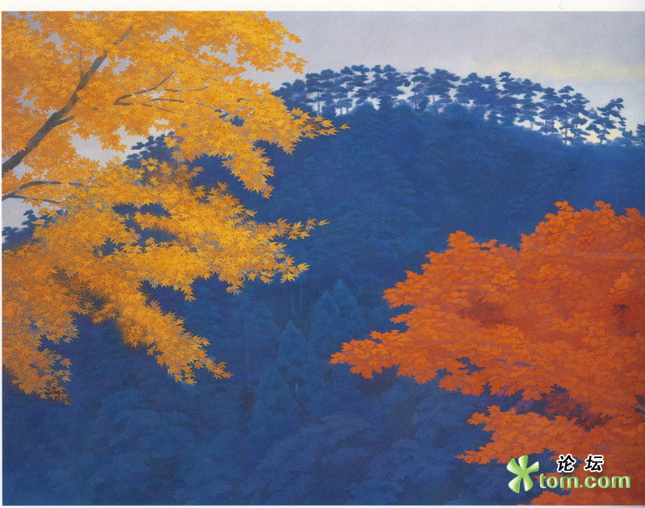
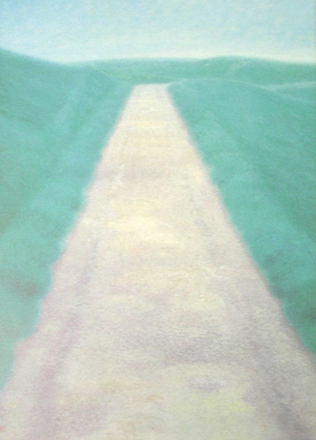

<!-- # ＜玉衡＞东山魁夷：另一种美 -->

**东山****先生身上所散发出的美实在是太多了。一枝钝笔无论如何也无法将它们完全展现。他的平淡之美、素净之美、超然之美、祥和之美，就和着那一层层的群青与粉白，渗进《残照》、《溪涧》、《光昏》里，渗进《树灵》、《暮潮》、《雪降》里，在纸上渲染开来，淡淡地，慢慢地，温柔地渗进人们的眸子和心，如此澄澈透明的美，化作落雪、月光、清泉，深深印在脑海里，沉淀在记忆的深处。**

# 东山魁夷：另一种美

##  文/廖汉斯（University of Michigan Ann Arbor）

“倘若樱花常开，我们的生命常在，那么二者的巧合不会引起任何感动。花儿由于其可能凋谢才更显示出生命的光辉。在感到花儿美好的心灵深处，我们一定会在无意识中不由得彼此珍惜自己的生命，感到在这茫茫世界的短暂生存期间能有缘相遇的喜悦。"

————东山魁夷

我时常想，能与东山魁夷先生“邂逅”，实在不能不说是一件美事。在心绪极其低落的时候，独自徘徊在迷宫般的、散发着铁锈味的书架之中，目光不经意间瞥向一本薄薄的《东山魁夷论艺》。它安静地躺在一堆鲜艳的画册里，略有浮尘，是如此不显眼，却不知为何有种特殊的魅力让我打开它，并在我翻开第一页，这句“倘若樱花常开”映入眼帘的时候，我知道东山先生对于我来说是“对”的。一口气读罢这本薄薄的册子，望着书中数幅黑白的东山先生的照片，不由得觉得自己已然被这个深邃的日本老人深深吸引，并且从内心深处产生巨大的感动。照片里的东山先生永远那么虔敬安详，但同时从他的双眼中又流露出一种坚定的力量来。他像黑白照片一样朴素而简单，但却又让人完全无法预料他曾经历过诸多磨难。东山先生的文字平静、恬淡而又美好，是只有画家、作家和哲学家融为一体之后才能写出的文字。于是又赶紧买来一本图文并茂的《美的情愫》细细品读，内心生出诸多感慨，竟不知从何说起了。

隐忍之美

东山先生的艺术之路，从来都不是一帆风顺的。他的家原本是做船具生意，父母并不可能对他产生任何艺术上的影响；反而是他们不断的纷争让东山先生从小就饱尝了人世的艰辛。父亲的生意愈加不景气，变故、死亡、战争接踵而至，让东山先生的道路愈加布满了荆棘。他也说过，看到母亲如此辛劳，曾想谋一个“正规”的职业，当画家的心愿往往因此而受阻碍。可是他的母亲连一天舒坦日子也没过上就与世长辞，东山先生承受的痛苦是多么难以想象。当他从欧洲留学归来，却又面临战争的无情蹂躏：他是一个艺术家，他的武器是画笔，他怎么可能扛着棍棒去充当炮灰呢？他怎么可能去做这些无用功呢？也许在练兵之时他一刻也未曾停止过对艺术道路的思考，心中还是默默坚守自己的信念。这种对于苦难的隐忍，岂不是一种美么？东山先生有许多心灵之美，而这隐忍之美是最让人唏嘘的。

他的隐忍也造就了他对生命与自然的独特感受。当他自己的生命和前途危在旦夕的时候，平日习以为常的风景竟也散发出异样的令人震撼的光辉，大大感动了东山先生的心。他的心产生了一种为了将这风景留存于画中而必须活下去的心意，于是隐忍着，并且认真地活了下去，这又是多么令人敬佩呢？

虔敬之美

东山先生应邀为唐招提寺的御影堂创作隔扇壁画，在他的心中，能够为了纪念鉴真和尚而创作是一种莫大的幸福。我未曾预想，一个活在二十世纪的日本老人竟能对一千二百多年前从中国远渡日本的僧人怀有如此崇高的敬意。他的心是如此柔软：“应该画些什么呢？我想，还是通过日本风景的两大要素——山与海，画出鉴真和尚未能目睹的风景，以安慰他的在天之灵。”（鉴真和尚在东渡日本后已经失明了）

他的隔扇壁画《山云涛声》仿佛能从墙壁上流下来一般，美妙极了。而这位老人却坚持认为这画并不是他画出来的，“而是由于有了鉴真和尚的精神引导才得以诞生。”多么虔敬又可爱的一位画家！他的画作出自他纯粹的感动，还有什么能比这样的动机更纯洁而高尚的呢？三十年前，他与森本长老一起向鉴真和尚的坐像报告“唐招提寺的壁画已经完成”，我看着黑白照片里那时的东山先生静静地坐在长老的身后，一袭深色的和衣，头低垂着，仿佛在思索着什么人生的奥义一般，谦敬的神态让人想到跟随基督的使徒。但正如他自己所言：“我的宗教心是淡泊的，我不知道自己是依靠什么而生活，依靠什么而走过来的。但是，由于自已有这样的感觉，才感受到存在于地球上的一切生灵和自己都有同样的宿命，都有同样的根。”

对于中国山水画的喜爱之情以及对于中国水墨技法的敬佩，东山先生也从来不加以掩饰。一个人对于美的追求是不会有国界线的。中国与日本的恩恩怨怨纷繁复杂，可是东山先生未曾让“小我”成为他艺术道路上的羁绊。他甚至在局势甚不稳定的时候来到中国，踏遍大好河山，用浓墨淡彩将中华的美景染在了纸上。

东山先生的虔敬也许不是对某一位神灵，而是对普遍存在于世的真善美。

道路之美

与东山先生的“邂逅”还有另一件奇妙至极的事。在偶遇他的书之前，一日闲来无事乱翻一个世界名画的文件夹。在五百多张色彩斑斓的画作里，我注意到一张初看极为简单的画。这是一幅竖长的画，正中间是一条狭长的道路。两侧是略带灰色的暗青的草地，群山显现在道路的尽头。天异常低矮。这幅画实在是太普通了，却不知为何让我目不转睛地盯着它看了好久，仿佛那条路可以引领我步入另一个世界。这感觉微妙至极，但当时我还不知道是谁画的，也未曾觉察它富有的日本色彩。后来，当我正在读东山先生的《一条道》的时候，心中突然泛起一阵感动：他所描绘的不正是我之前看到的那条道路么？赶紧查阅插图，竟然就是它！这不是一种莫大的缘分还是什么？

东山先生在文章中说：“在表现这条道路的时候，我想象为由此前进的道路，既是旅历的结果也是重新起步的征途。它既是通往未来的憧憬之路，也是诱发怀旧的乡愁之路......在人生的旅途中，有若干歧路，比起我自身的意志来，我被更大的他力推动者。这种想法至今没有改变，但在我的心中培育了走这一条道路的意志。它不是变成这幅作品了吗？从某种意义上来说，似乎我的心理把握、它的方向相当清楚固定。然而，那条道路既不是煌煌烈日照耀的道路，也不是黑暗阴影笼罩的道路，而是一条在早晨薄雾中静卧的道路，是坦然的、实实在在的道路。”读罢这些文字，内心无法抑制地产生强烈的共鸣。难怪这幅画能令我如此着迷！这不是无缘无故的。这条通向无尽的道路也通向了人的内心深处，让人跟随自身的意志坚定地走下去。这也不正体现了艺术对人巨大的感染力么？人通过艺术作品将自身的情感与艺术家的思想相交融并迸发出共鸣的火花，此时此刻这件艺术作品才算是真正完成了罢？

东山先生身上所散发出的美实在是太多了。一枝钝笔无论如何也无法将它们完全展现。他的平淡之美、素净之美、超然之美、祥和之美，就和着那一层层的群青与粉白，渗进《残照》、《溪涧》、《光昏》里，渗进《树灵》、《暮潮》、《雪降》里，在纸上渲染开来，淡淡地，慢慢地，温柔地渗进人们的眸子和心，如此澄澈透明的美，化作落雪、月光、清泉，深深印在脑海里，沉淀在记忆的深处。

发觉自己还是向往东方含蓄之美。只是才看了一些现代主义与抽象派的作品，就发觉自己被所谓的现代艺术“绑架”了，落入了其中的圈套，仿佛感情被欺骗了一般，一下子不知道什么是艺术了。那些怪诞的、杂乱的线条，那些随意地泼洒在油布上的颜料，那些不知所云的装置，那些哗众取宠的不能引起任何美感却令人作呕的行为艺术，让人迷失而彷徨！受了众多过于艳丽色彩的强烈刺激和支离破碎的人体形象的折磨，然而终于得以与东山先生相遇，实在是心灵的安慰与幸福！也许是我思想不够深刻，无法理解现代艺术的抽象与深邃罢？但是内心还是坚信，抛开重重技法、流派、主义不看，我也不懂，但只要是让人类感受到幸福与美的，便是好的艺术罢？

东山魁夷先生就是这样一个让人幸福的人。

2010.06.05 夏

后记

从开始接触东山魁夷，到买来他的书来看，到内心深处产生感动，再到决定写一些文字将这些感受与对他的喜爱表达出来，前前后后也有半个月了。依旧是固执地要用钢笔和信纸书写，在夜深人静的时候，才会有真的感情的流露。也许是上帝的安排，让我在内心最痛苦的时候遇见了他，心灵竟因而一定程度上得到了安慰与平静，这也许是我深深迷恋他的原因，并且是别人所不能理解的。还有很多话想说，还有很多感受没有写出来，是因为写着写着发现东山先生就是一本书，我的钝笔无法写也没有资格去写，稍微散漫和不负责的文字，写出来就是对东山先生的不尊重，所以，还是只写一些最为浅薄的感受罢！也不知道有多少人看了会和我一样产生共鸣；也许不会有人罢?

（采编：黄美琳；责编：徐海星）
