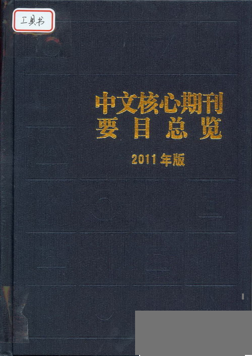
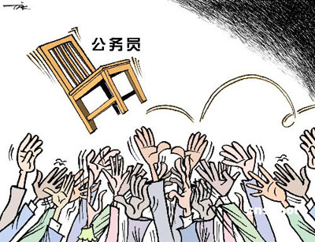

<!-- # ＜七星人物＞第十四期：毕业几年，我们走在各自的路上（3）——瓢虫君专访公务员、事业单位工作者 -->

<!-- # **毕业几年，我们走在各自的路上（3）****** -->

<!-- # ** ——****瓢虫君专访公务员、事业单位工作者** -->

北斗人物已经连续做了两期“毕业生”的专访，本期是第三期，也是最后一期；之前第一期，我们关注些“学习相关者”（[http://blog.renren.com/blog/362359989/870091714](http://blog.renren.com/blog/362359989/870091714)），第二期，我们则采访了些已经工作的毕业生，如在北漂、在外企工作的人（[http://blog.renren.com/blog/362359989/871410167](http://blog.renren.com/blog/362359989/871410167)），最后一期我们选取了另外另种人物：公务员和事业单位。

可能是源于国家或国情的问题，大众对这两个职业的评价和看法往往会不同于在其它单位工作的人，可能羡慕，可能渴望，可能排斥，也可能讨厌。但事实却是，每年国考大军的增度确实远超GDP和财政的增速，也许这才中国是当下最好的“国情教育”——活生生的“国民教育”。但anyway，除去他们身后的政府而言，他们中的每一个人也只是一位毕业生，而那也只是一份可能安逸、可能“危险”的工作。这两份工作可能在很多人看来不同于其他种类的工作，但北斗人物组还是希望每个人能用平和、理性的视角，看待这两个职业。

本期北斗人物，带您走入公务员和事业单位工作者的世界。

**阅读提示：**毕业生选题共分3期，本期为第3期，选取的两个采访对象分别是：公务员和事业单位工作者。本期文章依旧分为三部分，第一部分是对每个人和相应选择的简介，第二、三部分是采访问题，由General question 和 Specific question构成。其中8道General Questions是一样的，将以“一个问题，三个答案”的方式给出；文章第三部分，是针对每个人不同的选择而设计的6-8个Specific Questions。我们知道这样的分类可能略显粗糙，可能不够考虑每个被访者自身的经历，但我们总希望通过他们的答案看到一些一样、或不一样的答案，所以希望这次人物组新的采访和组稿方式，您能喜欢，也能包容其中出现的一些问题。

### 一、人物简介

**公务员：**

小李一年前毕业于西南政法大学法律专业，在茫茫求职大军中，他选择了考公，直至现在成为了一名县级公务员。平素的工作忙碌而细致，他主要负责撰写材料、收发文件、整理文书档案等。

**事业单位：** 2010年，罗晓身着蓑衣以“一蓑烟雨任平生”之意，拍毕业照告别他在武汉大学经济管理四年的学习生涯，并以此来表明自己要独自闯荡江湖，不再向家里要一分钱的决心。历经两年风雨，现在的他是财政部下属某核心期刊杂志的一名编辑，相比于大学时代的意气风发、特立独行，在事业单位的经历令他有了些新的改变和沉淀。另外，罗晓的文笔和语言会有些“诗意”，姑且称之为一个比较有自我情调的人吧。

### 二、 常规问题

**Q1****：描述一下你现在的工作和生活状态吧。

公务员：**对现在的工作，总的来说，我觉得还是挺适合自己的，虽然大多数时候还是挺忙的。我不否认出了校门就难得交到真朋友的这个观点，但我想我还是幸运的，身边的同事大都性格很好，也交到了不少朋友。我是外地人，大家对我的照顾也大大缩短了我对新环境的适应时间，特别快的就投入到了工作中，感觉挺好的。

**事业编制：**现在的日常工作就是处理各种论文，把它删减或者添加成合适的篇幅，然后找错别字；偶尔有写作，因为我们的杂志是一个官办的学术期刊，所以基本上都是在弘扬主旋律，没有什么自我发挥的余地。以前总觉得自己会很喜欢编辑的工作，后来工作了才发现完全不是想的那样，但已经上了贼船，只好继续做下去。不过相比那些忙得一点自我空间都没有的工作来说,我的工作可以随便上网写东西、看东西，所以还是很轻松的。

**Q2: ****你以前对这个选择的想象是怎样的？当初这个选择对吸引你的地方是什么呢？公务员：**说实话，我想象里，这个工作会有点白领阶层的成分，每天穿着白衬衣、西裤、皮鞋，穿梭在办公大楼里，挺光鲜气派的。不过后来我阴错阳差的考录了基层公务员，所以硬件方面肯定要和以前的期望有差距，不过可能从前仅仅是想象的缘故，我并没有因此有什么落差感。说起这个选择对我的吸引力，可能还是传统思想吧，我和父母那一辈的观点差不多，还是希望在公务员这样一个稳定的行业发展就好了，我不太想经历在大城市中拼搏很多年却最终难得有个安身之地的过程。

**事业编制：**当然是能去采编，能去约稿，能去自己写喽。吸引我的地方，一是靠女朋友近一点，二是不用出国，最后就是自己心里有重重的武汉情节。

**Q3****：你选择这个方向，是自己的想法还是听取了他人的意见？你对现在的生活满意吗？会后悔自己毕业前做出的这个选择吗？公务员：**自己吧，一直是这样想的，然后就水到渠成得到这份工作，中间有小波折，但总体来说还比较顺利的，所以，对现在的生活，我挺满意的。

**事业编制：**自己的想法，或者说是因为满足了刚才三点要求，因为在我眼中，工作永远只是一个糊口的营生。

我对现在的生活是满意的，不过怎么说呢，好歹是出卖劳动力换口能在外面生活的资本，和农民种田、屠夫杀猪，甚至妓女接客都是一样的，所以就算有不满也忍了；也不后悔，因为无论如何，这都是我的人生。

**Q4: ****对生活或现实有什么抱怨吗？有感受到什么压力吗？比如购车，生活压力，居住条件差，购房，恋爱，结婚，照顾父母etc****。公务员：**生活中遇到一些小麻烦，有些小抱怨，这都是正常的，但你要现在问我有什么抱怨，还真讲不出来。压力肯定是有的，但都在自我可以调节的范围内，先购房、再购车吧，而且购车可能要推迟一下了，因为结婚之后就面临要小孩的问题，现在小孩的花销还是挺大的。

关于照顾父母的问题，因为我是外地人，我想稳定下来应该会把父母接过来一起生活。父母都是农民，从小供我读书很不容易，现在他们岁数越来越大了，留在农村生活条件和医疗条件都不是很好，我想我也不会放心。

**事业编制：**抱怨自己本事不够大，肯定希望能够更好了。我的父母现在都还在工作，离退休最少还有7年，但照顾不上是最大的问题，现在能让我真的伤心也便是母亲总爱闹病。

作为个人，身为房奴一枚，月供比工资还高，不过有年终奖，而且去年也攒了几万，慢慢往里面砸呗。最大的压力其实都是来自于对于未来的未知，因为以后要面临结婚生子这些事情，想要摆平这些需要比较强的活动能力。

**Q5: ****在这一段时间里（小于半年）遇到过的最大的挫折是什么，有没有思考过这个最大挫折的来源或者本质又是什么？公务员：**这个可以不回答吗？好像没有什么印象深刻、很难过去的大挫折。我觉得现在的工作和生活相对来说还是挺稳定的。

**事业编制：**最大的挫折就是，驼背总是改不了，对自己的体质很失望。因为这个问题，准岳母对我偏见很大，阻碍我的婚姻生活。这个问题的来源无非是自己执念不重，习惯不好，而本质还是自己太容易随性堕落了吧，这也是最让我苦恼的事情。

**Q6: ****从毕业到现在所有的经历对你产生的最大影响是什么？公务员：**生活里，程序化的生活占主流，偶尔掺杂些非程序化的东西。可能不像刚毕业的时候那么浮躁了，我想，无论是什么工作，都能逐渐使人变得沉稳、成熟，这可能就是进入社会的蜕变过程。

**事业编制：**心情变舒畅了。《论语》里有一句叫“吾以一道以贯之”，我明白了很多事情的一些根本，所以也就不会有那么大的执念了。变得油滑了，也就少了很多烦恼。虽然坐久了、憋坏了，偶尔也是会抓狂，但那只是些情绪罢了，可以说更加接近“一蓑烟雨任平生”的心态。

**Q7: ****如果能再做一次选择，你愿意改变吗？****公务员：**因为比较满意现在的生活，所以工作就不要改变了。但如果时间可以倒流，希望高考多考点分，能上个更好点的大学。不是为了换个“好工作”，可能是因为有点名校情结吧。

**事业编制：**不管怎样都是来到一个摆脱了原有宗法关系的地方，重塑自己的人际网，所以不会去想重新选择或刻意改变，因为这不过是我与社会的交易，用我的劳动换取生存资源，然后供给我继续活的精彩。

**Q8: ****对于可能选择和你相似路线的后来人，有什么想说的吗？或，通过这个采访，你最想对他人说些什么呢？公务员：**每个人都要把握住自己能把握的机遇，人生没有重写的机会，要做到让以后的自己不后悔。无论做什么，依照自己的兴趣最重要，因为只有这样，无论是学习还是工作才都会是最快乐，效率最高，效果最好的。

**事业编制：**人生如逆旅,我亦是行人。

三、专门性问题

** 3.1 ****事业单位**

**事业单位，一般指以增进社会福利，满足社会文化、教育、科学、卫生等方面需要，提供各种社会服务为直接目的的社会组织。**

**Q1****：

你是什么时候决定加入这个单位的？在加入的过程中，有没有遇到一些“黑幕”？你又是如何看待那些内幕呢？A****：

**我一开始打算考研，结果没成功，后来公务员也没考上，就加入了编辑行业。编辑行业，要说内幕多得很，但也没有想象中那样的可怕。其实很多时候，大家谈起内幕总会鄙夷，但事实上一些潜规则、一些内幕，也是人们生存的必要手段。

**Q2****：你在初进事业单位后，你觉得自己最大的不足是哪方面呢？是专业知识还是为人处世？****A****：**最大的不足便是这个世界上还有许多学不来、说不破、只有自己体会过后才知道的规则。人的卑微、怯懦、凶残，才是左右这个社会运转的原动力；人的贪婪、善意、愉悦，都是这个道理。** Q3****：不同于企业文化，事业单位有更多的条条规规（比如各种报告、总结），你对此是什么看法？会不习惯吗？****A****：**这是一种宣示社会规则、人际规则，以及职场规则的仪式，但这也是毕要的。举个例子，和尚要打坐参禅，戒荤戒色。其实就是如果不通过这种极端手段，人们是无法明白这个过程的。不去经历，永远不知道要达到的这个境界，其实是很难很难的。没有这种肉体上的体验，也就不会真正把这些当作生命的本真。因为我们还是在乎的，还是那么多欲望，而当真的克服了这些才能参悟。单位里面的会议、报告、规章也是一样的道理。

**Q4****：事业单位相对比较稳定，在这个相对稳定的环境中，是否有什么东西也随之丢失？你对此如何看待？****A****：**我只出卖自己的劳动以及尊严，但是不出卖灵魂。说来简单，这些也是相对的。比如现在我们单位同事孩子上小学，托关系走后门，使劲浑身解数。可是轮到我的时候，是不是也一样呢？我可以保证不凭借自己的能力去残害别人，但真要到竞争到非你即我的时候，我还能做到灵魂不侵么？

**Q5: ****你是如何看待事业单位中一些“潜规则”的现象的？

****A****：**我们整个行业就是靠着见不得人的规则在运行，但是在这个竞争异常激烈的环境下又有什么别的办法？都是为了让自己过得更好，只是有些人太乐于放纵自己的欲望，做得过分了些而已。** Q6****：事业单位还有“编外制度”，你是属于什么，又是如何看待编制内外问题的呢？****A****：**当然是编内人员了，还是唯一的男性。“编外制度”是剥削劳动力的手段呗，其实人们做同质的工作，应该得到同样的酬劳，为啥会有差别？还不就是已经得利的群体在既定的社会中无偿享用新人的青春福利。

**Q7****：在事业单位中，升职同样是一个复杂的问题，你在面对这些时，是采取的什么态度和方式去让自己脱颖而出？****A****：**我打算继续考公务员嘛，有证就考嘛，谁让社会规则就是这样呢，但事实上，这也是最公平的规则了。正如前面说的自己油滑了，少了很多烦恼，不会再在升职问题上去刻意做些什么。

**3.2 ****公务员******

**现在社会上对公务员行业的评价众口不一，但大体来说离不开铁饭碗、压力小、潜规则、灰色收入等；而在公务员内部，对于大多数普通的非领导职务公务员来说，工作通常繁重，压力通常较大，

****同时，关于灰色收入更多的取决于人们如何定义灰色收入。**

**Q1: 你是怎样进入公务员这个群体中的？（A:统分毕业生 B:公开招录C:选聘大学生 D其他途径）你对于这个群体的选录方式有何看法，有何建议？A****：**公开招录。公开招录的程序、监督应该更透明一些。应该坚持凡进必考，但考试的方式可以灵活一些。

**Q2: ****你是基层公务员还是地市级以上公务员？你当初的选择是目光紧紧盯着大城市的公务员，还是很愿意下到基层锻炼自己？你觉得这两种环境的优缺点各是什么，哪种环境又更适合你呢？ A****：**基层公务员。大城市、小城市这个问题，我好像在毕业的时候没有怎么具体的权衡过，因为本来就是农村出身，当初的选择是愿意下到基层锻炼自己。两种环境各有利弊，在大城市，生活质量、享受的社会服务会高一些，但生活压力、房贷压力、高消费等问题也客观存在；在基层，条件有些艰苦，但很能锻炼人，我觉得还是在基层更适合我。

**Q3: ****你如何看待社会对公务员的指责和社会监督的问题？会害怕所谓的财政透明、财产公示、审计署审查这种东西吗，害怕的原因又是什么呢？A****：**对公务员的职责和社会监督在某些方面确实存在一些问题，但作为一名公正清廉的公务员，是不会害怕所谓的财产公示、审计署审查的；害怕的人都是公务员队伍里的害群之马，并且也是极少数。

**Q4: ****你是如何看待公务员无法保持个性、个人理想被日益磨灭的问题呢？觉得自己和上学时比，这些方面最大的变化是什么呢，更会“做人”了？A****：**我认为这种说法不是很科学，确实，作为公务员，要受到一些约定俗成的规则、制度的约束，但是这也并不影响个性的发挥，我觉得个人理想并没有被日益磨灭，那些理想坚定、目标远大的公务员，他们是不会受到影响的。和上学时比，我们工作以后最大的变化就是学会了适应社会，学会了理性看待社会，当然，有一些人可能还是看不惯一些现象，但是，随着阅历的增加、实践经验的积累，慢慢地就学会了适应和接受。

**Q5: ****那能问一下基于现状的，你的个人理想（职业规划）是什么吗？A****：**我的个人理想就是做好本职工作，在各方面锻炼提高自己能力，相信时机成熟时，自己的个人价值会得到实现。

**Q6: ****体制也许是公务员这个群体无法回避的一个问题。你是如何看待体制内和体制外工作的差别呢？对于同一单位，由于身份不同，同工不同酬的问题，你又是怎样看呢？是否觉得公平呢？A****：**在当今这个时代背景下，体制差异确实是存在的，体制内人员享受的福利、政治待遇是高于体制外人员的，至于同工不同酬问题，也是客观存在的，这都是某些特定原因下形成的，我相信，随着社会的进步和分配制度的改善，这些现象最终将会不复存在。

**Q7****：

****结合你大学同学现在的就业和生活情况，你如何评价公务员的工资和福利在这些同学中的水平呢？是不是在个人福利方面，会比大多数单位好很多呢？有没有一些时候，看到待遇和工作压力等方面巨大的差异后，感到不公平呢？A****：**我个人认为，公务员的工资和福利是相对比较低的，在个人福利方面，也比不上一些国企、垄断性经营部门。有一定的心理落差这是肯定的，但既然选择了这个职业，就会接受现实。

**Q8****：

****你对于公务员这个行业的理解是什么？你认为它的社会责任有多大？对于网上那些对公务员的非议或者标签，你客观的评价是怎样的？A****：**公务员做为国家公职人员，其根本宗旨是为人民服务的。与此同时，在实现为为人民服务的社会价值的同时，自己的个人价值也得到了体现。公务员应该承担必要的社会责任，而且是主要的，网上对公务员的非议或者标签，有一部分或者是一小部分群体是可能存在的，但公务员群体的主流还是好的，还是值得大家信任和肯定的。

**采访后记：** 1. 对于这期稿件，事业单位和公务员，其实，在外人看来，他们大体是相似的，这也是我们把他们放在一个稿件中的原因，但即使面对同样的答案，两位采访对象也给出了十分不一样的答案，这可能和个人阅历有关，也可能和个性有关，但也可能各位读者的答案和他俩的都不一样，不置可否。 2. 毕业生这个专题，到这也就全部结束了，期间，我们一共采访了8位人物，分别是：出国读书的，研究生，再考研者（第一期），北漂，警察，外企白领（第二期），事业单位，公务员（本期）；比较遗憾的是，我们没有如期找到毕业直接嫁为人妇的、做gap year的或者啃老族。这可能是一种遗憾，但转念想想，即使加上以上3类，我们也是难以覆盖众多毕业生的前进之路的，所以可能会稍有欣慰。这三期采访的人物都不是什么话题人物，他们源于生活，也是这个社会里大多数毕业生的生活状态，我们仅仅希望以一个较低的视角去观察他们、观察社会、观察这个国家正在发生的一些事情。我们不是看不见，只是不让说罢了，从60年代到现在，这里一直在拍一部永远看不到幕后的电影，从左到右，从生到死。当我们很难留下什么存在过的痕迹时，不妨多活些自己，让自己快乐些。真心希望每一位毕业生好运，北斗也与你们同在~~

**附，毕业生选题：**

第一期：毕业几年，我们走在各自的路上

——瓢虫君专访毕业生，链接：[http://blog.renren.com/blog/362359989/870091714](http://blog.renren.com/blog/362359989/870091714)

第二期：毕业几年，我们走在各自的路上（2）——瓢虫君专访北漂、警察和外企白领，链接：[http://blog.renren.com/blog/362359989/871410167](http://blog.renren.com/blog/362359989/871410167)

第三期：毕业几年，我们走在各自的路上（3）——瓢虫君专访公务员、事业单位工作者，链接：

**编****辑：**叶馨文

张森森

陶靓

孙娜

罗晓

**责编：**张正
