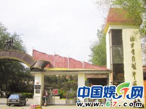

<!-- # ＜天权＞清华建筑本科生经历“北影拆迁”背后的城建斗争 -->

**我还是要说我的立场：惟知之深，故爱之切。我不会煽动众人去挡推土机，那不是清华的作风。而且就算我不煽动，也会有人去的。但我们的学术参与会让社会相信，在这片土地上，还有一个地方叫做——大学；这里，仍旧有一种艺术叫做——电影。如果我只有一个机会，我会保护一种精神，在这里：风能进，雨能进，星巴克不能进；如果我只有一根铅笔，我会绘出一片区域，在这里：风能进，雨能进，推土机不能进。**

#  清华建筑本科生经历“北影拆迁”背后的城建斗争

## 文/程昆（清华大学建筑系建03）

鲜红的“拆”字下，拿着横幅抗议。这幅画面在一日千里的时代中算不上大新闻。甚至于长期的媒体渲染产生的疲劳还会让我们漫不经心地憋出一句：刁民而已。若你只是恰好路过，那么可以通过丰富的逻辑思维忽略眼前愤怒的人群，我们仍旧可以淡淡地看个热闹，若问起，便答：正常不过！

这几十年中，有几人没有被拆过房子，有几人没有经历过市政规划造成的“流离失所”，以及大规模重建影响下对历史环境的“空白回忆”。那么在如此规模庞大的改造时代，面对眼前的示威人群我们也似乎真的有那么些理由平淡地回上一句：正常不过。

九月里，清华的事情很多，而且大都还很重要，比如：暑假虽然还没过完，大家已经被叫回来上课了；而且，新入学的娃娃还要被拉出去好好晒个太阳；快毕业的学生可能还要努力保研。在这里学建筑的人虽然还有段时间好活，毕竟五年嘛，但时间匆匆过去也就只剩下一瞬。

九月里，社会也很忙碌。春天种的果子熟了，是时候去收获，虽然到了我们这一辈，连熟的是什么也不甚了然。不过还好，我们现在起码还知道是到时候要收割了。

这个九月里我们还忙着和岛国恶语相向，我们还考虑着要不要买日货，还有人忙着砸掉已经买了的日货，只不过，别人的；九一八那天，我还考虑着为什么没有鸣笛，我还考虑着如何制造一些庄严肃穆，结果是，没用的。

但这些都过去了，九月正在离开我们。无论是这个九月还是上一个。但在九月的忙碌里面，隐约还有一个画面。北影厂那些“拆”的下面还站着一群人，老头老太，有的还坐着轮椅，他们正在高声呐喊。不过在忙碌的九月里他们的声音异常模糊，他们的行为也正在渐渐淡出。见证了新中国成立的北影厂，也正在九月的尘土中被悄悄掩埋。

时间匆匆过去只剩下一瞬，连同我们原本清晰的记忆，都只剩下不多的一丝光亮。我过去住在西安，十八年。城里种的大都是国槐，在路的两侧。十年前没有今天这么多汽车高楼，人在树下乘凉，远远就能看见城墙和钟鼓楼。两列国槐茂盛清凉，低调内敛，和西安人引以为豪的古风就像是榫卯般契合。不过汽车总有一天会多起来的，楼房也总有一天会高大到让钟鼓楼就像小孩子般低矮。

路宽是永远也不够用的，长安城在千年前就有一条百余米宽的街道名曰“天街”，街面上行人车马商贩云集，那时候尚且百余米，如今的街道要过汽车，那是局促的紧了。道路是市政的基本设施，没有好路，哪怕有再好的下水道人们也不会去走。但过去的老槐树限制了路宽，应该砍掉。没有意外，那一次依旧是老人的抗争，他们备足了干粮，坐在树下，日夜轮番看守，北方人的不屈最终达成了一个妥协。槐树留下了，成了道路分隔，但施工的时候砍掉树枝树冠，一时间大街就像是秃了一般。但数年之后，这里依旧绿荫如盖。

我到北京上学有三年了，清华建筑系是个熬夜伤人的地方，我领教的很透彻。但是如果这种伤害不仅是为了个人荣誉，那么对于建筑师来讲才最应该感到欣慰和鼓舞吧。因为建筑师解决了群体性的需求，作为设计者完成了更高层次的任务。但实际上，作为建筑师，设计越来越时尚，而受众渐渐力不从心，大多数时候建筑师都会归咎于业主不懂建筑，这诚然有理可循的，试看那秋裤楼、比基尼楼，甚至连天安门旁边的大鸟蛋，也不见的就是人人都喜欢，那么“业主”的审美水平，也确实值得好好考虑。但是对于只是想安静过日子的普通人来说，在他们的视野里安置一个不受群众喜闻乐见的东西，并且称之为时尚潮流，在众人的反对之下依旧坚持，设计师特有的——坚持，并且还认定人们的“审美”跟不上时代，恐怕这种做法也要值得好好考虑吧。

在建筑系，大三的第一个设计是博物馆。说起建筑设计，20世纪的建筑师是靠盖别人的家——别墅，来表达思想；21世纪的建筑师是通过盖众人的房子——公共场所，来扬名立万。当然，这只是戏谑，我没做什么考证。但在正发生着剧烈城市化的中国来看，后者的情况很明显。以此看来，课程里让我们先盖别墅，后盖博物馆是有些道理的；当然，从建筑的复杂性和设计师背负的责任上讲，两者也是有着千差万别。人类大工业时代的空间：厂房、车间、炼钢炉、储油罐、仓库等等，他们处在城市领导地位的时代已经过去了，但是精致而灵活的现代大空间才刚刚开始，并且创造力不断。但是城市没有一处空白的土地为建筑师提供试验场，让设计者随心所欲的做一些尝试。我们永远身处在一个大时间跨度上饱和的城市状态，每个历史阶段人们都尽其所能的使用土地。你欣赏的试验场，现在就极有可能已经站着建筑。

说的远了，但是正是因为每个建筑师对于土地的渴望，才造就了建筑作为艺术的可能性。土地是稀缺的，所以大家都尽其所能的利用并创造出不同来。而站在原有土地上的建筑，永远面临着被拆除的命运，这是必然的趋势。但是我们为什么不把故宫拆掉而重建政府大楼、纪念性建筑，同时我们为什么又把进驻在故宫里的星巴克撵了出来，清除故宫里哪怕那么一丝异味。那么说明这其中的拆和不拆，区别是值得考虑的。

博物馆设计要求学生可以自己选取地段，所以这段时间里设计者总是愿意把地址选在较偏僻的郊区，远离轴线，远离故宫，避免发生类似星巴克的危险。身处郊区，那里是人烟稀疏的场所，不会有老建筑的干扰，同时也没有稠密的人烟每天看到会感到别扭。建成后会去游览的，只是一大部分思想和精神状态和我们类似的行为主义者。我原本选择了远离轴线的一处荒地和鼓楼边的繁华处，但均不满意。受恩于老师的指导，北影厂可能拆掉的土地变成了这次深入了解的开始。总体来讲是开始正面审视“北影拆迁”背后矛盾的城建历程。

但是这一切也并不是我做设计那么简单，接踵而来的是和导演、演员、技术人员、厂内职工以及清华建筑系的教授们发生的交流，这些人改变了我的很多认识。

我去过北影厂三次。当然，前两次是作为一个学建筑的学生身份希望去了解作业地段才到过那里，我随身携带的只是纸笔、相机，当然还有一颗崇尚电影的心。我的初次考察并不成功，北影厂里面大多数剩下的人只是在匆匆的搬家，正常的秩序早就被打乱。没有人可问（不知道），也没有什么可看（停止营业）。我费了很大劲才从正在小规模拆除后的“遗迹”和紧闭的景点大门里透出的风光中隐约看出来北影厂面临的窘境：

这里曾经是中国国产电影取景的地方，荣宁府、明清风情街分别拍过《红楼梦》、《霸王别姬》、《红楼梦》等经典电视剧、影片，有上千部影片在这里取过景。单纯从一个电影爱好者的角度讲，情感上恐怕看到推土机在这等风光上大肆作业也会感到非常“有碍观瞻”吧，若我只是一名爱看电影的中国影迷，是绝不会容许推土机进驻北影厂的，一定要竭尽全力把北影厂里面的异味清除干净，让有碍观瞻的景象从面前消失。

但这只是听起来很好。查阅了很多文献报道，事实上由于事业单位转制，北影变成中影，又在国有企业自负盈亏的情况下，面临着大批职工养老的问题，中影在财政上面临困难，同时承担着近年来中国电影行业内的风险，背后还有更大的地权方面的问题，这块地方本属于总参部。种种原因，真相普通百姓已经很难摸清。恐怕我在学了建筑之后还要身兼经济、法律知识才能成为一名北影拆迁问题的学者，但是那时候只剩下黄土让我给他们追魂了。

作为一个普通百姓后代，我们很难想象这个地方作为集团面临的困境，并且这种困境也只是作为中影集团加盟房地产变成地产大亨后的片面逻辑。但作为电影观众的人民、作为拍过电影的演员、作为关心国家电影命运的导演们，以至于作为要设计这片场地的建筑师们，他们身处在一个什么样的逻辑之中呢，他们又面临怎样的困境呢？健康成熟的社会不在于给每件事一个差强人意的结果，而是每件事都给各方提供了一个可以平等交流的可能，让每个身份的利益都有声音可以清晰而持续的传达出来并参与到结果的影响中。我的身份迫使我相信这不是一个梦，但是眼下的，推土机的噪音很大。

因为这总是一个房地产的逻辑占上风的年代，无数的唾沫都会化作铲车的燃料，加速把剩下的推光。我并不反对中影通过开发房地产把自己变成有钱人再走路这里面蕴含着的那么一丝逻辑性。不过在这个铲车拿唾沫当燃料的年代里我一定要替非房地产的逻辑伸冤。每个身份的人都会为自己的利益考虑，但是房地产消灭唾沫，拒绝协商的姿态让理应平等和谐的社会口号显得苍白无力。我不仅是在替导演加强他们的声音，我还希望听到那些被屏蔽、被模糊的大众的声音，同时我还会站在一名清华建筑系学生的立场上为建筑的立场发出声音。

虽然我只不过一名学建筑系的学生，我未曾涉足过北影厂里的任何一部戏；也并非中影集团领导，为资金流转操过什么心。但是我真切地喜欢这片地方，热爱源自于两方面：看过的电影；工业建筑的美感。建筑系中国古代城市营建史的第一节课，老师曾讲过钱穆先生的话：惟知之深，故爱之切。想必修过此课的建筑学同仁们，印象深刻吧。我们所知没有导演和演员们丰富，自然我们的火没有他们大，但这也给我们一个理性看待问题的机会。而当我们站在建筑学的立场上说话时，我们正在平衡这个社会的发言权和声音，并且正在释放被模糊和屏蔽的大众的呼声，多方力量共同参与到这次拆迁的商榷中，一同打破房地产一言可遮天的困局。

但这也只是听起来很好。作为几十上百名在电影界有着德高望重的声誉和成就的电影导演、名演员、技术人员、编剧，他们身上带有的社会力量是巨大的，但如此巨大的社会力量在政府给予优惠下走房地产路线的中影面前显得却异常薄弱。对于这么一群文化知识和社会力量雄厚的团体，竟然也没有左右到房地产路线的坚定执行，那么其余的劳苦大众、弱势群体，他们发出呼声的情况是怎样的呢。还是家丑不要外扬了。言归正传吧。

首先作为电影界人士的呼声，我再次将他们的声音重播放大，这也是我作为一名中国影迷应尽的职责——保护中国的电影艺术。

【在北影厂里有这么一群“保卫派”。

史航——《铁齿铜牙纪晓岚》的知名编剧、策划人，对记者说：“我是长春人，曾经长春最有名的就是长春电影制片厂，这些年经历了卖地、搞地产的痛苦蜕变，直到今天，长影的员工依然是痛苦和残缺的。我不希望北影有一天也变成这样。”他还讲到，“钱可以再赚，赚了也会贬值，但文化这种东西，断了就是断了，我不信在那里建几个大酒店和文化中心就能够延续北影厂的文化意义。”

在北影的保卫派中，史航只是代表之一，这条“统一战线”里还有北影厂原厂长兼党委书记、国家一级导演宋崇。他说道；“我反对北影厂拆迁，原因有两点。一是电影文化是需要靠原址来获得传承的，你把这个厂抹掉了，那么这段历史也就一起被抹掉了，现在韩三平他们想的就是如何赚钱如何增值，对于电影文化、历史的传承都考虑的少了。二是这场拆迁没有透明度可言，我们反对暗箱操作，不透明就会产生猫腻和腐败。协议说建成后分给北影厂5万平方米住宅区，这个5万平方米职工可以分到吗？分配权在谁手中，项目惠及到大家，还是少数人？”

史航表示说：“现在把北影厂拆迁，就等于把黄金的艺术品融化成了金疙瘩。”

他还表示说，他对于电影集团出于历史包袱而转做房地产的“借口”也难以认同。“这让我想起《乱世佳人》里面曾经打过一个比方，一群人坐船经过一个海峡的时候风浪很大，于是他们就把船上的面粉都扔到海峡里，想等到风平浪静的时候再去捞，但到时真的还能收得回来吗？”】

**（以上文章材料来源于《****21****世纪经济报道》****张汉澍****上海报道**** 2012-09-21 23:51:11****引用前未联系确认，请您见谅，若有引用费用等事宜，请联系我，再次感谢您！）******

当然，作为导演们的愤怒不是我轻描淡写的两句引用就能说清楚的。前两次的北影之行可能只能叫做路过，第三次才真正让我正面见识到保卫派的坚定不屈，我从这些老人身上隐约看到当年那些守在槐树下的身影，我知道，他们是一样的，他们是不会轻易妥协的。

第三次探访北影原本是去考察测量建筑和场地的可能性，但那是个有人看管的地方，自称是学生的人，进入的可能性就没剩多少了；至于建筑系，或许能跨进半只脚吧。不过你总能找准混乱中的时机，混进一两个化妆间，不过荣宁府、明清街、摄影棚，永远紧锁大门。估计写完这篇文章之后会更难进去，看来我还不是最艰难的开拓者。我本要遗憾的离开北影，但我意外地走进了摄影棚旁的一间小房子，这里，正在发生着槐树下的商榷。受了一早上的冷漠待遇，遇到这群亲切的导演、技术人员，当然是很大的鼓舞；让我听见，北影，另一种声音还没有消亡，他们在默默地酝酿每一次抗衡并争取着最后的发言权。

我修过少量法律的课程，成绩普通，实在谈不上什么法律造诣，但清华法学院教授们的言传身教我也不敢忘却。我不愿这么随便做一个建筑方案了事，然后在推土机的轰鸣中装作不知。但我要做的也并非是站在导演和演员们的角度去为北影的保护尽最后一丝努力，按照电影《活着》中的一句话，我以为我能死在这院儿里。毕竟，我知之不若其深。他们是坚定的保卫者，抱着槐树说：“要砍树就先砍我”的事情我小时候是见到过的，人是有眼睛的，静坐示威是有用的。但发生过的多起强拆流血冲突，说这种话很虚。作为修过法律的学生，我不愿意拆迁发展成为一种野蛮的对抗，那时的胜利者并非因为真理，而是因为声音的大小。那么就算北影保留下来，那么也只代表了另一种强权的异构。我们需要提防房地产逻辑瞒天过海，可我们还要在防止不平等下的弱势演化成群体对法治的漠视。

但原则上保护建筑的法律确实存在，凡列入《北京优秀近现代建筑保护名录》中的建筑原则上不得拆除，北影厂的建筑群也列入其中，但只有三栋：主楼、东配楼、西配楼。剩下的摄影棚、录音车间（据说仍旧是现在最好的）、特技摄影棚、荣宁府、明清街将会被拆掉，可以说“中影房地产公司”确实是非常严格地遵守法律。可是拆这么多楼，我们被拆掉的建筑大约等于北影，那么遵守这么一部法律意义何在。剩下三个孤零零的近现代建筑混杂在高档会所脚下，就能成为大家“喜闻乐见”的场所？法律总滞后于社会发展，一部不新鲜的法律是缺乏现实意义的，简而言之，这时，没有公正的法律；继续简化，笔者不愿写了。

但保卫者们比我所想要开明的多，我的担心纯属多余。昨天导演来电，说他们希望能把剩下的建筑部分申请纳入到北京优秀建现代建筑名录中，以期得到法律庇护，若是能够得到清华建筑系学生或教授的联名支持，便增加了一份力量。我回答说：大家会理性考虑的。但在我心底里，我认为：如此甚好。

后来我联系了建筑系里的教授：边兰春教授，尹稚教授，还有我的班主任黄鹤，他们或是短息回复，或是微博联络，还有边教授与我在周末长谈。他们从字里行间和每个神情中都流露出热情和良心，我在这里深表感激。

但作为一个建筑学专业的学生，我们有我们的看法，签下我们的名字表示我们确持有这么一种学术态度，而不仅仅是站在情感的暗处。

城市是活的，她不能千年如一日的站在。人也是活的，人会不停地在土地上重建改造。城建就像是伤疤的愈合的过程，今天的伤口就是明天的疤，但无论是怎样的疤，熟悉了都不会是丑的。所以城中村的拆迁一直是个无休止的对抗。它是一个住在其中的人都看惯了的疤，细微的改动都会对群体产生不易接受的困难。

住在西安，我经历过两次搬家，一次是在6岁，另一次是16岁。我童年的大部分时光是住在城中村里，见惯了城市里最底层的人，农民工、小商贩、卖开水的阿姨、杂货铺的伙计、小餐馆的厨师……他们身上带着强烈的底层气息，他们可能买不起药，打不起针，吃不起饭，却还有一家人要养活，只能拼命干活。城中村对他们来说是母体，他们依附性极强的寄生在上面。我虽然不是他们中的一员，住在那里只因为上学方便，在城区里面还有家可回。但对于这群人而言，这地方终究只是个一块城建进程中暂时的伤疤，无论是铲掉还是补好，都有阵痛。但是理智的建筑师和规划师应该知道，人们不应该和下水道寄住在一起，每天见到蟑螂和老鼠，连基本卫生都不能保证，盗贼四起，传染病肆虐。拆掉了这个地方，我的损失不大，只两箱玩具，如此而已，但他们还能去哪儿，他们只能负担起住在城市的伤疤处，拆掉一个，只能让剩下的那个更挤。举个例子，就算是繁华至极的CBD，也有一小撮人过着城中村都不如的生活（一名同学就在地段调研中拍摄到北京CBD通惠河畔的“贫民窟”）。生活质量的改善并没有让他们切身受到好处，他们依旧游荡在城市的边角地区，阵痛换来的不是生活改善，而是颠沛流离。

那么我们的规划和建筑设计到底为城市带来了什么，如果我们没有解决任何问题，那么我们匠人营国的天命有没有得到正面使用呢？很多时候，城规和建筑设计的逻辑也不得不屈服于处在霸权地位的房地产逻辑。设计师、规划师只是匆匆过客。

日本建筑师隈研吾曾表达，他们的处境是在一个建造极其完善的巴黎和东京上再附加建筑，任何大尺度的建造都是看起来非正义的，仿佛是在强行肢解。所以他认为那个时代的建筑师例如柯布西耶和矶崎新的大规模城市设计并无实在意义，只不过作为他们的广告手段，而贩卖单体建筑才是他们的真正生意。因为大规模的城建被隈研吾认为不再可能，所以他感到被束缚；同时隈研吾觉得政府大规模投资公共建筑的时代也已经过去，大的建筑项目只能依靠不稳定的民间力量，城市设计难成气候，最后他推出了他的一套建筑单体影响城建的理论，但这个并不重要，并非我的论点。

我想隈研吾要是在中国可以看看现状，那么他一定会感到惊奇，然后高兴，最后沮丧。因为中国并没有那么多已经完美建造的城市，同时政府和实力雄厚的民间财团无时无刻不在进行着大规模的城建活动，城市建设在中国正值烈日当头，他应该感到高兴。但是，剩下的只是一股浓烈的房地产逻辑，大量价值建筑被拆毁，千年变成了黄土，黄土变成了商务区，毫无美感可言，虽有大规模城建的机会，但却没有真正意义上的城市建设，城市建设中无论民众、建筑师的参与都很低，岂不痛哉，沮丧是必然的。

然而我们向来也是不拒绝学习洋货，尤其当国家萎靡不振的时候，经济势头虽然明朗，但文化方面是远远落后的，于是乎，北京大力发展了文化产业，将自己从一个工业支持的城市一把推进了文化社会。工业的痕迹在城市中被肆意损坏，我们的过去仿佛一直是美好的文明社会和轻巧精密的高科技时代，工业被远远放在脑后，就仿佛有了文化，就不需要炼钢了，有了文化，就不再储粮了。人类文明中产生决定性影响的工业文明被热爱文化的社会扔掉了，我们连个炼钢工人都无处悼念。

然而当年的798工厂在城建探索中留下了不可抹杀的一笔。这里原本是国营电子工厂，随着工业城市的没落，有不少艺术家在这里住了下来，并进行艺术创作，在面临拆迁重建的时候，经过多方面的交流开发，变成了今天的艺术区。我不能说798还代表着底层艺术家的气质，甚至我不能说798代表着艺术或是“伪艺术”。然而那片厂区留下来的重工业时代的气息，是挥之不去的，至于艺术，若是它产生了保护工业遗产的作用，那么其余的就不要对它过多呵责了，毕竟已经做得不错了。

《当中国改变世界》一书里写道，“世界上十辆开动的吊塔就有九辆在中国，中国人提醒我们工业仍旧是社会的基础”。这个论点在书中出现了多次，然而我们自己似乎并不太赞同。我们奋力摆脱重工业的灰尘，向文明前进……

“电影是以现代大工业生产方式和经营方式进行统筹得以体现的。”这句话出自《中国大百科全书》电影卷，夏衍所作的序中。我不认为现在的798艺术区就比一个活生生摆在眼前待拆的工业与艺术结合的典范——北京电影制片厂显得更有教育意义，显得更有文化。如果一个人可以用著作等身来形容，那么北影厂就可以用“著作等梁”来比喻，毫不夸张，北影拍过的拷贝“著作充栋”都有了，何止“等梁”。

但是显然中影集团不这么认为的，为什么，我不清楚。

我没有强迫我的建筑系同胞们认同我的观点，不过9月30日之前北影厂会清空，所剩下的给我们这些代表建筑学的群体发言的时间不多了，希望我们不会集体性失语。关于北影厂的命运，每个人的参与都影响着结果。

但是我还是要说我的立场：惟知之深，故爱之切。我不会煽动众人去挡推土机，那不是清华的作风。而且就算我不煽动，也会有人去的。但我们的学术参与会让社会相信，在这片土地上，还有一个地方叫做——大学；这里，仍旧有一种艺术叫做——电影。

如果我只有一个机会，我会保护一种精神，在这里：风能进，雨能进，星巴克不能进；如果我只有一根铅笔，我会绘出一片区域，在这里：风能进，雨能进，推土机不能进。

事件尚未结束,持续进行。图片新闻搜索容易，不再赘述。

结尾附诗一首，系导演发来，北影保卫派，著名剧作家苏叔阳先生作。

**

致我的北影老同仁****

****苏叔阳******

今天我们相会在****

即将消失的大门口

不再友好地拍打肩膀

不再拥抱

甚至不再

不再微笑

既然我们青春岁月的印记

将被无情地毁成废墟

我们怎么能期望

还会有另一次晨光

把我们照耀

那些摄影棚和车间

那些曾经载满幻想或者眼泪的走道

那些在风中在雨里沉思或私语的树林

和我们峥嵘往日的回忆

也许都将在烟尘中流云似地飞去

无数艺术大师们的灵魂

将失去最后寄居的所在

只能徘徊在暗夜和黝黑的黎明

感叹唏嘘

连那些浓缩在铁盒子里的活跃的过去

也将僵老在未来的废物堆里

所有烂漫的色彩

一切畅快的笑声和悲痛的哭泣

还有你和我的笔

（我们描绘梦想的笔

都留在这里）

将和我们不再归来的精壮的日子

一起埋掉

这是怎样的流行病

这是怎样的健忘症

毁掉曾经的北影

就是铲掉中国电影史上的

几个高峰

住手吧

该是思考的时候

假使消除了一切历史的旧物

还怎么是一株

青翠了五千年的大树

那将是无根的飘萍啊

只能在轻薄的细流中沉浮······

（采编：马特；责编：马特）
