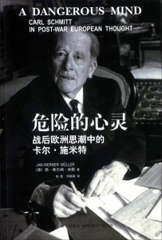
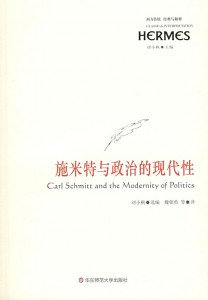
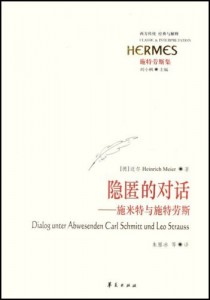

<!-- # 北斗荐书：主权者的幽灵：施米特与魏玛宪政 -->

魏玛共和国自1919年2月诞生之日起就面临着合法性与正当性的双重危机，与其说它是产自德国国内“强烈的”共和主义思潮，倒不如说它是由一场偶然发生的革命催生的。一方面，社会民主党最终的上台是靠镇压最初的革命集团：工兵委员会和斯巴达克派，因此，魏玛共和国并不是建立在所谓的“革命胜利”的基础上，而是，在某种程度上来说，建立在对革命的背叛的基础上。另一方面，即使最终成立了一个共和制政府，并颁布了一套议会民主制的宪法，然而魏玛共和国在后世历史学家看来，始终是一个“没有共和主义者的共和国”。正如科佩尔平森在《德国近现代史》中写道：“这套制度（共和制）并不是产生于积极的共和主义分子的活动，而是由君主主义者集团的分裂所产生的消极情况形成的······共和国是能把派别分裂减到最少的一种形式。”

魏玛共和国在历史上只存在了不到20年的时间，它结束于1934年希特勒成为国家元首，纳粹独裁统治形成，西方民主共和政体在德国的初次尝试以失败告终。而本文所介绍的主角卡尔·施米特，20世纪最有影响力的公法学家，正是成名于魏玛时代，曾试图通过捍卫魏玛宪法来拯救共和国于覆灭，又因为其后转而投靠纳粹而名声狼藉。施米特以其对自由主义的猛烈批判而闻名，扬·维尔纳米勒在《危险的心灵》一书中引用齐泽克的话评价施米特：“就洞悉到后政治自由主义宽容的死结所在来说，施米特仍旧是关键性的，既是一个危险人物又是一个诊断专家。”若将其在一生中迈出的那错误一步搁置在旁，施米特最大的价值乃在于他为我们揭示了自启蒙以降，自由主义所发现的诸多价值概念（如自由、民主、平等）之间不可调和的矛盾，他以其保守主义的洞察力和现实主义的敏锐眼光，对现代议会民主制的内在结构提出挑战，他所提出的那些质疑，无论是自由主义者还是社会主义者，无论是左派还是右派，无论是激进者还是保守者，都无法忽视。

因此，若要了解施米特的思想及其与魏玛宪政的关系，最好的方式就是阅读其原著。在国内的施米特研究中，首先是刘小枫所编的一套《施米特文集》，涵盖了施米特一生中的重要著作，本文要推荐的两本书一是这套书的第四本《论断与概念——在与魏玛、日内瓦和凡尔赛的斗争中1923—1939》，二是在第一本《政治的概念》中所收入的《合法性与正当性》。其次是关于施米特思想的评论，“卡尔施米特研究文丛”这套丛书中收入的都是美国和德国学者对施密特的研究，另外在刘小枫主编的“经典与解释”涉及到施米特的有四本书，两本刘小枫选编的《施米特与政治法学》，《施米特政治的现代性》以及一本美国自由派学者麦考米克所写的《施米特对自由主义的批判》和一本德国学者迈尔所写的《隐匿的对话——施米特与施特劳斯》。除此之外还有前文提到的德国学者扬·维尔纳米勒所写的《危险的心灵》，这本书主要研究施米特对战后欧洲政治思想的影响以及他对现代性和现代主义的继续批判，对施米特在魏玛民国时代的生活所述不多。

《论断与概念》是施米特生前自编的两本文集其中一本，这本文集中收入了施米特在1923年到1939年间的政论文章，涵盖了宪法、国际法、国际政治等领域，它的副标题叫做“在与魏玛、日内瓦和凡尔赛的斗争中”。施米特所做的斗争无一不是为德国作为一个主权国家强化其国家能力与国际地位而努力，这符合施米特一直所追求的一种“质的权威国家”而不是形式上的“量的权威国家”。这种追求表现在他提出的，对魏玛共和国议会民主制的软弱及其可能导致国家分裂的批判。

这本文集中的第七篇：《议会主义与现代大众民主的对立》。这篇文章是作为1926年发表的《议会主义的思想史状况》第二版的引言，在Ellen Kennedy评价这本书的一篇书评《施米特的的历史语境》中说：“《议会制状况》乃属关涉首个德意志共和国的自由民主基本制度的争论······施米特旨在解释”现代议会制度的基本内核”确信已在商讨和公开性中发现它。只有依据这种认知，才能理解议会制度的危机，并着手议会民主制的改革。”而议会民主制度的危机，施米特强调，是在于现代大众民主的发展将论证性的公开讨论变成一种空洞的形式。原本以讨论与公开性为基础的议会制不是权力争夺的场所，而是意见交换之下真理的诞生地，并由此产生一批真正的政治精英。而失去公开性讨论的议会制则是一个架空了的议会制，其新的基础从哪里获得呢？在这篇文章中施米特运用到一个转换，即过去议会制中的“讨论”变成今天议会制中的“谈判”，谈判意味着对利益和权力的争夺和妥协，同时意味着原本在议会中应当独立的议员，如今却代表着各自党派和利益集团在议会中争权夺利，而不是代表选民和国家利益陈述观点、交换意见。这实际上触及了现代民主制度中的软肋：完美的形式无法承载实质的正义。议会变成了“隐秘利益的接待室”，而拉德布鲁赫说，议会是个剧院。这种情形在今天的民主制国家中愈演愈烈，而施米特与其同时代的德国法学家能在魏玛时期认识到这一点，却是“得益于”魏玛共和国内激烈的党派斗争和魏玛宪政自身的矛盾。

《合法性与正当性》一书写于1932年，也就是希特勒发动国会纵火阴谋操控选举的前一年，施米特在本书中企图以最后的努力挽救魏玛宪政。他在后来1957年重印附言中写道：“当时的危机已经涉及到宪法的概念本身······本文是挽救总统制这一魏玛宪法的最后机会的绝望尝试。”“本文的核心命题······只有在修宪权受到限制的情况下，才能够否定一个政党的合法性。”这个命题虽然在当时受到主流学者的抵制，但在二战后西德颁布的《波恩基本法》中吸纳了这一建议，即“不能给予根本违背宪法中自由民主原则的政党以议会平等，必须对其实行党禁。”刘小枫在《政治的概念》一书的编者前言里讲到人们常用“正当性对抗合法性”作为描述本书的标签，在这本书中，施米特所对抗的合法性是一种功能主义的合法性概念，也就是一种纯粹程序上的合法性。在议会选举中争取到了51%的多数政党便获得了合法性，在一开始，所有政党都是基于一种机会均等原则得以进入议会。而获得合法占有政权的政党，同时也获得了三种巨大的政治奖赏：1.基于决定的运用，2.合法性的猜测，3.可立即执行性。“占有奖赏获得了一种决定性的政治意义，其毫无顾忌的利用成为党派政治的把持权力的当然手段。”

而已经合法获得政权的政党也可以利用其合法性取消机会均等原则，阻止其政敌合法获得政权。本书提到的另外一点是魏玛宪法自我消解的合法性危机。施米特认为修宪的底线是不能触及宪法的基本原则，“如果一部宪法预定修宪的可能性，那么，它并不是想由此提供一种废除它自己的合法性的合法方法，更不是想提出摧毁它自己正当性的合法手段”，而魏玛宪法中第一部分的价值中立和功能主义的结构形式恰恰给那些企图攻击宪法的政党提供了一个摧毁其合法性的均等机会。一旦一个政党进入合法性的大门便在自己身后将这门关上。施米特呼吁总统启用宪法第48条赋予总统关于紧急状态的权力，来对威胁到宪法存在的政党实施党禁。因为总统与直接民主、实质权力一起构成了魏玛宪法的三个竞争立法者，总统拥有某种程度上正当的立法权。

但施米特的本书中的呼吁最终败给了现实，兴登堡总统不愿过多违背宪法精神，启用其紧急状态的权力，却在1933年1月30日任命希特勒为总理，寄希望于希特勒能组建一个联合政党政府。兴登堡换来的结果则是希特勒依靠《授权法》通过各种法令以确立纳粹在德国的统治，包括《禁止新党建立法》，取消了其他政党进入议会的机会均等原则，《国家重建法》解散了所有邦议会，取消各邦自主权。而施米特本人从反感纳粹的态度转变为接受戈林的邀请，担任柏林大学的教授，并为纳粹的民族社会主义提供理论支持。

乔治施瓦布在他所著的《例外的挑战》一书的附录中为施米特被指责为一个机会主义者辩护，他指出，在1933年1月30日到3月24日这期间德国发生的一系列事件中，《授权法》的通过——对施米特而言，比兴登堡任命希特勒为总理更具深远意义。施瓦布认为，施米特的根本政治哲学乃是权力制定法律，而“国会的立法权被移交到行政部门，联邦国会事实上就正式放弃了它作为立法者的角色······因此，不能把施米特转而效忠于合法产生的新权威的行为描绘成具有机会主义的特性。”首先，这种说法十分牵强，1933年3月23日，国会以444票赞成，94票反对，通过“授权法案”，是在武装的纳粹党卫军的威胁之下通过的，仅有的94票反对全部出自不接受威胁的社会民主党人之手。《授权法》的通过确实产生了新权威，然而这一新权威的产生毫无合法性可言。其次，这种辩解其实是把施米特往更不利的境地推。因为，如果施米特投靠纳粹真的是从他的学说中找到依据，自然的从捍卫宪法转向独裁政权，那么施米特的学说则是在没有被歪曲的情况下（比如卢梭的公意说在被曲解在后来成为极权主义的鼻祖）就是危险而邪恶的。但我认为，施米特所提出批评的对象并不是自由的诸价值，而是在肯定这些价值的前提下，批评古典自由主义者没有认识到这些价值的紧张关系以及现代民主制发展过程中出现的种种危机，他关于总体国家、政治决断、民主同质性的学说是建立在对国家主权和政治能力的强调，通过努力挖掘像民主、平等、自由、社会、国家等概念的深层含义，企图形成一个实质的民族意志，将统治者与被统治者统一起来，区分同质者与异质者使国家免于分裂。

施米特被称为是“想要研究水利原理来解决烧到罗马城外的大火”，这是对他的褒奖，即使大火在当时没有扑灭，他对“水利原理”的研究却惠及今日。施米特所留下来的许多问题，比如，国家是一种规范主义的组织还是一种实质的权力？如果不存在普遍的平等，那么民主是否应该根据实质的不平等来区分同质者与异质者？政治在今天是已经沦为一种程序性技术性的管理方式？还是要区分敌我友之间的关系，认真思考权力的实际状态······这些都值得我们今天继续深思。

#### 推荐书目：

**推荐书目：扬·维尔纳米勒《危险的心灵》**

**[卡尔·施米特《论断与概念——在与魏玛、日内瓦和凡尔赛的斗争中1923—1939》](http://ishare.iask.sina.com.cn/f/5956485.html)**

**[卡尔·施米特《政治的概念》](http://ishare.iask.sina.com.cn/f/20563228.html)**

**[刘小枫等《施米特与政治法学》](http://ishare.iask.sina.com.cn/f/11955899.html?from=isnom)**

**刘小枫等《施米特与政治的现代性》**

**麦考米克《施米特对自由主义的批判——反对技术作为政治》**

**[迈尔《隐匿的对话——施米特与施特劳斯》](http://ishare.iask.sina.com.cn/f/24493807.html)**

（采编：陈芝；责编：陈芝）
