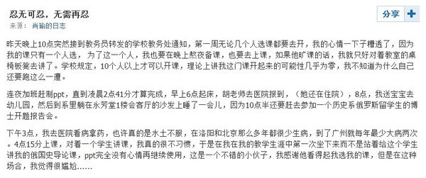

<!-- # ＜七星人物＞第十六期：善待是一种双向的态度 -->

<!-- # 善待是一种双向的态度 -->

## ——瓢虫君专访中大历史系肖瑜

**日前，一篇题为《忍无可忍，无需再忍》的人人日志在网络上引起热议，文章由一位老师的开课之痛延伸到对学校的评教制度的批判。该文出自中山大学一位青年历史教师之手，他想以自身的经历去问责一个并不完善的制度。在他看来，这个制度已经赋予了学生过度评判教师的权力。面对这篇文章，支持者有之，反对者亦有之。**

**这位老师名叫肖瑜，北大历史学硕士、博士，目前于中山大学历史系任教。**

**本以为这次访谈，肖瑜将会借助北斗这个平台澄清整个事件。但这位青年教师说自己不愿意再过于纠缠此事。我们尊重并理解他的态度，因而将访谈引入一个更值得整个社会反思的话题：当大家都在要求老师要善待学生时，学生是否给予了老师同样的善意呢？**

### 一、认真是一种习惯——关于文章风波的回应

**Q:您提到过，看中人人（校内）的原因在于“这个平台的大部分都是学生，和学生相处总归是要单纯些”，可是期间发生的一些事证明了当前的一些学生相当“成熟”，您也被一些学生说成“幼稚”，您怎么理解这里的“

成熟”和“幼稚”？**

A：

这里需要回一个问题，什么是成熟？迎合社会主流价值观的行为看似成熟，但是也可以换一个词——世故。我认为自己还算年轻，所以还是多一点热情，少一点世故吧。如果这被当作幼稚的话，那我还是宁愿继续幼稚。

我觉得作为名牌大学的大学生就应该是未来的精英。中国有十三亿多人，真正有机会上大学的人并不多，能上名牌大学的人更少。社会上有很多不尽如人意的地方，如果我们在高校里培养的人是为了适应社会而存在的，那这个高校一定是有问题的。一个真正有良知的大学生应该是尽量地通过自己的知识和素养去提高整个社会的底线，而不是去屈从。

**Q:面对不如人意的选课情况和评教结果，您在人人（校内）上连发几篇文章，特别是《忍无可忍，无需再忍》这篇，引起了极大的反响，您发文之前是否预见到了这种程度的传播力？**

A：

我大概是在08年汶川地震的时候开始写网络日志的。我为什么一直坚持写博客，很大程度上是为了提醒自己，要保持自我。常言道，无志之人常立志。但是在这样一个社会里面，如果不经常提醒自己，确实会丧失锐气。

工作时候跟学生时代不太一样，一开始，我对自己从学生到老师的身份转化不太成功，做学生的时候想说什么就说什么，也没有人在意。但是做了老师以后，我也不知道怎么就火了起来。我写的东西原本就是给自己和知心朋友看的，但是随着人人网的好友数量越来越多，是非争议也逐渐多了起来，有些事情真不是我可控的，如果早知道会引起这么大的反响，也许我该提醒自己换一种方式为好。

**Q:从文章的评论和回复中看，力挺的声音居多，炮轰的声音只是少数。一些人觉得您是小题大做、过于较真，您对此作何回应呢？**

A：

我并非是一定要旧事重提。我很想通过这个事情现身说法一下，我希望让一些有权力的人明白，在一所高校里面，某种程度上，如果学生比老师更有话语权，或者学生能够决定老师的命运的话，这个学校会很危险。因为很多要求严格的老师也许会因此被排挤出高校。我的出发点是为了这个学校好。我写的三篇文章里，如果说第一篇文章还略微带着一些个人情绪，后两篇文章其实是很客观的。

**Q:目前评教制度在各个高校十分普遍，您能否具体谈一下中大的评教制度，它为何能让学生比老师更有话语权？**

A：

如果一个老师在一个聘期内有课程评教排在后30%，理论上是不让他上职称的。当然，制度上也赋予了老师申诉的权利。但是全校几千名老师，30%末位淘汰的比例实在是有点高。就像一个公司，如果三分之一的员工都不合格，这个公司还开得下去吗？再有，能在高校教书的人大都是有骨气的，如果单纯是为了上职称，我是不愿意就评教这件事向校方做出任何申诉的。

据我所知，很多学校的评教是流于形式的。这样也不好，学生们会有意见。中大的评教制度在某种程度上是为了约束老师的，因为在高校的确有部分混课的老师。客观地说，评教制度是为了防微杜渐，出发点是好的。然而，实际上它的约束力也并不是很强，按照中大的规定，副教授以上就有终身教职。对于部分在职称上无欲无求的人，对于已经是教授的人来说，这个政策没有任何杀伤力，即使每年都排在后30%也不在乎。真正能伤到的就是一些刚从业的青年教师和一部分希望评上正高级职称的副教授们，而这些人往往是不敢混课的。

**Q:您之前说，您在这件事的处理策略上，很失败，只能怪自己不够成熟。您是否后悔做了这件事呢？如果现在再有一次机会让您表达意见，您会选择什么方式来处理这件事呢？**

A：高校教师基本都是知识分子，也多有一种闲云野鹤的态度，不太愿意管事，他们更愿意在学术上体现自己的价值，但是有些东西确实需要有人去讲，有些制度确实需要大家来改变。我就不幸成为了这样一个人，撞到了风口浪尖之上，这也确实给我自己带来了很大的压力。或许以我现在的身份说这些话并不合适，如果我是教授的话，可能说话会更有分量。但是我忍不住，HOLD不住就说了。

我并不后悔做这件事，但方式肯定是欠妥的。我最近一直在想这样一句话：你是一个好人，但未必能做好事。想做好事还要讲一定的策略，有些事是要因地制宜、因势利导的，不是说好心就一定能做好事。如果再有一次机会，我的方式可能会柔和一些，对学生如此，对同事如此，对领导也是如此。

**Q:在这个“认真你就输了”的时代里，您说您相信“认真不会输，认真不怕输”，你是怎么看待“认真”的？**

A：

有一个学生曾经回帖说，在世人看来，作弊或者是抄袭是不道德的；但对有些人来说，他们真不认为这是不道德的，因为身边的人都在抄，反而你这个较真的人给大家添了麻烦。

我觉得事情不应该是这个样子。认真应该是一种习惯，这是他的本职工作。社会上很多人都在抱怨没有规则或者规则不公，但是对于已有的规则，大家又不愿意照着执行。举个最简单的例子，谁都知道过马路闯红灯不对，但是你们看看每天有多少人在闯红灯？我希望每一个人都能是诚实守信、遵守规矩的人。对于合理的、约定俗成的规则，我们要遵守；对于不合理的规则，应该勇于发表自己的意见，争取能有所改变。

### 二、善待青年教师，就是善待中国学术的未来——关于师生角色的探讨

**Q:作为北大的毕业生，您曾在自己文章中多次怀念北大的氛围，为什么北大会对您有如此大的影响力呢？**

A：

其实我本科不是北大的，但是我本科的学校并不差，我是中国人民解放军外国语大学的，它是一个军校，我在那里确实学到了很多东西，包括军营的磨砺。不过，让我真正感受到自己开始“上大学了”是在研究生以后，我在那里（北大）呆了七年，那里给我留下的确实全是惊喜和震撼。在那里我学到了这一生受用不尽的东西，认识了一大批优秀得让人窒息的朋友，他们有做政府公务员的，有成为商界精英的，更多的人活跃在国内外的各个高校，无论是做哪一行，他们活的都很认真。母校也许对我而言并非是那个园子，而是我的那些好朋友、好兄弟。到了广东后，跟过去的朋友们离得远了，确实有些想家。

**Q:您的导师给予了您很大的影响，同样作为一位老师，您最敬重他们的哪些品质？**

A：

认真和敬业。我就是觉得他们当时是如何对我的，我也应该如何对待我的学生。

2003年非典前后，沈志华先生担心我荒废了学业，专门开车把我接到了他在北京大兴区的别墅里，在那里，我度过了学生生涯最重要的4个月。先生是极其用功的人，每天早上4点以前，他书房的灯已经亮了，几个月来天天如此。他告诉我他每天工作12-15个小时，十年如一日，看来此言非虚。从那时起我就明白了，世上没有免费的午餐，即使是再聪明的人如果不刻苦努力也终将一事无成。沈先生教导我，要写一万字的文章，起码要看100万字的一手材料，做10万字的卡片，这样的文章才叫扎实。我的第一篇像样的论文《锦州攻坚战——从林彪和毛泽东的三次分歧谈起》就是在沈老师家中完成的。

**Q:您是否希望从您的学生那里得到同样的敬重？**

A：

这个是自然的，当然也不能强求。我也并非对我所有的老师都非常敬重，但是我会对所有的老师非常礼貌，这是一个最基本的东西。我希望自己能做到一个老师应尽的责任，如果自己尽力去做了，我一直相信学生是有辨别能力的，他们会敬重我。

**Q:您认为作为一名好老师的标准是什么？如果以好老师的标准来评价自己，您觉得自己是一个好老师吗？**

A：

我才做了三年的老师，距离一个好老师的标准还差得很远很远。但是我确实有这样一个标准：作为一个好老师，第一、希望把先进的科学理念和知识传授给学生；第二、用自己积极的、乐观的、向上的生活态度去影响学生。

上过我的课的人都知道，我备一次课起码要花十五天甚至更长的时间，我说的是新课。而且每次再讲这个课，我还要重新更新三分之一的内容。学生反映，我的课信息量大，但是我认为这是好课。有些老师口才特别好，他只讲一两个观点，然后就此问题往下发挥，联系现实、联系热点问题，时间很快就过去了。我不会这么讲。我的课从来不去刻意联系现实，几乎没有。有些学生撰文说我的课东拉西扯，站在道德制高点上靠抨击现实来搏出位，我不知道他的根据是什么。事实上，我的每一次新课都是有录音的，我反复听过我上课的录音。我可以负责任地说，我开过的所有课程有效信息占到95%以上，我讲的全是和课程本身有关的话，绝对没有吹水。当然我自己讲课的状态有好有坏，自己的身体状况也有好有坏，但是我能做到每一节课准备的认真程度是一样的，从第一节到最后一节的质量也是大体一样的。

**Q:尊师重教本是传统，可是如今高校内学生对老师的不敬行为并不少见，您认为为什么会出现这种境况？学生、老师、学校，还有整个社会应该反思什么吗？**

A：

尊师重教是必须要坚持的。师生之间理应相互尊重，但是我比较反对这样一种理念，认为老师是为学生服务的。老师不是菜市场上卖菜的，学生愿意买什么，老师就吆喝什么；学生喜欢什么，我们就讲什么。事实上，如果学生的权力太大的话，客观上就会这样要求老师。对此我坚决不做妥协。

你说的学生不尊重老师的现象跟整个社会大风气有关，有一些大学老师确实做得不好。换位思考一下，如果我在大学听了几年课，不幸遇到的都是混课的老师，我也会对这个大学感到失望的。中国的社会经历了反右，经历了文革，知识分子的光环早已不复存在了。我们的父辈都经历过“知识越多越反动”的宣传，他们对“臭老九”有多少敬意呢？他们的孩子又会有多少敬意呢？对此，我也没有别的办法，只能从自身做起，期待更多的人越来越好，期待下一代的知识分子会做得越来越好。

**Q:在事件之初，您曾找学校反映过情况，但貌似并没有什么效果；另一个事实却是，现在高校的行政化程度越来越高。您觉得在目前的情况下，老师能够做什么？具体在这件事情上，学校又该给出怎样的一种回应呢？**

A：

体制之内我们依然有选择。体制内部有弊端，我们当然可以提出来，希望有所改进。但是在它没有改进的时候，我们也不能不做事。在现有的框架下，我们可以尽量做到自己该做的事情。如果因为过多的抱怨而忽视了做事本身的话，那这个损失就更大了。

具体到这件事上，善待学生并没有错。我希望学校在善待学生的同时，能够善待老师，尤其是善待青年老师。只有善待了青年教师，中国的学术才有未来，因为每一个大佬都是从青年教师起来的。

**Q:您认为老师和学生之间的理想状态应该是什么样的？**

A：

学校里面有各种各样的沙龙，都是学生和老师参与的。我自己就想办一个这样的沙龙。高校行政机构是存在问题的，但事实上有时候人们把行政所起的作用给夸大了，并不是所有的问题一定要谈及政治层面的；纯学术的、纯理念的东西是高校行政层面干预不了的。我讲俄罗斯诗歌，讲苏联犹太人总没有什么政治敏感性吧？！我觉得师生之间通过这种交流很大更大程度上有利于老师把自己的理念传递给学生，学生把自己的诉求传达给老师，双方能在一个更大层面上实现相互理解、相互信任。

<h3
