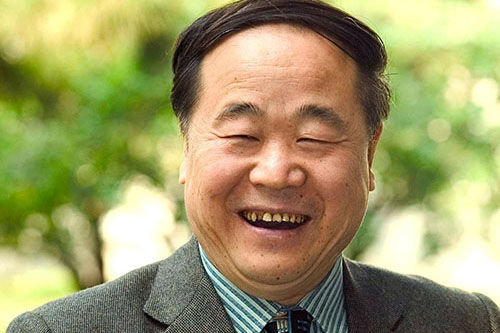

<!-- # ＜天枢＞莫言：从诺奖得主到伟大作家有多远 -->

**莫言令人诟病的地方不仅在于在不同场合都刻意忽视了汉语写作的残酷，更在于他以一己行动向世人证明了“让政治的归政治，文学的归文学”的主张的破产，见到异议作家当场退席，不顾历史惨痛手抄延安讲话，这是无论如何都无法回避的问题。关注这些，并非拿政治来对文学指手画脚，而涉及到一个作家的品格和道德底线。如果莫言不能正视并认真回应这些问题，那么他永远只是一个诺贝尔文学奖得主，而非一个伟大的作家。**

# 莫言：从诺奖得主到伟大作家有多远

## 文/凯风

莫言被授予诺贝尔文学奖，国人多年的诺奖情结是否就此消退？

显然没有。莫言获奖犹如一块巨石砸到原本就吹皱起来的春水里，掀起舆论界的惊涛骇浪。支持莫言的认为众望所瞩、实至名归，或谓舍莫言外，中国再无诺奖第二人，反对者或不屑于莫言的文学成就，或指责其与体制的亲近，更有甚者，将讨论的视线拉往过往的几届诺贝尔奖得主，敏感人物的名字以各种变形爆发于社交网络，以至于有了“中国第四位诺奖得主”“首位获得诺奖的共产党员”等民间说辞。还有些人颇为高明地说，文学的归文学，政治的归政治，不可对莫言过于苛求。更有御用文人早为当局总结了一套说辞，意谓莫言获奖是对中国崛起的肯定，又言是对是对中华文明、中国成就的肯定，只差一句又咽了回去的话，这是对盛会最精彩的献礼。阴谋论者也伺机而动，怀疑莫言获奖背后到底有着怎样不可告人的政治交易。

舆论界混乱如斯，政府层面也未曾如预料般大嘘一口气，反而忧心于民间舆论的“过度联想”，以至于脚忙手乱，《人民日报》头版未出现莫言获奖的消息就是“过犹不及”的例证。当局的尴尬在于，首先如何对莫言获奖进行定性，如何表述第一次，这个问题央视早已解决：莫言是首位获得诺贝尔文学奖的中国籍作家。一个中国籍，虽不能解决到底有多少中国人获得诺奖的问题，但至少可以正大光明地打出“首位”。但更大的尴尬则在于，曾经对诺奖不屑一顾，认为“不值一评”，甚至斥其为西方政治工具，有着“别有用心的政治目的”的相关部门，这次该如何对诺贝尔奖拨乱反正？更如何将莫言获奖与新时期中国文化的建设以及即将召开的盛会结合起来？尤为令人担心的是，假如下一位获奖者恰恰出现在一个不愿提及的领域里，又该如何改变原有的说辞？

观睹微博上的情绪，对莫言获奖乐见其成者并不占多，部分怀疑他没有这样的实力，部分则紧盯他的道德问题不放。莫言有没有这样的实力，暂且不予置评，文学标准的问题，人言言殊，毕竟在诺贝尔文学奖水准整体呈下降趋势的今天，一个诺贝尔奖也无法证明一个作家的成就，况且正如评论人羽戈所言，“诺贝尔文学奖的荣耀，掩盖不了中国文学的贫弱”（大意）。就后一个问题，却值得探讨，一个存在道德问题的优秀作家能否获得一个设定于文学界的奖项？在文学领域，是否应该尊崇让政治的归政治，文学的归文学的主张？

主张让政治的归政治，文学的归文学的人，忽视了一个关键问题，文学可以不涉及政治，但政治却总是染指文学，况且是在这样一个曾经将“文艺要为工农兵服务”推为文学创作的指导方针、有着政治全面控制文学经历的国度里，文学怎会脱离政治？许多人忽视的另一个更为关键的问题是，在文学广袤的空间里，除了政治，难道就没有别的标准了吗？评价一个作品，难道只剩下技术性的文法、结构了吗？只有所谓“魔幻的现实主义”了吗？一部作品的灵魂呢？作品的社会指向呢？在人道主义和人类理想主义精神方面的表现呢？

即使莫言在这些层面经得住考验，那么涉及个人的品格和社会责任方面呢？很难想象，一个具有广泛影响力的奖项，在考虑一个作品的时候竟然不考虑这个作品背后的价值指向以及作者的道德与人格？否则，写得一手好文章、将洗脑术驾驭得炉火炖青的戈培尔也该获得某个终身成就奖了吧。更难想象，如果一位作家，缺乏独立的人格，趋炎附势，为权力张目，能写出怎样透彻灵魂、具有深切社会和人性关怀的真诚的作品？这样的人即便可以称得上文学上的巨人，也只是精神上的侏儒。

有人拿曾为纳粹服务过的海德格尔作为例子。诚然，我们无法否认海德格尔在哲学上的巨大成就，然而一个人在某一专业领域有着怎样的成就是一回事，他是否配得上某一荣誉又是另一回事。当提倡人类诗意的栖居的海德格尔从纳粹归来，其同事也忍不住讥讽：君从叙拉古来？因此，莫言是否有实力获得诺贝尔文学奖奖是一回事，他是否配得上这样的奖项是另外一回事，而这个奖项是否配得上他（以及包括高在内的其他得主）则又是另一个新的问题了。

2000年诺贝尔文学奖得主高行健说在获奖言说中说：“文学一旦弄成国家的颂歌、民族的旗帜、政党的喉舌，或阶级与集团的代言，尽管可以动用传播手段，声势浩大，铺天盖地而来，可这样的文学也就丧失本性，不成其为文学，而变成权力和利益的代用品。”作为莫言对手的日本作家村上春树也有温情而令人肃然起敬的话语：以卵击石，在高大坚硬的墙和鸡蛋之间，我永远站在鸡蛋那方。我们都是独一无二，装在脆弱外壳中的灵魂。你我或多或少，都必须面对一堵名为「体制」的高墙。我写小说只有一个原因，就是给予每个灵魂尊严，让它们得以沐浴在阳光之下。这是他们写作的理由，而莫言呢？他的“文学的理由”是什么？

莫言令人诟病的地方不仅在于在不同场合都刻意忽视了汉语写作的残酷，更在于他以一己行动向世人证明了“让政治的归政治，文学的归文学”的主张的破产，见到异议作家当场退席，不顾历史惨痛手抄延安讲话，这是无论如何都无法回避的问题。关注这些，并非拿政治来对文学指手画脚，而涉及到一个作家的品格和道德底线。如果莫言不能正视并认真回应这些问题，那么他永远只是一个诺贝尔文学奖得主，而非一个伟大的作家。

莫言，这个名字犹如幽灵一般，与哑巴一道，共同构成了这个荒诞时代的隐喻。只要“莫言”仍是时代的主流，即便中国拥有十个诺贝尔文学奖，中国文学也难以挺直脊梁。

（采编：佛冉，责编：佛冉）
