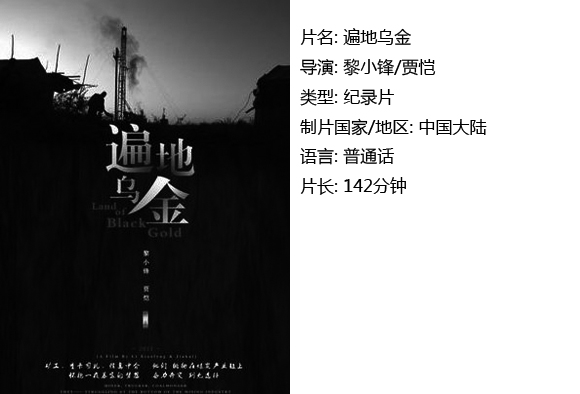

<!-- # ＜独立影像＞第三十三期：人间疲软，大地沉重 -->

**榆林被誉为中国的科威特，大地之下是蕴藏着无比丰富的煤与油气资源。这些资源带给当地人的并不是丰饶和欢愉，它反而像是加重了地心引力，吸引了外来的投资蜂拥而至，又将底层的人们牢牢地困在这片诅咒之地。这个世界好像倒过来一样，人们脚下的土地反而成了他们背上无法承受之重，整个社会的责任被甩给他们的肩膀，他们却命比纸薄。**

# 人间疲软，大地沉重

## 影评人 / 柯鸣谦（上海政法学院）

在拿到片子以前，我对这部关于煤矿的纪录片的想象是：摇曳的镜头跟着矿工们进入到矿井深处，煤矿开采的细节被一一记录下来，过去在新闻中不断出现的矿难事故的背后，这些细节（狭小逼仄的矿井、嶙峋狰狞的矿石、粗重的呼吸声以及压迫感，这些依然是我的幻想）幽灵般的浮现。然而，在这部影片中，除了开头时候摄影机随卡车开进深深的隧道，在矿井入口处停留了一会儿，煤矿的内部结构算是呈现给观众了，其余的两个多小时里，再也没有关于煤矿现场的任何记录。另一方面，在这部片子中，导演也没有把镜头对准那些凭借煤矿一夜致富的煤老板们，或者犀利生猛地去记录这一群体在暴富之后穷奢极欲的生活。围绕着煤矿这一话题，即使是纪录片也能找到许多戏剧性的素材，但我们的导演却放弃使用那些煽动性的镜头和剪辑技巧，只是再平淡不过地记录着那些位于煤矿生意边缘的人们的挣扎与疲惫。

因此，这部纪录片以记人为主，与煤矿有关的事和物则是随着对人物的了解深入而牵扯出来。影片中导演选取的人物，有运输煤矿的重卡司机、煤矿信息部的老板、普通的矿工、当地的居民。一个接着一个人物，从工地到公路，从潮湿肮脏的宿舍再到由于煤矿塌陷造成墙体断裂的居民房屋，一张有一张面孔在我眼前走过。人的问题是片子的焦点，而体制、社会、国家的种种问题都隐藏在人们叙述的背后。导演忠实地记录下这些最底层的人们的声音，通过他们的叙述，呈现给我们的是一幅煤矿世界荒诞的浮世绘。

一位工人：他们村子里的人动员起来阻止煤矿开采，要求煤老板赔偿村民损失，村中一位德高望重的老人与煤老板谈判，后来煤老板从外地找来打手，险些杀掉这个老人。而他们村子则因为煤矿的过度开采，地底下已经全被挖空了。整个村庄被放在一张薄薄的地皮上。

王老板：地方官员为了应付政绩考核与行政发包体制，上门请求乡镇上的商人们去做煤矿生意，一面又以安全问题为借口干涉施工，变相索取贿赂。

一位居民：他清楚地记得十一月十七日十二时，煤矿塌陷，当时平躺在床上的他一下子变成侧卧，他召集当地居民去中央上访，中央答应解决这个事情，回来后，当地政府却稳如泰山，一动都不动。

一位卡车司机：为了能赚到更多的钱，他不得不超载运送煤矿，而超载运煤又面临着被交警罚钱。同时，交警也会因为各种理由盘剥卡车司机们，如果司机不换水箱，就会因此而罚款，而换了水箱后又会因为私改车型而罚款。

信息部杜老板：由于承包商的层层转包，当地市场的房租大幅上涨，60多家信息部联合抵制，但联合很快就从内部瓦解了，有的信息部私下与承包商达成协议交了租金，有的说好与其他信息部一起撤出当地市场，却等别人走了以后自己留下来独占市场，有的虽然走了但留下一些人观望，等到时机成熟再回来。而承包商则派人在信息部里做“卧底”。

所有这些真实的故事就像一篇篇魔幻现实主义风格的短篇小说，而语言却充满了黑色幽默。卡车司机既要面对煤老板的压榨，又要面对体制的盘剥，而水箱的例子，正像是约赛连面对“第二十二条军规”那般的无奈。片中的王老板给我们讲了个笑话，他说那些市长、书记、局长凡是正级的干部总是很担心煤矿安全的问题，而副局长、副书记等副级的干部却巴不得煤矿死人，个中原因在于国家实行问责制，一旦煤矿出了事故正级的干部都要被免职，而副级的干部却安然无恙，反而他们可以再事故之后以安全隐患为由天天去煤矿工地，名为检查，实为蹭饭，用王老板的话说：“领导们每天一到饭点就准时出现，我们不得不招待。”道格拉斯诺斯对制度的定义是“制度能够决定人们的行为偏好，因为人们是在游戏规则之下做出的，制度构造了人们在政治、社会和经济方面发生交换的激励结构。”而王老板的例子再生动不过的诠释了这段话。在信息部抵制租金上涨的这一部分，我们看到的则是囚徒困境般的博弈问题。每个信息部的老板都希望租金能够回落，他们以为联合起来以撤出当地市场为威胁，可以迫使承包商降低租金，却又互相不信任,怀疑他们当中的人背信弃义与承包商私下达成协议交付租金，杜老板坚持不交租金，唾弃那些与承包商“勾结”的信息部老板，并承诺与大家一起离开当地，但最后却独自留了下来继续赚钱。理性的经济人这一假设在此处根本无需受到质疑，人与人之间无关乎信任，只关乎博弈。

在这部片子里，导演采访的那么多人中，信息部的杜老板是个性最鲜明的一个，也是占据影片比重最多的一个人物，导演坦言在采访的过程中他与杜老板聊得比较投机。在杜老板之外的那些人物的脸上，我看到无不是悲伤、苦涩、最重要的是疲惫。同样，整部影片的基调就是疲软。那位运输煤矿的重卡司机讲到，他总是没日没夜的跑运输，并且等在煤场，煤一出来装上车就得马上走，如果煤半夜出来，那他是不可能等到天亮再出发的，我想象着他是一匹过度操劳的老马，而身后卡车上的煤则化身为高大严厉的黑衣主人，骑在他的身上，挥动皮鞭催他前行。工人们因为过度的劳动而疲惫，村民们因为过度的反抗而疲惫，而煤老板们疲于应付官员们过度行使的权力。

榆林被誉为中国的科威特，大地之下是蕴藏着无比丰富的煤与油气资源。这些资源带给当地人的并不是丰饶和欢愉，它反而像是加重了地心引力，吸引了外来的投资蜂拥而至，又将底层的人们牢牢地困在这片诅咒之地。这个世界好像倒过来一样，人们脚下的土地反而成了他们背上无法承受之重，整个社会的责任被甩给他们的肩膀，他们却命比纸薄。杜老板吐着烟向我们抱怨她每日赚钱的艰辛，她还说自己尝尽了人间的苦头：开过饭店、搞过粮油、贩过蔬菜、开过服装店、开过舞厅、办过台球、养过三轮。她走在风沙里,由画外音讲着这些故事，在此之前是她一个人面对着镜头坐着，突然就留下了眼泪，再往前，她与一个跑运输的卡车司机在信息部里跟着音乐跳舞，其他人都高兴的看着。我想起讲故事的那个卡车司机，有一次，他坐在自己的卡车上等着装煤，播放手机里内置的一段铃声，那只是一段有节奏的电子铃声，他一个人坐在那里盯着手机发呆，直到这段“音乐”放完以后镜头才切换了过去。司机说他总是会头疼，需要吃药，那种药他已经吃了十几年了。烟和药给人们提供的都是一种麻醉，当现实的沉重和命运的叵测让人们不敢再直视眼前这片深渊的时候，烟让他们看不清现实，药让他们看不清自己。

结尾的时候，导演又带我们从杜老板的故事回到重卡司机身上，他由于疲劳驾驶而在开车的时候睡了过去,卡车被撞成了稀巴烂，所幸他人没有受伤。因为这次的事故，他欠了十多万的债，把家里的钱都赔进去了。这等于是说过去的辛苦全都白费，一切又要从头开始。这部影片最终还是以疲惫结束。这疲软的人间就如同电影的开头，镜头在黑暗的隧道里摇摇晃晃的向前走。至于榆林，随着地下能源竭泽而渔，它还能在这黑暗的隧道里走多久？两百年？三百年？我不知道。

###  【如何观看】~@_@?~

请关注【摘星星®

青年沙龙】在全国各大城市（目前已有西安、上海、武汉、成都、厦门、杭州、重庆、北京等城市）的线下放映活动~ [http://site.douban.com/177837/room/2069615/ ](http://site.douban.com/177837/room/2069615/

\)

关于**独立电影**和**DNEY**请参见[<>第一期：初识独立影像（上）](/?p=11506)，其中的**广告**也要记得看哦！

（采编：黄楚涵；责编：黄楚涵）
