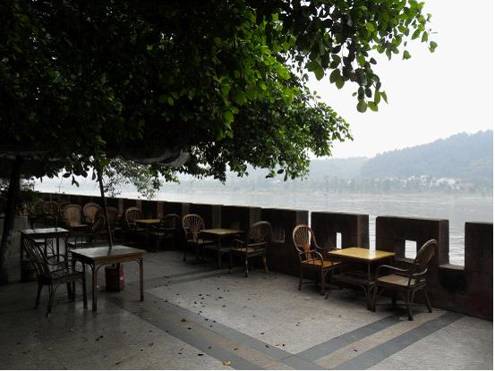
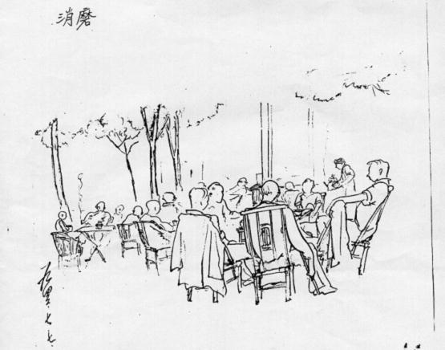

<!-- # 大学与茶馆 -->

1938年，一批批武大师生从日寇逼近、局势紧张的武昌溯江千里西迁至四川乐山。船只从肖公嘴一带经过时，依山开凿的巨大佛像吸引了所有人的注意，三江奔流的壮阔江面，高耸入云的千年石佛，这一切都让疲惫的师生们惊叹不已！或许有人在心中默默许愿，企盼大佛能保佑一方安宁，但他们不曾想到，流亡的武大将要在这座西陲小城停留八年之久。这一年的乐山，炮火硝烟尚未波及至此，“除抽壮丁以外，全无战时气氛”[1]。偌大名校，泥丸嘉州，千余名师生的涌入给这座小城带来了阵阵喧闹和朗朗书声。在公园、在江边、在树荫下，在散布全城的茶馆里，忙忙碌碌的么师[2]们都好奇地打量着这群陌生的大学生，他们期待，下江人的到来能给茶馆带来人气和好生意。

武大西迁乐山之后，校舍因陋就简，多选用当地旧有的庙宇、工厂、学校等。“文庙的大成殿变成了图书馆，火神庙变成了食堂，龙神祠、露济寺变成了学生宿舍，鸽子笼似的寝室充满了高低铺，多数的宿舍没有自习室，连上课用的桌椅都急需添购。”[3]校舍条件和珞珈山恢弘的宫殿式建筑群有如云泥之差。有自习室的宿舍，不论白天和黑夜，总是有人在自习桌前看书。有的学生则在自己的床上搭木板，当做自习桌使用。而文庙图书馆阅览大厅里的十几张长形阅览桌，每天一大早就成为学生们争夺的目标。这样，很多占不到座位的学生不得不光顾乐山随处可见的茶馆，茶馆成为他们学习、娱乐和开展各种活动的主要场所。

即使是对有些拥有自习桌的学生而言，茶馆也常常是生活中一大元素。蒋宗祺校友是乐嘉公园茶馆的常客，“在乐山四年，因没在宿舍自修室里占个座位，几年来的课余学习都只能依附于床前小桌，……白天正想静下心来读点书时，不巧，同室同学来了客人，谈笑风生，学习只好停摆！晚上，为了赶完某一章节的学习，想加点夜班时，而同室诸公又陆续归寝。临睡前的时刻是同学们学习一天以后舒畅休息的黄金时间，不免天南地北地畅谈一番，……就这样，加加夜班赶读章节的打算又只得‘煞锅’、‘泡汤’！”[4]寝室里的学习容易受到影响，“为了逃避干扰，到校外寻找一块清净宝地，开辟学习的第二战场就成为我以及和我有同样境遇的同学们的唯一出路。就由于此，乐嘉公园里的茶室自然地成为首选对象”[5]。

四川是今天世界饮茶之风的发源地之一，茶馆有着悠久绵长的历史，到茶馆吃茶几乎是四川人生活不可分割的一部分，这给不少初到四川的武大学生留下深刻的印象，有人回忆道：“四川茶馆之多，可说是‘五步一楼，十步一阁。’街头巷尾，随时随地，可以入座清心。不仅清早起来‘皮包水’，是一般市民的生活，据说小请客也好，大谈生意经也好，听清唱说书也好，‘摆龙门阵’也好……都可以‘一片冰心在玉壶’。”[6]内迁之后武大四川籍学生迅速增加，“西迁乐山前的一九三六年四川籍学生仅为二十三人占全校人数的3.4%，西迁后的一九三八年四川籍学生达二百六十一人，占全校人数的22.2%，增长了六倍之多。”[7]乐山饮茶之风盛行和大量川籍学生的涌入使得众多武大师生入乡随俗，被传染上坐茶馆的习惯。

简陋的校舍条件，浓郁的茶馆文化，再加上其他种种原因使得武大师生和乐山茶馆产生了密切的联系，形成一种奇妙的社会景观。

**一、茶馆与学习**

在茶馆里经常可见拿着书本，埋首读书的学生，或一个人刻苦研读，或约上三五好友一起相互切磋，砥砺学问。经济条件稍好的学生点上一杯清茶，手头拮据的学生叫上一盏“玻璃”（白开水）。出去吃饭或者上课时，把茶碗往桌子中间一推，表示还要回来，么师便不会收茶碗，这样一坐就可以坐大半天。茶馆成为课堂之外的第二学习阵地，在茶馆中交流的知识更是别有天地，“古、今、中、外，左、中、右派的各种书刊都有，许多马克思主义的论著也在同学间流传”[8]。茶馆的环境有时嘈杂，有时清静，但“只要有人看书，邻近座位的人们也比较安静。据大家经验，习惯了，茶馆内完全可以看书。好多同学说，只要别人打架不打在自己头上，保持安心看书不成问题。凡准备考试时节，茶馆内座无虚席，鸦雀无声。这时的茶馆完全成了武大学生的自习室、阅览室”[9]。有人宣称，“在人声鼎沸的茶馆中，我可以心无旁骛地看书，毫不受干扰，而且效率高，每次考试都能取得好成绩。”[10]到了大四，茶馆也往往成为学生撰写毕业论文的场所。方成校友在四年级为了准备毕业论文和考试，“白天蹲图书馆，晚上泡茶馆”，“成了二馆居士”[11]。可以毫不夸张地说，有些学生的毕业论文主要就是在茶馆写成的。蒋宗祺校友就是一个例证，他在茶馆里“按指导教授的建议，编写了论文提纲；用半年时间写成了近三万字的《战时公债刍议》毕业论文，获致佳评。”[12]此外“有组织的小型学术讨论会也常在茶馆举行”[13]。

**二、茶馆与团体**

乐山时期，武大学风宽松自由，学生思想活跃，朝气蓬勃，各类学生团体纷纷涌现。“著名的有：文谈社、风雨谈社、政谈社、海燕社、仁义学会、地平线社、东湖剧社、三民主义学会、岷江读书社以及各地同乡会、同学会。有些社团还在民主墙上张贴壁报。出现了自由结社、百花争艳的局面。”[14]

茶馆是各种学生组织活动和聚会的理想场所，因为校舍紧张，很多社团组织并没有合适的聚会场地，在茶馆开展活动，场地问题即迎刃而解，而且省去许多不必要的麻烦。社团成员不需要提前去布置活动地点，他们所要做的仅仅是按时到达指定的茶馆，即便是有人迟到，先来的成员也可以一边喝茶一边等待人员聚齐活动开始。

茶馆是一些学生正式加入社团的地点，比如田林校友就是在一次话剧演出结束后，因为其勤快肯干，被剧社社长邀请到嘉州公园坐茶馆，介绍他加入峨眉剧社。[15]有的组织干脆就诞生在茶馆中。1938年6月底，武汉大学党小组便是在乐山大渡河边的一家茶馆中秘密成立。[16]大大小小的各级学生组织在茶馆里讨论工作、交流心得、谋划社团发展。三五个人就可以围着茶馆简易的小方木桌，或背靠竹椅，或前倾身子，发表各自的见解。人多的时候，几张桌子一拼，茶馆中就形成了一个个展开激烈讨论的中心点。同乡会、同学会等组织还把迎新、送旧、谢师之类的活动定在茶馆。在系会、级会等组织的郊游活动中，坐茶馆也是少不了的。在抗日战争的时代背景之下，爱国的青年学生充分利用茶馆人流量大的特点，进行全民抗战、持久抗战等主题的宣传，抗日问题研究会下乡宣传队的队员们走遍了乐山附近的各乡镇，他们在乡镇宣传抗战形势时，“每次都是先在茶馆、集市等人群密集的地方讲演；讲演后再演出街头剧或小快板等”[17]，激发了偏远闭塞地区群众的爱国热情。在众多回忆文章中，风雨谈社社员杨方笙老校友的一段文字，显得尤其生动详细，可以让我们遥想当年学生团体在茶馆中的活跃情形：“那是个难忘的夜晚。三十多个风华正茂的男女大学生聚集在府街‘沫滨茶社’的后厅，正举行着风雨谈社的迎新茶会。外面茶客喧哗，我们听而不闻。会上先有一位社友报告形势，分析了世界反法西斯战争和我国抗日战争的最新发展情况，包括中共领导的抗日根据地的情况，指出强弱之势正在转化，最后胜利必然是属于民主力量的。接着便是包括我在内的新社友自我介绍；再接着便是老社友一人说几句欢迎词，或热烈或含蓄，或严肃或惹笑，最后我们还合唱了几条歌，闹得其余茶客们无不愕然，误以为这一帮年青人神经出了毛病。”[18]

即便是那些被国民党当局严令禁止活动的进步社团，也往往会选择在茶馆集会，位置偏僻的茶馆自然是他们聚会的选择。热闹的茶馆也未尝不可，因为熙熙攘攘的人群使得学生们的秘密活动不容易引人注目。岷江读书社是当时一个极富影响力的进步社团，成立于1939年8月，1942年在多方面压力下，该社被迫宣布自动解散，一些社员分别参加学校的其他进步社团，还有部分社员转入地下，继续坚持活动。张宝锵校友回忆：“地下的岷江读书社组织严密，入社的都要报告家庭情况、本人经历。我在建社之初即已加入。聚会是白天在一家茶馆举行。选举干事时，赞成的把茶盅盖子揭起，反对的不动。”[19]用“茶盅盖子”进行投票的细节让我们觉察到茶馆喧腾景象的背后隐藏着惊险和斗争。

（乐山一处露天茶馆，笔者2012年8月4日中午拍摄于岷江之畔）

**三、

茶馆与社交**

嘤其鸣矣，求其友声。茶馆是学生们进行社交活动的重要场所。“课外见面，尤其是不同宿舍同学之间见面，多约在茶馆。”[20]许多本不相识的同学借助茶馆这个社交空间建立了友谊。在伍一民校友笔下，茶馆中的社交活动颇有一番情趣：“春秋多佳日，下午没课，午觉后便与事先约好的同学去岷江对岸的任家坝散散步或坐茶馆，或两人一组，或三五一群。……任家坝平畴广阔，农舍点点，在浓密的树荫下往往有一家小茶馆，竹桌竹椅，清静近乎冷落，店主并不靠此营生，这是社交活动的理想地方。入座后，每个人一碗盖碗茶，便天南地北地神聊开来，放浪形骸，无拘无束，谈古论今或品评老师的讲课，或纵谈世界大局，也可交换读书心得，就这样两三个钟头下来，彼此启迪，获益匪浅。经过几次这样的交往，增进了解能成为知己。但也有一次交往，感到话不投机，共同语言太少，交往也就到此为止，保持点头之交。”[21]对于这种社交活动，有人给与了很高的肯定，认为“茶馆里的思想交流，往往影响着甚至决定着一个人的生活道路或政治道路。”[22]

**四、茶馆与休闲**

洙泗塘上莲坊凉，菡萏池中风送香。

三碗毛茶半天坐，古今上下论兴亡。[23]

1943年8月，化学系一位名叫焦庚辛的学生写下上面这首诗《晚茶》。洙泗塘是乐山城中一地名，附近有一家名叫“莲坊”的茶馆，每到夏天洙泗塘荷花盛开，香远益清，亭亭净植，吸引不少人到此喝茶。夏天的傍晚，暑气渐渐消散，在送来阵阵荷花香的晚风中品茗闲聊，显然是一件极其享受的事情。当时“教师因工作忙，有家务，坐茶馆的较少”[24]，但夏天洙泗塘的茶馆还是吸引了一些忙里偷闲的教师。在1940年7月9日的日记中，叶圣陶记述了自己和亲友去坐茶馆的经过：“三时，与墨及三官、徐汉诚往洙泗塘吃茶看荷花，……至则荷香扑鼻，翠盖红裳，眼界一新。就池旁觅座吃茶，墨与徐太太闲谈杂事，意至闲适。五时半归。”[25]一行人在茶馆闲坐了两个半小时。

在大部分师生经济困难的情况下，消费较低的茶馆是最容易被接受的休闲方式。因此，在紧张忙碌的学习工作之余，到茶馆摆龙门阵、下棋、打桥牌、晒太阳、闲坐成为很多学生课余生活的重要组成部分。孙法理校友就谈到：“星期天跟三两挚友作个短足旅行，到大佛寺、乌尤寺去寻幽探胜，或到郊外小茶馆晒太阳，打扑克牌或看书，也很潇洒。那时往往不拘形迹，有时就打着赤膊坐在茶馆里晒太阳，是很有些野趣的。”[26]

对于许多小商贩来说，热闹的茶馆是他们良好的商品市场，很多小贩会到茶馆卖东西。茶馆老板并不厌恶小贩拿着商品、工具在茶馆密集的人群里穿梭，因为他们给茶客带来了方便，这对茶馆生意是有好处的。因此，在茶馆闲坐的学生除了享受茶水之外，也能够享受到小商贩们带来的诸多便利。“茶馆时有小孩来擦皮鞋。还有小贩——也主要是小孩来卖香烟和花生、炒花生米、糖炒板栗等食物。那时有些同学开始吸香烟，觉得坐茶馆吸香烟满有‘风度’。最初是在茶馆买一支香烟三人同吸。一人吸一支已是比较阔气的了，买整包香烟来吸的很少很少。同学可以向卖东西的孩子赊账，到有钱时再一起付给。”[27]有几个提篮卖花生瓜子的小贩和学生们混熟了，“他们替同学们传递消息，他们卖到那个茶馆，那里就有武大同学，消息就来了，谁在什么地方，要谁来打桥牌等等”[28]，这样一来，学生们尽可靠着椅子享受安逸的茶馆世界，想要给其他人递个话都不需要自己跑腿。如果有些嘴馋，手头又比较宽裕，“则可以在茶馆叫面叫饼——四川白饼子夹棒棒鸡或芥菜丝或川北凉粉其味绝佳”[29]，小吃担子经常摆在茶馆外面以招徕顾客。

这样悠闲放松的茶馆生活使得师生们从学习工作的压力下暂得解脱，放下手头未完成的工作和心头的烦恼，抖落疲惫，收获轻松和满足，最后带着饱满的精神离开。对于他们而言，茶馆就是一个加油站和避难所。

（国立武汉大学化学系1942届校友、著名漫画家方成抗战期间创作的反映茶馆生活的漫画《消磨》，图片由武汉大学档案馆馆员吴骁老师提供）

**五、茶馆与性别**

我至今仍羡慕至极的茶馆文化，大约是男生的专利吧。男生口中的女生宿舍“白宫”，据云比男生宿舍舒服多了，散布在小城的六座男生宿舍，一半是香火不盛的庙宇，一半是简陋搭盖的通铺。它们的名字倒很启人想像，如龙神祠、叮咚街、露济寺、斑竹湾……。自修室都不够用，但是旁边都有茶馆，泡一盏茶可以坐上半天，许多人的功课、论文、交友、下棋、打桥牌、论政都在茶馆。他们那样的生活是女生无法企盼的，在那个时代没有任何女生敢一个人上街闲逛，也没有人敢上茶馆。在一千多学生中，男女生的比例是十比一，却是两种截然不同的世界。[30]

1947年毕业于国立武汉大学外文系的齐邦媛校友晚年在自传《巨流河》中这样回忆乐山时期男生女生与茶馆的关系，在她印象中“那个时代没有任何女生敢一个人上街闲逛，也没有人敢上茶馆”[31]。

在中国传统社会中，社会习俗限制女性在茶馆抛头露面。19世纪60~70年代，在西方文化的影响下，北京妇女出入茶馆的风气已经愈来愈盛。而在深居内陆的四川省会成都，1906年才出现第一家允许妇女进入的茶馆，但直到1937年茶馆基本还是男人的世界。抗战爆发后，在大量外省移民的冲击下，妇女出入茶馆才逐渐被成都社会所容忍。[32]与沿海城市和省会成都相比，地理位置偏僻的乐山思想风气尚显守旧落后。即便在武汉大学这所高等学府内部，男女生之间的交往也并不开放。有女生回忆：“当时武大除个别女同学和男同学谈恋爱外，一般男女同学有界限，很少接触，甚至同班同学也不说话。”[33]还有男生认为，“男女同学隔绝太甚”[34]，“武大风气保守，如一位女生和男生双双散步走过玉堂街——不要谈大佛寺、乌尤寺了，次日新闻就出来了”[35]，这两人会成为其他人悄悄议论的对象。每当有女同学们路过男同学聚集的茶馆，茶馆内也不免会传出“对某一女生的评头论脚之声”[36]。在这种内外风气的影响下，可想而知，女生自然很少在几乎是男生世界的茶馆里出现。

位于白塔街的女生宿舍原是进德女校，四层楼建筑，坚实雅净，是全校最好的宿舍，被称为“白宫”。白天光线好时，女生们可以在宿舍里坐着小板凳看书。除此之外，她们还在附近一个外国传教士的住所，在李码头、斑竹湾一堆从大渡河捞上的浮木上学习讨论。到了夜晚，“白宫”二楼的自修室灯光明亮，每间寝室里又有小自习桌。相对良好的宿舍条件，也使得女生们没有必要像男同学那样过度依赖茶馆。

即使是这样，也并不能说，“那个时代没有任何女生敢一个人上街闲逛，也没有人敢上茶馆”。相反，在当年男女学生写下的大量回忆文章中，我们还是可以发现女生出入茶馆的记述。同样是在《巨流河》中，齐邦媛提到一位姓俞的男生带着她去“坐了羡慕许久而未坐过的乡村茶馆”[37]。另一位女校友殷正慈甚至专门写了一篇《忆陈庄之茶》[38]的短文，深情追忆在乐山县城隔江对岸竹林中的陈庄泡茶馆的经历，她和其余几位女同学每逢春秋佳日，总是喜欢去那里泡上几个小时，考试前夕也总是喜欢背着书包到陈庄茶馆复习。在一位男学生的记忆中，武大女生“一般只在集体活动时光临茶馆”，但是“白塔街上邻近‘白宫’的基督教学生公社的茶园，则随时可见女生身影，并偶有女生在该处打工”[39]。另一位男学生还清楚记得文谈社两次内部聚会时一起去坐茶馆的女同学的名字：“一天世坦告诉我有几个同学想约我上茶馆谈谈，……那次上茶馆交谈的，除了世坦和我之外，还有马健武、潘兴来。……潘是一位天真热情的女同学，衣着朴素。”[40] “一个晚上，世坦同另一个社友约好到醍醐茶馆喝茶，介绍我认识了陈谋慧，一个举止大方、衣着朴素、容光焕发的女同学。”[41]这正好印证了女生通常只在集体活动时光临茶馆的说法。

我们应该看到，虽然女大学生在乐山茶馆的出现并不频繁和普遍，而且她们所光顾的茶馆或位置偏僻或靠近“白宫”或属于集体活动的场所，但她们偶尔闪现的倩影毕竟还是撼动了茶馆由男性主宰的传统，在不经意之间，乐山这座巴蜀小城的世态民风已经在动荡年代悄然发生了嬗变。

**六、大学与茶馆的相互影响**

乐山茶馆的老板们可能发现，指望着从这些喝“玻璃”的穷学生身上赚钱进而发家致富是不现实的。但是，高等学府的到来，知识分子的涌入，先进思想的传播，不同地域文化的汇集，毫无疑问给茶馆和以茶馆营生的人们带来了巨大的冲击。爱国学生在茶馆宣传抗战形势，打破了小城的沉寂，人们的精神面貌为之一新；大学生在茶馆读书学习、举办团体活动，在潜移默化之中改变了乐山人的思想教育观念，引发了一次深刻的文化启蒙；而女大学生偶尔光顾茶馆的身影，更是动摇了茶馆由男性控制的社会传统……可以说，武大的茶客们在八年之间推动了包括茶馆在内的整个乐山经济社会的现代化进程，对乐山地方文化产生了长远的影响。

乐山八年是武大校史上最为艰难困苦的时期，同时也是最为辉煌壮丽的时期。这其中当然离不开茶馆的功劳，武大人在茶馆陪伴下度过了那段可歌可泣、荡气回肠的峥嵘岁月。不少茶馆几乎全由武大学生占用，有的学生甚至早上洗脸、晚上洗脚都在茶馆，成为被茶馆文化所熏陶的资深茶客。复员武昌之后，在一段较长的时间内，珞珈山下的学子们还保留着乐山时期的茶馆文化。在1947年8月6日一位学生的日记中就有这样详细的记载：“……上杨家湾坐茶馆，去迟了就没得位子。而且即使找到了位子，叫一杯香片也得半天才轮到你跟前添一次水。因为茶馆小，茶炉小，人多，茶杯多，喊开水的急，如此不免90℃的水也拿来冲茶了。”[42]茶馆坚韧的生命力和适应性，以及它对武大学生的影响之深远可见一斑。茶馆成为众多师生校友后来挥之不去的一大情结，他们用温情的笔触留下了大量的文字资料，不断有校友重返乐山故地想再次领略茶馆的情趣。在今年年初的一次采访中，年近九旬的乐山时期老校友皮公亮和笔者谈到当年的茶馆生活时，笑呵呵地用记忆深刻的乐山方言喊了一句“么师，来杯玻璃！”[43]，回味六十多年前在茶馆叫茶的场景，足见茶馆在他脑海中的印象之深。

1946年10月，武汉大学东归珞珈，结束了八年流亡办学的岁月。那年夏末秋初的某个清晨，当茶馆的么师下好门板，摆好桌椅，为准备开始一天的生意忙得额头上冒出汗珠时，他们或许已经发现茶馆近来稍显冷清，曾经遍布全城的那些衣衫褴褛、面容饥瘦的“丘九”[44]不见了踪影。对于很多告别乐山的武大人而言，曾经的茶馆生活一去不复返，当他们白发苍苍再来寻访旧迹时，和乐山城一样，乐山的茶馆早已在现代化发展的滚滚洪流中失去了昔日的模样……

### 【注】

[1] 叶圣陶1938年11月4日给上海朋友的信，见叶圣陶：《叶圣陶集》第24卷，江苏教育出版社，2004年，第173页。 [2] 乐山方言对茶馆服务人员的称呼，即“茶博士”。 [3] 应利群：《抗战时期武汉大学西迁乐山》，武汉大学校友总会，武大武汉校友会合编：《武大校友通讯》1991年第2期，第64页。 [4] 蒋宗祺《乐山忆旧》，骆郁廷主编：《乐山的回响：武汉大学西迁乐山七十周年纪念文集》，武汉大学出版社，2008年，第270页。 [5] 同上。 [6] 殷正慈：《忆陈庄之茶》，董鼎总编辑：《学府纪闻：国立武汉大学》，台北南京出版有限公司，1981年，第334页。 [7] 应利群：《抗战时期武汉大学西迁乐山》，武汉大学校友总会，武大武汉校友会合编：《武大校友通讯》1991年第2期，第65页。 [8] 萧萐父：《冷门杂忆》，武汉大学北京老校友会，《北京珞嘉》编辑部编：《珞嘉岁月》，2003年，第673页。 [9] 邓春阳：《忆乐山茶馆生活》，龙泉明，徐正榜主编：《走近武大》，四川人民出版社，2000年，第146—147页。 [10] 张肃文：《走向珞珈山之路》，武汉大学校友总会编：《武大校友通讯》1998年第1辑，武汉大学出版社，1998年，第143页。 [11] 方成：《从羊到骆驼》，武大《校友通讯》编辑室编：《武汉大学校友通讯》第二期，1984年，第237页。 [12] 蒋宗祺《乐山忆旧》，骆郁廷主编：《乐山的回响：武汉大学西迁乐山七十周年纪念文集》，武汉大学出版社，2008年，第270页。 [13] 邓春阳：《忆乐山茶馆生活》，龙泉明，徐正榜主编：《走近武大》，四川人民出版社，2000年，第147页。 [14] 叶霜：《低首一生拜抚师——王星拱校长在乐山办学前后》，武汉大学校友总会编：《武大校友通讯》1997年第1辑，武汉大学出版社，1997年，第157页。 [15] 参见田林：《回忆峨眉剧社》，骆郁廷主编：《乐山的回响：武汉大学西迁乐山七十周年纪念文集》，武汉大学出版社，2008年，第315页。 [16] 参见张碧秀：《中共武汉大学特别支部在乐山》，武大北京老校友会编：《武大学运文选》，2002年，第34页。 [17] 顾谦详、黎军、方成、端木正、蒋传漪、王晓云、张熙、王若林：《乐山时期的武大“抗研”》，武大北京老校友会编：《武大学运文选》，2002年，第41页。 [18] 杨方笙：《大学》，谢绍正主编：《永远的感召——寻找武大乐山时期的故事》，2003年，第48页。 [19] 张宝锵：《我与岷江读书社的地下组织》，载《岷江情深——岷江读书社回忆录》，岷江读书社编，2004年，第105页。 [20] 邓春阳：《忆乐山茶馆生活》，龙泉明，徐正榜主编：《走近武大》，四川人民出版社，2000年，第147页。 [21] 伍一民：《龙神祠杂忆》，骆郁廷主编：《乐山的回响：武汉大学西迁乐山七十周年纪念文集》，武汉大学出版社，2008年，第283—284页。 [22] 邓春阳：《忆乐山茶馆生活》，龙泉明，徐正榜主编：《走近武大》，四川人民出版社，2000年，第147页。 [23] 焦庚辛：《乐山纪事》，武汉大学校友总会编：《武大校友通讯》2008年第2辑，武汉大学出版社，2008年，第268页。 [24] 邓春阳：《忆乐山茶馆生活》，龙泉明，徐正榜主编：《走近武大》，四川人民出版社，2000年，第144页。 [25] 叶圣陶：《叶圣陶集》第19卷，南京：江苏教育出版社，2004年，第267页。 [26] 孙法理：《乐山时期武大的文化生活》，骆郁廷主编：《乐山的回响：武汉大学西迁乐山七十周年纪念文集》，武汉大学出版社，2008年，第329页。 [27] 邓春阳：《忆乐山茶馆生活》，龙泉明，徐正榜主编：《走近武大》，四川人民出版社，2000年，第146页。 [28] 郑德信：《乐山寻梦记》，武汉大学北京老校友会，《北京珞嘉》编辑部编：《珞嘉岁月》，2003年，第810页。 [29] 王禹生：《嘉乐弦歌忆旧》，龙泉明，徐正榜主编：《走近武大》，四川人民出版社，2000年，第142页。 [30] 齐邦媛：《巨流河》，台北天下远见出版股份有限公司，2009年，第171—172页。 [31] 齐邦媛：《巨流河》，台北天下远见出版股份有限公司，2009年，第172页。 [32] 参见王笛：《茶馆：成都的公共生活和微观世界，1900~1950》，社会科学文献出版社，2010年，第四章。 [33] 陈凤箫：《甜滋滋的回忆》，武汉大学文谈社编：《回忆文谈社》，1996年，第136页。 [34] 邓春阳：《武大国剧活动琐忆》，武汉大学北京老校友会，《北京珞嘉》编辑部编：《珞嘉岁月》，2003年，第775页。 [35] 王禹生：《嘉乐弦歌忆旧》，龙泉明，徐正榜主编：《走近武大》，四川人民出版社，2000年，第141页。 [36] 邓春阳：《忆乐山茶馆生活》，龙泉明，徐正榜主编：《走近武大》，四川人民出版社，2000年，第145页。 [37] 齐邦媛：《巨流河》，台北天下远见出版股份有限公司，2009年，第246页。 [38] 殷正慈：《忆陈庄之茶》，董鼎总编辑：《学府纪闻：国立武汉大学》，台北南京出版有限公司，1981年，第334—336页。 [39] 邓春阳：《忆乐山茶馆生活》，龙泉明，徐正榜主编：《走近武大》，四川人民出版社，2000年，第144页。 [40] 徐圣熙：《从坐茶馆开始》，武汉大学文谈社编：《回忆文谈社》，1996年，第150—151页。 [41] 同上，第152页。 [42] 廖翔高：《珞珈剪影——半个多世纪前的日记选登》，武汉大学北京老校友会，《北京珞嘉》编辑部编：《珞嘉岁月》，2003年，第850—851页。 [43] 2012年1月12日下午，笔者与吴骁、廖煜轩在皮公亮老校友家的谈话。皮公亮老校友是湖南长沙人，1944年至1949年就读于国立武汉大学。 [44] 解放前人们称当兵的为“丘八”或“丘八老爷”，称学生为“丘九”。

（采编：周拙恒；责编：楼杭丹）
