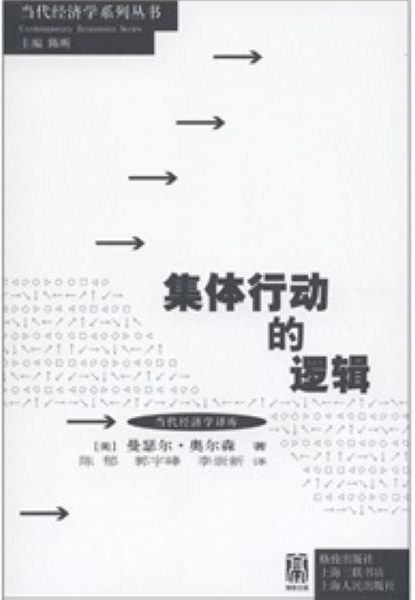
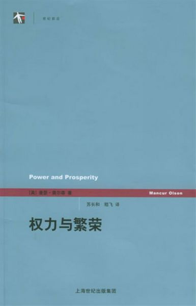

<!-- # 北斗荐书：奥尔森三部曲之我见 -->

前段时间，我阅读了美国马里兰大学教授、已故著名经济学家曼瑟·奥尔森（Mancur Olson）的三本重要著作：《集体行动的逻辑》、《国家的兴衰：经济增长、滞涨和社会僵化》和《权力与繁荣》，深有感触。**鉴于奥尔森的研究和大家所关心的一系列问题比如民主行动、市场及国家有效性、政府存在的意义息息相关，因此我认为将自己有关奥尔森著作的感悟和观点进行整理十分有必要。**我认为，奥尔森的著作将会非常有效地回答大家如上的一些热点问题，这对于我们开阔学术思路，想必也会有非常重要的帮助。

对于奥尔森著作的学习和理解，我得到了邓辉老师的强力推荐和帮助，在此再次表示感谢。同时，莫尔逍也和我探讨了奥尔森思想和哈耶克有关自发秩序理论之间的关系，对于我加强理论逻辑串联也提供了不少帮助，在此也表示感谢。

在我对奥尔森教授著作开始评议前，我首先将向大家分享我这篇文章的行文思路。在第一部分，我将简要介绍奥尔森教授的研究领域及核心理论。在对其理论有了大概了解后，我将在第二部分就奥尔森研究的方法论路径进行一个简单说明，并就他的方法论同奥地利学派的方法论进行比较，并将简单评议奥尔森的理论是否能和奥地利学派的理论进行兼容以及我为什么要就理论兼容的问题进行说明。文章的第三部分，我将正式开始就奥尔森教授的理论进行简要论述和评议。

由于本文并非正式的学术论文，并且由于我自身时间所限，因此我无法做到将引用学者的观点进行详细标注，尽请谅解。以后如果有需要，我会进一步就这个问题进行调整。

#### 第一部分 奥尔森研究领域及核心理念简介

奥尔森教授作为公共选择学派的代表人物，其研究重点为外部性和公共品，并且由于其理论不仅从理论本身得到了完美的证明，也由于能够很好地反映现实状况，基本上被经济学各学派，以及其他社会科学学科所广泛接受。可以说，奥尔森的理论影响深远。而他的核心理论则依先后出版顺序，通过《集体行动的逻辑》、《国家的兴衰：经济增长、滞涨和社会僵化》（以下简称《国家的兴衰》）和《权力与繁荣》这三本著作进行传达。

奥尔森的核心理念，言简意赅，并不罗嗦。在《集体行动的逻辑》一书中，奥尔森首先认为，传统对于集体行动的认识——即个人可以有效行动，因此集团无论大小都可以有效行动的观点是错误的。他认为，随着集团人数的扩张，集团要进行集体行动由于缺乏激励，会越来越困难。他通过实证分析和规范理论推导两个方法证明了自身的理论。

在提出了集体行动的逻辑后，奥尔森教授又将理论进一步扩展到了回答国家兴衰这个问题上。在《国家的兴衰》一书中，奥尔森认为历史上各国经济的繁荣与衰弱同能够有效集体行动的特殊利益集团紧密相关。特殊利益集团的垄断性越强，经济损失越大，国家也会日渐衰弱。

在《国家的兴衰》这本著作问世之后，读者们自然会提出疑问，如何保证一个国家的持久繁荣？奥尔森教授给出的答案是，除了市场经济本身，还需要强化市场型政府（market-augmenting government）来保障市场的运行。这个问题，奥尔森通过其遗著《权力与繁荣》进行了阐述。

我本人则在阅读到这部分时突然思考到了著名经济学家米尔顿·弗里德曼曾有的一句名言：资本主义不是政治自由的充分条件，而是政治自由的必要条件（History suggests that capitalism is a necessary condition for political freedom. Clearly it is not a sufficient condition. ）。然而问题则是，政治自由的充要条件是什么？如果我们仅仅只有必要条件，而不能够回答充分条件，以及由此逻辑更为全面的充要条件，那么我们在探索自由之路上，很可能依然困难重重。而我本人在阅读了奥尔森的著作后，提出了有关自由（我将在文章最后部分解释为什么我使用“自由”而非“政治自由”的原因）充要条件观点（鉴于我自身阅读范围的局限性，也许这个观点被西方的学者们早就提过了，然而不管怎么样，我认为这个观点依然有很强的启发性），那就是：资本主义和强化市场型政府是自由的充要条件。

以上我简单介绍了奥尔森的研究领域、核心理论以及他的思想对我的启发，接下来，我将就奥尔森研究的方法论同奥地利学派的方法论进行对比，思考奥尔森理论对奥地利学派理论的兼容性，以及我为什么要就方法论问题进行思考的原因。读者如果对方法论的讨论不感兴趣，可以先跳过第二部分，直接进入第三部分了解我对奥尔森核心理论的理解和评议。另外，本文不采取文末注释的形式，如果需要补充说明，会在正文部分的括号内加以说明。

#### 第二部分 奥尔森理论与奥地利学派方法论及理论兼容性

奥尔森教授对其理论进行推导的方法论，基本上是基于主流经济学新古典综合学派的方法论：即规范性和先验性理论推导同实证分析相结合，通过观察现实状况后，提出理论，并就理论内涵进行逻辑扩展，再进行假设检验，进一步修正、验证理论的合理性，并最终得出理论结论。

无论是提出集体行动逻辑、特殊利益集团对国家经济增长的影响以及强化市场型政府等多个理论，奥尔森教授均用到了如上的方法论。然而值得一提的是，奥尔森教授在《国家的兴衰》一书中对于主流经济学过多使用静态和局部实证分析的方法提出了不同意见，强调了应该在历史全局环境下进行动态分析的重要性，这一点则和奥地利学派的动态分析方法论有契合之处。

接下来我将要论述为什么需要将奥尔森的理论同奥地利学派的方法论和理论的兼容性进行说明。

首先我将简要介绍奥地利学派的方法论。奥地利学派的方法论是基于对人类行为公理的理解之上（相关可以参考Ｌ·米塞斯《人类行为的经济学分析》（Human Action: A Treatise On Economics, 1949），对于比较新古典综合学派方法论同奥地利学派异同的也可以参考加里·贝克尔的《人类行为的经济分析》（The Economic Approach to Human Behavior，1976）），通过公理展开动态逻辑演绎（在这里，新古典综合学派的主流经济学通常采取“比较静态”的研究方法，这点为奥地利学派所反对，奥地利学派认为这样的分析方法脱离实际情况，既然现实事件是动态的，那么就应该用动态的演绎方法才能更好解释人的经济行为）加上历史事实作为理论推演的提示，推理出经济学理论。在奥地利学派看来，历史事实则是对奥地利学派进行全局理论演绎的重要提示。奥地利学派认为，全局性理论当然能够用来解释现实世界以及某一种经济学概念上较优或者最优的配置，然而，倒过来说的话，局部事实则是不能解释全局理论的，我们很可能由于对现有世界知识掌握的不全面性，而导致以偏事实概括全局理论的出现。因此，奥地利学派总体上是拒绝局部实证分析来推理全局理论的。但是，奥地利学派内部对于局部实证分析的观点也存在不同意见。以F·A·哈耶克为代表的奥地利学派人接受局部经验分析的方法论，同时坚持在理论推理中继续采取基于人类行为公理的全局演绎来进行理论推理。

所以我们概括起来说可以认为，奥地利学派的理论推理方法基于人类行为公理，采取纯理论逻辑演绎加历史线索作为演绎提示的方法，反对将局部实证分析“以偏概全”上升到全局性理论，同时，也有部分奥地利学派认为局部实证分析的理论如果在逻辑上符合奥地利学派纯理论逻辑的推理方法，也可以嵌入奥地利学派的理论之中。

有关奥地利学派和新古典综合学派方法论的异同，读者也可以阅读朝圣山学社社员、西班牙胡安·卡洛斯国王大学经济学教授维尔塔·德索托的著作《奥地利学派：市场秩序与企业家创造性》。

到这边的话读者们应该可以有一个初步结论，那就是从理论全局演绎的角度，奥地利学派的方法论可能比新古典综合学派的方法论更有优势。然而我在本文第二部分的主旨并非要刻意告诉读者应该认同哪个方法论，事实上我个人的结论是相对委婉的，我的目的则是指出，奥尔森的理论之所以为各学科、各学派所广泛接受，很重要的原因是无论是从哪个方法论的研究角度，他的理论都能被证明，无论是实证的或者先验的，或者其他。每个人在学术研究都会有不同的方法论，对此我表示理解和尊重。

因此可以说，奥尔森的理论，正如他自己在分析中所采用的逻辑推导+动态+历史的演绎方法可以看出，他的理论完全可以嵌入奥地利学派的方法论。尽管奥地利学派现在在观点上，分裂成支持罗斯巴德的无政府资本主义和支持哈耶克的有政府古典自由主义两个阵营，但是奥尔森的理论在方法论上，是能够和后者进行完美衔接的。正如德索托教授的评议，那就是新古典综合学派在去掉某些形式之后的理论，能够为奥地利学派所采纳和接受。

值得一提的一个题外话就是，奥尔森的理论在我看来，和哈耶克有关自发扩展秩序的理论也有不少可以衔接的相似或相同之处。然而鉴于本人对于哈耶克著作的阅读和理解并不十分深入，因此不好在此下最后结论。如果日后有机会，我也将就这部分的问题进行专门分析。好了，有关奥尔森理论同奥地利学派方法论的异同，以及其理论是否能够嵌入奥地利学派方法论，我已经完成了相关论述。非常感谢将第二部分耐心看完的读者，相信通过以上分析和讨论，我们可以一起对经济学的不同方法论有着更为深刻的认识和收获。

#### 第三部分 奥尔森核心理念的介绍及评议

在这一部分，我将会进一步介绍奥尔森的核心理论，以及我对于奥尔森理论衍伸观点的看法。奥尔森的核心观点通过其三本核心著作进行表达，按照时间顺序分别是我在文章一开始提到的《集体行动的逻辑》（1971）、《国家的兴衰》（1982）以及《权力与繁荣》（2000）。在第三部分，我将按照三本书的先后顺序，分为三小节进行相关介绍。

**1、集体行动的逻辑：大小集团集体行动的不同效应**

奥尔森教授在《集体行动的逻辑》一书中提出的有关集体行动的理论，极富创新性。通常人们谈到集体行动的有效性，总会认为，一个集团中的个体，只要有共同利益，那么就可以为了共同利益而进行集体行动。

这样的假定曾经被两方面的人士所广泛接受。一方面，在过往被许多政治学家所采纳接受，并基于这个理论提出各种有关民主决策和公共选择有效性的进一步推论，很多相关学者从“集体行动一概有效”甚至推理出了“民主行动一概有效”。在另一方面，这一理论又存在于老生常谈的卡尔·马克思的理论中，马克思理论认为，资产阶级掌权后，为了阶级共同利益，往往会对工人阶级采取压迫剥削。如果工人阶级“觉醒”，了解到资产阶级对于他们的迫害，那么便会起来起事捍卫自身利益，并建立属于工人阶级的政权。马克思主义由此进一步推论，如果某个阶级内部的人能拥有不少共同利益，那么他们将会按照共同利益而共同行事。

不幸的是，无论是政治学家还是马克思主义者，对于一概而论的集体行动有效性所进行的判断和推论，都是错误的。奥尔森教授明确地指出了这一有关集体行动观点的悖论：既然大集团中的人是理性的和自利的，那么一旦集团人数足够多，则他们所在集体所提供的集体物品对其个体的收益相较于成本（一个人为了所在集体行动，可能放弃原本属于自己的工作和闲暇时间，这些时间原本可以被用来创造收入或者放松休息）可能会比较小，在这样的情况下集团中的个体可能会由于收益不划算，而放弃为集体付出；如果收益并不小，那么个体总会希望有他人来付出参与集体行动，而自己搭便车坐享其成，缺乏参与集体行动的激励。因此，奥尔森教授最后得出结论，那就是在通常情况下，集团成员人数越大，则集体行动越困难。

以上的分析仅仅揭露了集体行动无效的通常可能性，那么，什么样的集体行动才是可能的呢？奥尔森教授在书中为我们揭示了几个重要的因素，我将其进行了归纳：集团大小、集团内部成员的熟悉程度（熟悉程度越高，则信任度和相互合作的默契越高，集体行动的效率也越高）、集团是否有正负选择性激励、成员同质性是否高（比如成员的阶级，相同阶级对于集体物品的共同需求会越大）、对于集体行动收益有强烈需求的特殊人士（比如领导游说集团的政客、媒体从业人员和社会科学家，他们可能会由于对集体行动收益有更强烈的渴望，而主导集体行动）、集团集体行动时讨价还价的成本、以及集团内部对集体物品的偏好强度等重要因素。

以上，我将一些比较好理解的因素通过条文后的括号予以了简单说明，接下来我将要特别说明集体行动可能的重要必要条件：选择性激励。选择性激励也是奥尔森教授有关集体行动逻辑分析的关键所在。激励通常分为正激励和负激励，这样的激励在集团行动中也是经常出现的。对于集团行动而言，负激励的作用较为显而易见。比如在欧洲工会组织中，对于那些不愿意参加工会以及在工会中作为不积极的工人，工会会采取负激励的惩罚措施，如拒绝这些工人参加工人集体参加的娱乐活动、在这些工人认为自己遭受雇主不公平对待时不提供保护等。这些禁止拒绝集体行动者同会员和积极参与者分红，以及提供利益帮助的负激励，对于集体行动来说，是常常出现的。

奥尔森教授又进一步指出，除了显而易见的负激励之外，正激励对于集体行动同样也是十分重要的。奥尔森教授在进行正激励的说明前，特别指出了集体行动有效情况下的正激励，往往并不是集体行动本身所要提供的那一份公共物品。正如奥尔森教授对于集体行动所需要的必要条件所列，一定程度下由集体提供的公共品，会由于搭便车现象而无法提供，因此，正激励随着集团人数的增加，往往并不是该集团主目标的这份公共品本身，而是通过向集团成员提供集团内的其他公共品，来激励集团成员参与集体行动。而这样的公共品本身，相对于集体行动的终极公共品，则是较容易提供的。同样是工会的例子，一些工会不仅通过负激励“胁迫”工人参与工会，同时又通过给工人提供必要的工作保险，而吸引工人参加。对于工会来说，向每位会员收取一定的收入投入到集体保险，显然比要求他们进行某一项需要付出大量金钱和时间的集体行动容易得多。同时，工人们也可能会被提供子女看护、子女教育入学、住房等各方面的优惠，以此作为集团要求工人在诸如罢工提工资等工会最主要的终极公共品上提供生产行动。普遍而言，对于集团成员来说，如果他们想要长期享受这些正选择性激励，那么他们就必须参与到对本集团终极公共品的生产中。

在这里，奥尔森教授进一步指出，通常情况下人数比较大但成功的集体行动，往往是通过提供这样的选择性激励而进行的，而非就集体终极公共品本身。

奥尔森教授不仅通过理论自身的逻辑推导扩展了以上理论，还通过数学证明、实证分析等其他方法论，证明了以上有关集体行动的理论。如果读者对于严格意义上的理论证明有兴趣，我建议读者可以好好参考《集体行动的逻辑》这本书。

**2、国家的兴衰：特殊利益集团的影响**

以上我简要介绍了我眼中《集体行动逻辑》一书的核心理论，事实上，这本书的逻辑结构和方法论构成是非常丰富的，无论你是奥地利学派先验主义方法论支持者，还是新古典综合学派实证分析方法论支持者，还是两种方法论结合的“骑墙派”，我相信你都会从中得到不少启发。接下来，我将要介绍奥尔森教授有关国家兴衰的理论，这部分理论的建立和发展基于他对集体行动的分析。

奥尔森教授发现了国家衰弱的一个重大充分必要条件，那就是各种特殊分利集团对国家的影响：各种特殊利益集团存在时间越长、越稳定，则经济增长衰退和社会僵化的可能性越大。而反过来，不存在大量分利集团则不构成国家衰弱的充分条件，最多只能算是必要条件。

这个理论是非常简单的，而奥尔森教授不仅用动态的逻辑演绎方法推导了这个理论，也借助数学和历史事实，来对这个理论进行检验。以下我将用理论解释现实的方法来论述奥尔森教授的这个理论。

我们可以用一个典型案例来说明奥尔森有关国家衰弱的理论，这个案例就是英国。在英国光荣革命之后，英国并没有多少特殊分利集团，加上政府对经济的不干预政策，因此在一两百年的时间里，英国在自由贸易、国内工业等多个领域均有广泛的增长和发展。而随着经济的增长和财富的积累，英国各产业也逐渐形成了围绕各自企业主或劳工等的特殊分利集团。这些特殊分利集团，比如说英国各类别工会，利用民主投票、罢工等手段迫使政府采取最低工资法等各种措施，保护现有劳工的既得利益。

按照经济学的基本原理，类似于最低工资法之类的政策不仅降低了企业的生产效率，而且还会排斥许多等待进入就业岗位的待业人员的就业机会，进而进一步影响这部分人的收入。类似的，诸如各行业协会等，也会通过立法、游说、强制等手段，限制行业准入，以此获得较高的经济利润。经济学基本原理告诉我们，垄断组织获得的经济利润通常会高于非垄断下的情况，但是由于垄断形成的低效，整个社会的产出也降低了，因此消费者能够购买到的商品的质量和数量也比之前低。如果一个社会各行业的分利垄断小集团越多，那么整体社会的经济效率损失则越大，市场竞争的优势没有得到发挥，经济增长的乏力也就开始显现了。

我们再来回顾下奥尔森教授的理论：社会稳定的时间越长（政府对于私有产权的保护等重要因素也是社会稳定的必要条件，这里暂不展开论述），则越有利于经济发展，然而经济的发展所形成的各种分利集团，通过制度、政策以及自身的选择性激励，维持自身的垄断性，同时降低整个社会的经济效率。

这整个理论，完全解释了英国的实际情况。英国在19世纪后20年开始，受到特殊分利集团的影响，成为了西方发达国家中，经济增长最先开始衰退的国家。由于两次世界大战对于英国本土的破坏力有限，因此，英国社会又获得了比其他欧洲国家更长的稳定时间，而这，又造就了英国分利集团进一步的发展。非常明显的是，以英国工会为代表的分利集团，通过与政府合谋，获得了大量的垄断利益和力量，甚至当年爱德华·希斯首相的内阁会议，都受到工会胁迫而被迫断电（作为保守党首相的希斯，力主消除英国的工会垄断，而这遭到了英国工会把持的电力公司强行阻拦，所以才有了断电之事，以此胁迫政府不要对工会动刀）。

在案例中，奥尔森教授还为我们揭示了一个特殊案例：瑞士。尽管作为永久中立国的瑞士有悠久的稳定传统，但是由于宪政法律体系不易修改，加上国内产业结构等因素，即使瑞士在一定时期内由于分利集团造成过经济增长的乏力，但是由于瑞士的宪政体制并没有为特殊利益集团服务的空间，因此其垄断能力大打折扣，有的垄断分利集团因此衰弱甚至消失，这也保证了瑞士经济在长期较高速的增长。

在《国家的兴衰》这本书中，奥尔森教授还为我们揭示了他有关国家兴衰的理论是如何匹配美国、澳大利亚、新西兰、法国、德国等西方主要经济体的经济增长和衰弱，甚至也包含了战后日本、韩国、香港、新加坡、台湾等经济体的腾飞（这些经济体由于战争等因素，造成了缺少稳定社会所存在的特殊分利集团，而香港则是由于英国长期的不干预政策造成特殊分利集团难以发挥作用）。同时，他还将有关国家衰弱的理论创新地运用到了对印度和中国的分析上。奥尔森教授认为，印度的种姓制度等也造成了印度社会的分利集团，而这又在印度的长期历史环境中造成了经济增长的乏力。而以上种种案例，无不说明了政府照顾特殊利益集团的行为对经济增长乏力的影响。

然而，有趣的是，奥尔森教授也指出，这样的案例放在中国身上并不合适。尽管在19世纪由于行会等特殊分利集团造成了中国经济增长的乏力，但是这些行会的存在本身较少受到政府支持。根据奥尔森教授对历史的阐述，由于中国社会幅员辽阔，政府很多有关贸易的商业职能被行会所掌控。进一步分析，中国广大的幅员决定了各级政府不可能参与到所有有关商业运行的具体规则制定，而这其中的许多规则则被行会“承包”了。再加上中国中央政府在明王朝之后采取的贸易保护政策，使得行会的垄断特权进一步加强。我们或许也可以说，具有部分政府职能的中国行会，利用垄断特权造成了经济增长的乏力。

到这里，读者们可能会发现，奥尔森教授在《国家的兴衰》一书中更多侧重的是特殊分利集团对国家衰弱的影响，那么，又是什么因素造成了国家的强盛呢？所有进一步的答案，奥尔森教授在其遗著，也就是“奥尔森三部曲”的收尾之作——《权力与繁荣》中，给出了答案。

值得一提的是，《国家的兴衰》一书富含经济学各种方法论的有趣实践，以及大量对历史事实的分析。我认为作为经济学学者或者爱好者，想要了解各种方法论的综合应用，这本书不失为一本不错的选择。

**3、权力与繁荣：政府出现的演绎及自由的充要条件**

《权力与繁荣》一书是奥尔森教授的遗著。奥尔森教授1998年因心脏病突发突然辞世，留下了这本尚未完成全书最后润色的著作。单看书的名字，我们大致就可以猜到奥尔森教授的这本书是探讨政治权力与经济增长之间关系的。这样的话，应该会有两个疑问被思考者提出：第一，经济的增长需要政治权力吗？第二，如果经济增长需要政治权力，那么，什么样的政治权力是保障经济增长的关键呢？——这两个问题，奥尔森教授用其富有逻辑和实证方法的文字，向我们予以了说明。

探讨政府是不是有必要存在，当然需要探究政府是如何产生的。古典自由主义政治经济学家约翰·洛克在其著作《政府论》（尤其是下篇）中，为我们从政治学的逻辑角度探寻了政府的起源及其必要性。在我看来，奥尔森教授则是从经济学的角度，进一步为我们解释了政府的起源及其是否必要。奥尔森的理论同样通过逻辑推导、数学和实证证明来进行。为了简明扼要阐述其观点，我将继续通过逻辑演化的方式简要说明。

奥尔森教授从掌控一个地方的匪帮开始论述。他指出，匪帮通常对一个地区收取税收作为收益，而作为回报，其提供的服务很可能是该地区公正的司法裁决，以此维护交易秩序。如果这个匪帮不能够提供如上强制力，那么这个地区的市场交易就会出现失去秩序的情况，比如不诚信履约，而对于匪帮来说，在这个情况下，他收取的税收的收益，是远远小于在其较好维护公共秩序的情况下的（缺乏公共秩序造成收入损失，匪帮的税收收入自然会减少）。而如果匪帮收取的税收数量过大，那么匪帮管辖地区的生产者的生产积极性就会大打折扣，由于生产者由于过多税收降低了生产效率，因此匪帮在下一轮的征税活动中很难再征收到丰厚的税收，其在长期中的税收也会由于生产者缺乏积极性而遭受严重损失。因此，如果这个匪帮是理性的，即知道自己不给管辖区域提供维持市场秩序的必要司法秩序，或者对辖区内生产者征税过重，那么其收益将无法被维护，因此，进一步的话，他一方面会提供良好的交易秩序，另一方面会征收合理税负，使得其利益最大化。

然而问题是，这样的匪帮存在吗？先别急，奥尔森教授提出这个匪帮逻辑，正是为了我们让我们更好地了解政府的起源及其必要性，而打得一个较为恰当的比方，在《权力与繁荣》一书接下来的部分，奥尔森教授就其理论做了进一步的说明。

在我看来，匪帮逻辑这个比方对于理解政府的起源，实在再好不过了。现在，我们把视角从匪帮转向政府，看看会出现什么样的变化。

我们首先来看没有政府的情况下，市场会出怎么变化呢？奥尔森教授在原著中有非常详实的论述。而鉴于本文为了简化表达他的思想，我在这边借用博弈论进行分析。在市场上，消费者和生产者之间的博弈，存在着无限次博弈和有限次博弈的两种可能性。在无限次博弈中，鉴于消费者将会无限次购买这种类型的产品，而企业也会无限次提供供给，因此，一旦企业做出了欺骗消费者的行为而被察觉，那么消费者就会转向其他同类型的企业，而有关该企业欺诈的信息便会在市场中传递，大量的消费者很可能通过各种途径得知这一消息，而不购买该企业的产品，这对其收入将会造成不小的损失，因此，这种情况下企业不太可能为所欲为。然而，一旦当这个消费产品是有限次博弈，即消费者仅仅购买一次这个消费品，那么商家就可能出现欺诈的情况，这个时候消费者再要回去要找商家，可能就逃之夭夭了。在现实中，这种情况往往出现在消费者购买所谓无证“地摊货”中（地摊货对消费者而言，好处和风险是并存的，在通常情况下消费者和地摊货提供者之间，确实不太可能出现交易纠纷；然而，地摊货原本也是市场秩序的一部分，却由于政府不承认其地位，而造成了消费者在法律上可能不被保护的危险，因此从这个角度，地摊货提供者冒风险违约的几率是大于“行货”的，但是我也必须强调，这样的几率相对地摊货通常的正常交易而言，还是比较小的；但是，有关地摊货由于政府管制而成为“非法”的话题，势必有牵涉以下话题：到如果政府不存在，这个情况是否还会继续？这样的提问是明智而深刻的，而我们则必须由此进一步深入研究司法对于市场秩序的重要性）。

在前一个情况中，我们很可能并不需要政府来裁决，市场自动维持交易秩序。而在后一个情况中，我们必须要有一个处于交易第三方的人士来裁决，这样的方式较为公正，这个第三方人士就是政府。然而，有部分Libertarianism的经济学家（虽然我本人也信仰Libertarianism，但我并不认同这部分经济学家有关政府的观点）认为，私人也可以提供政府强制力才有的司法来裁决市场交易中的纠纷。然而问题是，在同一个地区，这些拥有政府强制力的不同私人机构，如果展开竞争，很可能会为了抢市场出现暴力冲突（这一点，我认为支持无政府的经济学家们，并没有提供至少在逻辑上有强说服力的解释，他们对于人性似乎过于乐观）。进一步推论，如果我们认为人是自利的，且时而理性，时而不理性，那么这样的冲突将会是无法避免的。因此，我们需要控制第三方裁决机构的成本，那就是将其统一成一个政府机构内的各部门，以防止第三方裁决机构自身的相互厮杀。而政府内部，则可以通过分权制衡等制度、文化手段，比如“三权分立”等，保持稳定性。

因此我们可以说，市场第三方交易机构如果缺少某一单一的强制力，市场秩序的失效，将会是惨不忍睹的。也许我的论述并不如奥尔森教授那般清晰，读者可以通过进一步阅读奥尔森教授的著作来深入探寻政府存在必要性的奥秘。

但是，问题到了这边，并不是完全被解答。我们也已经知道，作为第三方裁决机构的政府，也会出现不理性的、蚕食市场的情况（相关内容可以参考奥尔森教授在《权力与繁荣》书中对于前苏联计划经济体制的描述，这个情况我们也很容易联想到以美国等发达民主国家为代表的“政府管制+市场经济”的混合经济体），以此，我们必须找到一个较为明确的标准，来定义维护市场秩序的政府所必要的属性。

为此，奥尔森教授提出了“强化市场型政府”（market-augmenting government）的理念。这个理念按照本书序言，可以做如下定义：“一个政府，如果有足够的权利去创造和保护私有产权并强制执行合约，而且受到约束不去剥夺这些个人的权利，那么这样的政府便是‘强化市场型政府。”

而对于强化市场型政府需要做哪些以及存在需要哪些条件，奥尔森教授也给出了一些重要因素：比如基于以中产阶级为主的稳定的民主社会（有关不同类型民主和专制制度对于经济的影响，可以参考原著；我在未来思考进一步成熟后，也会专门辟文予以说明）、社会较为清晰和明确的产权意识、政府对经济尽可能少的干预，等等。然而不幸的是，所有这些因素的实现，都涉及规范分析范畴，而对于如何实现这些因素，奥尔森教授在做进一步回答前，也已经与世长辞了。事实上，这些因素的完全实现，也很可能是不可能的一件事情，其中重要的原因可能就是，人性并非完美，因此带有人性弱点的政府也不可能去完美实现如上的诉求。

我们已经知道了没有政府的市场秩序是非常可怕的（可以用一句俗话说，那就是“政府是必要的恶”），我们也知道了政府之恶可能会给我们的自由造成难以想象的损害。那么，是不是还要其他因素可以让后者的可能性降低呢。奥尔森教授的答案是：市场本身。奥尔森教授用前苏联计划经济年代后期，僵化的体制内人员随着“共谋”，而展开地下市场的问题来说明问题。他认为，随着计划经济的失败，以及体制内人员的相互熟悉，人们逐渐重新认识到了市场交易的好处，苏联政权体制内依靠物物交换展开地下市场的情况逐渐扩大开，随后进一步深入发展则出现了地下汇市。因此，奥尔森教授认为，市场自身会在这样的情况下发生作用。

而接下来随着市场及其他因素削弱了前苏联的庞大帝国，及各加盟共和国的纷纷独立，有的共和国政府有意无意地碰巧建立或接近于奥尔森所言的“强化市场型政府”，促进了经济的快速市场化及繁荣，而有的国家的政府则没有当好匪帮帮主，出现了市场失去秩序，政府作为混乱的情况（比如鲍里斯·叶利钦总统任内的俄罗斯联邦）。而对于依然是一个庞大帝国的俄罗斯联邦，类似“强化市场型政府”政府所需要的条件肯定不止上文所提的，根据集体行动逻辑理论，俄罗斯联邦可能还需要进一步拆分，以提升政府和市场的效率，而这类衍生理论则需要学者进一步用学术想象力和严谨的逻辑去开阔发展。

当然，除了揭示计划经济体制失败后，人们由此意识到市场经济的好处，奥尔森教授还认为，即使在有着政府干预的市场中，市场也可能依靠自己的力量推动经济繁荣，并且促使政府不敢过多干预经济（一旦如此，如果这个政府是理性的话，那么为了保证自己的收益，他会给予市场一定的自由度）。这个理论则可以解释以美国等为代表的市场经济体，这些经济体相对自由，经济也较为繁荣，但是政府存在着一些管制，可是由于市场自发力量的强大，因此政府管制可以说是在小心翼翼的环境下进行的。而提到不完美的政府形式，我们或许可以立刻想到深陷欧债危机的“欧猪五国”，这五个国家无一例外都是通过民主方式建立了庞大的政府机构，因此，对于民主制度是否可以有效避免这种状况，答案已经是否定的了。民主制度很可能是稳定经济繁荣的必要而非充分条件，通俗地说，民主制度是我们已知的所有最糟糕的政治制度中最不糟糕的那一个（这边我们依然需要保持理性，那就是民主的有效性受到集体行动有效性的约束）。

到了这里，我们可以概括，那就是政府的存在是必要的恶，没有政府的市场将会失去秩序，而政府规模或管制过大将会阻碍市场的发展，并最终导致市场在一定情况下几乎完全陷入静止状态。然而，市场的力量受到政府干扰既会如此脆弱，也会由于其自身强大的韧劲，在计划经济的失败后死灰复燃，也同样会在政府管制的情况下顽强地生存着——因为，即使人类对于权力有着必要的或者非理性的需求，即使人类因为对权力的非理性需求遭受了可怕的灾难和代价，人类最终终究会发现市场的力量。

奥尔森教授在《权力与繁荣》一书中，还提出了就科斯定理、腐败、治理效能、理性人与非理性人等一系列有意义的论述，读者如果想要深入学习，认真阅读这本著作不失为一个好的选择。

#### 第四部分 尾声：自发秩序与自由的充要条件

**1、哈耶克同奥尔森：理论的一致性**

我想，但凡阅读过哈耶克教授著作的读者，都会发现，沿着奥尔森教授对于政府和市场存在的逻辑的推论，我们很容易找到两位伟大学者思想的共鸣处。也许他们的方法论并不一样，但是科学的、能够解释事实的、富有逻辑性的全局性理论，则是他们观点的交集。在这里，我想到了早年阅读过的哈耶克教授的《自由宪章》等重要著作。也许由于时间的关系，我并不能完全回忆起他在著作中的全部重要观点。但是我想，在政府、市场和自发秩序论的一系列逻辑上，我们应该发现了理论的一致性。对于相关理论，我会做进一步的深入研究。由于现在并未深入探究，所以只能浅谈至此了。

**2、自由的充要条件**

我在文章的开始部分，曾经提到我将要提出的一个观点，那就是：资本主义和强化市场型政府是自由的充要条件。

这个观点我相信西方权威学者早就论证过了，但是由于我目前阅读信息量有限，所以暂且作为我自己思想的一个启发。以下我将简要论述我是如何推理这个观点的。

奥尔森教授为我们揭示了强化市场型政府所需要的充要条件：1、保护私有财产、强制执行契约；2、受约束并保护个人权利。同时，政府又是保护市场的条件，而我们又知道，作为社会化动物的个体的人的自由基于同其他人进行各种形式的交换来达成，社会化的交换就是经济交换，经济交换的通常载体是市场，因此我们可以说，市场赋予了作为个体的人以自由，然而，仅仅有市场是不足够的，我们还需要某一种政府来维持市场秩序，以保障我们的自由选择处于最优或者较优水平，因此我们可以得出结论说，资本主义和强化市场型政府是经济自由的充要条件。

然而，人类的自由并不仅仅局限于经济自由，虽然说，经济自由是基本的自由，但是如果我们没有一定程度的政治自由，人的自由依然是不全面的，我们的演说权等政治自由，不仅会在一定程度上让经济自由得以较好执行，而且，这也是人类渴望的自由本身，因此我们的自由不仅需要经济自由，也需要政治自由。弗里德曼教授早就精辟地指出了资本主义是政治自由的必要条件。那么我们知道，要保障资本主义的较优地存在，我们需要强化市场型政府。这样，我们便可以得出一个有关自由的充要条件，那就是：

资本主义和强化市场型政府是自由的充要条件。

能有这个结论我很高兴，但是我也知道，这仅仅是规范性的结论。我们可以就人类演化过程中的种种现象进行实证分析或提出规范性结论，但正如米塞斯教授等人早就指出的论断，我们是无法对具体的经济未来或者政治未来做出100%准确预测的。科学毕竟不是宗教，也不是占卜。科学家可以通过科学手段尽可能为我们揭示人类生存的客观规律以及解释种种现象，但是却不可能让每个人去做科学家认为是正确的选择，这似乎也有悖于自由选择。然而，我则同样希望，我们能够有办法，使得我们的自由之光在科学理论的指引之下，不至于过于暗淡。

**3、奥尔森理论的想象与展望**

如果我们作为经济科学从业人员，不仅要能够理解现有的理论，并就其在各种方法论下进行检验，而且，如果我们想要有科研成果的话，我们必须要进一步发展现有的科学理论，尊重历史事实，开动我们的想象力，同时又富有逻辑地展开推理。

显然，奥尔森教授的著作能够给我们带来的思考，绝不止书本上的理论本身。就我单将他的理论同哈耶克教授的自发扩展秩序理论进行对比，就有了进一步的探索空间。从集体行动的逻辑理论角度，我们可以探寻国家大小所导致的政府管理有效性；我们也难以想象，在大集团行动容易无效的科学理论之下，如何将庞大领土和人口的国家有效进行良性民主化转化，这可以确定是不可能完成的任物；由于集体行动并非万能，因此我们也不可以得出基于集体行动的民主制度一概有效的观点；如何确定某种强制，如何确定自由的边界，以保护市场的自发秩序……——这些观点，我想都是值得我们进一步需要探索和思考的。

这篇文章基本上汇集了我近年来有关问题思考的所有观点，以及从伟大学者们那里所获取的宝贵知识财富，然而，对于我这个即将踏上漫漫经济科学职业研究的人员来说，路途依然遥远。文章本身肯定会存在逻辑结构、以及观点认知上的错误，但是我希望自己能够在本文完成之后，可以进一步深入思考和阅读，追去更高的学术品质。

#### 推荐书目：

[**奥尔森《集体行动的逻辑》** ](http://ishare.iask.sina.com.cn/f/16491424.html?from=like&retcode=0\)

**[奥尔森《国家兴衰探源》](http://ishare.iask.sina.com.cn/f/23127454.html)**

**[奥尔森《权力与繁荣》](http://ishare.iask.sina.com.cn/f/33404143.html)**

（采编：陈芝；责编：陈芝）
