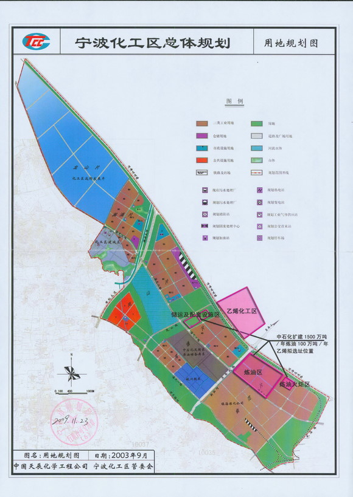
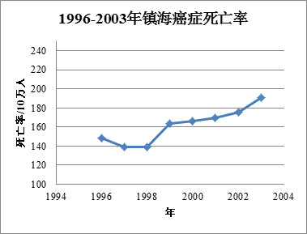

<!-- # ＜天枢＞我所知道的，关于镇海，关于PX -->

**作者写在前面的话：本文的目的是针对PX无毒的事实给出为什么PX会在宁波镇海这样的发达地区造成如此大规模的恐慌和群体事件的本土性解释，并不对PX本身的生化性质及其经济价值乃至整个“一体化”项目的功过进行评判。**

# 我所知道的，关于镇海，关于PX

## 文/匿名

好久没有写日志了，憋不住吐一吐我所知道的一些事情。我首先是一个人，其次是一个中国宁波镇海人，最后才是和镇海炼化有那么些关系的人，因而也像大部分人那样反对“一体化”项目落地。但观这两日不论是微博，还是人人，总似乎有一种情绪化的趋势，因而觉得有必要就我所知，聊一聊相关的过去。毕竟，历史的存在是为了避免将来犯同样的错误，以及过去的错误不能够用将错就错来弥补。

之前有人已经写过一些对镇海老城的印象了，其实想必每一个到过镇海的人都对镇海老城的平静和安定有深刻的印象，在此就不叙了。对于PX的种种辟谣和反辟谣此处也不论，本文主要聊一聊我所知道的镇海和化工。其实，半年前，我已经想到今天可能会发生的一些事情。也许不光是我，许多镇海的居民都会有类似的想法。这样的事情，总有一天会爆发，会让每个人都身处其中，难以自拔。

由于本人出生在镇海炼化，也就是此次风暴的中心，爷爷奶奶居住于镇海老城，自己又在镇海中学和旁边的港务新村度过几乎整个高中三年的时光，所以观点尽量保持平正。另外，除了一些为解释事情来龙去脉而不得不涉及到的传言（很有可能是真实情形，文中用灰色标注，请谨慎引用），其余均为事实。

#### 镇海炼化与镇海：不得不说的故事

其实，在20多年前，炼化和镇海之间的关系，是相当和谐的，这在现在看来，似乎不可思议，但这确实是事实。

炼化的落地在当时看来几乎是一种福利。镇海，乃至整个宁波地区，在上世纪70年代以前，重工业基础可以用空白来形容，主要原因来源于当时的国防观念。国家层面上的这一观念从70年代中期开始改变，也就是从那个时期开始，镇海港区、镇海炼化相继建设。1977年恢复高考后几年，镇海的高考落榜生中比较优秀的那部分，也大都分配入港务局和镇海炼化。当时镇海炼化职工因待遇高，福利好而著称，甚至在省城杭州的公交车上，身穿镇海炼化的工作服都会令人羡慕。目前镇海炼化的管理水平和中高层的素质，大都由那批人来奠定。另一方面，外来的规范化企业管理方法，也由炼化带给了本地的民营企业。

但这也并不是说一切都将这样和谐下去。一方面，镇海炼化无论如何都是一个重化工企业，污染的问题一直存在，各种怪病的问题在经过一段时间的积累之后纷纷出现，再加之民营经济的发展，相当一部分镇海炼化员工在对比中产生了一些失落感，因而总是希望自己的下一代能够走出去，不要再回到这里来。但总体而言，这段时间，炼化和镇海的关系，基本相安无事。

只是，镇海的经济指标，就此与化工难脱干系。

#### 镇海的化工之怨

镇海炼化最初的选址是缺乏周全的考虑的，位于镇海老城的上风向，因而能够直接影响镇海老城区的环境。使情况更加复杂的是，由于镇海炼化的存在，宁波市有关规划部门在洪镇铁路以北，现在属于蛟川街道和澥浦镇东部的区域建立宁波化工区，即今天的宁波石化经济技术开发区，引进了以韩国LG为代表的大批中小化工企业。相比较镇海炼化，这些企业使得镇海的环境遭到了进一步的破坏，并在2002年造成一次中等规模的散步事件，具体记录可见官方发布的《镇海区2002年大事记》[1]。2009年，镇海炼化新建的乙烯厂区比其他厂区更加接近老城区，这也使得老城区居民开始“切身”体会到厂区刚开始生产之时所带来的巨大噪音。

（图1 宁波化工区规划，其中舟山跨海大桥（箭头方向）为蛟川街道/澥浦镇分界线，最北端蓝色部分为现状慈东工业区，属慈溪市，镇海炼化及其家属区和附近村庄位于蛟川街道棕色部分，大图可在[这里](http://rrurl.cn/51tm6m)下载）

其他一系列化工企业的事故也使得镇海人对于化工心存警惕。2004年，甬江南岸北仑区的浙江善高发生火灾并引发爆炸，危及附近一液氯储罐，幸而处置及时，否则整个宁波中心城区都将面临灭顶之灾，CCTV《东方时空》当时对此事件也有报道[2]。当时，爆炸的巨大声响整个镇海老城都能够听的一清二楚。2007年9月，位于化工区的LG甬兴化工厂发生400吨丙烯腈泄漏[3]，最终的处置情况官方报道语焉不详[4]，但坊间议论纷纷，传言不断。至于化工区和江对岸北仑小港夜间时常偷排的废气，几乎已成为居民生活的家常便饭。

另一个重要的原因则来自身边的人。镇海的癌症死亡率近年来显著上升，以下两图数据来源分别为镇海疾控中心发表的两篇论文[5][6]，2003年和2007年间存在的Gap暂无法解释，也许是由于医疗水平提高和防病意识加强，也有可能是统计方法的差异[7]，但都显示出显著的增长的趋势，且此比率高出全国平均水平。当然，超出的原因也可被解释为宁波人历来喜食腌制食品，盐摄入量较高，然而，作为一个镇海人，近年来时常耳闻身边有人因患癌症去世，想必已成为一个共同的经历。

（图2 1996-2003年镇海癌症死亡率 [5]）

（图3 2007-2009年镇海癌症死亡率 [6]）

#### 关于“一体化”项目和PX

接下来就将涉及到本文的核心问题，亦即这些天来最受关注的炼油一体化扩建工程。这项工程的推动者为中石化和浙江省政府[8]，初步规划早已做出（图1，来源网址时间为2009年，在某市长来宁波任职之前），主要的内容为在现有2300万吨/年炼油和100万吨/年乙烯产量的基础上，再新建1500万吨/年炼油和120万吨/年乙烯产量并将原炼油能力优化到2600万吨，具体项目构成基本和镇海炼化现有的规模接近[8]，其中包含100万吨/年PX产量，和2002年投产的45万吨/年PX产量相加，总产量达到145万吨。

由于规模接近翻番，该项目的环境影响必然是各方关注的重中之重。选址（参见图1粉色部分）位于镇海老城区的上风向，因而其排放废弃将直接影响镇海老城区的环境。传言在项目确定之初，由于对环境影响估计不足导致整个项目被否，后来为了通过审批，不得不增加了防护林这一环保项目。但由于防护林带规划范围较大，需要拆迁数个村庄乃至既有的居民区，因而产生了矛盾，这也成为本次事件的导火索。

#### 一点个人看法

首先是针对这一项目本身。PX的毒性确实在最近的种种事件中被夸大，使得类似的项目草木皆兵，这一现象，恐怕还将持续相当长的一段时间。但是，不要忘了，这个“一体化”项目本身仅仅是石化产业链的一端，而其余的相当一部分则由化工区内部大大小小的厂家来承担。乙烯除了镇海炼化自行生产聚乙烯之外，也会提供给类似LG甬兴之类的工厂进一步生产ABS等化工原料。因而，随着炼油和乙烯生产规模的扩大，有理由相信，下游厂商的数量和规模也会发生增长，因此，无论PX的事实如何，居民对于该项目对环境影响的质疑，都有其合理性，我本人对该项目也持反对态度。至于传说中某公司的鸵鸟行为，本人表示不齿。想让别人理性，请先公布证据，就像本文一样，这是现代文明社会起码的规范。当然，反对的一方也应当有充分的准备，毕竟谁主张，谁举证，对于没有充分证据和可靠材料支撑的论点表示反对，这是每个人的自由，他人无权干涉。并且，如果因为这次事件砍掉的仅仅是一个PX而不是包括乙烯扩建在内的整个“一体化”项目的话，付出如此大的代价，消耗全世界的关注，所获得的收效并不显著，这也是我短期内最为担心的事情。

其次是梳理一下本次事件发生的来龙去脉。这一事件的浅层激化轨迹为湾塘村拆迁事件（10月22日—10月25日）->因PX而导致镇海老城响应（10月25日—26日）->进一步发酵（10月27日），但深层原因则为镇海老城环境问题多年得不到有效解决。不管是拆迁问题，还是PX的种种传言，乃至这个项目到底是不是PX，不过是起了推波助澜的作用，因而不论证实或者证伪，都无助于事态的解决。镇海老城由于地理位置和历史原因，无论“一体化”项目是否上马，可以预见仍将长期处于严峻的环境形势之中，居民想要获取优良的环境，仍然需要长期不懈的努力。至于政府，也许还将面临类似问题的考验和质疑。

这样的结论看似悲观，却也只能视为一种既成事实。环境意识的提高毕竟需要一个过程，对于改革开放之初的镇海，乃至整个中国，甚至于当时的世界其他地方，作出那样高的要求无异于天方夜谭。而后民众的环境权利意识，也不得不在病痛和不安中一步步提升。历史无法改变，只能寄望将来，不要用将错就错去消除错误；在其他地区，不要再走这种先无视环境，再自食恶果的道路。

幸而，民众的环境意识有了飞速的提高，尽管这样的提高，一次又一次伴随着种种让人揪心的事实。

谨祝故乡平和，安好，海定，波宁。

初稿完成于2012年10月28日清晨

更新于2012年10月28日傍晚

### 【参考资料】

[1] [镇海区2002年大事记](http://rrurl.cn/hSAclg). 镇海区档案局. 2007-10-10, 查阅于2012-10-26. [2] 陈国良, 生死之搏四小时, 《水上消防》2004年第5期, pp: 4-6. [3] [水污染治理先进技术汇编](http://rrurl.cn/jzAyqk)

(Word 文档). 中华人民共和国科学技术部. 2011.8, pp: 167-168, 查阅于 2012-10-26. [4] [镇海妥善处置一起化学品泄漏事故](http://rrurl.cn/sPhsjT). 宁波日报. 2007-10-09, 查阅于 2012-10-26. [5] 胡依红等, 宁波市镇海区1996-2003年居民恶性肿瘤死亡原因分析, 《中国预防医学杂志》, 2005年4月第6卷第2期, pp: 123-124. [6] 杨庆伟等, 2007-2009年镇海区恶性肿瘤死亡情况与减寿分析, 《中国农村卫生事业管理》, 2011年3月第31卷第3期, pp: 278-279. [7] 杨庆伟等, 2009年镇海区恶性肿瘤发病情况分析, 《中国公共卫生管理》, 2010年第26卷第6期, pp: 629-630. [8] [（国家级）1500万吨年炼油和100万吨年乙烯扩建项目建设项目选址](http://rrurl.cn/51tm6m), 浙江省建设厅网站, 查阅于 2012-10-26.

### 版权声明

本文以 CC-BY-NC-ND 3.0 Unported（署名-非商业使用-禁止演绎）协议发布，这意味着你可以在保留署名和非商业使用的前提下重新发布本文而不需要支付版权费用，但不允许任何修改。

### 文后

欣闻方才宁波市政府已经在“一体化”项目中取消PX项目，应当肯定。但正如上面所说，乙烯扩建在内的整个“一体化”项目大部分仍然在被“科学论证”，因而其后续的环境影响仍然有待观察。另外，镇海老城的生态环境并不因为一个PX的取消而得到改善，这仍需要从上到下的重视和努力。当然，我希望这种努力是和平而持续的，而不是暴力和激进的。无论如何，祝福镇海老城，也祝福所有认真为之理性地付出和努力的人。

（责编：马特）
