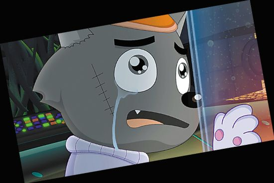

<!-- # 斜看电影审查制度 -->

前阵子美国电影《Innocence of Muslims 》引起中东穆斯林的强烈反感，引发穆斯林抗议并最终引发暴力事件，导致美国驻利比亚大使声身亡。这部默默无名的影片因为这一系列事件而名闻天下，整个白宫都被它搞得焦头烂额。不过这种情况在我国是绝不可能发生的，因为我们广电总局的中国电影审查标准明令禁止“可能引起国际、民族、宗教纠纷的情节

”的影片。而最近电影导演娄烨也将其新片《浮城谜事》的整个审查过程在网上公布，一时间引起无数热议，电影审查制度到底是个什么玩意儿呢？

客观地说电影审查在全世界都是存在的，只是审查的主体和表现形式不一样而已。美国是全世界言论最为自由的地方，就算《Innocence of Muslims》惹出了天大的麻烦，它的拍摄者也不用为此承担任何法律责任。但是在美国审查却依然是存在的，他们的审查表现为分级限制和自我审查。纯粹的审查是违背美国宪法的，但是分级制度却可以在不违背宪法的前提下限制一部影片的制作和发行。假如一部电影因为过于血腥暴力的场面和情色场面被MPAA定为NC17级，这就意味着17岁以下的观众无法观看该片，电影尚未上映就流失掉一大批观众；观众群的流失必然影响上座率，进而影响影院的排片量，故影片的发行范围也会缩小；而发行的缩小必然导致票房收入的减少，这是电影公司的老板们不愿意看到的景象。接着就出现了电影拍摄过程中的自我审查。假如一部电影可以拍成PG13（可能包括不适合13岁以下儿童观看的内容

），干嘛要拍成R级(17岁以下必须由家长或成年监护人陪同

)？当年电影《珍珠港》因为战争场面过于血腥险些被定为R级，后经过制片方对战争场面的重新剪辑处理，最终电影还是被定为PG13级，这就意味着电影可以赢得更多17岁以下的观众，但电影确实是以牺牲其战争戏的艺术性为代价的。随着近年美国电影观众的日益年轻化，好莱坞更喜欢制作一些合家欢似的电影，这样就可以把一家大小全部吸引进电影院；而且各种电影周边产品的消费主力军也是年纪相对轻的观众，我们很难想象一个穿着西装的中年男子，对着绿巨人玩具大呼小叫。好莱坞的自我审查也越来越严重，以至于近年NC17的电影几乎要绝迹了。除了暴力、情色、粗口等内容，是否政治正确也是好莱坞自我审查的一部分。美国是一个移民国家，因而种族问题就变成这个国家最敏感的政治话题，也是好莱坞最关切的问题。格里菲斯的《一个国家的诞生》是影史上划时代的作品，很多人都认为是这部电影将他从街头马戏带入艺术的殿堂，但是这部戏对于3K党的美化描写却遭到大面积的抗议和抵制，乃至在一些地区被禁。经历了1960年代的民权运动后，种族主义更是成为了过街老鼠，绝对是上不了台面的。好莱坞也形成了一套种族搭配模式，比方说警匪片的拍档通常会有一个有色人种（《致命武器》系列、《48小时》系列），不守纪律的白人神探通常会有一个成天教训他的黑人上司，华人一般担任警局的文职和技术支持一类活。假如是以某个族群的犯罪问题为背景的话，那么肯定会安排一个该族群的演员出演主要正面角色。相对来说对现任领导人和国家政策提出批评和讽刺就显得容易多了，奥巴马的竞选口号已经被调侃了无数次，布什总统还没下台奥利佛斯通就开始鼓捣《布什传》，迈克摩尔更是在2004年弄了一部《华氏911》直接叫板布什政府。但是批评和讽刺也得有个度，如果得罪了现任领导人或者现行政策的支持者那就意味着又要流失一部分观众。当然也有专门为反对现任领导人的群体拍摄的电影，就像《华氏911》。当然好莱坞和华盛顿的关系也不都是批评和讽刺，也有如胶似漆的时候。好莱坞拍戏的时候经常要用到各种飞机、航母、军事基地什么的，而军方也偶尔需要好莱坞替他们宣传形象，这其中最极端的例子就是托尼斯科特导演的《壮志凌云》，影片拍摄得到军方大力支持，而最终的电影业很像一出征兵广告，到后来斯科特拍摄军方不太那么正面的片子的时候，军方也没那么爽快了。受益于宽广的发行渠道，在好莱坞主流作品的自我审查越来越严重，但是各种主打特定市场的电影依然有广阔的空间：低成本的血腥恐怖片还能大行其道，直接发行DVD的动作片，每年可以卖到数十亿美元，美国的色情片制作业也是红红火火。前面我们提到的MPAA是一个非政府的行业协会组织，也就是说在美国政府几乎无法插手电影的制作和发行，一切的检查都是依靠行业和闯作者的自律，对行业的从业人员的压力基本都来自市场。这也就是美国政府拿《Innocence of Muslims》一点办法都没有的原因。当然也有个别极端的例外情况。在周星驰的《国产零零漆》中，曾经出现过一部美国色情片《春潮烂漫海棠红》，这部电影的女主角Traci Lords因为在拍摄本片时尚未成年，最终政府以本片有未成年人参加色情演出为由禁掉了该片，不允许任何人发行和持有该片。

像美国这种完全依靠行业自律和市场压力的电影审查模式虽然也存在很多问题，并且也时不时闹个笑话，但还是在大多数现代化国家得到采纳。除此之外还有另外一种模式，那就是完全以政府为主导的一种审查模式，就像中国这样。中国电影早在民国时期就存在电影审查制度，但是当时的审查制度并没能像今天这样深刻影响到中国电影，1947年电影《一江春水向东流》因为批评国民党在重庆大后方的腐败几乎被禁，但是导演郑君里行贿了负责了电影审查的官员，最终电影得以顺利上映。共产党和国民党不同，共产党一直十分重视电影，把电影当做一个最重要的宣传手段，是党意识形态的重要领域。因此对于电影制作发行审查的权力一直牢牢的控制在手里，新中国第一部被禁的电影是《武训传》，这部电影讲述的山东武训行乞办学的故事，为了迎合新中国的政治氛围，电影中加进了一段宣扬共产党意识形态的戏，这部戏最开始是得到周恩来的肯定的，但是片中武训质疑暴力革命的戏依然惹恼了毛泽东，之后毛发动了一场对于该片的大批判运动，这部电影一时间成为整个中国文化政治运动的中心，这是之前任何中国电影都没能“享受”的待遇。《武训传》的遭遇完全属于躺着中枪，在此之后的很多年中国电影一直都必须紧跟着党的路线走，最终完全沦为党宣传的工具。1956年4月28日，毛泽东在中共中央政治局扩大会议上提出：“艺术问题上的百花齐放，学术问题上的百家争鸣，我看应该成为我们的方针。”电影工作者受到毛泽东讲话精神的影响，拍摄了不少反映他们内心真实想法的电影，比方说吕班拍摄的讽刺官僚主义和铺张浪费的《新局长到来之前》《未完成的喜剧》。但是这场双百运动很快演变成一场恐怖的反右运动，导演石挥因为在电影《雾海夜航许》中刻画了不是伟光正的干部形象，被打成右派，受到迫害，最终自杀身亡。和石挥有类似遭遇的电影人还有很多。电影人刚刚想表达一点自己的想法，立刻又被一棍子打死，彻底回到党意识形态宣传工作者上来了。但是有审查就会有反抗，哪怕是跪着造反。1958年严寄洲和郝光拍摄的《英雄虎胆》加进了女特务阿兰和解放军侦察科长的感情戏，并加进了一段二人跳舞的镜头，为当时无数群众所默默喜爱，但是江青同志却认为该片“美化特务阿兰，

跳摇摆舞一场是资产阶级生活大展览，歪曲了侦察部队形象，雷参谋化装后，比敌人还象敌人。剿匪不靠发动群众，只靠派进去，与《林海雪原》都是学苏联的。”其实那一时期的中国电影审查根本没有任何具体的标准而言，完全由政治风气和领导人的喜好而定，电影和电影人的命运也像小孩子的脸苦笑不定，就像毛主席的亲密战友过几天也可能变成内奸、工贼、叛徒。文化大革命爆发之后，中国电影几乎全面停产，整个10年拍摄的完全是按照江青的“三突出”原则拍摄的为政治服务的电影。而同一时期同为社会主义国家的苏联由于赫鲁晓夫文艺政策的影响出现了大量像《雁南飞》《第四十一》这样的佳作，甚至诞生如塔可夫斯基这样的大师。

文革结束后，整个社会出现了一股反思文革的潮流，党也适当地放宽了文艺政策。一时间出现了不少反思文革、制度、人性、社会问题的影片。吴永刚的《巴山夜雨》、谢晋的《天云山传奇》《芙蓉镇》，杨延晋的《苦恼人的笑》《小街》都对文革作出了反思，郑同天的《邻居》反映了文革之后大学教员的住房问题以及当时社会的腐败作风，由郑义编剧的《枫》反映了文革中武斗的情形，很多年后被人称为中国的《大逃杀》……但是很快就有一部电影触及到了党审查的底线，长春电影制片厂拍摄完成了1980年的电影《太阳和人》。这部电影尖锐地提出了“您爱这个国家，苦苦地恋着这个国家……可这个国家爱您吗？”

这样的问题，并引发了一场长达两年的争论，甚至将当时最高层的邓小平和胡耀邦也卷了进去，最终这部电影被禁，后来台湾方面出于特殊的政治目的在台湾拍摄了该片，并使用了剧本作者白桦原著的名字《苦恋》。1980年代，中国社会风气、经济和政治初步开放，观众也能接触到欧美、日本、港台的电影，相较国产电影，这些电影更具吸引力。各大国营制片厂也开始根据观众的需求拍摄一些商业电影，于是银幕上出现了喜剧、武打、犯罪、惊悚，乃至裸露镜头。80年代末的电影《寡妇村》上映时打上“儿童不宜”的字样，这或许是中国大陆电影分级意识的开始。整个八十年代是中华人民共和国历史上电影审查最为宽松的年代，中国第五代导演也在那样一个环境下横空出世。时至今日还有人为周晓文的《最后的疯狂》叫好，不是因为电影本身，而是因为他是一部国产片。有朋友看完谢飞的《本命年》后兴奋不已，大呼这样的电影，现在根本无法通过审查，当年还能得金鸡百花奖。进入20世纪90年代，电影审查收紧，以至于这一时期最令人兴奋的国产片基本都是禁片，张艺谋信心满满地派出了他最为观众认可的《活着》出人意料的被禁；陈凯歌的《霸王别姬》也被禁，后来因为在戛纳得奖才得以解禁，但是时至今日仍然不能在电视台播出；田壮壮的《蓝风筝》也被禁，第五代最杰出的三位导演接连被禁，而他们的电影被禁的一个重要原因都是因为电影反映了文革。这段80年代可以在电影反思的历史，在90年代成为了禁忌，90年代出现的第六代导演干脆就以地下导演的身份出场。而90年代最后一部可以称为杰作的大陆电影《鬼子来了》同样难免被禁的命运。在这个10年，擅长历史题材的第五代发现历史常常成为禁忌，而关注当下和个体命运的第六代则完全沦为地下。除开地下的和被禁的，整个90年代的国产电影显得异常的平庸。

进入21世纪，中国经济腾飞，电影产业也迅猛发展。然而此时却出现一个吊诡的景象，随着国家的进一步开放和发展，电影审查制度却越来越严厉，电影的艺术品质也在不断下滑。在保守而平庸的90年代我们还能在银幕上看到一些反映人性和社会阴暗面的作品，比方说张艺谋的《菊豆》，就算电影容易被禁，电影人也愿意尝试敏感题材；到了新世纪，这些题材几乎消亡。新世纪以来，过往的主旋律题材越来越少，取而代之的是现代商业片；而国产电影的审查标准也越来越严厉，对于电影内容的限制也越来越多。在这种审查环境下，我们的商业电影也被迫朝着一个吊诡的方向发展。这些年国产警匪题材影片不少，但是我们却看不到一个张丰毅在《龙年警官》里演的桀骜不驯的警察，因为在现在电影里警察不能说的话、不能干的事太多。新的电影审查标准似乎要将国产电影完全引向歌颂生活、歌颂祖国的真善美境地。现实题材禁区多，迫使电影制作者把目光转向古装片，于是一时间戏院里尽是些飞来飞起的古代人；古装片观众看累了，于是又转向民国。电影人失去了关注当下的热情和动力，或许有一天他们还会失去这种能力。拍完了野合、乱伦、通奸的张艺谋居然在知天命的年纪拍起了纯情戏。早在90年代基本就被香港电影人摒弃了的民族主义元素，又被他们重拾，以迎合国内的审查制度。电影《叶问》本来是主要描写国内的门派之争的，但是剧本送审后被要求修改，不能破坏民族团结，最终被改成拳打东洋鬼子，第二部又升级为拳打西洋鬼子。许多讲述特区香港故事的电影为了能在内地上映被迫做出修改，变成殖民地香港的故事，很多事情只能发生在1997之前，于是观众可以轻易的在一部讲述96年故事的电影中找到一部06年才上市的手机，电影《金钱帝国》很魔幻的片头加上了香港97回归之后社会清正廉洁，稍有历史常识的人都知道从上世纪80年代开始香港一直就是全世界最清廉的地区之一。陈嘉上拍摄《画皮》为了通过审查，被迫把女鬼改成了狐狸精，难道在我们的审查官员眼里，女鬼和狐狸精的差别真的有那么大吗？今天的中国电影审查制度已经完全脱离中国社会的现实状况。观众在现实中每天都可以接触到大量暴力犯罪、官员贪腐、不道德男女关系的讯息，但是我们的电影审查却想要完全在电影中杜绝这些东西。有上亿中国人经常烧香拜佛，电影里却不能有神神鬼鬼。他们似乎想用电影为观众塑造一个理想世界，就像少年吴宇森为了逃避周遭恶劣的环境常常躲进电影院，但是都说了是少年吴宇森；我们这个社会的绝大多数都是成年人，三岁小孩哭了你用糖哄他，三十岁老爷们儿骂娘了你还用糖哄他，这是对大家智商的侮辱。

（采编：周拙恒；责编：楼杭丹）
