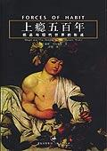
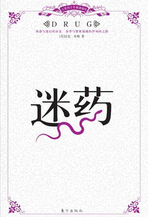
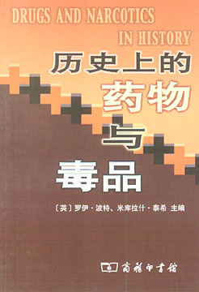
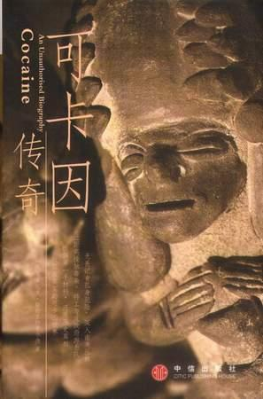
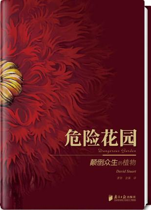
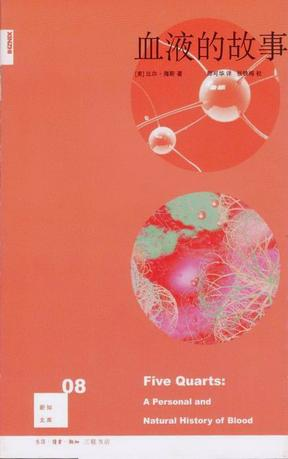

<!-- # 北斗荐书：你好！毒！ -->

问世间毒为何物？

1896 年诺贝尔因心脏病去世，当时硝酸甘油已经普遍用于治疗心脏病，但每个医生都不知道硝酸甘油的药理学原理，这不啻于叫他吃下自己发明的炸药。 1998年的诺贝尔生理医学奖揭开了这个谜底，硝酸甘油在人体内会产生 NO，没错，就是汽车排放的致命有害的尾气。但在人体内，极其微量的一氧化氮是心血管调节血压和血流的信号分子。谁会想到炸药可以救命？

最近几年，另外一种臭名昭著的毒气—— H2S成了被关注的气体，它是继一氧化氮和一氧化碳之后被发现的第3种气体信号分子，在动物体内具有舒张血管、调节血压等多种生理功能，其代谢异常与心脏病和高血压等多种心血管疾病有关。

谁想过毒气可以用于治疗？ [（TED 视频：马克•罗斯：可控的假死状态；《环球科学 2010年度专刊医学健康》“硫化氢：救命的毒气”）](http://v.163.com/movie/2011/7/I/0/M7B9LHCIG_M7BA7A6I0.html)

大自然安排一种毒药之前，已经准备了一种解药，而人类从毒物的被动性适应到主动性改造，展现了一副生机勃勃的人类与环境的互动史，也展示了人类想通过毒药迷药解放自己的深层欲望。

毒物就像一面略带畸形的放大镜，照向人类自身的时候，有时候会失真，不过更多时候，毒物成功的翻阅了了横亘在人类和真理之间那面常识和经验的高墙，的确成为了我们骄傲的解药。

[戴维・考特莱特《上瘾五百年: 瘾品与现代世界的形成》](http://ishare.iask.sina.com.cn/f/11531222.html?from=like)

这本书我以前介绍过，其实这本书严格意义上不是讲毒品的，而是讲能让人成瘾的物质的发展史，包括咖啡、酒、烟草这样的合法瘾品。但是这本书里也介绍了非法瘾品，比如大麻、古柯碱之类的。以及因这些瘾品的大量消费所形成的全球贸易和产生的权力关系。只要能带来金钱的，就能带来权力。

马修.柯林/约翰.高德菲《迷幻异域:快乐丸与青年文化的故事》

这本书如果你看完了，会了解到音乐文化的另一面，它与毒品息息相关。有时候你经常会听说，他是个搞音乐的，还知道他吸毒磕药，看上去很酷对不对？这本书就是告诉你他们为什么会这样。里面有很多故事，音乐与磕药的故事。音乐是一种让听觉产生幻觉的艺术，如果你不产生幻觉，音乐就不成其为艺术。但我们平常都用通俗的话讲叫“审美”，音乐的美学其实多是听觉产生奇异幻想的结果，而药物在这时可以起到诱发奇异幻想的效果。你什么时候看到有人读书、看电视的时候磕药。所以，从生理或心理学角度上讲，药物与音乐天生存在必然联系。

迈克·米勒《迷药》

这本书跟《××的历史》差不多，全彩色，通过讲历史故事的方式，把植物迷幻药发展史串了下来。在过去化学不太发达的情况下，世界各地的人们都想通过植物、矿物种的天然成分达到一种致人迷幻的效果，所以就形成了一种简单的迷幻文化，但由于人们对科学知识的缺乏，这些东西的危害到底有多大，当时人们的认识还不清楚。书的内容说得不太深，属于快速阅读物品，供知道分子们增加知识用的。所以，没事翻翻看倒也无妨。

[ 艾里克·施洛瑟《大麻的疯狂》](http://ishare.iask.sina.com.cn/f/17170082.html?from=like)

这本书名字叫《大麻的疯狂》，其实关于大麻的内容只占很小一部分，这本书主要写的是美国黑市交易，比如大麻、色情、非法劳动力。这个作者不知道怎么会把这三样东西拉在一起，大概是在美国很典型吧。其实这本书有相当一部分内容是“淫秽帝国”，如果叫这个名字的话，肯定会很好卖，当然，新闻出版署也不会通过。

[罗伊/波特/米库拉什/泰西《历史上的药物与毒品》](http://ishare.iask.sina.com.cn/f/22569295.html)

这本书其实跟《上瘾五百年》有点类似，就是把药物和毒品牵扯到的法律、政策以及因此而形成的工业结合在一起讲出来的，还有关于疾病的治疗，看着可能有点枯燥，像论文一样。

[斯特里特费尔德《可卡因传奇》](http://ishare.iask.sina.com.cn/f/11056425.html)

这本书的确写得很传神，在美洲，古柯随处都是，但是，欧洲人去了，把它带回欧洲，提炼出可卡因，然后再弄回美洲，结果就成了灾难。一种毒品和他倡导的政治，所以说可卡因这东西真的很传奇，如果说美洲人天性自由，那么，当可卡因给他们带来更多的自由后，结果会是什么样子呢？就是我们今天看到的样子。

David Stuart《危险花园:颠倒众生的植物》

有一种毒叫情花之毒，大自然造化神奇，有毒的花多半都很美丽（没有毒的花也一样），让人看上去就很有拥抱的欲望。这本书每个故事篇幅都不长，读起来不会清水白菜般无味。纸张装帧、文字配都比较不错，不属于重口味的整蛊之毒，最好让她在你的书房里慢慢散发，有情、有花、有毒，美人赠我蒙汗药就是这三大要素。

约翰·埃姆斯利《致命元素:毒药的历史》

重金属中毒确实枯燥无味，作者讲故事的水平实在不高。当字典查阅一下倒是凑合。联想到1995 年5月清华大学、朱令铊中毒事件，因为互联网干预，一条生命从医生手里被争夺回来，医学、法律问题我们先搁置一旁，真正逆转朱令中毒的解药出人意料，就是“普鲁士蓝”，真叫人感叹：问世间毒为何物，一物降一物。

[比尔·海斯《血液的故事》](http://ishare.iask.sina.com.cn/f/21183326.html?from=like)

无论神经毒素还是血液毒素，最先品尝到滋味的，就是血液。内分泌各种激素、神经递质、还有外来毒物，他们会首先在血液里相遇。不过本书书看标题和目录很吸引人，翻起来索然无味。最好还是叫医学院上进好学又八卦的学生读了给你讲。

（采编：黎昱杉

；责编：陈芝）
