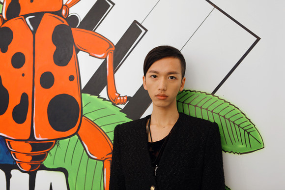

<!-- # ＜七星人物＞第十九期：南方小镇少年——瓢虫君专访“不一样的”覃仙球 -->

<!-- # 南方小镇少年 -->

<!-- #  ——瓢虫君专访“不一样的”覃仙球 -->

翻开《云爆弹》第四期，有一张他的照片。温柔的脸庞，年轻的眼神，皮肤闪耀着光芒。他消瘦，脸颊并不饱满，眼神迥然，不丰满的嘴唇异常性感，用一种柔软的语调向我们讲述着自己。他带我们走进南方小镇生活，田野乡村的味道，少年爱情的湿润，以及绵软浓郁的悲伤；他向我们展开他不算漫长却精彩异常的人生，而这一切看上去都和网络上那个嚣张跋扈的他截然不同。

他是覃仙球。因话题禁忌，词汇热辣而为人知，然而他所拥有的不仅仅是“言无禁忌”的勇气，才华才是他发声的底气所在。这个名字第一次出现在网络上，还是在他读大学的时候。因为一次失败的感情，他将写作当成了自己的发泄口。而让他没有想到的是，这篇小说在发布当天就登上了新浪博客的首页，访问量高达十几万。

几个月前，他自费出版小说《占卜术》，这本书因为涉及未成年人的情色描写而被多家出版社拒绝，但他不愿为了出版而任由他人将自己的小说改得面目全非，最终他仍然选择了自费出书，并且书的销量好出他的预期。那本书的封面是奶绿色，夏天的绿加上一点香甜的奶，构成了一个女孩的故事。他说，这是一个关于回忆的故事，饱含着自己的青葱岁月和繁华光年，拥有梦想和疼痛，还有现实的玻璃碎片。

他只是认为，想做的事情一定要去做，这是人类很纯粹很本能的欲望。就如同文字于他，他把写小说当作一种爱好而非谋生的手段，心爱之物总是希望极尽纯粹，容不得一丝杂质。

“仙球”两字带着沙漠般的荒芜，闪烁变幻的现代性，热浪下的虚无，疯狂中的速度，可大可小，可以揉碎，也可以拼凑，就像他自己，很自然它们成为了他文字的代表。他上大学，学做衣服，玩音乐，北漂，去曼谷当老师，目睹了红衫军暴动，和吴虹飞学习写作，出师后用文字实现人生。对于大多数人来说，这样的生活精彩纷呈。然而当被问到是否对此满意时他说，“人很少会对自己的生活满意吧”，他不断渴望新鲜和能量，不堪忍受千篇一律和按部就班，愿意为所要的人生支付他最高昂的代价。落脚到现实，他希望能够用自己的钱养活自己，有还算舒服的房子住，有干净的衣服穿，这些就足够了。如果可能，他依然希望有一天能去一个更加自由的地方，比如瑞士，有着很好的自然和社会环境，更重要的是，他希望自己能够单凭艺术便能够生活下去。

在这个理想主义难以存活的年代，还有人这样活着。对于生活，他推崇率性而为，顺其自然。对于喜欢他的人，他能感知到他们的善意；而对于不喜欢他的人，他也能够做到不去过多地在意。“我不依赖别人对我的看法活下去。”在采访的最后，他这样对记者说。

**一、他眼中的自己Q:你的姓“覃”是念qin还是tan呢？你为什么要给自己取一个这样的名字呢？我注意到你有用过覃宪秋这个名字，这是你的本名吗？取名仙球仅仅取了谐音还是有什么别致的含义呢？** A:覃这个姓，我查过一共有五个读音。覃（qin）是在两广和湖南通用的读音，而覃（Tan）是北方和河南一小部分人的读音。取这个名字纯粹是谐音，因为我的本名叫覃宪秋。但是我觉得这个名字听上去很老气，好像民国时期革命烈士。另外我又很喜欢那种魔幻性质的东西，我觉得仙球会更贴合我写东西的风格。

**Q：你认为自己是一个怯懦的人吗？** A：我以前很怯懦，就是那种基本上别人可以随便捏我，排挤我，欺负我，也不会拒绝人。但现在慢慢的可能就会越来越远离那种状况了。如果你一直以这种状态活在社会中的话，最后就会是一个悲剧，一个失败者。我不能容忍自己以一个失败者或者悲剧的形象活着，因为我很好面子，我就想要自己一定要活得体面。这样你势必对自己的性格做出一些牺牲，或者对社会做出一些妥协。

**Q:阿飞帮你写的序，以及写的《关于小球》中描述的你，你认为准确吗？** A:八九不离十吧。毕竟我们认识也四五年了，虽然我并不太表达自己，但她也能够从我的交流和文字中发现我的双重性格。我平时在和人交流的时候表现出来的是一种很温和的方式，只有写作的时候是很张牙舞爪的。

**Q:那是什么造成你的双重性格呢？** A:应该所有的性格都能归结到童年和青春期。我本身是一个挺胆怯的人，一直到上中学仍然是这样。但是我看的书、接触到的东西都比我的同龄人要激烈很多。生活中，一方面别人不了解我，但另一方面他们又对我很好奇。记得在初中的时候，小男生开始进入叛逆期，他们便开始因为我的长相，我的性取向（那个时候我已经不太掩饰我喜欢男生了）等等排挤我。我的胆怯令我无法发泄，情绪的持续积压，我便开始写东西，将愤怒等激烈的情绪释放在文字中。

**Q:你觉得在人人网上很多人喜欢你，或者关注你的原因是什么呢？那些非议你的人又是为什么呢？** A:他们黑我也是因为我自身的原因吧。因为我这个人很冲动，愤怒的时候会口不择言。其实一开始我是很受欢迎的。通常是这样，一群人在刚接触的时候，都会努力展现出善意的一面。然后接触久了，就会流露出不好的一面。很多人看到我在网上口无遮拦地说很多大尺度话题，他们觉得和我开这样的玩笑，也算是一种互动。我又是一个很容易把别人的玩笑话当真的人。我说那些话不是在开玩笑，我真的就是那么想的。每每当我当真了以后又说是开玩笑的，我便会很愤怒，负面情绪就会倾泻出来，伤害到很多人。我觉得这是个双方都有原因的过程。

**Q:你在口舌之战中通过纯粹的文字游戏去抨击现实，你觉得对缓解你认为糟糕的现状有什么作用？你有没有想过在现实生活中通过其他手段来改变现状，或者让人和人的关系更和谐一些？** A:我文字里面表现的是一个状态，在现实生活中给人的感觉还是挺有正能量的吧。改变现状还是从自己身上做起吧，包括对人和人之间关系的失望、悲观，是因为确实很多人交往的时候是互相带有敌意，或者说互相没有善意的。我想如果我带着善意去跟别人交往的话，别人感受到我的善意，他肯定也不会对我有敌意。

**Q:你有没有想过某一天不在网上写小说了，就像普通人一样，过很平凡很平凡的生活？** A:那样的生活我一定忍受不了，我一直在努力避免那种生活。我可以不写小说，但是我不能过那样的生活。如果真的要求我每天上班啊，我宁愿放弃那样的生活。与其那样的话，可能我会选择很贫穷、很潦倒的生活。

**二、审美与性爱Q:你理想中的对象是怎样的呢？** A:说实话，朋友们觉得我的审美糟糕透了。我喜欢的人常常是庸俗、粗壮、木讷、乏味的，可能是因为互补吧。我是一个常常有新想法、在两个人交流中常常有很多废话的人，如果两个人都是这样的吧，就会出现争锋的感觉；如果别人一直对我说话，我常常会进入放空的状态。所以我喜欢的相处模式是，两个人在一起，他的话很少，但是对我有求必应，这么说起来，我有点控制狂的味道。

**Q:所以你理想中的情人其实是一个能够很好地倾听你说话的人。** A:对，我需要一个平庸的好人。

**Q:在你眼中，性爱在爱情中的地位是怎样的呢？** A:这个问题我想过很久。最初的时候，我和我喜欢的男生在一起是并没有性的。只是一些挺幼稚的调情，以及一些肌肤之亲，包括牵手，趁别人不注意亲我一下之类的，我也会觉得特别甜蜜。我们之间并没有性，也完全不知道如何用性去完善两个人之间的关系。

后来我觉得性和爱情是可以分开的。我上高中时候的第一次性经验，其实是和一个我有些厌恶的男生发生的。然而我发现，即便我那么厌恶他，但是和他发生性关系似乎也不是件那么难以接受的事情。所以我的看法是，和爱的人不做爱、和不爱的人做爱，其实都是可以接受的事情。两者结合起来，和爱的人做爱，我觉得应该会很美妙吧，但是我至今还没有尝试过。

**Q:你对将性爱写入文章是怎么考虑的呢？因为这本身就是对世俗道德的一种挑战。** A:我一开始写东西，都是无意识的。想到什么写什么，所以我的文章常常呈现出流水账的趋势。很多都是写回忆的，那面会写一些以前有过的性关系。但是写性关系如何才能避免它写出来显得庸俗和肮脏呢？这也是我所需要思考的问题。有些东西你遮遮掩掩反而会让人觉得猥琐，那何不干脆掀开这块遮羞布。我认为，我写作时候所带有的情感，和写出来的东西带给别人的情感，其实是一致的。

**三、他的文字Q：对你影响比较大的文字工作者都有谁？** A：我写小说的风格变化还是挺大的。张爱玲影响我很大，《乌托邦之死》便是个例子。她的文风基本上已经很冷了，一潭死水的那种感觉，但下边就有很多起伏的东西。我文字的画面感是受到马尔克斯的影响，我思维的跳脱或者幽默感是受到王小波的影响。另外，阿飞对我影响也很大。她教我写作的时候怎样克制自己的情绪，因为克制地写比放着写可能更有打动人的效果。你不能让自己的情绪露出蛛丝马迹，只让读者闻到那一小点，足以让他们发挥想象力就行，这样就可以打动他们。

**Q:关于你写的《乌托邦之死》，我想知道你心中的乌托邦是什么样子的？** A:这个小说中出现了很多公共事件，可以说是这个社会当下的历史。我用乌托邦作为题目，有两层含义。一个含义是小说的主角摒弃一切去爱一个男人，基本上现实生活中的肮脏和丑恶都给摒弃了，只沉浸在自己甜蜜却又无望的幻想世界里面。另一个含义是现实的映射，共产主义的建立给人一种乌托邦的假象。这个小说讲的是主人公对爱情的乌托邦的幻想，以及现实乌托邦的假象一起崩坏。

**Q:你理想中的乌托邦-现实生活是怎样的？** A：举个存在例子，比如日本和北欧，他们差别很大，但是有很多共同之处。他们的年轻人可以真正专注于自己喜欢的事情，但是又不会饿死。、

**Q:关于你的新书《占卜术》，怎么想到用这个名字的？** A:这其实是我14岁时候起的一个名字。当时很喜欢怪力乱神的名字，觉得这个名字听上去挺吸引人的。另一方面，我在小说结尾提到过，生活本身无法预知，你通过占卜术可能会预知到一些东西。但是即便是预知了，生活和命运可能也并不会有多大的变化。

**Q:那你本身是如何看待预测未来、算命等事情的呢？** A:我不太会去做这样的事情，不是不信，只是当所有的结果都摆在你的面前一目了然的时候，你活着还有什么意思呢。人活着就是靠对未知的渴求，包括会与谁相爱，这需要人们孜孜不倦地去靠近去渴求自己希望达到的理想的状态，这是人活着的最重要的动力。

**四、《占卜术》Q:占卜术主人公是一个女生，是否说明你内心也是有一个女性角色存在呢？** A:我一开始写作都是以异性恋的视角来写作的。年纪小的时候，我对自己的性别认同有一些障碍，更加希望自己是一个女孩。当时我写的小说都是女性视角。我在大学的时候完成了自己的性别认同，我不需要成为任何一个性别的人，只需要做自己，所以从那以后我的写作是双性视角的。

**Q:一开头，与主人公小绿有过关系的男人一个接一个死去，是想说明小绿命运的悲剧性吗？** A:我写的时候很迷恋“消失”这个话题。我那个时候写的所有小说，最后总有一个人下落不明，不一定是死。我觉得人和人交往，肯定会分开，分开的结果有两种，一种是死，一种是消失。

**Q:整个故事很悲伤，小绿对于男人们的不拒绝不作为的态度，是想要塑造一个什么样的内心？** A:这和我本身很像，说难听一点就是贱。不管什么样的男人对我求欢，我都不会拒绝。这出于一种怜悯，因为我觉得男人在求欢的时候的样子挺可怜的，挺难看的。他们被情欲折磨得失去了体面。我会觉得他们已经那么可怜了，你为什么还要拒绝他们呢？

**Q：如果你是小绿，最后是会选择留在小姑家还是回到镇子里？** A：我自己可能是不会。这个小说改过，改之前就写小绿回到镇子以后为了躲避那个男人的骚扰，在奔跑的时候被一辆车给撞死了，就是很惨烈的结局。后来我想这有点太让人觉得匪夷所思了，就改成了一个让人觉得很无奈，但确实有可能是真的的一个结局，就是说她最后就答应了那个男的的求欢，她整个心态已经是这样了，她从来不拒绝男人。她最后也不会拒绝。

我肯定对生活不会选择那样，我一直都很想逃离小镇生活。你小镇生活就是像书里写的那种，特别琐碎，比如说你家今晚买了几斤肉，左邻右舍都会知道的那种。我很讨厌这种很琐碎很庸俗的生活。虽然对于北京有很多负面的评价，但在大城市最大的好处就是谁也不认识我。我做什么别人都不会真正的在意。哪怕你每天穿着奇装异服上街，可能当时会有很多人对你指指点点，或者用很奇怪的眼神看你，但是他们不在你的现实生活里出现，所以你就觉得这都是很无所谓的事情。但是你想在小镇里面，你哪天穿的很奇怪出去了，然后全镇的人可能在一年之后还会在议论这件事情。

**Q：在《占卜术》里你最喜欢的是那个角色？** A：我最喜欢的可能是小姑。因为她是整个小说里面最像现实生活中的人。我写的小说一直有一个问题，像《乌托邦之死》还有另外一些小说，里边的我或者说主人公永远是面目最模糊的，反倒是她身边的人形象会比较鲜活。

《占卜术》里边的我就是一个很模糊、随便捏的一个小女孩，但是小姑的形象就很鲜活，你一闭眼就知道她是个很泼辣、很厉害、斤斤计较、工于算计、会嫉妒、会跟人怎么样的女性的形象。你会觉得这样的形象是自己生活中每个阶段都会有的一个人，而且我在现实生活中会比较喜欢这种性格的女生。因为我觉得相反，她们还更简单一些，她们不掩饰自己的欲望、自己的需求，她们想要什么就很明确的表达出来，她们不在意自己的肤浅。她们对人可能会有点刁钻，有点刻薄，但她又可能会发自内心的对别人好。

覃仙球人人网址：[http://www.renren.com/242742203/profile](http://www.renren.com/242742203/profile)

（

编辑：金晶、王怡然、孙娜；责编：张正

）
