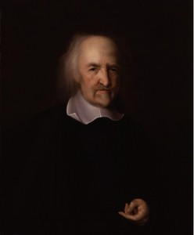

<!-- # 古典社会契约理论与国家 -->

**编者按：提及古典契约理论，大多数读者心中大多有一个相对一致的理解，并将其直接与卢梭联系起来，郭冉的这篇文章分别向大家介绍了霍布斯，洛克与卢梭三人的古典契约理论的产生背景和主要观点，并同国家这个概念联系起来做了横向和纵向两个维度的比较分析，向读者展现了一个内涵丰富，影响深远的社会理论体系。**

# 古典社会契约理论与国家

## 文/郭冉（北京大学）

说到古典契约理论，可能大多数人会有一个很直观的看法，即社会契约的基本含义就是：在自然状态下，缺少一个国家，而国家是由公民的“公意”决定的，每个公民都是这个公意的一部分，并将其内化于自己的价值认同，全体公民通过一致的同一，订立契约，让渡自己的权力于“公意”（引申为主权者-国家），国家则负责保护每一个公民不受灾害、他人的侵袭，国家权力是有边界的，不能侵犯公民的自主和自由，违反契约就等于背叛这个共同体。

这样看当然不错，但也包含了一些误解，比如，这种说法大体上是卢梭的契约观点，而不同的论者则有不同的理论，在别人眼中，社会契约可能就不是这样。在这篇小文中，则主要指霍布斯，洛克的契约理论，当然也包括卢梭，三个论者各有千秋；此外，三者的契约理论也和自然法传统是分不开的，文中也会略有涉及。不过文无完文，一家之言自然说不清形形色色的契约理论，而且作为清一色的舶来品，文中的观点和论述可能也会失之偏颇，有待商榷。

#### 1.霍布斯与恐惧

霍布斯（1588-1679）一生与恐惧并行。出生之年，适逢西班牙无敌舰队进犯英吉利海峡，母亲惊而早产，生下霍布斯；壮盛之年，则遇上议会与国王的战争，举国混乱、国王斩首、克氏专政，继而是斯图亚特王朝复辟；垂垂老矣，则因宗教迫害，禁止言论，寄人篱下客死异乡。终其一生，都贯穿着宗教改革和由之引发的冲突，神圣和世俗的对立难以消弭。

这样说未免有些夸张，但不可否认，这些经历很大程度上形塑着霍布斯的思想形式和学说立场。在十六、七世纪,英国的新兴力量——新贵族和资产阶级在政治生活和思想领域发挥了越来越大的影响，世俗国家、政治自由和放任的市场经济以及五花八门的思想也都在霍布斯的学说中留下了印痕，有的直观，有的隐晦。

当然，要谈霍布斯的学说，就得像教科书一样，不得不从“自然状态”开始。霍氏的“自然状态”散发着一股浓重的阴郁：一切人反对一切人的战争。为什么呢？因为资源是有限的，是稀缺的。人最基本的本能就是生存，生存下来是一切事情的必要条件，这也是人的“自然权利”；为了生存，人可以自私自利，可以不顾道德，只要自己得到满足。自然法是存在的，倡导包容，美德，利他，从软约束层面，自然法可以产生一些调节的效果。但是，这个脆弱的准则又会时时刻刻面临其他的挑战，根本上而言，人与人之间没有信任，剩下的就只有“战争”。霍布斯这个问题的提出，也就是“秩序的建构何以成为可能”，构成了许多学科，许多问题至今在求索的话题，社会学在探讨，国际关系学也以此为学科的基础。（读过《三体》的朋友也会对“黑暗森林”印象深刻，因为刘慈欣也在书中思考这个问题，粗略地说，书中叙事的立场有些类似国际关系中的现实主义流派）

既然人们之间的关系是如此恐怖，那为什么我们的历史中没出现这种情况呢？霍布斯的设问很巧妙：因为有“国家”——利维坦。国家源自所谓的“契约”，它的出现避免社会出现这种残酷的局面。显而易见的是，国家也不是活雷锋一样无偿地为自己的臣民提供各种各样的服务，它的代表——主权者，从民众那里拿过权力，并承诺提供保护。但这只是主权者的一面之词，作为一个具有无上权力的存在，他不受到任何的干预、限制，用一个词来概括，就是“君主专制国家”。

这样看来，霍布斯这个怪老头假设了一个“自然状态”，然后煞有介事地弄一个权力无所不包的君主专制国家出来，似乎是在玩弄概念，其实还是在告诉民众：把权力乖乖的交出来，只有仁慈的君王才会保护你们。

但是，当《利维坦》面世的时候，霍布斯却遭到了巨大的非议：保皇派和议会派都将其作为论敌甚至对他进行迫害，这又是为什么呢？

前面我们提到了，霍布斯生于多事之秋，壮盛之年又适逢英国政治力量的洗牌，冲突不断，新老势力的矛盾交织自然得以在他的学说中显现。16世纪，英国卷入与西班牙的海上争霸，1588年皇家海军与无敌舰队进行了决战，自此，英国的海上霸权确立。17世纪初，青年霍布斯见证了寄希望于神圣权力的君权的增强与新贵族对权力的渴望，二者的矛盾引发了四十年代旷日持久的内战。内战中民众流离失所，社会败坏，霍布斯对自然状态的思考直接来源于内战中的社会状态。的确，混乱的国家需要一个强力的领导人。如何祛除社会中蔓延的恐惧,如何重建信任和秩序?克伦威尔在此应运而生，在他的铁腕统治下，英国恢复了稳定。《利维坦》中，霍布斯把国家应用到他的“机械唯物哲学”中(但霍布斯的本意未必是这样,可能是我误读的)，而不是什么“神授”的产物，这显然得罪了不少人，在宗教观念还根深蒂固的时代，“国家”无疑是神圣的，“君权”无疑是“神授”的。你凭一己之言把国家降低到世俗的层面，还与宗教何干？在还没有完成宗教改革的欧洲，在神权强于世俗权力的当时，这种说法违背了“政治正确”。霍布斯也自然受到了保守派的排挤。但是，在另一方，议会派眼中，霍布斯则成了一个不折不扣的保皇派，因为你的学说是支持专制统治的,主权者不受法律的限制,人民让渡自己全部的权力给政府,但得到的,或许仅仅是政府的对自己的口头承诺。主权在君不在民，不受制约。

但霍布斯的玄机也就在此：他把国家看作是人为的，是一个一个的人用自己的理性和主权者订立契约，虽然他看来,人性是阴冷的,自利的,但这不妨碍人们获得“自己”的身份，上帝不能阻止“人之为人”。

#### 2. 洛克与权力分立

约翰·洛克生于1632年，卒于1702年，是英国经验主义思想的代表之一。也是代议制政府的大力提倡者。相比于霍布斯阴郁的论调，洛克就要显得温情了许多。从时代上来说也是这样。两者出生相差将近半个世纪，理智上来推测，在洛克读大学之后并且开始对自己世界进行思考的时候，英国早已经在克伦威尔的统治之下稳定了下来，复辟之后也没有出现太多的混乱，一切都还保持着基本的平静，所以也就根本不会存在“一切人反对一切人的战争”。

在英国，这是一个相对平和的时代。新贵族们都在筹划着怎么样去增加财富，而民众们呢，也忙着在刚刚形成的市场经济中分得自己一杯羹，没时间去想什么人之间的斗争。亚当·斯密也在忙着分析这些现象，看看经济背后的“规律”是什么样，看看劳动分工怎么样。在洛克的“自然状态”中，人与人之间是和平共处的，人们各司其职，各自保全好自己的财产，这似乎是一个十全十美的状态。即使在新王朝复辟之后，也没阻止这股新的力量的发展。虽然其中出现了一些反“潮流”的论调，比如菲尔麦的《先祖论》等仍然死守君权神授的一些观念，甚至从传说中的亚当来推测统治权力的正当延续。

洛克也对此作出了自己的回应，具体体现就是他的政府二论和宗教宽容。我们可以选择对上帝的信仰，但是对那些不信仰上帝，或者是其他教派的人，则不应进行迫害，他们也有自己的权利去选择。而对于君权神授等论调，在政府论第一部中，他反驳说，君主权力和亚当毫无关系。从表面上来看，这个论证可以看做是他对神权政治和世袭政治的否定，但更深的层面，则反映了当时议会和王权的斗争事实（后来发生光荣革命和汉诺威王朝建立,又经过了很长的时间才最终确立议会的地位）。经历了内战的洗礼，议会势力大大增强，但很显然，没有完全控制住政府，克氏专政和王朝复辟证明了这一点。守旧贵族们仍然没有放弃自己的权力，试图在这个框架中恢复往日的荣耀。对于这一点，洛克的回答十分明确：人们是通过契约结合在一起的，为什么会有契约呢？因为自然状态中，人们虽然是和平共处的，但是也不排除会有一些意外的事情发生，如盗窃等侵犯人们财产的行为，或者战争等大规模的冲突。虽然他看来，自然法除了具有道德上的软约束力之外，仍然具有调节社会的功效。但自然法毕竟不是一部“实体”的法律，为了保证财产的安好，有时不得不采取一些强制性的措施，所以呢，就出现了源于契约的国家。

与社会不同，国家不是既定之物。在这个契约中,人们通过承认或默认的方式，也让渡了自己的一部分权力,交给一个公共的机构“国家”来执行。从这个层面上讲，国家是“设计”出来的。但与霍布斯有很大的不同，就是国家不具备专断的能力，一切都听从民意而不能恣意妄为。并且，他还倡导权力分立，立法权和行政权彼此制衡，而最终的裁判权则由民意来裁决，即某个决定是否对人民有利。国家作为一部设计好的机器而存在，发挥的仅仅是人们希望他发挥的一些功能，因而，并不需要对国家有什么感激之情。对于经济的运行来讲，国家更是要小心翼翼，极端地说，就是扮演好自己的“守夜人”角色，别干预经济，任其自由发展。不得不说，美国的建立就是洛克学说最好的实践。

从长远来看，发展初期的不干预政策确实促进了英国经济的大步前进，正如贝罗奇（Bairoch）所证实的城市人口大幅度增长与经济增长的正向关系，又如诺斯的制度变迁理论中强调的新观念的形成，以及产权制度形成对于长期经济发展和制度变迁的积极作用。这些新的社会力量，也都直接促成了洛克的学说，以及洛克背后相同人群中共识的形成：需要国家，但减少干预。

当然，再往后面的发展就有不同的社会现实和理论流派，社会分化、对立，保守主义，新自由主义等形形色色的主张和立场鱼贯而出，很多论者也对这个议题做出了许多有意义的阐述，在本文中就不赘述了。

#### 3.卢梭契约论的吊诡

卢梭生于1712年，卒于1778年，从时间上来看，他远远晚于洛克和霍布斯的时代，这也暗示出他的学说必定与二者有着明显的不同。他的一生贯穿着法国专制时代的三个代表性的时期：太阳王路易十四，法国王权专制的顶峰，他的统治于1715年结束；法王路易十五，统治延续到1774年，经历了专制王权从鼎盛到逐步下行的过程；接下来是路易十六，在其任上发生了大革命，89-91年斐扬派统治，君主立宪，92年-93年吉伦特派统治，共和政体，并最终由吉伦特派把他送上断头台。虽然大革命没有最终改变法国的专制事实，但无疑，它摧垮了波旁家族在法国的统治，即使有后来的复辟。

在这样的时代背景下，卢梭的思想有一些过人乃至惊人之处也就不足为怪了。象他的《爱弥尔》就深深地影响了康德，他的《论人类起源的不平等及其基础》和《社会契约论》就深深地影响了大革命中的各个派别，甚至远在北美（当然北美独立在思想上并不仅仅受到洛克卢梭等个别人的影响），甚至人们到今天为止，谈到社会契约，直观上也会第一个想起卢梭。

文章开头我也讲到了卢梭契约论中的一些教条化的观点，当然，仅仅这样看是不完整的，很容易对他造成误读。他说：所有人要把自己“全部”权利让渡出来形成“公意”，在公意的基础上产生政府。我们不仅要追问：为什么他会让所有人把“所有”权利都让出来？公意之下的政府到底是一个什么样的政府？这就要从他的自然状态谈起。在他看来，自然状态无疑是一个美好的图景，人与人之间本身就已经产生了相互行为的规范，各司其职各行其是，因而不用担心出现大规模的冲突、战争等极端事件。但既然这样，为什么自然状态会瓦解？因为，在这个社会中，私有制出现了，不平等出现了，财产不平等是第一步，政府、实体法律等的出现就是在制度上确认了这种不平等。在不平等之下，才会出现“主-奴”之间的冲突，一言以蔽之，不平等是导致冲突的根源。

卢梭版社会契约应运而生。他要解决的问题就是不平等和压制。人们把自己全部的权力让渡于“公意”，也就不存在财产等的不平等，这是第一步；公共人格同样是不受限制，不可分割的，这有些类似霍布斯的说法，只是所有人都必须纳入其中。而洛克则希望分割政府的权力，使之不构成对公民社会的威胁；第三就是公共的权威一定要保障所有人的权益，免遭侵害，如果有人作奸犯科，在他看来，就是背叛契约，也就不会在包含于契约中，就会受到处罚。人们服从契约，不过是在服从自己的命令，没有理由去违反。政府是“公意”授权之下产生的，同样仅仅是实现人民利益诉求的工具，不应成为特权和压制工具。具体的形式就是直接民主和共产主义，直接民主中，每个人都可以表达自己的诉求，由公意裁决；而洛克式的代议民主在卢梭看来就是分割了公意，削弱了人民主权，造成一种事实上的不平等。而剥夺所有人的财产，代之以共有财产，在他看来，并非对个人财产权利的侵犯，反而是一种保护，使他们免遭更有势力的人、权贵阶级去侵犯。

看到这里，我们就不难理解为什么卢梭思想具有一些危险的副作用，虽然他的本意并非如此。直接民主如何实现？在一个人口超过几千万的大国中，实行这种制度无异于天方夜谭，即使辅助以联邦制。这种社会实验的危险远不止于此：后来大革命中的种种行为，如雅各宾派的屠杀，吉伦特派的屠杀，都被冠以合法的理由：那些不服从的人，那些有异议的人都是反革命，都是背叛契约的人，我们对他们进行斗争是正当的，甚至从肉体上消灭也是正当的；到了20世纪，纳粹的宣传同样出于这个策略，有计划地消灭了一批又一批的异见者，当然，纳粹也是通过“选举”获得权力的。直接民主变成了极权政体的掩体。相似的还有柏拉图的理想国，他也是构思了一个军事共产主义社会，同样在后世的共产试验中出现了很大的问题，并被后世贴上了“鼓吹极权主义”的标签。

所以，说他的思想有“吊诡”，正是出于此。他本意并没有鼓吹专制、极权，并竭其所能去反对法国当时的专制统治；但他没想到的是，在他死后的法国，人们对他的理解，对他学说的使用则完全误入歧途；正如柏拉图的理想国，仅仅是想构思一个乌托邦，并尝试对当时的僭主政体进行一些改良，可没想到，在这个构思里，哲学王带来的不是智慧，而是危险的社会实验和极权的可能。

#### 4.反思

从这个小文里，介绍了几种比较有影响力的古典契约理论，当然，粗浅的论述仅仅是一个类似教科书的简介，不能涵盖全部，不加褒贬。读者有兴趣可以亲自读一些专门的作品，名著面前人人平等，有所体会就有所收获。

此外呢，还有当代契约理论的发展。文中也提到了，契约论和自然法传统是分不开的，近现代自然法学说主要有富勒，德沃金，罗尔斯。罗尔斯的“无知之幕”就可以认为是自然状态的一个变体。这些是法理学研究的领域，我所知甚少，就不僭越了。

（采编：周拙恒；责编：周拙恒）
