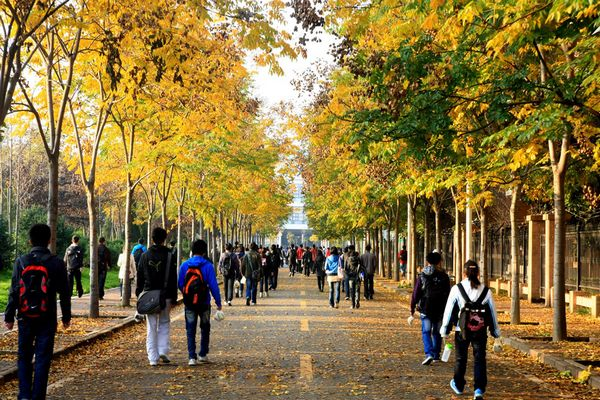

<!-- # 何处安魂：悬浮着的学术精英 -->

**慢慢感知到自己的普通、平常，只是属于正态分布一个标准差里的一份子，没有什么“异禀”，不见什么“大用”，只是一个比较努力的平常人吧，而这个世界努力的平常人很多，况且不平常的人也在努力。我知道自己还会努力，但是我也承认一生极有可能只能做些平常事，父母都是平常的人啊，有我平常的乖儿子不是也挺幸福的。我骨子里留着百姓的血，百姓的血带着百姓的命，也带着百姓的福。承认自己平常，没有那么难。卸下荣耀，也是卸下重量。还原自己，也是上进。**

# 何处安魂：悬浮着的学术精英

## 文/李博文（厦门大学）

**一**

前一阵子一个来自芝加哥的教会阿姨跟我说，几年前有一个中国留学生在西北大学读博士，毕业后回国由于没有受到预想的待遇而抑郁自杀。教会阿姨说整个芝加哥的教会都为这个有才华的中国年青人逝世而惋惜，后悔没有早日领他见到主，若是他早日见到主了这个悲剧就能避免。

我当时不记得有看过相关的新闻，回来搜索了一下：涂序新，浙江金华人，清华大学水利工程学士、法学学士，美国西北大学岩土工程硕士、博士，发表SCI核心期刊3篇，2009年回到浙江大学工作，2009年9月11日向浙江大学填报申报副教授的信息，六天以后自杀于浙江大学玉泉校区，死前留下遗书：

“在此时刻，我认为当初的决定下得是草率的，事后的发展完全没有预计，感谢一些朋友事前的忠告。国内学术圈的现实：残酷、无信、无情。虽然因我的自以为是而忽视。”

很多人猜测，涂序新自杀之前，有人向他暗示了副教授的申请结果，虽然之后没有人站出来承认。和几个同学聊起这个事情，有人说国内学术界黑暗，有人怪这个人心态不好，大家看法上莫衷一是，感情上都很惋惜。

**二**

和很多其他美国商学院一样，UTD的商学院也在扩张，今年一年就招了20个faculty，昨天去学院拿了宣传手册，浏览了一下这些未来有可能成为自己老师的人，发现三个亚裔面孔，看罢简历，三人本科都毕业于清华北大两所学校之一，然后在美国常春藤或常春藤级的名校拿下了博士学位，年龄在三十上下，我真的由衷佩服这三位前辈，美国学界教职十分紧张，好多一流名校博士只能到次一级的学校教书，但是终身教授制度规定除非学者违反了法律，美国学术机构不能解聘获得终身教授身份的学者，这样优厚的待遇，自由而独立的工作，以及社会赋予学者的尊重，使得美国的professorship严重供不应求，这三人在中国成长、接受教育，用第二语言研究学问、表达学术观点，不但能受到美国学界的认可，还能在美国拿到教职，这意味着美国人愿意花自己的钱供养他们的智力创造，也意味着美国人放心把他们的next generation交给此三人来塑造。

手册里，三人西装革履，自信满满，神采奕奕，眼神中仿佛世界朝他们打开了。百度百科上搜出涂序新生前的照片，也和他们一样，清秀俊朗，帅气阳光，只是现在，鲜活的生命已经变成了一个词条，被压在人们记忆的杂货柜底。我眼前浮现出教会阿姨想我讲述这个悲剧时的样子，我不禁想问她：若真有主，若主泛爱众生，为何他待人差别如此之大？

**三**

在UTD有幸结识Dr.Scotch，一个有俄罗斯血统的典型的西式老学者，三十多年前，他在芝加哥大学获得社会学学士学位，而后在哈佛大学获得了社会学博士，之后教书并从事关于disabled people的研究。来到他办公室，墙上挂着一幅马克斯·韦伯的画像，韦伯双眉微皱、目光如炬、炯炯有神，好像向前能刻穿任何和他对接的目光，背后又有不可测的渊深。Dr.Scotch看到我对韦伯的画像很感兴趣，从书架上拿出了一本皱巴巴的旧书，对我说：“This is the first sociology book that I read. At that time, I wasn’t in Harvard. I was in University of Chicago.”我双手接过书，生怕不小心把老教授少年的珍藏记忆弄破了，定睛看看书名：The Protestant Ethic and Spirit of Capitalism，哎呀，这不是久违的《新教伦理与资本主义精神》吗？我尽量保持对仗地跟他说：“This is also the first the sociology book that I read. When I was reading its Chinese version, I wasn’t in America. I was in Xiamen University.”

一学期下来旁听了Dr. Sctoch的课程，顺便观察了这个学者的生活，大致是看journal里的paper, 去conference和其他教授讨论paper，写自己的paper，改自己的paper，给学生布置paper，看学生的paper，改学生的paper。他那两大常春藤名校的光环随着接触变多而渐渐褪去,有时我会好奇，这个老爷爷研究了三十多年的disabled people，他到底研究出了什么？发的paper的名字都能写一页又一页了，这些paper有多少人看过？disabled people的生活又改变了多少？世界对disabled people的理解和认识又如何不一样了？

一天下课他跟我说，学院要选一个新的院长，但是他不想去选，他觉得当个学者就很好，每天他都可以慢慢的吃一顿午餐，如果他做了financial analyst，他恐怕就没有这个特权了。我恍然一小悟，什么contribute to the advancement of knowledge through cutting-edge research，什么facing the greatest intellectual challenge of our times，孩子，你不是想多了，你是想太多了！你以为每个学者都是马克思·韦伯啊？若是每个学者都像韦伯老爷子那么猛，《社会学入门》早就写爆了！你想累死社会学系大一新生啊？

大部分的学者一生只能重复咀嚼韦伯老爷子的观点，然后把咀嚼出来的成果吐给next generation，在读完同行几百篇paper之后，从一大堆重复的观点里挖掘出一点点新意，浩浩荡荡几千字，其实只在一个大话题的小问题里做出一点点进步。而若不是有其他学者也面临着相同的写作压力，很少有人再会从这佶屈聱牙的文字梳理出他的思路，他的“智力贡献”就此被封存到了书柜的角落里。与韦伯不同的是，没有一老一少会将它从书柜里重新拾起，然后重复Dr.Scotch和我的对话。

这个世界上大部分人都是普通人，学者也一样，也许，学者这份工作的特殊之处就是能慢慢的吃一顿午餐吧。但是学者在学生面前还要重复着勇于创造、大胆创新学术精神，尽管有时他要拉直嗓子说这些话才有底气，尽管他知道也许他本人也无法留下什么创造被人铭记，因为台下坐着的保不齐就有人有韦伯的笔力，潇潇洒洒便揭示人类发展的奥秘，而对于其余的人，还有他自己，也许在一开始就注定被遗忘，但是有过认真努力便是意义。

**四**

小时候常觉得读博士作学者是一件崇高伟大的事情，长大了发现周围很多好友都读了博士，其中去国外读博士的人也大有人在。Personal Statement里面为学为师的誓言写的令读者临表涕零、不知所言，然而私下里聊来大家的动机都莫衷一是：有人确实爱学术；有人觉得博士的光环很诱人；有人喜欢大学的环境、教授的待遇；有人想出国，硕士太贵了，博士倒贴奖学金，算一算比国内工作的同学挣得还多，这何乐不为；有的人压根没想好干什么，先读着，反正多读点书没有错。

在这一群人中，有极小一部分人有幸去到世界名校，有幸享受到世界上最精致的教育资源，翻开北美各名校网站，看一看博士生的简历，每个名校的项目一两年间都会招一个中国学生，涂序新的教育背景是这一群人的一个标准模版，本科清华或北大，博士常春藤或常春藤级名校。

犹记当年我在辽宁参加高考，三十多万人同进考场，清华北大也只要几百人而已，能考入这两所高等学府之一已经是几千人中的一个了。进入北大清华，他们要与这个国家最优秀的头脑竞争，GPA、语言考试、学生活动、学术论文，一切的一切都冲在前面，才有一定的几率进入梦寐以求的西方学府开始自己的PhD生活，走到这一步的人称得上是精英中的精英。若是来北美，PhD的学术训练要求又是惊人的严格，稍不留神又有奖学金停掉、资格考试不过、毕业论文写不出的障碍，于此同时还要在一流刊物上发尽可能多的文章以提高将来找到教职的概率。困难虽多，总有人能够克服万难，最终拿到博士学位，同时在世界级的top journal上发表了文章。我由衷的羡慕和钦佩这些人，因为超常的智力水平和坚韧意志，只要少了一样，他们都走不到这一步。

只要想想从应试教育的苦读到博士帽流苏的援正之间所有的希望、努力、坚持、辛苦和拼搏，我们便可以稍微理解涂序新的心情。他的成就是一步一个脚印踩出来的，是用paper的冷寂和实验室里的汗水交换来的，是他用最真实最纯粹的努力创造出来的。现在，他要社会给他应得的尊重和奖励，就像他做对了题就该得到相应的分数，他付出过了努力，也该有百分之百的正当性得到与之对应的评价和报酬。可惜生活不像是一场考试，更像是一次实验，结果有时和努力并不相关，因为大自然有自己的轨迹。

六年的苦读后从西北大学拿到博士学位，也许是因为照顾家人的考虑，他没有留在美国而是选择了到浙江大学教书，也许在他心中，自己去浙大是overqualified，也许评上副教授是他给自己不能再退的底线。当他带着北美名校的荣耀重踏故土，被浙大安排在57平方米的教师公寓里，现实的感官刺激太强烈了：即使你是那么优秀、那么上进、那么努力，即使你有那么多成绩，生活依然不容易，作为一个新人，这里有副教授们、教授们、院长们，你名校的荣耀不能免除你和他们经营关系的负担，你要考虑岩土的构造，也要以相同的审慎去考虑见到什么样的人该怎样说话；你可能看惯了美国人的大house，但是以杭州高企的房价57平米的房子已经是浙大腾出的一笔价值不小的资产，想要大一点的房子，靠工资收入也只能一平米一平米的挣，一间厕所一个厨房的积攒。

很容易知道，现实的这一切和涂序新想象的太不一样了，他开始怀疑自己曾经的努力，一切是否值得，若是不值，青春也覆水难收。也许副教授的职称是他最后的慰藉，但是生活严酷地说：这，我也不能给你。遗言中，他斥责中国学术界的“残酷、无情、无信”，他的评价或有几分偏激或有几分真，实际上不仅是中国学界，整个生活似乎都在骗他。

假如生活欺骗了你，不要悲伤，不要心急。

忧郁的日子里需要镇静，相信吧，快乐的日子终将会来临。

一切都是瞬息，一切都将会过去。

**五**

夜半观影，随便一选竟是一部德州的电影，No Country for Old Man，中译《老无所依》。结尾处，牛仔的妻子对杀手说：你没有必要杀我，你已经拿到了钱，也杀了我丈夫。

杀手拿出一枚钱币，抛过后掷出生死一问：告诉我，是正面还是反面？

牛仔的妻子说：钱币不能决定什么，决定权在你。

杀手不高兴的回复道：我来到这里的原因，和这枚钱币来到这里的原因，没有什么不同。

这个世界任何一件事的发生都是有逻辑的，一件事情确有另一件事情的引导，又确凿的引导另一件事情的发生。然而这个逻辑并不掌握在人手上，有时生活总向希望的反向行走，而且走的理直气壮，有时你用你的逻辑去框定它，它便告诉你它的那些必然而不期然的偶然。

The finity can't comprehend the infinity.

影片里的老警察无法继承父辈们惩凶除恶的荣耀，无论多么努力，杀手的狡猾精明面前，他总是幼稚无力。最后，他决定退出这场不是为他的智商设定的游戏：“I always figured when I got older, God would sort of come into my life somehow. But he didn’t.”

体制之过？人心之恶？涂序新之错？神之责？

我想到了教会的阿姨跟我讲述这个悲剧时的样子，我想问问她：如果真的有主，如果主全知全能全善，那么他能不能告诉我，悲剧为何？

**六**

xmmxmu最近有一条微博：“我渐渐开始意识到，我这辈子极有可能成不了富二代他爹官二代他爹，只能当一个平凡的我娃他爹了···每每想到这里，我就觉得眼前的生活开阔亮丽了不少。”

David呆回复他说：“有时候觉得接受自己终将平庸的事实也算是成熟的表现啊。”

不知怎的，毕业三个月后，这些当年被我视作不上进的语言，现在听起来都有道理了。拿出毕业前为班级毕业大戏写的朗诵词，勤勉与善良，智识与理想，悲悯与传奇，凌云寺里写下的文字，我还信着。只是，我也许一生最传奇的事情就是在毕业季给已经毕业、正在毕业、将要毕业的同学讲文庆校长的传奇；只是，我也许一生也没有能力在宏大的背景里演绎悲悯，但是我还是有可能完成小学生守则里的要求，做几件助人为乐的好人好事。总是梦想改变世界，慢慢发现世界早有自己的安排，不需要我去改变，我需要改变自己，那样也是在改变世界，因为我也是世界的一部分。

慢慢感知到自己的普通、平常，只是属于正态分布一个标准差里的一份子，没有什么“异禀”，不见什么“大用”，只是一个比较努力的平常人吧，而这个世界努力的平常人很多，况且不平常的人也在努力。我知道自己还会努力，但是我也承认一生极有可能只能做些平常事，父母都是平常的人啊，有我平常的乖儿子不是也挺幸福的。我骨子里留着百姓的血，百姓的血带着百姓的命，也带着百姓的福。

承认自己平常，没有那么难。卸下荣耀，也是卸下重量。还原自己，也是上进。

**七**

在写作此文想法出现的第二天，网上便传出MIT投行女郭衡自杀的消息。郭衡在华尔街投行、私募对冲基金都做过，就读蜚声世界的MIT斯隆管理学院MBA，还自己开办过公司。从博客里看，她不是一个书呆子，而是有很多独立的想法的人。透过MIT，她仔细的观察着世界上流社会的精英们，发现自己无法与他们竞争。她还忧心中国传统文化的陨落，渴望振兴传统文化，这里摘录她博客里的一段文字：

“今年是龙年，我依然用着这传了五千年的宝贵文字纪录我的人生。在我生日之际，我真心希望所有龙的传人能够睁开双眼，看看我们所面对的真实世界，客观地分析一下我们民族的未来在哪里。”

想想民族的未来，也想想自己的现在：自己开心吗？自己喜欢什么？自己在做自己喜欢的事吗？如果没有，为什么？有时候我们觉得自己是强者，其实我们同情弱者的同时，自己也许就是弱者，是需要帮助的人。我们要尽一切可能帮助人，但是自己病的咬牙坚持的时候，治愈自己便是对世界很大的帮助，因为自己轰塌的时候，这个世界中与自己有联系的部分也会颤抖。

任何人都需要一个宏愿。任何一种伟大都是自然发生的。

**八**

谈及涂序新的悲剧，教会的阿姨说其实侍奉神不需要什么地位，哪怕是一个普通老师，在讲台之上，如果能充分演绎神性的伟大，也能为神创造不少荣耀。

作为非基督徒，我尊重她对世界的理解，就像她尊重我对世界的理解一样。

涂序新临死时还有一个女儿在由她姥姥姥爷抚养，我想，如果真的有所说的神性的伟大荣耀，那必然在他女儿嫩嫩的掌心。

（采编：陈肃，责编：佛冉）
