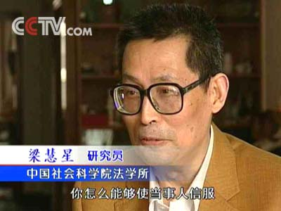
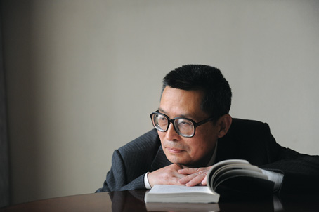

<!-- # ：怎样进行法律思维？ -->

（本文是基于梁慧星老师所做演讲记录而成，因字数限制及文意表达，在内容上有所删减）

### 一、什么是法律思维？

众所周知，现代社会有一个法律职业群体，称为"法律共同体"或者"法律人"，包括法官、检察官、仲裁员、律师、法学教授、企业法律顾问，等等。这些职业差异很大，律师是自由职业者，法官是国家公务员、执掌裁判权，为什么把他们归入"法律共同体"当中呢？因为他们共有一个思维方式，就是法律思维。法官裁判案件、律师代理案件和法学教授分析案件，采用的是同一个思维模式，即法律思维。法律思维的特点是什么呢？我们如果将法律人的思维方式和经济学家的思维方式作一对照，就会有一个明确的认识。

我们经常可以看到，电视台讨论某个社会问题，邀请一位经济学家和一位法学教授作为嘉宾。经济学家怎么样展开议论呢？经济学家总是问有没有效率？能不能提高生产力？总是讲投入与产出，讲价值最大化，讲资源的合理配置等等。经济学家这样来展开议论，其核心概念就是"价值"，即经济学家的整个思维是围绕"价值"这个核心概念进行的。

对于同样的社会问题，法学教授将怎样发表意见呢？**他首先问合法不合法？然后问法律有没有规定？如果法律有规定，他再问法律是怎么规定的？**当他谈论法律是怎么规定的时候，他就要分析法律的规范构成，分析其构成要件、适用范围和法律效果，然后用讨论的这个事实、这个行为与法律规范的构成要件加以对照。**如果对照的结果，是"符合法律规范的构成要件"，他就表示肯定的意见；如果对照得出的结果，是"不符合法律规范的构成要件"，他就要表示否定的意见。**

可见"法律人"在讨论社会问题时，整个思维过程是围绕合法不合法、法律有没有规定以及是怎样规定的来进行的，换言之，这个思维过程是紧扣着法律规范进行的。这就是"法律人"的思维模式。

然而为什么在面对同样的案件时，法律人所做的思维常常和普通大众不一致，甚至有些时候是南辕北辙呢？**面对药家鑫案，一些人拍手称快说判了死刑才是民意，然而一些法律人却认为这样的结果是舆论压倒法律的失败。面对虐童案，一些民众认为应当推广重刑或者重新立法，而法律人再次站在了他们的对立面，认为立法并不是最重要的，第一要务还是从现有法律中完善扩展，比如对于虐待罪的广义解释。**

这样不同意见往往导致汹涌的民意认为法律人并不是为了人民而说话。当我们冷静下来，仔细分析此类矛盾的时候发现，其实一切都是基于法律人所特有的法律思维，或者进一步缩小而言，**是基于其社会性和正义性。**

### 二、法律的社会性与法律思维

法律不仅是裁判规范，而且是人类社会生活中的规范，因此法律不仅具有规范性而且具有社会性。法律的社会性，就是说法律以人类社会生活、社会现象、社会关系为规范对象。简而言之，因为法律是社会生活规范，所以具有社会性。

**法律的社会性与法律人进行思维的关系，首先表现在认定案件事实的阶段。**一谈到案件事实的认定，我们会首先想到程序法、证据法，想到举证责任分配规则。但同志们要注意一个非常重要的问题，并不不是所有的事实都需要当事人举证、都必须通过证据来认定。按照证据法理论，有两类事实不需要当事人举证，而应当由法官直接认定。法官根据什么直接认定案件事实？根据社会生活经验。法官根据社会生活经验直接认定案件事实，是由法律的社会性决定的。

第一类不需要举证的事实，是可以从"日常生活经验推定的事实"，亦即"显而易见的事实"。

这一类事实在民事案件审理中经常遇到。陕西省以前就发生过这样的案件，医生把手术钳留在病人的肚子里，病人多年肚子疼痛，遭受了长期的痛苦，后来有了"B超"，到医院做"B超"检查，发现肚子里有一个手术钳，然后动手术把手术钳取了出来。于是起诉原先做手术的医院，要求判决一笔精神损害赔偿金。遗留在病人肚子里的手术钳都已经取出来了，此时还需要举证证明被告医院有过错吗？被告医院把手术钳遗留在病人肚子里当然具有过错，这是显而易见的，属于根据日常生活经验法则推定的事实。

北京发生过这样的一个案件，心脏起博器的导线断了一截在患者的心脏里，患者向法院起诉追究生产厂家的产品责任。产品质量法第41条规定，缺陷产品造成他人人身和缺陷产品以外的其他财产损害的，由生产者承担无过错责任。什么叫"缺陷"？第46条规定，产品具有危及他人人身财产的不合理危险，就叫"缺陷"。心脏起搏器导线断了一截在原告心脏里，还有必要要求原告举证证明产品有缺陷吗？还有必要证明心脏起搏器导线断在患者的心脏里，究竟属于"不合理的危险"还是"合理的危险"吗？

除上面举的"显而易见的事实"外，还有一类不需要举证的事实，就是"难以举证的事实"。这类事实很难甚至不可能通过证据加以证明，最典型的就是精神损害的事实。精神损害之是否存在及精神损害的严重程度，当事人很难举证甚至不可能举证，属于难以举证的事实。应当由审理案件的法官直接根据社会生活经验予以认定。这里举我国台湾地区台北地方法院在一九九九年裁判的一个关于消费者权益的诉讼案件为例。按照我国台湾地区民法和消费者保护法的规定，造成消费者人身伤害的可以判决精神损害赔偿。案件事实是，原告到一个高级餐厅用餐，餐后上甜点每人一杯冰淇淋，原告在吃冰淇淋的时候咬到玻璃碎片，把口腔内侧的粘膜划破了，于是原告向法院起诉要求判决被告餐厅赔偿50万元新台币的精神损害赔偿金。

这个案件中有两个事实需要认定，一个是人身伤害的存在和严重程度，一个是精神损害的存在和严重程度。让我们看看法官怎么样认定。判决书写道："查甲受友人邀请，至五星级餐厅用餐，原本心情愉悦，竟于冰琪凌中咬到玻璃碎片，致口腔内侧粘膜流血，并受有2公厘乘1公厘大小之外伤性溃疡，约1－2周才可痊愈，业经证人之结证在卷，且经本院函询财团法人新光医院属实。"这一段是关于人身损害存在和严重程度的认定，完全遵循证据规则。所谓"业经证人之结证在卷"，就是把证人传上法庭当庭陈诉，由书记官记录并由证人签名画押。但证人只是证明人身损害事实之存在，还不足以证明人身损害事实的严重程度，于是法院向当时进行治疗的医院发出调查函，该医院回了一个书面证据，法院根据医院的书面证据认定人身损害的严重程度，包括伤口大小及多少时间可以痊愈。你看，人身伤害的存在和严重程度，是严格按照证据规则通过证据予以认定的。

但本案原告要求的不是人身损害的赔偿而是精神损害赔偿，精神损害之是否存在及其严重程度，属于难以举证的事实，没有办法通过证据加以证明。我们看法院如何认定？判决书接着写道："甲主张因此事件，连续数日惶惶不安，担心是否已吞入玻璃碎片，是否造成穿肠破肚、内脏损坏，是否须开刀取出，亦符合一般经验法则。"你看，这一段几乎全是原告诉状中的原话，原告主张因此事件连续数日惶惶不安，担心是否吞入玻璃碎片，是否需开刀取出，吃不好饭、睡不好觉，因而主张存在严重的精神损害。而这个精神损害事实是无法用证据证明的，法官最后用"亦符合一般经验法则"一句予以认定。所谓原告主张的精神损害事实符合一般经验法则，就是说按照社会生活经验是可以相信的，换了其他的人吃冰淇淋咬到玻璃碎片把口腔划破流血，也会寝食不安，也会担心是否已经吞下肚去，是否已经把肠子、肚子划破了，是否已经造成内脏损害，需要到医院开刀取出，按照日常生活经验是完全可能的。于是判决书用了"亦符合一般经验法则"，直接予以认定。最后判决被告支付原告10万元新台币的精神损害赔偿金。

**法律的社会性对于裁判案件的重要意义，还在于正确解释适用法律。**我们经常可以看到对一些疑难、复杂案件，存在两种裁判方案、两种解释意见，各有其理由。遇到这样的情况，律师应该从法律的社会性出发，采用社会学的解释方法，即考虑所产生的社会效果的方法，主张采用产生好的社会效果的裁判方案。既然两种裁判方案都有道理，则应该以所产生社会效果的好坏作为判断标准，哪一种裁判方案产生的社会效果好，就应当采用哪一种裁判方案。在裁判当中，不考虑社会效果是错误的，因为法律有社会性，法律是社会的行为规范，无论立法机关制订法律，或者法庭适用法律，就都要达到一个好的社会效果。

### 三、法律的正义性与法律思维

**所谓法律的正义性，指法律本身须符合于社会正义，法律的目的是为了实现社会正义。**正义性是法律与其他行为规则，如技术规则，的根本区别所在。正如人有"善、恶"，法律也有"善、恶"，这就是所谓的"良法"与"恶法"。符合于"社会正义"的法律是"良法"，违背"社会正义"的法律就是"恶法"。历史上曾经存在过的许多"恶法"，诸如规定对小偷砍手的法律，规定当众将"私通"者乱石砸死的法律，规定对流浪者加以鞭打、监禁甚至处死的法律，规定对同性恋者予以惩罚的法律，都是不正义的法律，都随着社会的进步而相继被废止。我国被废止的"收容遣送"制度、规定"撞了白撞"的地方性法规，就属于"恶法"。

**须特别注意的是，在自然科学领域，只有正确与错误的区分，而没有正义与不正义之分，但在法学上、在裁判案件当中，严格说来只有正义与不正义的区分。**当然，我们平常也说某个裁判方案正确，某个裁判方案错误，说某个案件的判决正确，某个案件的判决错误，但这种情形所谓的"正确"、"错误"，与自然科学中所谓的"正确"、"错误"，具有显然不同的意义。

自然科学领域中的"正确"，是指符合客观世界的规律性，"错误"是指违反客观世界的规律性。但在作为社会科学的法学领域，特别是在裁判实践当中，我们说某个判决正确，某个裁判方案正确，某个解释意见正确，是指该项判决、该项裁判方案、该项解释意见，符合法律所要实现的正义性，能够在当事人之间实现公平正义。我们说某个判决错误，某个裁判方案错误，某个解释意见错误，是指该项判决、该项裁判方案、该项解释意见，违背法律的正义性，不能在当事人之间实现公平正义。

**正义性是法律最本质的属性，**如果不了解法律的正义性，脱离了法律的正义性，在法律领域、在裁判实践当中，就失去了判断是非、对错的标准，就真正成了"公说公有理、婆说婆有理"，我们就必然迷失方向。

法律的正义性对裁判案件非常重要，**裁判的目的就是在当事人之间实现正义，不是抽象的正义、一般的正义，而是具体的正义。**使诚信一方的利益得到了保护，使不诚信的一方的非法目的不能实现，使弱者遭受的损害得到了填补，使玩弄法律者受到制裁，使当事人的利害关系达到平衡，就叫正义、就叫公平。这样的判决当然是正确的、妥当的。相反，无论你的解释意见、裁判方案和判决书讲出什么道理，但判决结果在当事人之间没有实现正义，就是错误的、不妥当的。有的同志说，虽然某个案件判决不公正，但法律就是这样规定的。这样的说法其实是错误的，**法律本身并不是僵化的，法官只要掌握了正确的裁判方法，一定能实现当事人之间的正义。**

但是裁判的目的何在？目的是针对具体的案件，作出社会效果良好、符合实质正义、于法有据的妥当的判决。什么是妥当性？妥当性就是合法性、于法有据、实质正义和社会效果的统一。法律的社会性和正义性决定，法院裁判一定要考虑社会效果。什么是社会效果？社会效果就是综合考虑人情事理、公平正义、分辨善恶、保护弱者、国家政策、市场秩序、社会稳定，还有法律的权威。

以近年各地法院审理的所谓"宅基地买卖"案件为例。出卖人以违反宅基地禁止买卖的法律法规为由，请求法院确认房屋买卖合同无效。这类案件的实质，是城市郊区的农村为规避土地征收制度，以"宅基地"的名义将土地分配给农户建房，以低于商品房的价格出售给城市工薪阶层。因近几年房地产市场价格猛涨，出卖人反悔，以违反宅基地禁止买卖的法律法规为由，诉请法院确认房屋买卖合同无效。开始好些法院死抠法律规定，支持了出卖人的请求，认定买卖合同无效，判决双方退房、退款。

后来许多法律人注意到这样判决不公正。因为购房人往往是城市低收入阶层，几年前按照市场价格购买了房屋，已经交房、付款，居住了好多年。原购房时一千多块钱一平方米，现在房价涨到三、四千元一平方米，法院判决退房、退款对买受人非常不利，使其无端遭受重大损失。并且这样判决支持了出卖人背信弃义的行为，也与合同法诚信原则相违背。于是改变裁判方案，判决认定买卖合同有效。

认定买卖合同有效，有没有理由？当然可以找到理由。一是采目的性限缩解释方法，法律法规禁止买卖的"宅基地"，是指农户现在居住的房屋的宅基地，并不包括以"宅基地"名义分配给农户建房出售的土地。二是通过解释当事人之间的合同性质，属于"房屋买卖合同"，未涉及"土地使用权问题"，不是宅基地买卖合同，当然不违反禁止宅基地买卖的法律法规。于是判决认定这类房屋买卖合同有效，避免产生不公正的结果。退一步说，即使认定合同无效，也还可以通过适用合同法关于合同无效的规则，判决由具有过错的出卖人承担买受人遭受的损失，实现个案的公正。

因为法院判决确认买卖合同无效，使违背诚信的出卖人获得不当利益，诱使许多出卖人仿效，纷纷向法院起诉，其社会效果当然是不好的。现在法院改变裁判方案，判决驳回出卖人的起诉，维护房屋买卖合同的效力，打消了其他出卖人通过玩弄法律、获得不当利益的侥幸心理，维护了当事人之间的公平正义，维护了法律秩序，得到好的社会效果。

特别要补充一点，前面谈到的社会效果与这里讲的正义性是一致的，**只有判决结果符合正义性，在当事人之间实现了正义，才可能产生良好的社会效果。绝对不能将二者对立起来，根据实践经验，一个符合正义性的判决产生不好的社会效果，或者反过来，一个违背正义性的判决产生好的社会效果，均绝无可能！**

总括起来，我作这个演讲的目的，是要告诉大家，法律思维在案件中所起的关键作用。**我们这些法律人，绝不是消极被动的、无所作为的，既不是法律条文的奴隶，也不是程序规则、证据规则和举证责任分配规则的奴隶。如果能够正确认识法律思维，就一定能够在面对法律问题时，实践法律正义，并促进社会的和谐。**

### 作者介绍

梁慧星 1944年1月16日生，四川青神人。中国著名民法学家，中国社会科学院学部委员，中国社会科学院法学研究所研究员，《法学研究》杂志主编，中国社会科学院教授，博士生导师。兼任西南政法大学、山东大学博士生导师。2008年担任第十一届全国人大代表（主席团成员）、第十一届全国人大法律委员会委员。1966年毕业于西南政法学院（现西南政法大学）；1981年毕业于中国社会科学院研究院，获民法硕士学位。1990年国家人事部授予“有突出贡献中青年专家”称号。

### 【深入阅读】

1.《梁慧星：怎样进行法律思维？》（完整版）[http://www.aisixiang.com/data/25494.html?page=1](http://www.aisixiang.com/data/25494.html?page=1)

2.张树军：现象学方法与法律思维 [http://www.aisixiang.com/data/10621.html](http://www.aisixiang.com/data/10621.html)

3.田宏伟：法律思维的“规范性”与“能动司法” [http://www.aisixiang.com/data/50220.html](http://www.aisixiang.com/data/50220.html)

**P.S.**

致亲爱的七星说法读者们：

“七星说法读者群”业已上线，群号：262980026。在这里，你可以去和你喜欢的编辑搭讪，可以咨询法律问题，可以认识许多学法律的孩纸，可以问问怎么考华政的研究生或者司法考试的复习方法，可以探讨法律高深的理论或者有意思的故事，可以和一群有意思的人一起组织法律项目研究，最重要的是，可以深入了解一个有着专业知识但又很有趣的团队——七星说法团队。毕竟，结识朋友，永远是我们来北斗最欣喜的一件事儿。

（编辑：王卜玄；责编：戴正阳、陈澜鑫）
