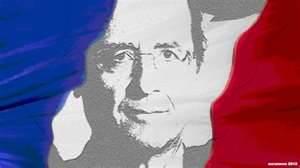

<!-- # 弗朗索瓦·奥朗德的转向 -->

11月6日，法国总理让-马克·埃罗（Jean-Marc Ayrault）根据前一天面世的一份关于法国企业国际竞争力的报告宣布了一系列旨在促进法国企业竞争力的政策。这一系列支持企业主的政策、特别是通过提高增值税来获得资金用以帮助企业减低劳动力成本的举措，和总统弗朗索瓦·奥朗德（François Hollande）在今年竞选期间的种种表态、承诺形成了鲜明对比。当玛丽安娜杂志（

« Marianne »）的记者问及奥朗德是否在政策方向上进行了“转向”的时候，奥朗德却矢口否认：“转向？哪有转向？”他解释说，加强财政纪律、重振法国工业等等目标都是他竞选时一直强调的重中之重，而政府推出的这一套“竞争力协定”（pacte de compétitivité）正是实现这些目标的手段。

无论“转向”这个词是否言过其实，法国政府最近的一系列举措与总统奥朗德在竞选期间的表现确实体现出迥然不同的逻辑。本文将从经济政策和执政风格两方面回顾奥朗德在当选法国总统半年以来所发生的“转向”，并分析这些转向背后不同层次的原因。

**从“社会正义”到“企业竞争力”——经济政策上的“紧缩转向”**

弗朗索瓦·奥朗德是法国主要左派政党——社会党（Parti socialiste）的2012年总统大选候选人，他的主要对手便是寻求连任的总统、来自右派政党人民运动联盟（UMP, Union pour un Mouvement Populaire）的尼古拉·萨科齐。竞选期间，奥朗德以“改变，就是现在”为口号，对萨科齐从政策方针到执政风格等各方面发起了全面抨击和清算。在经济方面，奥朗德在竞选期间强调“社会正义”（justice sociale），承诺废除萨科齐上台伊始就制定的限定各项税收总和不能超过年收入50%的“税盾”政策（bouclier fiscal）、承诺将18岁就开始工作的工人的退休年龄从萨科齐改革之后的62岁恢复至之前的60岁。他强烈抨击萨科齐政府试图提高增值税率的做法：右派希望提高增值税率用以填补社会保障资金的空缺[1]，因而称这一措施为“社会性的增值税”（« TVA sociale »），而左派则针锋相对地抨击其为“反社会的增值税”（« TVA antisociale »），因为他们宣称提高增值税率会降低普通民众的购买力。

2012年5月6日，奥朗德当选为法国总统；一个月后的议会选举中，社会党和其他几个左派政党一道获得了议会多数。奥朗德在刚上台的几个月里，推行了一系列具有左倾色彩的政策：将发给有未成年儿童的家庭的开学补助（allocation de rentrée scolaire）金额提高25%、按照承诺将部分特定人群的退休年龄恢复至60岁、萨科齐政府于年初通过的提高增值税的法案也被重新废除。引人关注的针对最富有者的75%所得税最高税率也由议会投票通过（尽管范围已经被缩小，执行期限也被限定为仅两年），右派及媒体担心此举会引发大批资金外流，英国首相卡梅伦曾表示将“铺红地毯”以迎接为避税而落户英国的法国公司。

同时，法国经济走势在欧元区债务危机的背景下持续低迷，失业率持续上升。2012年9月底，数字显示法国的失业人口已突破300万——上一次失业人口突破这一心里门槛已经是上世纪末的事情。国内经济状况没有起色，而周边国家如西班牙、意大利已是危机重重，更不用提垂死挣扎的希腊。各国都纷纷开始祭出紧缩政策的大旗。邻国西班牙在去年底上台的右派政府的领导下，开始了几轮的紧缩政策：停发公务员第十三个月工资、减少节假日、减少失业补贴金额、提高增值税率……而奥朗德政府似乎一直无动于衷。无论法国国内反对党派还是其他一些国家，都对法国的左派政府应对危机的能力持怀疑态度。越来越多的人认为奥朗德受制于社会党内的左翼力量而无法实施应对危机所需的改革。这样的状况直到

“加洛瓦报告”的问世和随之而来的一系列政策宣示之后才得到改变。

11月5日，欧洲航空防务及航天公司（EADS）前总裁路易·加洛瓦（Louis Gallois）向法国政府提交了本文开头提到的那份关于法国企业在国际市场上的竞争力问题的报告。次日，政府就宣布了一系列旨在促进法国企业竞争力的政策，加洛瓦报告中的提议几乎被政府照单全收。这一套“竞争力协定”（« pacte de compétitivité

»）中最引人关注的一条就是通过税务信贷（crédit d’impôt）的形式在三年内向法国企业提供200亿欧元的税收减免。而这200亿资金的来源，一半将由削减财政开支来完成，另一半则由增加税收来实现，主要是将增值税提高0.4个百分点（从19.6%提高到20%）。

于是，在竞选时被奥朗德团队轻描淡写一带而过的“竞争力”（compétitivité）一词如今取代了“正义”（justice）成为了政府政策的焦点；左派在废除了右派的提高增值税率的法案后，又自己决定将增值税提高；劳动力成本（coût du travail）是左派此前一直回避的话题，而这次政府公开宣布这200亿的税收减免将使法国企业的劳动力成本下降6%。

对于这一转变，埃罗政府的经济部长皮埃尔·莫斯科维奇（Pierre Moscovici）自己评价道：“这对左派来说是一场真正的哥白尼式革命”。作为企业界的代表，法国企业运动（MEDEF, Mouvement des Entreprises de France）主席洛朗斯·帕黎索（Laurence Parisot）也将这一系列举措评价为一次“重大变动”。人民运动联盟总书记让-弗朗索瓦·科佩则嘲笑左派在增值税问题上的反复：“现在，摆在社会党人面前的很像是一个大转弯，是对给他们选民的承诺的放弃。”看来，无论是哪一方，都或多或少承认奥朗德政府在经济政策上作出了重大转变。

在政府出台“竞争力协定”一个星期后，奥朗德于11月13日在爱丽舍宫召开了他上任以来的首次大型媒体见面会。会上，奥朗德再次称赞了“加洛瓦报告”，推介了政府推出的“竞争力协定”，并针对企业界对“税务信贷”机制可能程序繁冗有名无实的担忧，申明这一机制将是“迅速而有效”的。他明确提及“劳动力成本”，说这一协定体现了“关于劳动力成本的真相回归”。尽管奥朗德仍然声称“不需要进行任何转向、转弯，因为这些选择和我的承诺、我的原则，尤其是和法国的利益相符”，但实质上，整个媒体见面会所传递的最重要信息就是奥朗德在坚定地为政府的新政策背书。

这一转变让人不禁想起了上一个社会党总统弗朗索瓦·密特朗（François Mitterand）在他的第一届任期内那次著名的“紧缩转向”（« tournant de la rigueur »）[2]。固然，奥朗德的“转向”幅度和密特朗不可同日而语，政治后果也远没有当时那样重大，但一个左派总统开始大谈“竞争力”，向最富有者征收75%的所得税最高税率到为企业减轻200亿欧元税负，这仍是一个不可小视的转变。

**从“正常的总统”到“战斗的总统”——执政风格上的“责任转向”**

奥朗德上台以来，除了在政策方向上的转变外，在执政风格上也经历了重要变化。这些变化同样引人注目：在法国，一个政治人物的政策主张与他/她的形象、作风几乎受到同等关注，而且后者有时甚至是民众评判该人物更为重要的标准。

竞选期间，奥朗德提出的一个重要口号就是“正常的总统”（« président normal »），这与之前萨科齐在任时的“超级总统”（« hyper président »）风格形成鲜明对立。抛开关于“富人总统”还是“平民总统”之类的上纲上线，这种对立至少体现在两个层面：1、公关策略上，萨科齐走的是“进攻型”路线：出言不逊，作风凌厉，对政治对手的指责非常直接和激烈，寻求改革时强调决断而轻视对话；而奥朗德则言语平和，擅于解释，强调团结，寻求各方对话以达成共识。2、执政方式上，法兰西第五共和从戴高乐至希拉克的传统是：总统主外，总理主内；总统指明方向，总理制定路线。萨科齐在任期内与这一传统背道而驰，在无论内外各种事物上高频率发言表态，甚至插手一些本不应由总统插手的人事任命，留下了一个无所不在的总统的形象。这一风格不符合大多数法国人的习惯，因而备受诟病。而奥朗德则表示将回归传统，给总理给政府以充分空间。奥朗德在竞选辩论中那段已经成为经典的“我，共和国总统”打头的排比句里就清楚地展现了这一区别。

应该说，“正常的总统”这一口号让那些对无所不在的“超级总统”早已厌倦的人们感到了变化，为奥朗德的最终胜选发挥了重要作用。在当选后的前几个月，奥朗德也确实在严格遵循着“正常的总统”的风格：从不表现出愤怒或挑衅，讲话必谈团结，发言频率不高，只提大政方向，留给政府以工作空间。在这样的风格下，奥朗德和总理埃罗在民调中获得的信任度最初保持在50%以上。

然而随着有关经济局势的各种统计数字陆续公布，媒体的报道充满了危机感，民众对经济形势的严峻有越来越深的感知，而奥朗德乃至整个政府的姿态却显得有些“不温不火”；此外，缺乏经验的新政府自上任以来在公关上犯下了一系列或大或小的失误：某个部长政府作出决策前就提前表态、一个部长和另一个部长作出互相矛盾的表态……而这些失误经反对党的放大和媒体的报道之后，使民众留下了政府缺乏专业性的印象。从8、9月份开始，总统和总理在民调中的信任度便开始直线下跌。

在信任危机面前，奥朗德开始调整风格。9月9日，奥朗德在法国电视1台（TF1）接受访谈时，一改往日温和平静的作风，而是采取了更富进攻性的语调。面对危机，奥朗德说自己作为总统处在“在战斗的情形”中，而且是在“第一线”。两天后的9月11日，总理埃罗接受欧洲广播1台（Europe 1）采访，当记者问他“正常的总统”是否已经终结时，埃罗的回答是：“我们确实进入了一个不同的阶段：法国人已经看到总统带着勇气、真诚与决心，担起了他所确定的也是法国人赋予他的使命：在正义之下振兴国家。”这个回答事实上承认了执政者在公关策略上的重要转变。平实低调的亲民姿态可以赢得选举，然而面对严峻的经济形势，必须表现出坚强有力的一面，才能让民众感到更加可靠。在11月13日的媒体见面会上，奥朗德的发言也力求展示总统庄严的一面，句句掷地有声：“在我眼中唯一要紧的问题，不是目前舆论的状况，而是五年以后法国的状况。我的使命很简单：就是做到重振增长，减少失业。我要法国人依据这两项工作的结果——也只依据这些结果——来对我作出评判。”

同时，面对政府不断出现的各种公关失误，奥朗德也不能再不管不问。9月9日的电视访谈中，奥朗德明确要求政府成员以他的竞选承诺为准绳，不能任意发挥。总理埃罗近两个月也数次出面纠正某些部长的措辞，给出明确的政府立场。在11月13日的媒体见面会上，有记者问奥朗德对此前内政部长曼纽尔·瓦尔斯（Manuel Valls）在反恐问题上对右派的过激指责有何评价时，奥朗德在肯定了瓦尔斯的工作、批评右派放大问题的同时，也不点名地批评了瓦尔斯：“不要挑起争端，不要试图用什么言语来达到政治的目的。”应该说，在新的公关策略下，奥朗德在给政府留下工作空间的同时，进一步对外界树立了自己的权威，表现出对整个内阁队伍的领导能力。

“正常的总统”的概念有亲民的好处，却隐含着“平庸”“缺乏魄力”的危险。奥朗德面对危机，采取了执政风格上的转向，表现出了更庄严的责任感。那个诙谐幽默、平易近人的“正常的总统”不见了，如今站在我们面前的，是一个充满着使命感的“战斗的总统”。

**“周期性转向”还是“结构性转向”？**

回顾奥朗德的这些转向，笔者认为其背后原因可以分为两个层次：“周期性”原因（causes conjoncturelles）与“结构性”原因（causes structurelles）。

在当下的民主国家中，选举占据着政治生活的核心地位，是影响所有政治人物行动的最重要因素。而在法国，总统大选的重要性和受关注程度又远超其他选举，因而主流政治家为赢得选举或在其中扩大自己影响力，会制定各种专门的手段。然而选举归选举，总统上任之后需要面临的是经济和政治现实。选举和选举后的现实会导致当选者多多少少的“转向”，这一点上，前几任总统无论左右都有先例：81年，密特朗联合共产党人凭借左倾的竞选纲领当选总统，执政两年后面临经济崩盘，83年被迫采取程度空前的“紧缩转向”；95年，希拉克以弥合“社会割裂”（« fracture sociale »）、缩小不平等为主题赢得大选，半年后他承认低估了经济困难，为了减少赤字达到欧盟要求，政府开始采取紧缩政策，提高税收，阿兰·朱佩的改革方案遭遇规模空前的全国大罢工；07年，萨科齐打着提高购买力的旗号赢得大选，实施了“税盾”等一系列减税措施，结果遭遇金融危机，国库亏空，削减开支、减少公务员数量的措施开始实行……奥朗德在政策方向上的转向，应该说比萨科齐的要明显得多，与密特朗的“紧缩转向”无法相比，大致可以和希拉克的转向相互比照。而奥朗德在执政风格上的转向，就更和选举密切相关——“正常的总统”这一理念某种程度上说就是针对竞选对手、“超级总统”萨科齐而设计的，自然，竞选之后，这一理念的弊端便逐渐暴露出来，迫使奥朗德转变风格。可以说，选举这一周期性政治事件，是奥朗德的转向的直接因素。

同时，我们也要注意到奥朗德这些转向的大背景——欧元区债务危机及其引发的一系列政治、社会危机。自09年欧债危机爆发以来，欧洲多国的政府陆续倒台，意大利的贝鲁斯科尼政府、西班牙的萨帕特罗政府、希腊的帕潘德里欧政府、法国的萨科齐政府等等。传统的欧陆福利国家模式引起了的集体反思，精简公共开支、提高劳动力市场灵活性等已成为共识。作为危机中的欧洲最强劲的经济体，德国在强化财政纪律、加强劳动力市场灵活性方面的做法越来越成为邻国学习的对象。每个国家都面临改革重任，深度与广度取决于各自政府。这是整个欧洲的大背景。而竞选中的奥朗德很少真正面对这一改革重任，他并未将“竞争力”这一传统工业大国重振经济的关键词纳入竞选视野。这样一种违背大背景的策略是难以继续的。因此，奥朗德的转向是欧洲经济大环境的根本变化在法国的结果，是欧洲改革大方向的历史动力在法国的落实。作为历史悠久的法国社会党在新世纪的代表人物，奥朗德正在完成将该党由一个传统的“社会主义”政党向现代的“社民主义”政党的转型。他的路标，远有德国前总理格哈德·施罗德（Gerhard Schröder），近有法国前总理米歇尔·罗卡尔（Michel Rocard）。这是奥朗德的转向的结构性背景。

**转向背后的延续性**

在媒体面前，奥朗德完全否认自己有“转向”，这种否认当然是策略性的——一个政治家不能主动否定自己——但也确实反映了事情的另一面：转向的同时，奥朗德也仍然保留了一个社会党人、一个左派总统的一些底色。

在欧洲政策方面，社会党人奥朗德在法国的当选有力推动了欧洲的经济路线从过度紧缩中调整过来。紧缩与增长的矛盾，在危机严重的国家如西班牙、希腊体现得尤为突出：削减开支可以减少赤字，但也压制了消费和投资，导致经济增长动力进一步衰减。同时，紧缩政策已经损害了民众的社会福利，使他们生活水平下降，引起了重大的政治动荡。无论诺贝尔经济学奖得主克鲁格曼还是投资大亨索罗斯都曾警告：过度的紧缩无异于自杀。而且，在此前“默科齐”（媒体对关系密切的默克尔和萨科齐的合称）主导下，欧洲央行维持着单一的控制通胀的角色，对陷入危机的政府无能为力。奥朗德在竞选时就把“欧洲的重新定向”（« réorientation de l’Europe »）作为主题之一，把抑制过度紧缩，寻求增长可能作为自己的重点。他曾承诺要就“默科齐”主导的欧洲财政协定进行重新谈判，加入促进经济增长内容。虽然这一承诺最终并未兑现——欧洲财政协定只字未改，奥朗德只是在条约后加入了一个旨在促进增长的“附录”——但在他和其他欧洲领导人（主要是意大利总理马里奥·蒙蒂）的努力下，欧洲央行开始在救助困难国家中发挥更积极的角色，德国在紧缩政策的立场上也有所松动。这让在紧缩政策下几乎窒息的南欧国家呼吸到了一丝新鲜的空气，也让市场对欧元区解体的担忧有所减轻。奥朗德作为一个左派政治家，他在危机时的当选以及当选后在放松紧缩问题上的坚持，确实为欧洲经济走向新的方向提供了重要推力。

同时，在国内政策方面，即使奥朗德事实上已经开始实行某种程度的“紧缩政策”，为了提高企业竞争力而实质上违背了竞选时政策主张的逻辑，激进左翼的政党已经开始毫不含糊地批判他向资本方投降，但这些政策并未引起十分严重的社会反抗，这当然是因为奥朗德是左派政党党员，形象上更容易被接受，但同样也与奥朗德的温和作风、与他采取的强调“社会对话”（dialogue sociale）的方法不无关系。奥朗德尽管摆脱了当选之出不温不火的架势，表现出对局势紧迫感的认识，但仍然在几乎每次讲话中强调团结，强调稳定。加洛瓦报告提出的“竞争力休克疗法”（« choc de compétitivité

»），被政府改称为“竞争力协定”（« pacte de compétitivité

»）；在决定将增值税最高税率从19.6%提高至20%时，政府同时将增值税最低税率（主要针对生活必需品）由5.5%降低为5%。这些举措客观上有助于社会各界更平和地接受这些“勒紧裤腰带”的政策。而所谓的“社会对话”，指的是代表劳方的各大公会和代表资方的各种组织在政府给定的框架下，就具体政策方针进行谈判。萨科齐在任时曾推行过“社会峰会”（sommet social），但他的“社会峰会”更多是一种自上而下、由政府主导的模式。他在推行退休制度改革时遭遇到了一拨又一拨的游行、罢工，固然和改革本身的性质有关，但他忽视社会组织的角色、只让政府一意孤行的作风也是重要原因之一，遭到了甚至是来自右派内部的质疑。奥朗德在竞选时就强调社会对话的重要性，抨击萨科齐不顾反对声音，强行由政府推动立法。当选以后，左派政府已经在7月组织了一次“社会讨论大会”（grande conférence sociale），劳资双方的各个组织就就业、培训、失业、分配公平等重要问题进行探讨。会后，包括平时看来几乎不可能有什么共同立场的法国企业家运动（MEDEF）和法国劳工联盟（CGT）都对大会这一形式感到满意。应该说，健全而灵活的劳资对话机制也是现代社民主义的要义之一。这点上，奥朗德从竞选到当选，一直都起着正面的作用。

**转向固然艰难却是必需**

综上所述，奥朗德的一系列转向背后有着种种必然性。正如诸多评论者在他当选时即预言的那样：面对当下的危机，他在竞选时的那种口吻必然无法长期为继。现在，转向已经明确，更艰巨的任务还在后头。在严峻的经济形势和舆论压力面前，奥朗德及时作出了政策方向和执政风格上的调整，但仍保持了他一以贯之的部分路线。面对危局，无论谁来执政，转向都难以避免，转向带来的民意下跌也几乎是必然。但笔者以为，由一个左派的而不是右派的、“正常的总统”的而不是“超级总统”来完成这一转向，对法国来说未必不是一件幸事。

[1]目前，社会保障所需的资金主要来自由雇员和雇主分别按比例缴纳的社会分摊金（côtisation sociale），右派希望提高增值税率，用多征收的这部分资金投入社会保障，以减轻雇主缴纳社会分摊金的比例，降低劳动力成本。

[2]密特朗于1981年第一次当选法国总统，他领导的社会党与法国共产党等其他左派政党共同组阁，在“共同纲领”（« Programme commun »）的框架下，实施了以国有化、增加政府支出为特征的扩张性经济政策。结果到1983年，财政赤字猛增，通货膨胀剧烈，失业人数提高，严酷的经济状况迫使政府不得不放弃“共同纲领”，采取紧缩政策，缩减开支，增加税收，并准备开始将两年内国有化的企业再次私有化。“紧缩转向”导致左派政党联盟破裂，共产党退出政府，最终使得右派在1984年议会选举中获胜，出现了第五共和政治史上第一次“左右共治”（« cohabitation »）。

（荐稿：楼杭丹；采编：彭程；责编：彭程）
