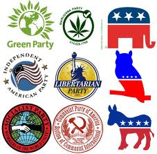
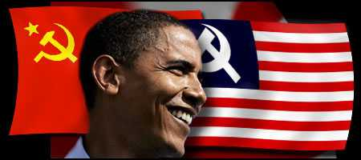

<!-- # 奥巴马连任背后的美国政党竞争 -->

**前言**

总统选举作为美国宪政体制的重要组成部分，在美国和全球政治生活中均占据重要地位。继于2008年成为美国首位黑人总统后，奥巴马在2012年美国大选中通过击败罗尼，把握连任总统的机遇。虽然不乏媒体扬言奥巴马的种族背景注定其竞选失败，但是这未能阻止奥巴马分别在2008年和2012年美国大选中获得超过38万张和近30万张白人选票，更不用说获得大量少数族裔追捧。奥巴马在美国大选中获得选民如此广泛的支持，与他具有独一无二的社会资本不无关系。

一、新政治经济学中的政党竞争研究概述

新政治经济学作为经济学和政治学的结合，运用经济学说研究选民、政党、国家之间的互动。在新政治学视野中，政党和其他政治市场参与者均试图采取最大化行为，因而与经济市场参与者并无二致。在一般情况下，公民可以委托政党在政府决策中表达其意愿，使他们与后者处于同一层次。继阿罗将多数投票规则下无稳定结果概括为投票悖论后，唐斯以政党在竞选中寻求最大当选概率为由，将其视为追求最大权力主体，从而使政党经济学成为新政治经济学的一枝独秀。

美国政治学家安东尼·唐斯在《民主的经济理论》中首先运用一般均衡方法分析政党与选民之间的博弈。在他看来，两党制下政党和选民参与选举的目的分别在于当选连任和找到最佳政治代理人。通过借鉴霍特林大街模型，唐斯提出中间选民定理，从而开创政党空间竞争路径研究范式：正如杂货店为了扩大客源，会向大街中心移动，政党为了争取最多选票，会将政纲贴近处于中间标度的选民。后来，意大利政治学家乔万尼·萨托利在将多党制区分为温和多党制和极化多党制的基础上，提出政党竞争在两种政党制度下分别向向心竞争和离心竞争演进。

在罗温·哈让、格林·派德森、科拉斯·特拉姆联系意识形态距离提出多党制下政党竞争具有不确定结果的同时，威廉·赖克对唐斯关于政党最大化行为的假定从而开创政党的联盟经济学研究范式。他认为参选的政党往往结成规模足够大的联盟，即采用最小获胜联盟法胜出：偏小或偏大的政党联盟偏小分别妨碍取得执政党地位和容易解组。后来，罗伯特·阿克塞尔罗德、保罗·沃里克分别提出意识形态相近的政党将结成以最小获胜联盟为上限的联盟和党派数目与政府存续时间呈反比。罗伯特·巴斯特提出策略行为具有扩张最小获胜联盟的作用。

以布鲁斯·纽曼为代表的学者将市场营销理论引入政党竞争研究，从而开辟政党竞争的营销学研究范式。继纽曼将4P理论与竞选各环节对应后，丽斯·马斯蒙结合商业行为导向，将政党分为产品导向型政党，销售导向型政党和市场导向型政党。产品导向型政党总能获得一定选民支持，以致在丧失选民支持时抗拒改变政纲。销售导向型政党致力于说服选民认同其政纲，而市场导向型政党致力于依照选民偏好颁布政纲。罗伯特·奥姆罗德提出市场导向型政党对选民利益的关心受到诸多环境变量影响，且它需要提高政府集权化程度来应对对手的挑战。

政党类型理论多年来在西方政党理论中占据主体地位，为政党竞争的类型研究范式出现奠定基础。进入上个世纪中期以来，莫里斯·迪热维尔、希德格蒙·纽曼、奥托·基希海尔默、盎格鲁·帕尼比昂科、安德·库维尔先后对政党作出不尽相同的分类，以便剖析其在竞选中的优势。后来，乔纳森·霍普金和凯特瑞那·保罗西通过借鉴前述研究成果研究南欧党派互动，总结商业公司型政党的基本特征。政党在将大权交由领袖主掌的同时，日益广泛地依赖商业公司支持参选。

二、社会资本在政党竞争中的积极作用

虽然新政治经济学家基于理性人假设研究政党和民的相互策略行为，有助于得出关于竞选公理，但是这不是说他们的研究范式是无懈可击的。姑且不论单个公民只能微弱地影响选举结果，以致有放弃投票的倾向，政治市场以集体选择为主要交易方式，因而与以个人选择为主要交易方式的经济市场间存在难以逾越的鸿沟。在哈贝马斯眼中，新政治经济学将政党与选民之间的互动简化为诸多策略行为，是将对方当作实现自身利益的工具，因而无法显示竞选中回归本我的交往。

首先，政党需要以追求善治的抱负取信于选民。

由于各国政治合法性无不植根于善治，所以政党在竞选中均会表露追求善治的抱负来取信于选民。从福利经济学上讲，善治包含实现最大社会利益的资源配置，体现代表公共部门的政党和代表私人部门的选民之间的融洽关系。普特南认为在社会分工日益深化的现代社会，政党在竞选中不能独自打保龄球，而必须理顺国家与社会，政府与公民之间的关系。他指出信任作为社会资本的重要组成部分，构成公共生活的润滑剂。政党和公民对信任的合理会增进信任，任其闲置则减少信任。政府和公民以互信为前提会共同解决社会问题，从而提高政党公信力。

其次，政党需要以追求善治的抱负确立行动准则。

政党在竞选中表露追求善治的抱负不仅可以取信于选民，而且可以为选民和自身确立行动准则。亨廷顿认为现代化建设在过程和结果上由于分别解构和建构社会秩序，因而滋生社会不稳定和增进社会稳定。随着人类在全球化进程加速的背景下进入风险社会，各国地区和行业差距拉大日益引发社会贫困群体相对剥夺感。倘若政党能借助正式制度和非正式制度稀释这种怨恨，那么政党可以避免公众对其认同被这种怨恨侵蚀，进而避免国家在转型中陷入永无休止的纷争。其实，规范作为一类重要的社会资本，具有确保政党和不同社会阶层平等对话的功能。

再次，政党需要依托参与网络培育互惠型公民。

根据社会交换理论，公民对参选政党的支持属于植根于理性的批判性认同。换言之，公民在对参选政党代表利益考量的基础上，拥护其中能代表多数人的政党。公众支持参选政党既要求公民具有参与政府决策的主体意识，也要求公民具有以为他人服务为核心的公共精神：具有主体意识是公民在竞选中维护自身权益的前提，而具有公共精神是公民在竞选中考虑他人权益的前提。普特南认为公民在参政中构建具有普适性的互惠原则，从而克服集体行动的困境。在价值观日益多元的现代社会，公民在竞选中按照互惠原则行动能塑造超越特定群体的风尚。

可以说，政党在竞选中胜出并非只是像企业销售那样寻找和推销代售商品，而是通过整合信任，规范和互惠，与选民就解决社会问题达成共识的结果。利普哈特认为在人口异质性日益增强的当代，共识民主日益取代多数民主成为表达公共意志的渠道：不同于多数民主中仅以微弱多数决定当选者，以致权力高度集中于某一党派，共识民主中少数人和多数人均有代言人上任，意味权力为多个主体共享。政党与公民在共识民主中共商国是，有助于改变竞选中赢者通吃的局面。

三、美国大选棋局变动背后的社会资本积累

自从二十世纪中期以来，中心城市社会问题激增促使美国进入大规模郊区化发展时期，从而带来美国政党与选民之间的关系调整。随着二、三产业从中心城市搬向城郊，白人和少数族裔分别向城郊和中心城市迁徙，从而推动美国郊区化发展。相应地，民主党和共和党分别以中心城市和城郊为主要发展地盘，并紧跟人口迁徙迁徙动向选择主攻选区。随着郊区成为美国总统选举的主战场，民主党在郊区竞选中获得的支持率逐渐超过共和党，表明两者已然展开旗鼓相当的竞争。

（一）种族隔离制度消除淡化美国大选的种族主义色彩

不言而喻，奥巴马和其他杰出黑人候选人在美国大选中战胜共和党离不开白人摒弃种族主义。虽然历史上不乏美国人跨种族投票，但是在持续上百年的种族隔离制度下，白人一度很少给黑人投票。在美国大众媒体干扰下，黑人在竞选中往往难以采取去种族化战略。姑且不论具有社会经济地位中上的白人希望白人政治精英当选，社会经济地位低下的白人与大多数黑人在就业和入学上有激烈的竞争，因而鲜有愿意黑人当选者。直到上个世纪七十年代，底特律、亚特兰大、巴尔的摩等黑人聚居城市的白人才普遍认同当地成功当选的黑人政党领袖的政绩。

（二）黑人威胁感知减少促进白人-黑人共同体的形成

不仅如此，杰出黑人候选人在美国大选中战胜共和党离不开各州白人对他们提供多层次支持。表面上看，奥巴马和其他黑人竞选者在种族问题严重地区获得的选票数目小于在种族问题轻微地区，表明白人对黑人威胁感知与黑人密度整相关。实际上，白人对黑人威胁的感知在美国各州族群关系网络得到调整的情况下可以大大降低。帕特南认为美国白人社区中经常与他人互动的个体作为社会资本家，具有支持锐意进取黑人担任公职的强烈倾向，因而能控制白人对黑人威胁的感知。从这个意义上讲，杰出黑人候选人有望被白人视为共同体中的头号人物。

（三）选举团制度与两党制协同发挥去种族化筛选功能

鉴于选举团制一直在美国大选中配合两党制决定候选人胜负，选举团人制度对于杰出黑人候选人在美国大选中战胜其对手的作用不容忽视。在不少美国政治家看来，选举团人制度作为美国联邦制重要基石，旨在保护非裔和其他少数族裔公民权。美国《宪法》第12条修正案规定选举人必须对总统和副总统分开投票，以免同一党派候选人在竞选同一官职上撞车。伴随美国政党政治和选举政治在各参选党派激烈较量中融为一体，美国大选之中的元首之争变成党派之争。在这种情况下，杰出黑人候选人可以争取少数关键州的白人支持来在大选中出奇制胜。

（四）入党门槛低下便于黑人为成为政治代理人造势

值得一提的是，美国各族群不必对特定政党怀有高度忠诚，因而包含杰出黑人候选人在大选中击败其对手的可能性。早在民主党和共和党创立初期，以杰弗逊为代表的美国政治家基于政党具有罪恶天性的假定，主张各党派相互监督，从而限制美国党派斗争走向专权。相比于其他发达国家，美国至今没有设定严格的入党手续：公民只需在选民登记表上填写某个党派名称来表明自己归属的党派，且可以随时变换党员身份，有助于杰出黑人候选人以合格政治代理人身份上任。

四．奥巴马任职前后美国政党竞争走向

虽然以奥巴马为代表的黑人成为美国政坛巨星不曾说明美国宪政体制与社会资本积累毫无不适应之处，但是可以肯定近些年美国政党竞争中的社会资本积累方式发生微妙的变化。固然，美国民众投票率多年来持续走低，反映他们对美国现行政党制度和选举制度的不信任。不过，这不意味奥巴马会和以往美国总统在竞选中以笼络人心为目的乱开空头支票，且对党内事务不闻不问。相反，奥巴马在上任前后一直为民请命，以便抵制以共和党为首的极右势力损害民众福祉。

（一）网络在美国执政党生成中具有决定性作用

回顾美国每次政治领导人换届，媒介对相关候选人当选的压倒性影响是显而易见的。继肯尼迪于上个世纪六十年代依托电视战胜受到国会鼎力支持的约翰逊后，奥巴马在2008年和2012年美国总统选举中依托网络战胜已然成为美国政坛风云人物的希拉里，麦凯恩和罗姆尼。在2004年竞选议员期间，奥巴马开始在网上动员投票，从而为后来两次竞选总统期间在网上争取选民支持奠定基石。通过指挥一只竞选团对在奥巴马个人网站、Youtube、Facebook等网络空间上发布讲话原文，媒体报道，志愿者招募等信息，奥巴马轻易获得广大美国民众的青睐。

（二）美国民众扮演竞选信息接受-传播者角色

在利用网络发布竞选信息的基础上，奥巴马将大量文本与鼠标与指尖操作衔接，从而便利美国民众从竞选信息接受者成为传播者。在美国进入互联网时代之前，美国媒体对参加总统选举的黑人总会特别设置领导力议程，从而使其种族背景受到选民格外关注。然而，奥巴马竞选团队在多种网络空间上将新闻报道中的种族主义论调过滤，从而规避媒体借助领导力议程刁难自己。无独有偶，奥巴马利用多重网络空间广泛吸引小额捐款，从而获得超出主要依靠政界人士捐款的希拉里，麦凯恩和罗姆尼的捐款。通过上述举措，奥巴马自然绕过种族和捐款陷阱。

（三）美国共产党紧跟大选节拍来壮大自身力量

在奥巴马依托网络在政治生涯中乘胜追击的同时，以美国共产党为代表的在野党利用总统选举扩大自身影响力。在民主党于2006年美国中期总统选举中打击极右势力后，美国共产党领导的劳工斗争逐渐走出低谷，进而向组建联合政府阶段过渡。将劳工斗争的矛头指向极右势力，美国共产党清楚彻底击败这股势力无法在2008年和2012年总统选举中完成，因而承认美国具有存在推行极端国家主义的危险。由于现阶段美国共产党尚无法强有力地领导劳工斗争，所以它依然寄希望于民主党击败美国极右势力，从而难以发挥美国草根对政策议程的影响。

（四）美国共产党联合民主党与极右势力抗衡

美国共产党利用总统选举扩大自身影响力与其说是为民主党做嫁衣，不如说是逐步调整资本主义生产关系，集中体现在它协助民主党对付共和党控制选民和离间劳工与大众的阴谋。除了在选民集中的社区设置投票点外，美国共产党还依托多种媒体揭露极右势力非民主本质。同时，美国共产党在其政纲中做出结束海外战争，延长还款期限，援助海湾国家等方面计划。此外，美国共产党在分析美国各种群关系的基础上，提出拉美裔将成为民主党总统候选人选票的一大来源。

**结语**

自从奥巴马于2008年当选美国总统以来，消除种族歧视再次成为美国政党竞争中的一个焦点。不论美国极右势力在共和党旗下阻挠奥巴马推行医改，还是它在种族主义者的鼓动下成立右翼茶叶党，都表明美国极右势力企图在奥巴马当选美国总统后挽回败局。纵使奥巴马在2012年美国总统选举中把握连任机遇，美国右翼势力未曾停止向本国中低收入阶层转嫁经济危机。在共和党沦为美国极右势力附庸的情况下，奥巴马政府为人民运动纵深发展创造空间依然任重道远。

参考文献： [1]高奇琦：《西方政党经济学理论研究综述》 [J]. 《晋阳学刊》 2010，（6）：30-33 [2]史献芝：《社会资本与政党认同之逻辑关联性及路径选择》 [J]. 《晋阳学刊》 2010，（6）：30-34 [3]陈炳辉：《多数民主与共识民主》 [J]. 《江淮论坛》 2012，（1）：74-81 [4]武文霞：《郊区化时期美国的城市特点与政党发展格局变化探析》 [J]. 《河南师范大学学报》 2011，38（3）：70-73 [5]刘宝东：《美国洲际政治地理与奥巴马的白人选票》 [J]. 《世界地理研究》 2011，20（4）：1-13 [6]朱兴丰：《美国选举人团制度评析》 [J]. 《世纪桥》 2009，（3）：50-59 [7]张延：《美国两党制的困境》 [J]. 《法制与社会》 2010，（17）：174 [8]李镭：《WEB2与美国选举政治的结构转型》 [J]. 《国际新闻界》 2008，（12）：40-44 [9]余维海：《近年来选举政治中的美国共产党》 [J]. 《当代世界社会主义问题》 2010，（3）：84-92

原文链接：[http://blog.renren.com/blog/393322011/886598362?bfrom=011201092](http://blog.renren.com/blog/393322011/886598362?bfrom=011201092)

（采编：彭程；责编：彭程）
