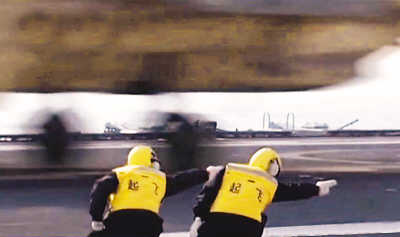

<!-- # 七星视点：浪花之梦梦还多——航母，海军，及其他 -->

### 起飞

2012年11月25日，中国人民解放军海军航空母舰“辽宁”号首次成功完成了舰载固定翼飞机的起飞和降落试验。

消息甫一公开，就引发了相当广泛的震动。网民们，尤其是素来关心军事和国防的网民们，在微博上，在论坛里，在门户网站的讨论区里，用各种方式表达着自己的兴奋和喜悦。同样，媒体也不失时机地加入了这场欢庆当中。

[@舰船知识杂志](http://weibo.com/2073915493)：海军是辽宁style，航娘style；白天非常霸气充满力量的舰载机，夜间起降也毫无问题的歼15，那种很给力的舰载机！海军兔都是硬汉，白天穿着彩色马甲在航母甲板上值班那种硬汉，

听到飞机呼啸就会热血沸腾的硬汉，到了晚上喜欢恶劣天气起降的硬汉！

从现在开始奔向星辰大海！海军是辽宁style，航娘style！

[@舰船知识杂志](http://weibo.com/2073915493)：问：为什么中国航母起飞官手势信号全面模仿美军？有中国网友答：这是为了以后方便接收美军的航空母舰。虽然这个回答未必合理，但是小编我喜欢这个态度。

[@舰船知识杂志](http://weibo.com/2073915493)：走你style让中国人体验了一把全民航母风，海军官兵自然是主角，他们也用这种方式诠释中国海军建功深蓝的自信与豪迈、苦练打赢的热血与追求。这其实是“人民海军style”、“海军强国style”，更是中国人的“梦想style”。

[@环球时报](http://weibo.com/1974576991)：今天《航母style》以“向前跑！迎着冷眼和嘲笑！”之名继续火爆，眼泪和弹幕淹没画面。[@张颐武](http://weibo.com/n/%E5%BC%A0%E9%A2%90%E6%AD%A6)

老师说：这段视频是中国年青一代的感伤、幽默和豪情壮志。这是一段情感的扣连，一段悠长辛酸故事的告别，也是一个新的起点。这些以兔子自居的齐声：愿在我有生之年，得见你君临天下。[http://t.cn/zjGhr5z](http://t.cn/zjGhr5z)

“你们可曾见过这样一支舰队，这样一天？”1907年12月16日，美国总统西奥多·罗斯福在送别他的舰队的时候这样说道。这支舰队由16艘当时最出色、最强大的战舰组成，全部漆成鲜亮华美的白色，在阳光下闪闪发亮。这次环绕整个地球的远航，后来被认为是美国海军进入世界一流行列的标志。

而如今，中国人是不是也可以说，这是从未见过的舰队，从未见过的一天？

### 飞向未知的未来

然而，“兵凶战危”，这句话在这样的时候，是总是会被人记起的。在齐齐的欢呼声中，迎头泼来的一盆冷水，也让人们清醒了许多。

[@国际时事军事评论员吴戈](http://weibo.com/n/%E5%9B%BD%E9%99%85%E6%97%B6%E4%BA%8B%E5%86%9B%E4%BA%8B%E8%AF%84%E8%AE%BA%E5%91%98%E5%90%B4%E6%88%88)：比如今天第一个告诉我，他感到航母使他作为中国人的自豪感和自尊感大增的网友，就是地税的朋友。我可没说这不应该啊，只是说衣食足而知航母，工资高才有空爱海军。我现在对海军说不出多少热情洋溢的话，大家可知我的财政状况和政治地位，生活压力了。

[@石头醒工砖](http://weibo.com/u/1339498011)：看到爱国者为飞机上航母那么high，我也跟着很高兴：东亚日德兰又近一步，支那帝国的彻底灭亡曙光展露。

[@鹿咻](http://weibo.com/summerflywong)：航母style的扩散，怕是给人以军国主义盛行的印象吧？反正看上去好恐怖，特别是看到还有背着几岁大孩子的大人，两个一起做这动作。

[@国际时事军事评论员吴戈](http://weibo.com/n/%E5%9B%BD%E9%99%85%E6%97%B6%E4%BA%8B%E5%86%9B%E4%BA%8B%E8%AF%84%E8%AE%BA%E5%91%98%E5%90%B4%E6%88%88)：任何事情，本身或许是积极的，但一旦加上中国人的规模这个变量，立马变得有点惊人。世界最多的一群人，普及航母起飞手势，这是个什么国家形象？英德造舰竞赛，华盛顿海军条约，美苏日德二战中的工业比拼？造舰没什么不应该，但在力度上成为一国主题，背后蕴含着民族战略决战，恐非当今世界潮流。

在世界历史上的很多时候，新装备的出现、军队的强大，并没有给国家和人民带来任何利益。相反，强大的军备却往往使国家走上灭亡的道路，与此同时，还给本国和邻国的人民带来深重的灾难。

那么，在21世纪的今天，我们是否仍然需要警惕军国主义的、在中国这样一个“热爱和平”的国家的复活呢？对国家强大、人民幸福这一单纯而朴素的目标的渴望，会不会像历史曾经无数次无情地证明过的一样，将国家推向毁灭呢？我们今天的狂欢，会不会让以后的几代人、十几代人，背上沉重的历史负担呢？

这样的未来，绝非我们所期望的。然而，变化却往往会在不知不觉中悄然发生。

### 赤城之峰今宵限

在这个时候，我们不能不想起我们的邻国——日本。

东亚人对日本的情感，不管是仇恨或者如何，都往往是始自昭和时代。而在某种程度上，作为对这种情感的回应，一般的日本国民对历史的反省，也常常是集中在所谓“动荡的昭和史”，或者，作为其外延，扩展到“大正德谟克拉西”（大正民主）之失败和教训。然而，纵然其走到这一步，也往往把罪责仅仅归咎于军部，或者，寄望于明治时代的元老不曾如此快地凋零，于是便能抑止军部的独走。

然而，仅此并不足以解释那个在维新以后强大起来的日本，究竟是因为什么，一直目视前方大步向前迈进，却最终跌落深渊，而在这整个过程中，竟没有一天让国民过上最初所追求的幸福生活。

明治时代的日本，是一个年轻的国家。虽然贫困，虽然缺乏产业，虽然缺乏近代人才，然而这个国家却有着旺盛的生命力。为了能够发展出与列强相当的工业和经济，建立和列强相当的陆海军，上至天皇大臣，下至一般国民，都是竭尽其力量和聪明才智的。也正是在这段时期里，日本确实在经济上和军备上立于列强之林，在战争中，先是击败了清国，又击败了俄国，而且成为了大英帝国数十年来第一个正式盟友。然而，这时的日本仍然并非一个富裕的国家。可以说，这个国家、这支军队，是靠国民的牺牲来维系的。而国民之所以愿意做出这种牺牲，原因又是什么？在这里，看不到什么直接的、功利性的理由。似乎，这更多的是出自对国家、对君主的那种淳朴的感情，那种认为国家强大，国民就自豪的感情。

这些人中绝大部分，也许并不懂得国际关系和现代政治，也并不理解日本国在一场场战争中，究竟经历着如何危险的处境。这群人，只不过是经历了黑船来航，经历了幕末的动荡，即使此刻生活依旧艰难，仍为最初成为“国民”而感到自豪，拥有一颗希望自己生于兹长于兹的国度强大的质朴之心的、最最普通的日本人罢了。

然而，也正是这些普通的日本人，挣扎着推动日本走上了毁灭之路——并不是从昭和时代开始，而是从明治时代就已经开始了。的确，这个时代是昂扬而奋进的，这种奋进，最初也许是国民自身的奋进，是“自由、自主、自律、自尊”的国民的奋进，然而却逐渐演变成了作为国家的构成体的国民的奋进，以国家的方向为方向的奋进。

在日俄战争最紧张、最危险的日子里，夏目漱石曾经说过这样的话：

_“虽然是一个文人，在关键的时刻，还是要靠军人才能生存下去。”_

_“如果失败，日本会沦为殖民地，《我是猫》和‘前日之，丝瓜水，亦未饮’都无法用日语再读了，落语、歌舞伎、能、狂言也都完了。”_

如果这样的意识，成为了知识界的共识，那么知识分子们又怎么可能面对军部的无理而不低头呢？

看着国家走向危险和灭亡，却不发言的国民，又有什么资格，把所有的责任都推给军部、推给元老呢？

日本最初的大型航空母舰“赤城”号服役之初，备受鼓舞的国民曾经为海军踊跃捐款，仅在1932年中，海军就利用捐款购买了数百架舰载机。短短十年之后，这艘曾经象征着海军的骄傲的军舰，就沉睡在中途岛的海底了。

### 批评和被批评

然而，这种批评并不是被所有人接受的。毕竟，“强大国家”的形象，本身就足以构成一种诱惑，一种在美学上能够让人忘记潜在危机的诱惑。所以对批评的批评也就接踵而至。

[毛慧宁™Seven](http://www.renren.com/profile.do?id=254746258): 那群公知可以调笑间肆无忌惮地讥讽辽宁号没有舰载机，讥讽航母首航庆祝的那群女兵，讥讽辽宁号质量堪忧，不敢停飞机。当然，他们的言论不需要付出任何代价，围观者们开心地笑着，“黑的漂亮！”“查水表~！”“这就是天朝~！”“‘中国特色’~！”3天过去他们就可以当做一切都没有发生，可是我们的军工科研人员，我们的劳动者们他们不能如此，我们现在没有，我们就要咬牙不惜一切代价把它造出来！沈飞总经理罗阳今天中午在歼15完成着舰试飞后，心脏病突发离开了我们，为什么这时他们不需要付出代价？

所以，这是一种怎样的思维方式呢？难道说，因为其他国家拥有的，“我们”就要不惜一切代价去拥有吗？只要是力量，就自然构成正义？而不需要考虑这样做究竟有没有好处，究竟会如何改变国家的安全形势，究竟会不会给未来增添不利的变数？而如果不认同这种思维方式，如果提出意见，或者加以讽刺，那就是公敌？就应该付出所谓的“代价”？

当然历史上是有付出代价的例子的，这种代价，也叫“天诛”。

[小白兔吃猫饼干](http://www.douban.com/people/dorisophy/)：“笑看公知犬养毅被爱国水兵打脸，日本人即将迎来市场经济的新高潮！”“你个民主脑残！海军会清你场？居然想裁海军！”“莫道吾辈黩兵武，每个日本人心中都有一个大国梦！”#[杭墓思待撸](http://www.douban.com/update/topic/%E6%9D%AD%E5%A2%93%E6%80%9D%E5%BE%85%E6%92%B8)#

### 结语：浪花之梦

在整个中国近代史上，海军，恐怕是一代代人梦想的首要载体，同时也是一幕幕悲剧的最完整缩影。最初，当那支“亚洲第一舰队”出现在东方的海面上的时候，未来似乎被曙光照亮了。然而，龙旗败给了菊纹，舰队沉没在了威海卫的冰冷海底。后来，海军浩浩荡荡的造舰梦，再次被邻居打碎。在滚滚的长江水中，海军悲壮地把他的人和他的船投诸死地，为了使国家得到复生。后来，刚刚百废待兴，却又兄弟阋墙，海军终于不能不随波漂流。经历了这样的历史，人们也就不难理解中国人对一支强大海军的渴望。

然而，我们从历史中所学到的，不应该仅仅是这些。那些以强大国家为诉求的努力，最终是如何走向失败，这难道不是我们更应该警觉的吗？如今，中国据说是已经强大起来了。那么，防止国家走上歧路，难道不是我们的责任吗？

[@赵楚](http://weibo.com/zhaochu1962)：经常听人高呼警惕日本军国主义，这话我同意，但我觉得中国人最可担心的还轮不到什么日本军国主义，而是以新文革、新极左、新纳粹和新红卫兵为代表的中国军国主义，从历史看，无论血腥残暴程度，还是社会毒化威力，都远超日本军国主义。

（编辑：张舸；责编：张舸）
