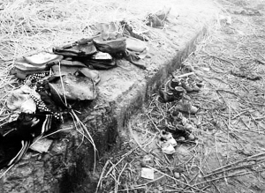
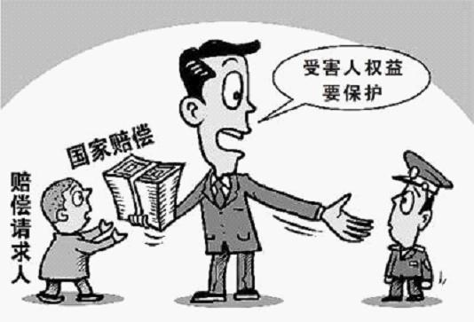

<!-- # ：校车背后，我们该看到更多 -->

童宇翔(4岁)，彭冰宇(4岁)，胡思敏(4岁)，罗沁馨(4岁)，童钱龙(6岁)，童芳强(6岁)，童晨熙(6岁)，胡思琦(5岁)，童泉冰(5岁)，童嘉伟(4岁)，卢雨男(5岁)。

这一串姓名和年龄无情地昭示着一个事实：11个稚嫩的生命已经离我们远去。孩子们的离去不仅是亲人心中永难愈合的伤口，也让这个社会脆弱的神经再一次被悲剧触痛。我们有很多的困惑，或许只有自己找寻答案。

### 条例究竟保障了谁？

2012年4月，国务院颁布了《校车安全管理条例》（以下简称《条例》）。这是很多人在事发后首先想到的问责的法律依据。网友愤怒地指责地方政府有法不依，没有将《条例》落到实处。尽管大家同样义愤填膺，但从现行的《条例》文本上看，笔者恐怕不得不泼先你一盆冷水。

不知道是不是旁观者清，早在2012年4月10日，英国广播公司网站就在报道中指出：中国国务院颁布的《校车安全管理条例》确立了校车规格，也列出超载等违例行为的处罚措施。但是，**幼儿园与高中学生均不在条例的保障范围内**。

那么管理条例究竟保障了谁呢？

《条例》第二条的给我们的答案是：**本条例所称校车，是指依照本条例取得使用许可，用于接送接受义务教育的学生上下学的7座以上的载客汽车。**

换言之，《条例》的保障范围限于小学一年级到初中三年级的学生，而且只针对取得使用许可的校车。

难道幼儿园校车管理目前竟是一片“法外之地”吗？其实也不尽然。

国家质量监督检验检疫总局、国家标准化答理委员会批准发布的专用校车安全国家标准（包括《专用校车安全技术条件》和《专用校车学生座椅系统及其车辆固定件的强度》2项国标）已于2012年5月1日起正式实施，对一些技术性的规定做了进一步明确。

其中，**《专用校车安全技术条件》将标准范围修改为“适用于幼儿园阶段3周岁以上及九年制义务教育阶段受教育的群体所乘坐的专用校车”，这也是新国标的一大亮点：幼儿校车首次进入国家标准的制定行列，算是填补了一项空白。**

并且，**新版校车安全国标是强制国标而非推荐国标。这意味着什么呢？**

国家标准分为强制性国标（GB）和推荐性国标（GB/T）。其中，**强制性国标是保障人体健康、人身、财产安全的标准和法律及行政法规规定强制执行的国家标准**；推荐性国标是指生产、交换、使用等方面，通过经济手段或市场调节而自愿采用的国家标准。但推荐性国标一经接受并采用，或各方商定同意纳入经济合同中，就成为各方必须共同遵守的技术依据，具有法律上的约束性。

此外，一些规范化的幼儿园可能会有自己制定的校车管理制度，但是像这起事故中的“春蕾幼儿园”一样的“黑幼儿园”，行政力量既无法审批，也就难以规范。孩子们的安全就只能悬于幼儿园自己对自己的约束力了。

**有法必依的前提是“有法可依”。**可以说，关于幼儿园校车安全问题的立法暂时还处于一个半真空状态，国家层面的法律法规还有待完善。

### 向谁问责？如何问责？

法律依据不足并不意味着无可指责，《条例》的保障范围没有将幼儿园囊括在内又岂能成为推卸责任的借口？虽然追究责任不可能挽回已逝的生命，但它仍然是重要而且必要的。这不仅是为了给当事人的亲属一个交代，更重要的是惩戒警示后来人以避免重蹈覆辙。

很显然，校车事故的直接责任人是春蕾幼儿园的园长兼司机周春娥。等待她的将是一场刑事审判，结果如何大家可以关注。

然而无论是舆论还是受害人家属，似乎对都没有周春娥有太多的指责。

事故中的幸存者小杰的母亲张利侠说，她打心里不会恨园长。“大家将心比心，她也不想出这个事。”一些死者家属也表示，校车出事并不怪幼儿园，他们也不是故意的。

舆论也是如此。大家都明白：周春娥的责任仅限于这一场事故本身，而这场事故只是制度弊病造成的众多悲剧中的一个。在某种程度上，甚至可以说，周春娥只是一个牺牲品。**怎样对政府的问责，怎样永久性地避免类似的意外才是反思校车事故的关键。**

据悉，事故发生的第3天，贵溪市委宣传部副部长江南称，包括副市长、教育局正副局长、交通运输局局长、公安局副局长等在内的12名校车事故相关责任人已**停职检查**。

有些读者可能不免要问：你凭什么说政府对这起校车事故是负有责任的呢？

我们知道，在渎职的三种类型之中，有一种是**玩忽职守型渎职，是指国家机关工作人员严重不负责任，不履行或不正确地履行自己的工作职责，致使公共财产、国家和人民利益追受重大损失的行为。**

出事的“春蕾幼儿园”是一家“黑幼儿园”，也就是未经教育部门合法注册的幼儿园。在《幼儿园管理条例》第五条中规定：未经登记注册，任何单位和个人不得举办幼儿园。第二十七条中提到，（幼儿园）擅自招收幼儿的，由教育行政部门视情节轻重，给予限期整顿、停止招生、停止办园的行政处罚。

可见，在这次的事故中，政府是负有对该幼儿园进行行政处罚的职责的，但是它却该管不管，该作不作，对黑幼儿园的经营听之任之。

试想，假如地方政府的工作人员正确履行了工作职责，对“春蕾幼儿园”进行及时地整顿或处罚，这起意外还有可能发生吗？正是由于政府没有将危险扼杀在摇篮中，才会发生这样令人扼腕的悲剧。

因此，**地方政府及其工作人员对这起事故显然是负有责任的。**

那么，就责任追究所依据的法律法规而言，目前都有哪些呢？笔者在这里做一个简单梳理，可能会有遗漏：

**在国家法律方面**，有《刑法》(第八章“贪污贿赂罪”、第九章“渎职罪”等)、《刑事诉讼法》、《公务员法》、《行政监察法》；

**在行政法规规章方面**，有《行政机关公务员处分条例》、《行政监察法实施条例》、《关于违反信访工作纪律处分暂行规定》、《安全生产领域违法违纪行为政纪处分暂行规定》、《环境保护违法违纪行为处分暂行规定》等；

**在司法解释方面**，有最高人民法院、最高人民检察院联合发布的《关于办理职务犯罪案件认定自首、立功等量刑情节若干问题的意见》、《关于办理受贿刑事案件适用法律若干问题的意见》，最高人民检察院发布的《关于人民检察院直接受理立案侦查案件立案标准的规定(试行)》、《关于渎职侵权犯罪案件立案标准的规定》。

此外，还有一些党内文件，因为不属于法律法规，在此不一一列举。

### 赔偿？补偿？垫资？

与问责结果同样让人们关注的，是对受害人家属的救济。人命不可能用金钱衡量，但逝者已矣，似乎也找不到其他更好的救济手段。

江西省贵溪市滨江镇人民政府与死者家属签订了交通事故协议，一次性支付死者家属死亡赔偿金、丧葬费、家属办理丧葬事宜期间的交通费、误工费、住宿费及精神抚慰金等一切费用共计人民币48万元整。

这里也存在一些问题：

比如，媒体报道中对这48万元的定性是不明确的，有的用的是“赔偿金”，有的用的是“补偿金”。这两个概念有什么不同呢？

**从法律上界定，赔偿与补偿的主要区别有四：**

**其一，发生的基础不同。**国家赔偿由国家机关及其工作人员的违法行为引起。国家补偿则由国家的合法行为引起；

**其二，性质不同。**国家赔偿是国家对其违法行为承担的一种法律责任，意在恢复到合法行为所应有的状态。国家补偿是一种例外责任，意在为因公共利益而遭受特别损失的公民、法人或其他组织提供补救，以体现公平负担的精神；

**其三，承担责任的方式不同。**国家赔偿责任以金钱赔偿为原则，以恢复原状、返还财产等方式为辅。国家补偿责任多为支付一定数额的金钱；

**其四，承担责任的时间不同。**国家赔偿以损害的实际发生为条件。国家补偿既可以在损害发生前，也可以在损害发生后。

也就是说，“赔偿”和“补偿”一字之差，意味着对地方政府的行为是否合法的不同认定。这起校车事件中，很显然当事人不是为了什么“公共利益”而牺牲，那么至少我们可以用排除法，认定这48万元的性质肯定不属于“补偿”。

**在明确了这一点之后，我们又要问：在包括之前发生的校车事故中，由政府出面“赔偿”是否具有法律上的正当性？**

对此，中国政法大学教授刘智慧认为，**政府在此类事件中的赔偿可视为一种垫资，其正当性要视事件是否为公共事件。**

她认为，当事件已经成为公共事件，比如三鹿奶粉事件或大的交通事故，涉及人数多、赔偿数量大，老百姓单独索赔往往难度大、成本高，由政府先行垫资，能够更快地施行救济，平息事件。政府垫资后，由政府再向相关方面索赔，执行成本也较低。若直接责任方无法承担赔偿，政府的垫资也可视为一种公共支出，在其职能范围之内。但若事件尚不成为公共事件，则政府的垫资不具正当性。

刘智慧同时认为，**即便构成公共事件，也非垫资了事，必须调查事故原委。若政府在事件中没有履行监管义务和管理职责，须依行政法进行问责。**

按照刘教授的观点，这笔超过五百万的支出也可以理解为政府在履行职能，是为了及时救济受害者而代替责任人付出的，日后可以向责任人追偿。

我们知道，行政行为有作为和不作为之分。行政不作为是行政行为的重要组成部分，在行政管理活动中普遍存在，对当事人有着重大影响，是实现依法行政必须予以重视的领域。而这次校车事故的根源就与政府没有对幼儿园的校车安全尽到监管职责有关，也就是因为行政不作为导致的后果。

**行政不作为就是看起来什么也没做，但又确实对损害难辞其咎。那么行政不作为需不需要赔偿呢？**

2010年，在《中华人民共和国国家赔偿法》第1次修改过程中，有全国人大常委会委员提出行政不作为造成损害的也应纳入国家赔偿范围，但法律并未明确对此作出规定。

全国人大常委会法工委国家法室副主任武增表示，这不意味着行政不作为构成违法就不予国家赔偿。《国家赔偿法》第三条第五项“造成公民身体伤害或者死亡的其他违法行为”，该项包括行政不作为构成违法的情形。

至于为何在《国家赔偿法》中没有就此作出明确规定，武增表示，这主要是考虑到行政不作为在实践中情况非常复杂，行政机关不作为有一些限定条件，在法律中规定比较困难，所以在条文中没有明确表述。**对于具体案件，行政机关的不作为如果已经构成了违法，那么同样需要承担赔偿责任。**

然而将对不作为的赔偿解释为包含在兜底条款中，多少有点“打马虎眼”的嫌疑。期待在未来《国家赔偿法》的修改会对这个问题会有更明确的体现。

### 这样的事情以后免不了？

如果告诉你这句话出自江西省贵溪市教育局副局长官细毛之口，还是陈述句。你会有怎样的反应？愤怒？震惊？还是困惑？

别急，咱们不能犯断章取义的毛病，这句话要联系上下文来理解。

官细毛认为，民办幼儿园是一块灰色地带，它们的存在有其合理性。“像‘春蕾’这样的幼儿园老百姓还是认可的，没有牌照也认可。教育局有审批权，有执法证，如果办了一所幼儿园未经审批就招生，可以罚款，可令其停止招生。**但要我们上门执法做不到，我们没有执法队，不可能去搬桌椅，只能请法院强制执行。”**

官细毛建议，幼儿园应该纳入义务教育序列，“否则，(像贵溪校车事故)这样的事以后还免不了，我都不敢保证贵溪以后免得了。我希望这种由面包车改装的校车要绝迹，一辆都不能有。”

根据29日的一则调查报道：事故发生地的洪塘村本身有小学和幼儿园，但几乎没有人愿意去。

为什么？因为“那里有毒气”。

洪塘村小学距离事发地点不到两公里，但是附近有一家化工厂，散发出臭味，孩子们上课不得不关严窗户。这家名为“麒麟化工”的厂矿与学校距离在百米之内，附近居民认为，化工厂污染严重，连菜都种不出来，所以很多村民宁愿送孩子到更远的金沙村小学和金沙村春蕾幼儿园，也不愿意在这里读书，“因路远这些孩子读书都要乘坐校车，可能这也是导致事故发生的一个间接原因吧。”

可见，校车事件折射出的当地幼儿教育的生态令人担忧。近年来除了校车事故，还有“天价幼儿园”之例，这些问题都告诉我们：我国的幼儿教育正是乱象丛生的局面。

那么我们就不免要问：法律在其中扮演了怎样的角色？

从立法上看，幼儿园虽没有纳入义务教育序列，不能适用《义务教育法》，但《教育法》和《幼儿园管理条例》还不至于让幼教陷入完全真空的法律状态。

更关键的问题可能出在执法环节。**在我国，幼儿园的管理实行地方负责原则。地方各级人民政府的教育行政部门，主管本行政辖区内的幼儿园管理工作。**而《幼儿园管理条例》第七条明确禁止“在污染区和危险区内设置幼儿园”。在行政法规有明确规定的情形下，再看看洪塘村小学的环境，你对当地政府的执法能力会作何评价呢？

### 结语

仅是这一次意外的校车事故，就暴露出立法和执法现实的诸多不足。我们恐怕不得不承认，所谓的“中国特色的社会主义法律体系已经建成”只是搭好了一个基本框架，其中还有很多缺位和漏洞。在追求法治的过程中，法律应当永远处于一个修改完善的动态，而满足于自己的成就是危险的。只要社会还在前进，法律的发展就该永不止步。

**如果说法律的完善是立法机关要操心的事，那么在一个“新闻追尾”的时代，我们也应该反省自己对新闻事件的态度如同“过眼云烟”一般。即便有一些调查记者努力试图还原真相并揭示背后的深层问题，也容易囿于媒体自身的缺陷而无法深入。很多情况下，我们并不缺乏信息来源，我们少的只是思考的习惯和深度。**

**面对一个新闻事件，我们看到的应该更多。**

【深入阅读】

《校车安全管理条例》全文 [http://www.gov.cn/zwgk/2012-04/10/content_2109706.htm](http://www.gov.cn/zwgk/2012-04/10/content_2109706.htm)

《专用校车安全技术条件》（GB 24407—2012） [http://www.gov.cn/gzdt/att/att/site1/20120412/1c6f6506c5d510f104a501.pdf](http://www.gov.cn/gzdt/att/att/site1/20120412/1c6f6506c5d510f104a501.pdf)

《专用校车学生座椅系统及其车辆固定件的强度》(GB 24406-2012) [http://www.gov.cn/gzdt/att/att/site1/20120412/1c6f6506c5d510f104bb02.pdf](http://www.gov.cn/gzdt/att/att/site1/20120412/1c6f6506c5d510f104bb02.pdf)

从赔偿与补偿的界限看大陆《国家赔偿法》的修改方向 [http://www.110.com/ziliao/article-9130.html](http://www.110.com/ziliao/article-9130.html)

论行政不作为的国家赔偿责任 [http://www.110.com/ziliao/article-141748.html](http://www.110.com/ziliao/article-141748.html)

论我国行政问责制的法律缺失及其重构 [http://www.chinalawedu.com/new/16900a172a2011/2011125guopei155136.shtml](http://www.chinalawedu.com/new/16900a172a2011/2011125guopei155136.shtml)

《幼儿园管理条例》 [http://baike.baidu.com/view/459399.htm](http://baike.baidu.com/view/459399.htm)

上一期的七星说法，我们关注了四川彭州天价乌木案（[/?p=28030](/?p=28030)

），文章发出后，该案的事态又有了新的变化。

“11月27日，“彭州天价乌木”案在成都市中级人民法院开庭审理后不久，法官赶赴乌木发掘现场，对承包地及河道位置进行了实地测量。经双方指认，7根乌木发掘位置大致吻合，但就乌木发掘地点是在河道还是在承包地这一问题上，双方仍存在巨大分歧。12月6日，为确认土地问题，吴高亮将土地发包方彭州通济镇麻柳村17组告上彭州市人民法院，同时追加彭州市农村发展局为第三人。”“12月17日，彭州法院经审查认为，根据最高法院在《关于审理涉及农村土地承包纠纷案适用[法律](http://law.hexun.com/)问题的解释》第一条中的规定，吴高亮所诉情况超出了受理范围，明确表示不予受理此案。”（摘自[http://news.hexun.com/2012-12-21/149302088.html](http://news.hexun.com/2012-12-21/149302088.html)

，《“彭州乌木案”后续

吴高亮告土地发包方未被受理》）吴高亮的代理律师表示，将提起上诉。

七星说法NO.58(编辑：于轶婷；责编：马特、陈澜鑫）

P.S.加入“七星说法读者群”，我们一起说法！群号：262980026。
