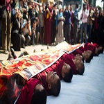

<!-- # 言说自我的困难 -->

一个人读了很多古今中外的书籍，他并不一定就了解中国，了解他当下的生存境遇，有可能倒是越读越糊涂（当下很多知识分子就是这样）。能真正描述出自己的生存处境、让自己发出声音是一件异常困难的事情。因为我们每时每刻都在受着西方话语霸权的压迫。

李猛老师在最近的讲座《异己的传统:汉译世界名著与中西体用之争》之中说过这么一段很有价值的话：“我今天最大的困惑是，我并没有找到中国人理解西学最关键最核心的切入的地方，模糊的感觉，生存体验，转变为中国人自己的汉语来表述西学经验，这是最大的挑战。如何用最平实的语言来讲述亚氏思想。我一讲中学一屋子人，讲西学就剩下几个人，好像是个专家性的，与我们生活的切身性依然是西学研究者最大的问题。

”李猛老师的这一番话是相当深刻的，他说出了中国学界普遍面临的巨大困境。

前不久我转发了一篇汪晖的文章《东方主义、民族区域自治与尊严政治——关于“西藏问题”的一点思考》，恰好一位藏族朋友看到了。他对汪晖的这篇文章提出了强烈的批评：

**

“****作为一名学者，这篇文章无异于一篇毁灭之作，它标志着一颗灵魂的良知彻底泯灭了。没有良知，便无所谓灵魂，那么已就不再有真正的人，只不过是发声的机器而已。高谈阔论，旁征博引，故弄玄虚，整篇文章看似理论深刻，实则不过是一篇空洞无物的政治宣传罢了。谈论的是“西藏问题”，通篇只说西方和中国的利益与矛盾，却只字不提作为核心和对象的“藏人”，慕尼黑的悲剧再一次重演，变换了的只是导演！”

**

我接着回应了这位藏族朋友的批评：

“你的批评在一定程度上是合理的。汪晖并没有从藏人的内在视野来考察世界，也就是他没有认真学习过藏传佛教、也没有认真研究过藏族的历史，也没有藏区生活经历，就来谈西藏，谈出的西藏必然是一个他者眼中的西藏。作为一个汉人学者要真正理解藏人的内心世界是非常困难的，我希望以后有学者能理解藏人。不过汪晖主要要分析的是：世界中的西藏，要清理的是西方人对西藏的那种想象中的歪曲所产生的东方主义，还有从近代以来在帝国主义——民族国家话语霸权之下的西藏命运，还有放到整个中国中来观察处于民族区域自治之中的西藏，也就是他只能从外围来观察西藏。但是从内在藏人的视野观察西藏，他还做不到。

真正要研究西藏，必须深入到藏人的最内心深处，理解到藏人的信仰世界，理解到他们的喜怒哀乐、悲欢离合，理解他们远古悠久的历史传统，脚要踏在西藏的土地上。在这一方面，我没有看到哪位汉族学者做好了，前次去西藏，看到藏大出版了很多藏族学者的书籍，作了很多深入的研究，不过一个缺点在于，使用西方的学术词汇、框架来研究西藏，总是感觉离真实的西藏很远。也就是藏人的声音很难发出来，因为找不到比较适合的语言发出声音，另外来自汉区、西方话语霸权的双重重压，藏人的声音就被埋没了。我倒是希望有思想抱负的藏族人能发出他们最内在的声音。”

前不久另一个朋友与我谈到汪晖的时候就说：“听过几次汪晖的讲座，他确实提出了很多新颖的观点，但总是感觉他还差着点什么。”我也听过一次汪晖老师的讲座，阅读汪晖的时候，也和这位朋友有相同的感觉，汪晖还是差了点什么。我给朋友的答复是：“汪晖差了一个内在视野，他总是从全球知识界寻求各种各样的学术资源，而且他努力的想融入国际学术界，和他们对话，所以他有了外在的视野，他观察中国总是更多的站在国际学界的位置上俯视这个“他者”的中国，而不是钻进中国的五脏六腑里面去观察中国，然后让中国自己说话，这就是汪晖搔不到痒处的原因”。

汪晖的话语总是与中国自身的经验隔着一层雾，若隐若现的抓住了写东西，但是又无法说的痛快淋漓。他在研究西藏和中国的时候都缺乏了一种“内在视野”，所以他无法精确的描述出我们脚下的经验。不过汪晖在言说中国经验的时候已经远远的超越了当下的大部分学者。所以我还是非常敬佩汪晖了。

甘阳、刘小枫也是我敬佩的学者，不过他们在描述我们的生存经验的时候也是感到无力，就是很难搔到痒处，就给人感觉还是夹生饭，相比来说刘小枫更给人一种夹生饭的感觉，甘阳《将错就错》的小短文已经很熟了，不过缺乏的是思想的架构。甘阳写的《政治哲人：斯特劳斯》已经有了强烈的问题意识，你读着的时候可以感觉到他这篇文章虽然是写斯特劳斯的，但是它和我们的生存经验有着切身之处，有一种“熟味”，这已经是当下学者研究西学所能达到的最高水平，但还是有点夹生饭的味道在里面。我记得我当初在读回族历史学家纳忠写的《阿拉伯通史》的时候，让我感觉大快人心，我真正能感受到里面那种与我的生命相激荡的东西，他已经把那种伊斯兰教的精髓成功的用汉语表达了出来，可以说他是成功的把伊斯兰人的生命经验很切合的描述了出来，要知道中国的回民已经学习汉语至少700年了。但是我们现在还完全不能做到成功的用汉语把西方人的生命经验切合的表达出来。费孝通的《乡土中国》使用简单明了的语言很切合的把中国农村的社会经验描述了出来，这真的是非常非常不容易的。你看看现在这么多专家在研究人类学，但是有谁能用汉语和人类学的知识很切合的描述出一个少数民族的生命经验了呢？没有。都清一色的是一些客观性的资料堆砌，而无法真正进入少数民族的生命经验之中去。

你有没有这样的时刻：有时突然看到某人写的一句话或者一段话，你会赞叹不已，哎呀，对对对对，就是这样，你说出了我心中的想法。其实很多想法我们都是隐隐约约的有的了，但是我们自己还无法为之命名，无法言说出来，直到有一天某人用了某个概念，某句话，某个理论很好的把我们的这种经验描述了出来，然后我们在阅读此人的话语的时候感觉到了一种痛快淋漓，对啊，就是这样啊。这就叫做切合了我们的生命经验。

我们在读康德、柏拉图的著作的时候，感觉没有任何味道，这就是因为我们的生命经验与之有隔阂。总是感觉非常的生疏，但记得有一次师大请了著名史记专家韩兆琦老师来讲，大家都听得非常的痛快，最后全场的人都说：“韩老师，再给我们讲讲，不要离开”。这就是因为韩老师能够用现代汉语成功的把史记当中的生命经验传达出来，另外也是因为史记本身就是我们汉人生命经验的一部分。前些年我读牟宗三《才性与玄理》《历史哲学》，牟先生的每一本书籍都能给我很大的震撼，感觉读他的书籍就是痛快淋漓，那种生命经验在互相鼓动。其他新儒家的书籍我没有这么大的体验。要把康德的生命经验用汉语成功的传达出来是非常困难的，比起传达孔子的生命经验要难得多。

现在我们中国人已经有了无穷丰富的实践经验，但是这些丰富的经验总是无法被很好的描述传达出来。我们找不到很好的概念、语言、理论来言说我们的经验。今天中国经验变得异常的复杂，因为中国是农业社会经验、社会主义经验和资本主义社会经验复杂交织的混合物。西方的话语、中国的话语、苏联来的话语已经完全的混合在了我们的思想观念之中。所以在描述我们经验的时候就显得异常困难。仅仅使用本土传统资源的话语，我们总是感觉有些经验总是无法表达出来，因为我们的经验已经包含了从全世界输送来的经验了，但是如果我们套用西方的话语来描述我们的经验又会显得搔不到痒处，总是隔着我们一层纸。这造成了两难：局限于自己的传统话语，只能是自说自话，而完全使用西方概念又说不出我们的经验。

因为今天中国已经深深的介入到全球化之中，所以我们在诉说自己经验的时候必须是：内在视野和外在视野都具备。因为我们的自我意识一部分由我们过去的历史传统，还有我们当下的实践来塑造，另一方面我们又强烈的受到了外部世界特别是西方的塑造。内在视野就是指我们必须理解我们自身的传统、历史、实践，我们必须清清楚楚知道自己是如何来的，另外外在视野就是指我们必须知道外面的世界是如何理解我们的，看待我们的，已经外面的世界是如何运行的。就比如如果要想真正理解西藏，就必须兼具西藏内在视野和西藏的外部视野，我们必须学习藏传佛教、了解藏族历史、亲自和藏族人生活交谈等等。另外呢，还必须理解中国共产党对西藏的政策和态度，也必须理解西方人对西藏的看法，只有在这种内在视野和外在视野的不断对话之中才能形成对西藏比较好的理解，西藏也才能真正言说自己。这样看来，汪晖研究中国还需要做的就是：深度从内在了解中国的历史、传统，真正的扎根到农村或者工厂去生活一段时间，这样才能真正理解现时代中国农民和工人的生命经验。曹锦清、贺学峰、董磊明等一批三农专家对中国的内在经验已经非常的熟悉，但是缺乏了另一个视野，这就是外部视野，也就是他们还做不到像汪晖那样站在国际学术界的高度来俯视整个中国农村。当然了要做到内外视野兼有是非常困难的了。

难以言说自己的经验也是我一直面临的困难，因为我想切实的把农民的经验经验传达出来，让农民自己说话，但其实是非常困难的了，我经常用“我”作为文章开头，最重要的原因就是，我对自己的经验感触最深，也最熟悉，而一旦我扩展到整个农民群体之中去言说，总是感觉说出来的话语空洞无聊，总是抓不到真正的那种经验。所以为了避免空洞无聊我只能来写我自己的经验。比如这篇文章，又只是隐隐约约的描述了部分经验，总是有些经验有口难言。因此也就显得有点空洞无聊。

我以前说过：当你不能言说自己的时候，别人就可以随便的想象你、误解你、偏见你、言说你。只有自己能够言说自己，我们才能掌握自己的命运。

（采编：陈肃；责编：彭程）
