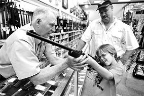
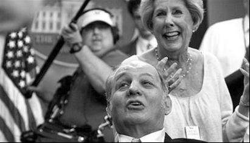
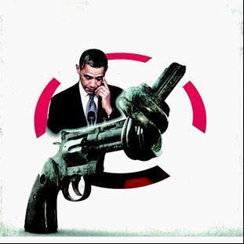

<!-- # ：美国枪支如何自由 -->

### 引言

美国时间2012年7月20日，科罗拉多州丹佛，一袭黑衣的24岁科罗拉多大学神经学博士詹姆士·霍尔姆斯走进了当地一购物中心的影院，放映厅中正在首映新电影《蝙蝠侠前传3：黑暗骑士崛起》。霍尔姆斯径直走向银幕，然后竟转身向观众席投掷了催泪瓦斯，随后影院中枪声大作、尖叫四起。事件造成12人死亡，59人受伤。

大约三个月过后，奥巴马和罗姆尼站在辩论台上，这是美国总统大选的第二轮电视辩论。

“下面有请妮娜.冈萨雷斯。她的问题，我们也听到过许多次了，不管是在网上，还是在这里。”

“奥巴马总统，08年民主党全国大会上，您说将不保证AK47等不会落入罪犯手中。在限制攻击型武器方面，您的政府都做了些什么，或者有何打算？”

话音刚落，曾当过12年宪法学讲师的奥巴马就条件反射似地迅速作出了如下回答：**“我们国家信奉宪法第二修正案，我也信奉宪法第二修正案。长久以来，我们拿枪打猎、进行体育活动，并以此保护自己......”**

随后他才谈到了他所遇见的丹佛枪击案中已经康复的受害者，他又说到：“我想做的，就是将如何减少暴力引入更广泛的讨论，一部分是......”然而到了这里，之前言谈流利的奥巴马却少见地停顿了下来，然后用迅速地语气带过了如下一句话：**“能否让攻击性武器禁令再次生效**，但还有一部分......”

之后，随着和罗姆尼的交锋，辩论似乎越来越离题了。奥巴马在就这个问题的最后时间里竟大肆谈论在他的任期内较差的学校在数学和理科上取得了进步以及谈论教师和经济发展的关系。主持人不得不打断了奥巴马，她颇有些无奈地说：“总统先生，之前谈的是枪支问题！”

（[http://v.qq.com/cover/f/f2ni54bmo8irvtp.html?vid=q0011qdc5kj](http://v.qq.com/cover/f/f2ni54bmo8irvtp.html?vid=q0011qdc5kj) ,视频中一小时15分处）

12月14日上午9点半，20岁的亚当.兰扎离开家，来到了他母亲任教的那所小学，打破窗户的玻璃强行进入。面容清秀的他闯入教室，随后一言不发，扣动了他手中的那支“大毒蛇”步枪的扳机。事件造成28人死亡，18名当场死亡的儿童、2名在送医中不治身亡的儿童、6名成年人、他亲手在家中杀害的母亲，以及开枪自杀的他。

这一次，奥巴马当众拭着眼角的泪水，他说：**“我们必须团结一心，采取有效措施，避免此类事件再度发生。放下党派成见。”**在当月月底的电视专访中，他承诺在第二任期内积极推动提出一系列综合性控枪对策。

**为何一谈到枪支问题，总统开口便说到宪法第二修正案？什么是宪法第二修正案？攻击型武器禁令又是什么？它为何只能够“再次”生效？为什么谈论枪支问题要强调“放下党派成见？”? “枪支自由”的美国，枪支如何自由？**

### 勇敢的枪手与宪法第二修正案

“枪支自由”成为美国传统观念中的重要一部分真是一点都不奇怪，**当第一批欧洲人在16世纪踏上这片大陆的时候，他们需要时刻准备着扣动扳机以驱逐印第安人或是抵御来袭的猛兽**。在那时欧洲列强争夺殖民地、社会秩序缺乏的北美，一支枪在手，就给保障自我安全提供了机会。此外，正如奥巴马所说的“我们拿枪打猎”，早期的北美打猎是一项重要的谋生方式，根据1770年的统计，在当时的北美的出口物资中，鹿皮的价值竟然排到了第五位。

袁征教授在《论美国枪支管制运动的发展及前景》一文中，说到：**“毫不夸张的说，最初的开拓者们是依靠坚定的决心、宗教信仰的支撑和先进的武器在北美大路恶劣的环境中求得生存。”**

正因为如此，北美初期的政府甚至强调携带枪支的必要性。例如1623年的弗吉尼亚就禁止没有携带武器的居民出外旅行、去田里劳作，1644年马萨诸塞则规定对于任何没有武装起来的公民处以6先令罚款。

在这样的观念之下，各州逐渐形成了民兵组织，以担负防卫任务。**而正是这些民兵组织，为美国的独立起到了无可替代的作用。**1775年4月19日的清晨，莱克星敦响起一声清脆的枪声，开枪的正是民兵。**不管是独立战争还是随后的“西部大开发”和南北战争，枪支都一直伴随着美国人。逐渐地，枪支竟然成为了这个国度“持续的象征和保守主义的图腾”。**这样，也就不难理解宪法第二修正案了。

1787年，美国宪法草案提交到各州立法机构予以批准，但当时的草案更为注重的是其政治制度的构建，而忽略了对公民权利的列举，于是联邦党人承诺在第一届国会中加入保障人民基本权利的内容，这就有了著名的——《权利法案》。

《权利法案》即美国宪法第一至第十条宪法修正案，其中第二修正案叙述如下：**纪律严明的民兵是保障自由州的安全所必需的，人民持有和携带武器的权利不可侵犯。（A well regulated Militia being necessary to the security of a free State, the right of the people to keep and bear Arms shall not be infringed. ）**

这，便是“枪支自由”“持枪权”的**宪法基础**，如果你理解了在美国历史上手持枪支的民兵是多么的重要，想必你就清楚了为何“持枪权”会出现在《权利法案》中了。

不过，对于这一修正案，宪法学桑福德.列文森却说：“此条款从来没有人认为它是清晰的，它是所有修正案中最糟糕透顶的。”宪法第二修正案到底“糟糕透顶”在哪里呢，别着急，我们很快就会说到。在这里，我们首先来看看在美国历史上“限枪”声浪的开始吧。

### 刺杀、犯罪与限枪派

20世纪30年代，美国迎来了社会发展的寒冬，遭遇了著名的“大萧条”，失业人数蹿升，治安混乱，犯罪不断滋生。1929年在风城芝加哥的街头，就发生了犯罪团伙间的激烈枪战，而在1933年新上任的总统富兰克林.罗斯福险些在迈阿密被枪杀。在种种事件之下，呼吁限枪的声音开始壮大，枪口逃生的罗斯福则力主推动了《1934年全国枪支法》，试图加强枪支管理，开始“限枪”。

**《1934年全国枪支法》作为美国联邦第一部系统管理枪支的法律，试图以征税的方式迫使枪支逐渐退出市场，同时也对枪支登记作出了详细的规定。**然而遗憾的是，在国会辩论中只有B类枪支才被允许纳入该法规制中，B类枪支包括冲锋枪、短管步枪、干扰器、破坏性武器、手榴弹、炸弹等。从枪口装载子弹的武器则被称之为“陈旧武器”，未作限制。这些“陈旧武器”就包括了左轮手枪、步枪甚至还可能有大炮和追击炮，只要弹药是从枪口装载即可，很显然，“陈旧武器”的威力并不“陈旧”。

无论如何，“限枪”的序幕已经拉开。**仅仅四年之后，《1938年联邦火器法》生效**。这一次，财政部被授予了给枪支经销商、制造商和进口商颁发执照的权利，同时禁止销售武器给已经确认有重罪的犯人和逃犯，认定运输被盗枪支被认定为非法。**这部法律开创了“限枪”的新思路——对持枪人的限制。**

不过，在这部法律出台之后，美国的“限枪”进程进入了停滞的状态，而这两部法律无论是在立法上还是在执法上实际都并不令人满意，例如《1938年联邦火器法》对于禁止向重罪犯人出售武器的规定，必须证明枪支提供商是在明确知晓的情况下向罪犯出售武器，因此枪支提供商实际上并不需要额外的注意，是否“明确知晓”也极难证明，所以从这部法律颁布到60年代，每年因此而遭逮捕的人仅仅不到100人。

另一场社会动荡正在等待着美国人，它将会把“限枪运动”推上新的高潮，这就是20世纪60年代。这一时期，涉枪暴力犯罪愈发严重，而三个著名的事件更是震惊全美，它们正在悄然地改变着美国人的观念。**1963年正在向民众挥手致意的肯尼迪总统遭到枪杀，1968年民权领袖马丁路德金在旅店遭到枪杀，同年肯尼迪总统的弟弟罗伯特.肯尼迪遭到枪杀。**一声声枪响，身边的同僚被枪口夺走生命，这无疑缓解了参众两院激烈的争辩，使得共识逐渐达成，在总统约翰逊的推动下，《1968年枪支管制法》应运而生。

**《1968年枪支管制法》使得联邦枪支管制迈入了巅峰**，它规定：除销售商外，禁止跨州邮寄、运输枪支；禁止出售小型冲锋枪、炸弹、手榴弹等破坏性装置；不得出售转让枪支给未成年人、罪犯、逃犯、精神病患者、吸毒者等，上述人员也不得持有枪支。它也对枪支的购买者设置了年龄的限制：二十一岁以下的的人不得从联邦许可的经销商购买手枪或手枪弹药；步枪、鸟枪及但其弹药只出售给十八周岁以上的人。

这部法律铸就了美国20世纪60年代枪支管制的“黄金时代”，不过随着社会动荡的消逝，枪支犯罪逐渐减少，北美大陆的居民又开始怀念那自由自在的“持枪岁月”了，**“持枪派”的力量一直在壮大着，和美国宪法第二修正案一起，等待着属于“持枪派”的“黄金时代”。**

### “持枪派”VS.女强人

无论如何，那些手持枪支保卫自由的民兵形象已经深入美国民众心中，再加上《权利法案》中的第二修正案对于“持枪权”的肯定，“禁枪”对于美国人民几乎是不可能的事情，而“限枪的尺度”也时时遭到质疑。

**在每一次的限枪法案制定之时，都能看到一个组织的身影，那就是大名鼎鼎的NRA——美国步枪协会。**这一组织早在1871年便已成立，自称是“美国历史最悠久、规模最大的民权维护组织”，目前其会员达到400万人。其会徽中的雄鹰骄傲地展翅，脚踏两杆步枪。美国步枪协会是全美社会中最为强大的单一问题利益集团，其组织之严密、资金之雄厚、影响力之巨大，一直是“限枪派”所无法比拟的。

《1968年枪支管制法》颁布之后，美国步枪协会开始全力投入反限枪运动，**他们全力支持反对加强枪支管制的总统候选人，在其出版刊物上宣传持枪自由，通过游说争取议员的支持。**他们甚至要求自己的会员根据是否支持枪支拥有来给议员候选人评分，据此出版《投票指南》，其对于政治的影响力可见一斑。1968年后，美国的枪支管制似乎进入了真正的寒冬。

在1986年颁布的《1986年武器拥有者保护法》是对《1968年枪支管制法》的局部修订，这一法案标志着“持枪派”的巨大胜利，它在跨州销售、销售记录、武器登记上都消弱了原先法案的强度。60年代限枪运动的高潮早已不复存在，而之前的共识也正随着社会安定而自我消解。

可是几乎就在《1986武器拥有者保护法》出台之时，**一个女人站了起来，她致电美国步枪协会，称：“我会用我的一生来与你们斗争！”这个人的名字叫做萨拉布雷迪**，1981年在里根总统遇刺事件中她的丈夫吉姆.布雷迪头部中枪、导致瘫痪。四年之后，萨拉带着她的儿子去搭乘朋友的车，她的儿子在车上寻得一把手枪，好奇地玩弄着，萨拉发现后震惊地夺去枪。此后，她开始下定决心，投入枪支管制事业，她领导的手枪管制有限公司成为了枪支管制运动的重要力量。

**1987年开始，这位女强人和他的丈夫领导的手枪管制有限公司开始四处呼吁，全力推动国会通过以他们名字命名的《布雷迪法》。**这部法案要求购买手枪者必须等待一周，在等待期内让警察有时间对购枪者进行背景核查，同时也让购枪者可能的愤怒情绪得到缓解。这样的内容不得不说是较为温和的，然而在强大的“持枪派”干扰下，依然未能得到通过。不巧，又是几起恶性枪支案件使得《布雷迪法》起死回生，1989年加州斯托克顿校园枪击案，5死、29伤，1991年德克萨斯餐厅枪击案，22死、23伤，又一次是悲剧使得民众、政客的心中产生了震荡。1992年民主党克林顿当选，同时民主党也在两院占据了优势，克林顿上任后开始推动《布雷迪法》，这部法案最终在1993年通过，只是一周的等待期变成了5天，并且只审查购枪者过去五年的情况。

**不过，几乎是在死局中逆袭的限枪派乘胜追击，在他们的持续努力之下，1994年通过了《联邦攻击性武器禁令》。**这部法要求枪支经销商向ATF（美国烟草火器与爆炸物管理局)提交指纹和照片，向当地最高执法官承诺从事的商业活动不为州法、地方发所禁止。更为重要的是《联邦攻击性武器禁令》禁止生产、销售包括AK-47在内的19种可以半自动击发的步枪、手枪和猎枪，以及装10颗子弹以上的弹匣。

当然，“持枪派”的影响依旧处处可寻，例如此前购买、持有的以上枪支、弹药依然可以继续拥有，再如禁令中包含了**“落日条款”——法律的有效期为10年，2004年到期。这也就是为什么在文章开始奥巴马说“能否让攻击性武器禁令再次生效”的原因了。**

### 法律？政治？

**在这里必须首先说明的是，在美国有关枪支管制的法律并非只有联邦法律，相反，各州各地的枪支管制法不仅一直存在，而且往往是联邦法律的先行者。**例如，美国最古老的现行强制枪支管理法——《苏利文法》，就是纽约州法；再其次，在规定购枪等待期的《布雷迪法》通过前，就已经有24个州实施了本州购枪等待期的规定。各州的枪支政策从一开始便不同，而在社会变化中，也各自做出了调整，进行着枪支管制的“州实验”，其许多成功经验被吸收进联邦法律。**然而各州通过州立法进行枪支管控由于联邦最高法院的两个判决而蒙上了阴影。**

文章一开始说过，宪法第二修正案遭到了很多学者的批评，认为其语词不清、含义模糊。再来看看第二修正案原文吧：“纪律严明的民兵是保障自由州的安全所必需的，人民持有和携带武器的权利不可侵犯。”**从这条法律上来看，人民持枪的权利是建立在民兵组织的基础上的吗？第二修正案保护的究竟是个人还是集体的权利？**这些争论从未停歇，而宪法的解释权拥有者——联邦最高法院也极少对此作出正面的解释，直到08年的“哥伦比亚特区诉赫默案”和10年的“麦克唐纳诉芝加哥案”，联邦最高法院不得不对这两起“实验案件”作出判决。

九名大法官，两次判决每一次的结果都是5:4，但每一次的结果都是“限枪派”和州政府所不愿看到的。联邦法院在赫默案中裁定：**第二修正案保护的是个人基于传统的合法目的拥有并使用枪支的权利，与是否参加民兵组织无关。**至此，剩下来的争论就只有：个人持有和携带武器的权利是否适用于州，也即持枪权是否是一项基本权利，从而适用于全美。在麦克唐纳案中，最高院裁定：**个人持有和携带武器的权利是一项基本权利，通过第十四修正案的正当程序条款适用于州。**

同样具有很长历史的州枪支管制立法遭遇到了重大的打击，查看最高法院法官的意见书，你会看到长长的极为精妙的宪法解释，充斥着对第二修正案每一个词汇的考量。然而，这背后真的没有政治意识形态的力量吗？当然，绝无可能。

事实上，无论是联邦立法还是州立法处处都在党派政治的影响之下。《1934年全国枪支法》，在任总统罗斯福，民主党人；《1968年枪支管制法》，在任总统林登.约翰逊，民主党人；1993年《布雷迪法》、1994《联邦攻击性武器禁令》在任总统克林顿，民主党人。**在共和党人担任总统的时期，推动枪支管制法律几乎是不可能完成的任务。而枪支管制的推动还都需要民主党人在国会中占据优势。**

枪支管制如同堕胎、同性恋等等问题一样，成为了驴象之争的绝对战场，只是有的战场双方默契地不踏足其中，而枪支管制，又恰恰是不得不面对的。这就是为什么奥巴马在康州小学枪击案的讲话中说到：“放下党派成见。”

### 结语

《联邦攻击型武器禁令》真的有可能重新生效吗？枪支管制有可能恢复生机吗？我不知道，从奥巴马在辩论中巧妙的回答里我猜他也不知道。然而这一次，有点像要动真格了。奥巴马已责成副总统拜登带领政府跨部门工作小组研究控枪对策，他承诺将根据这个小组提交的建议来形成并提出一个具体计划，并推动国会通过相关法案。

奥巴马还对美国步枪协会所提出的在每所学校增派持枪警卫的计划提出质疑。他说，如果防范校园枪击案的唯一答案是“在校园里配备更多枪支”，他对此表示怀疑，并认为大部分美国民众也会对这一计划的有效性心存疑虑。

最终的事态会如何呢？我们拭目以待吧。本文想要做的就是尽量客观地展现美国枪支管制法律的状况，让大家明白**“枪支自由”其实也并不太“自由”。**

【深入阅读】

《论美国枪支管制运动的发展及前景》，袁征，载于《美国研究》2002年第4期； [http://ias.cass.cn/show/show_project_ls.asp?id=87](http://ias.cass.cn/show/show_project_ls.asp?id=87)

《美国控枪史，一场法律之战》； [http://news.ifeng.com/gundong/detail_2012_12/30/20679223_0.shtml](http://news.ifeng.com/gundong/detail_2012_12/30/20679223_0.shtml)

《奥巴马承诺力争明年推出控枪新举措》，新华网； [http://news.ifeng.com/world/special/meiguoxiaoxueqiangji/content-3/detail_2012_12/31/20686710_0.shtml](http://news.ifeng.com/world/special/meiguoxiaoxueqiangji/content-3/detail_2012_12/31/20686710_0.shtml)

《美国人的持枪权利和枪支自由》，来自博客——雾谷飞鸿； [http://blogs.america.gov/mgck/](http://blogs.america.gov/mgck/)

七星说法NO.59（编辑：陈澜鑫；责编：石味诗）

**P.S.加入“七星说法读者群”，我们一起说法！群号：262980026。**
