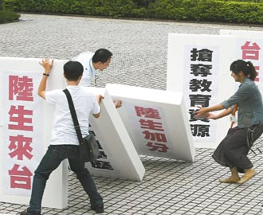

<!-- # 偏見與寬容，歷史與親歷 -->

**偏見與寬容**

（本文原為網路日誌。當時校內外有些事端引得眾人不快；我略有小感，僅針對當時當事作文一篇，與同學們分享。蒙“北斗”同仁錯愛，略作刪節以成此文。）

或許在香港的經歷已讓我受過一番“洗禮”，使我對摩擦和不友善做了比較多的心理準備。來台前，我已經備下滿滿的耐心、理解、寬容、體諒甚至憐憫；真正過來後，反倒沒受到什麼心理衝擊。目前來說，在臺灣，在政大，還不錯。

陸生學位生初到臺灣，我們都以“小白鼠”自嘲。新客進門，客人自是忐忑，主人也手足無措。試探與磨合，免不了摩擦和不快。我們常常強調大陸的複雜和多元，無法一以概之；可是相比於數以千百的陸生，兩千三百萬臺灣人恐怕蘊含著更多的複雜和多元。臺灣人對大陸，有好奇而瞭解的，有好奇而不解的，有好奇而誤解的；有瞭解而不感興趣的，有瞭解而刻意曲解的，有不解而不感興趣的。自然，陸生迎面撞上的偏見不知幾許。我們會錯愕，會憤怒，會失望，會反擊。

偏見絕非臺灣的特產。這世界上的每個人，恐怕或多或少都生活在自己或他人編織的偏見之網中。這個世界太大，每個角落每時每刻都發生著無數的人與事；每個個體又太小，無力一一瞭解它們的紛紛種種，一一查驗事情的來龍去脈、人物的來蹤去跡。很多時候我們會偷懶，會抄近道，會跳過“小心求證”的部分而直接把“大膽假設”當作真實接受下來。而一旦我們用錯誤的成見去推猜他人，就會傷害到他們。人人都有懶惰的本能，因此人人都有自己的偏見和不瞭解，也都有用偏見刺傷他人的時候。

許多臺灣人對大陸不瞭解、甚至不甚好奇，這並不怎麼奇怪，正如更多的大陸人對臺灣並不瞭解也不甚好奇一樣。甚至“大陸人”對自己的每個角落又何嘗都瞭解呢。東北分開三個省，吉林省裡有個吉林市；內蒙並非人人都騎馬，也有大城市；武漢分三鎮，漢口僅其一。這些好像都是很簡單的事，可一樣有大陸人不知道。這幾天巴以戰雲密佈；前幾年達爾富爾據稱爆發“種族清洗”；紅色高棉用四年將本國人口四分之一一筆勾銷——這些事不可謂不大，然而有多少大陸人去關心、去好奇？去好奇，往往需要一個理由；去理解，往往要費許多功夫。很多事情，只要不在生活中佔有顯著的位置，我們就沒有那麼大的興趣去孜孜求知。陸生在臺灣生活，每天從睜眼到閉眼都是“臺灣”，自然有強烈的動機去瞭解和理解“臺灣”。反觀與我們接觸的臺灣人，對他們來說“陸生”乃至“大陸”只是生活中太小的一部分。他們沒有那麼強烈的動機去費心瞭解事情的全貌，理解我們的處境，於是——或許有時，或許常常——只有憑籍固有的“偏見”做判斷。若他們付出功夫來傾聽我們，那自然是極大的善意，值得我們熱烈的回應；若他們沒有付出那個功夫而是聽任本能的懶惰，那也當得我們的寬容，因為我們自己也有犯懶、聽任自己陷於偏見之時。有些臺灣人“俯視”大陸以寄託自己的優越感——但哪裡沒有這種人呢？有些大陸人還以輕賤自己的國家和同胞來維繫優越感呢。

若有臺灣人因為缺乏瞭解而傷害到我們，那當然值得我們的回應與反駁；但若事事都歸結到“你們應該多瞭解大陸”上，既是苛責，也不可能。我更傾向於用理解的態度面對他們的“不瞭解”，用寬容的態度面對他們的“偏見”：既然你不瞭解，你有偏見，而且你沒有足夠的動機去修正自己的偏見；好，我明白，我來幫你瞭解我，我與你交流，我主動降低你的“瞭解的成本”。

總之，不瞭解，不理解，是很正常的情況，未必故意針對我們。傲慢與輕視，也不是任何一個地方的專利，每個人身上——包括你我——都有。

今天身在臺灣，有些偏見直挺挺地壓到了我們的身上，讓我們疼痛，於是我們不滿。而大陸人所持有的偏見，也會傷害到其他人，只是我們未必是受害者，感受不到。在網上留言、攻擊在台陸生的臺灣線民，與隨口叫囂“血洗東京”的大陸“愛國青年”，有什麼不同？一樣是不瞭解甚至無意瞭解真實而複雜的事實；一樣是不負責任地找尋發洩目標，宣洩自己的生活壓力，維持自己的優越感。若我們認為不能通過那些“愛國青年”去描繪整個中國大陸的圖景，恐怕我們也用不著因為那些臺灣線民而改變自己的臺灣印象。那些不瞭解大陸、對大陸有偏見的臺灣人，對我們是個提醒：提醒我們，偏見可以給人帶去多少疼痛，提醒我們切切收起自己的偏見，用小心和謙卑避免在另一時空成為偏見和傷害的輸出者。

**站在大潮的浪尖**

臺灣社會囿於內部問題，用“三限六不”等方式自縛人才競爭的手腳，我作為局外人都要為之扼腕。然而不得不說，種種限制其來有自。人才政策，教育政策，這些當然是關乎國本的問題；可恰恰，臺灣的“國本”是什麼，還陷在爭議裡。“中國”名號在國際上已被大陸佔有，此為不可逆轉的大勢；“中華民國”的外套穿在台澎金馬身上，陳舊而怪異。但若正式換上“臺灣”這件新衣，則內不符憲法，外制於大陸。“臺灣”到底是什麼？“中國”到底是“臺灣”的什麼？

陸生來台求學，本來可以是很單純的事情；可惜，任何問題只要帶上“陸”“中”首碼，就得在臺灣的輿論場中受到政爭話語的染色，一概“政治化”。在台陸生的一舉一動之所以敏感，我們的幾塊錢學費、獎學金之所以被盯著不放，並非我們自己有幾分能耐，而是身份標籤使然。種種爭議，項莊舞劍、意在沛公，是臺灣人自己的“國本”爭議的宏大圖景一角。我們只是臺灣政治對峙的符號而已，我們的福利和待遇也算“躺著中槍”，超出單純的政策考量，變得格外敏感。

有學者認為，若一個社會對國族認同、疆域範圍存在高度共識，則其民主化更容易鞏固。臺灣恰恰沒有對國族和疆域的“高度共識”，甚至連“共識”都沒有。只有它引以為傲的憲政體制，所謂“民主”，所謂“自由”，可以積極地（而非消極地）維繫臺灣作為一個政治實體的運作。馬英九念茲在茲“一國兩區”喊得理直氣壯，無非因為它來自中華民國憲法；蔡英文模模糊糊的“臺灣共識”拿得出手，無非因為她訴諸“民主”、取法公投；謝長廷在民進黨內也敢講“一中”，靠的也是“憲法”這個首碼。臺灣可藉以安枕的社會共識唯有其民主制度和價值，它們在臺灣已擁有絕對“政治正確”的規範性意涵。

憲政意味著對各種觀點的制度性保障，允許它們成為政治動員的理念平臺；民主不免吵鬧，爭鬥，甚至攻訐。這就是臺灣，這就是我等陸生選擇前來的臺灣。在這個臺灣我們會看到立委用對陸生不友善的喊話贏取掌聲，在這個臺灣我們看到媒體用誤導性報導博得市場。在這個臺灣，“統獨”話語既然是政治動員最有力的武器，那麼必然有人撿起它、使用它，就算沒有民進黨也會有民退黨，沒有蘋果也會有香蕉。這是島內政治最洶湧的部分，而我們，站在風口浪尖。

在這個民主制度下，臺灣沒有一個一言九鼎的“政府”。立法機構，行政機構，司法機構，面對陸生有不同的角色。國民黨，民進黨，其他黨派，對待陸生有不同的看法。中時、蘋果、自由、聯合，它們都有自己的取向和態度。我們難以簡單地評判臺灣“政府”，因為不存在這個一元性的“政府”。陸生能夠來台，有賴一些政治勢力的推動；陸生來台後憂擾紛紛，因為有些政治勢力在反對。所有議題都在沖折、交鋒、妥協、平衡。推動陸生來台者，與詆毀陸生者，並不是同一群人——前者沒法封上後者的嘴巴，哪怕前者能夠在立法院以多數通過議案。

這種多元的狀態，讓我不願意用“臺灣人如何如何”，甚至“有的臺灣人如何如何”的語言下判斷，起碼我會特別謹慎。若要做判斷，我願意儘量指明具體的人群，說明白是“哪一些”臺灣人，以免殃及對我友善者。“臺灣人”這樣的名號抹殺了太多的多元。對我友善者，見之或許心涼；對我敵視者，見之如獲至寶，更堅定其敵視與偏見。我們不想被當作“大陸人”一以視之；而同理，臺灣的朋友們也不希望自己“被”如此。我以為，就事論事是比較好的態度：有偏見，糾之；有無知，知之；即可。不必帶著防禦心態，時刻準備為大陸辯護；也不必匆忙作全稱判斷，對“臺灣”評頭論足。

臺灣社會需要找回面對大陸的平常心，這得花些時間。這點時間在陸生的生命維度上顯得略長，但在宏觀歷史的維度下卻不長。回想幾年前，臺灣政治還處在撕裂社會的省籍對立中；而今它已基本走出那種難捱的困境。我對陸生在台的處境也持有樂觀的看法。千帆過旁是沉舟，我們正是揚帆之人。

我等陸生客居於此，身處異鄉的宏大歷史過程中，甚至成為其中一部：曰不幸，我們要承擔超出己身的榮辱；曰幸，我們有機會目睹甚至影響這段關鍵的歷史。每一天我們與周遭的友善互動，都在歷練自己，都在改變臺灣。寬容，耐心，理解，總是可以把我們引向更美好的社會，更安寧的內心。

**寫在最後**

臺灣的好，臺灣的不那麼好，臺灣的不好，都是我們的收穫。反駁與反抗，當然是我們的正當權利；只是，何須以眼前一得一失來判斷，何須爭眼前那一口氣呢。爭來了，或許後面是空虛；抱以耐心，退一步，溫潤化解，又何嘗不美。

陸生來台，只是龐大時代的小小一角。我願意親眼看看這個角落，所以我來了。臺灣在重新定位自己的身份，這是一個基礎性的變遷；兩岸互動在深化、複雜化，這是一個長期的歷史過程。陸生身處衝撞點，摩擦，磨合，磨礪。我們恰好——幸或不幸——站在這段歷史上，體驗它帶給我們的限制與機會。我對自己說：好吧，擺放好我的平常心，此心光明，亦複何言。

**2012****年11月18日晨8時**

**於政治大學自強十舍**

（採編：余澤霖

責編：余澤霖）
