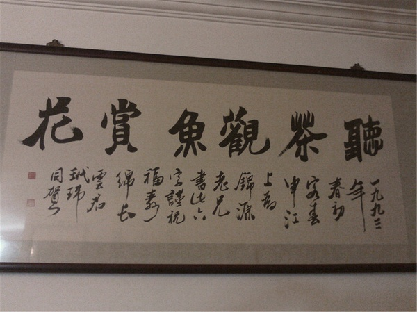

<!-- # 听茶 -->

九三年开春，祖父的挚友国学家陈云君先生客居沪上。是年祖父即将离休，陈先生遂书此六字相赠，以陈桃花潭水之情，亦托名遂合退身之劝。昔为吏经纶事务，今退隐息心自娱，常怀山泽鱼鸟之思，如此，吏隐兼得，无嗔无喜，方为人生至境。

陈先生是陈三立之侄孙，陈寅恪之侄，陈覃恪之子，梁漱溟之弟子。义宁陈氏雄厚的文化基因赋予他以卓敏的才情，幼承家学，孜孜不倦，精诗书，工丹青，通儒佛，兼好育香品茗，身历文革动乱亦不屈从于时势，惟以古石苍苔字作枕，焚膏继晷，力学忘疲。

或许作为长房长孙，我被祖父视若珍宝时时带在身边的缘故吧，据说那年陈先生在祖父的办公室里为他挥毫此书之时，未满四岁的我正在某个角落处爬来爬去，咿咿呀呀不知所云地唱着祖父一字一句教的唐诗。当然我对此毫无记忆，只记得这幅字后来被悬挂在客厅内。我从开始读书识字就一直努力辨认上面的字儿，有事没事就爱歪着脑袋正着看倒着读，揣摩这些黑杠杠背后的意思。少时的我，独爱“听茶”二字，也独不解此二字深意，茶声究竟是怎样的一种象？是浅啜和牛饮的交替？是把盏高低的瀑泄？是瞬时的冷暖自知？

前些日子寒假回沪看望祖父。静夜的客厅里，我和躺椅中的祖父共对这幅字的时候，我问，究竟什么是听茶呢？听的是水声？唇声？还是炭火声？祖父悠悠然道，都是又都不是。你们这代人，大概没有见过北京老铁壶吧。冬天里，一把粗朴的老铁壶烧上水，烧至初沸时便作奇响，可闻见北风摧林，松涛万壑，苍鹰振翅，尘土飞扬。枯桑知天风，海水知天寒，世相万千，人生种种，悲怒喜怨，莫不见容于此一沸，初听嘈杂，再听喧嚣，复往入听，唯觉清寂，从心到百骸，无一不自由。这世上有些道理就是这么怪，本质和真知，总是从看似相反的表象里渗透出来的，有的人能看破，有的人看不破，其中区别的，大概就是修为和业力吧。

二十二岁后趋于简素内敛，只专念于自己的角色使命而无暇顾他，于是轮轴转的种种纷扰龌龊便全无入心的可能。渐渐看透，这世间最强韧的力量是一种有底蕴的温柔，比如滴水穿石，比如外圆内方，这种温柔毫无矫饰，也不具备奇夸的形态，仅仅是一种坚守之上的包容力。孔子所谓的“君子不器”，在我看来，或可同于返璞归真的心象，不制于形，不拘于格，不以物喜，不以己悲，远离对自身过于执念的定义，也就拆除了禁锢身心的藩篱，至美的品性，应该是一种温润的守恒，是于铢积寸累和潜移默化中塑成的某种不渝不灭和不屈不折吧。修心的人，借一把朴素的铁壶便能听到整个世界疏密的鼓点，通乎大道自然而陟于物我合一的高地，相形之下，于人心而言，法门寺地宫里唐僖宗华丽了千年的茶七事，不过是相隔于人的冰冷摆设，止于色相的华赡，望之俨然，即之不温。

如今年纪渐长，偏好素净，惯于饮茶，玫瑰龙井或昆仑雪菊从不离身，也渐悟出陈先生“听茶”二字的神韵了。学问之路漫长修远，须时时抱持听茶之简素心境相对，严己宽人，谦和均足，如此方能戾气不起，知足常乐。

（采编：黄梅林，责编：佛冉）
