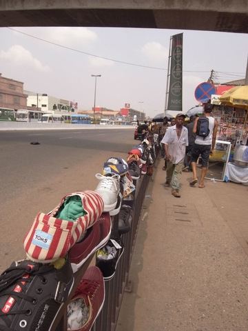

<!-- # 中国人在西非 -->

“Hey, Chinaman, How many seats did you buy!”这是我和伟平坐上加纳公交车时听到的第一句问候。说是公交车，事实上是私自拉客的小面包车，类似于国内曾经盛行过的“招手停”。我们背着行囊笨重地上了车，把包放在膝上，两人座已是挤得难得动弹。这时后面的乘客便来此一句。原来这空间是预留给三人的，我们奋力而无奈地凑了凑，算是又容下了一位。车一脚油门，哐当哐当地开了出去。

初来的时候，每当听到Chinaman，我都不免想回敬一句Negro。后来得知，Chinaman在当地真心是中立的称谓，连在这里多年的华侨也称自己为Chinaman，便顺其自然了。看到亚洲面孔，绝大多数当地人的反应是中国人。人们向你问好，尤其是在市集上，有“你好”，“小伙”和众多功夫片中习得的词汇。在较为发达的南方，孩子们看到你的第一反应是“师父”（师傅），让人忍俊不禁。我的房东告诉我说，西游记在此经久不衰，不仅是他的童年伴侣，更是延续到了当代的孩子们心中。想必，翻译过来的时候未曾翻译这个称呼，以至于不少小孩追问我师父的涵义。向北方走，则大不同了，大家对于中国影像的记忆仍是功夫片，李小龙或是成龙，尤其对《醉拳》情有独钟。

当然，更为丰富和生动的中国形象并非是电视上的，而是形形色色的在非洲闯荡和生活的中国人。仅是在加纳一国，便据称有数万中国商人，且不提源源不断的移民劳工。在稍具规模的城市，便能见到中餐厅或中国人开的旅店，虽说雇佣了黑人作为员工，但服务的受众仍多数是访非的中国同胞。街边硕大的中文招牌，唤起些家乡的气息，可无论是吃住，中式场所都昂贵的让人难以接受，以住宿来说，多是一百多美元一晚，望而止步。

中国元素的介入在当地造就了一番新的景象，“中国”和“中国人”也随之成为了个敏感的话题。在不久前刚刚落幕的加纳选举中，中国被反对党作为攻击现任党的重要论题，官方的贷款，企业的违规操作，个体商贩的活动，都成为了和加纳发展独立性、合法性和持续性息息相关的问题。当然，政治不过是这大场景中的一个曲目。

**淘金客，赌场和妓院**

“当时淘金热的时候，生意比这好。后来不是打死了个小孩么，便冷了下来”。首都繁华市区中餐厅的老板站在门口同我说道。他指的是前不久加纳军警在追捕非法淘金者时击毙的一名中国淘金客。我不知道死者会是个年纪轻轻的人。据老板说，他们的酒楼开了有些时日。当西非的淘金热兴起的时候，这酒楼旁同时兴起的还有妓院和赌场。淘金客们面对着突如其来的财富，不少都养成了“挥金如土”的气概，赌桌上常有一掷千金的“老板们”。

“湖南的小妹们还经常来我这里点外卖，”老板微笑着说，“她们接客都不接外客的。”但随着官方对于非法淘金的容忍度降低（加纳的金矿是由政府企业垄断的，虽说有部分承包给外商的例子，绝大多数是自我掌控），淘金所带来的风险日益增高，涌入的中国淘金客和旁带的产业随之衰落。

我见到的另一位中国商人谈及淘金热时不免一阵牢骚。他并非是在采矿行业，而是经营手机市场。“淘金造就了一大批暴发户”，本来稍好的风气被这些突然富足的人们改变了，他们不仅出手大方，更是习惯用钱去解决问题。在西非，“不夸张地说，在整个非洲”，无论是什么机构办事，都喜欢卡中国人，觉得中国人油水大，且乐于给钱。他接着说，其实非洲在经过殖民时期后受西方法治影响，风气本是较为规矩，结果现在反而是贪污腐败得乌烟瘴气。至于这腐化是由内而生，还是外部所致，我倒是觉得还需仔细验证。

我的确发现，孩子们和小贩们找中国人要钱的几率远远高于其他人，甚至多于游客群体。一次，我们在机场询问签证事宜，还没进去，就被保安拉到一边，旁敲恻隐地说能帮我们盖个章以延期。这种破绽百出的骗局都不想反驳，可对方却说得头头是道；我不免有些无语地走开了。不止一次，别人提醒我说，过海关的时候一定要给工作人员些小钱，以保证过关。“可我又没带什么非法的东西。”我问道。

“可是你是中国人。”

**中国猪，滚出去。**

一日我步行在市区闲逛时，走到了个气氛上不对劲的地方。这附近有体育馆，政府大楼，纪念馆，理应是个热闹繁华的地方。可这地方汇集着在建筑工地上的工人，衣衫褴褛的行人，简直是这个国家贫富差距的缩影。没有人和你打招呼，最多只是抬头瞟一眼。一群年轻人经过，本已经走了过去，转过头来，喊道，Chino，Chino。我转过身，看着他们。他们愈加嚣张，直接叫嚷着“中国猪”，气势汹汹地向我们走来。我们不理他们，他们却一直跟上来，尾随了好一段时间。最后，伟平叫了个出租车，我们简直是落荒而逃了。

回到住所，我又后悔当时没能和他们谈谈为什么会如此愤怒。可当时的情景又不容我想这些。我把经历告诉了房东和同住的澳洲人，他们解释道，中国人不受当地欢迎的原因，一是因为中国人挤占了当地的市场，他们常常假扮成买主到市场去询问价格，熟悉情形后便在附近开一家价格更低的同类商品店铺；二是，采矿冶金企业常雇佣中国工人（大抵是因为中国工人相比当地人确实勤快），他们在当地农民的土地上开矿，警察来之后贿赂警察，事情不了了之。农民自然是受了大亏，气愤不过，诉诸于法；报纸媒体们也呼应得报道，期间没提背后的公司，而是描述了中国的工人。世界各地的媒体的共同之处，在于孜孜不倦地传播着易被人们所接受的情绪和解释。这里，是民族主义的旗帜。城市里的中产阶级和精英们（负担得了报纸的人绝对算是中产阶级）自然在读过这样的报道后义愤填膺。而这种情绪延伸到了其他的社会阶层，更增加了对中国的不满。另有一日，伟平仅仅是在一家店中询问了下价格，便被老板怒吼着赶了出去。

和当地的中国打工者聊过天后，又不免对他们有所同情。除去生意做大的老板和淘金中的幸运儿外，多数人仍是含着背井离乡的忧苦，为谋得一片生存之地。初来乍到，语言不通，又苦于西非各种社会机构和服务的办事效率；据理力争得不到什么好处，唯有以钱通关。中国人的抱团取暖，无论在哪个大洲都是显而易见：我们可以住在自己人把自己人包围的区域内，这个区域如何拥挤我们也不觉有何不妥。我们从块地方的窗户向外望去，口口相传着对于外界的诸多印象：贿赂警察应该给的份额，民众的慵懒和不思进取和刚刚冒出的从业机会和市场。从这个意义上说，未曾有一片异域的土地成为真正意义上的家乡，中国人是永远的异乡者，站在旁边的观察者，务必精明的投机者。在世界的各个角落，与其说在和当地迥异的文化社会做融合，我们不如说是夹在自己辛劳的秉性，流毒的聪明，和保守的老陈之间，生于此，归于斯。

**圣经中的东方**

“你知道么，中国将会统治世界。”新年祈祷后，Angela走出教堂时同我说道。

“我觉得不会。”

“一定会。中国就是那个东方的国度，圣经里就提到过的。它将成为超级大国，并引领世界。”

我的基督教知识匮乏，只是依稀记得基督诞生时到来的三个国王（其实是智者）是来自东方。但我觉得这样的“牵强附会”也真的算是与时俱进了。我提及中国人不受欢迎之处，问Angela她怎么看这些事。

“中国人带来了许多就业机会，他们在这里开厂，开饭店，我们不少人才有了工作，”Angela指指远处的房子说，“那里是中国商品的集散地，大多数交易都在那里。”的确，不夸张地说，中国人让非洲人穿上了衣鞋。这些日常用品变得可以负担，大大得得益于中非贸易。我见到过的凡是能说上正经两句中文的加纳人，都是在广东一带从事进口生意。

在北部，摩托车是最普遍的交通工具，当地一名语法教师对我说，之前有日本摩托，但少有人有钱购买，直到中国摩托的进入，才普及开来。我坐着他的摩托，一路颠过了多哥边境，从中国修过的公路，到未经修整漫天黄尘的土路，其天差地别的冲击不亚于从宽带高速一下到了拨号上网。

当地人对中国怀着比我强烈的信心。街上有出国工作留学，帮忙办理签证的中介，都是打着美国，英国和中国的名号，至少对于他们，中国是可以并列的目的地之一。我和伟平遭遇了不少次“求婚”，听说我们是中国而来，都询问我们是否单身，并开玩笑说能否带她们一起回国。当然，更多的情况是询问如何才能到中国去，签证事宜如何处理，等等。有时候，我觉得他们之于中国，如许多中国同胞之于美国，带着又爱又恨的情绪，有某种程度的厌恶（中国的商品就和美国的快餐一样涌入），可又自觉其昌盛，而心向往之。人们对于中国的不少事都好奇，但转来转去总是那几个问题：“中国和英国比有什么区别”，“中国有像非洲一样的地区吗”，“中国的公路好吗”。最后一个问题源于中国跨越整个大陆的工程队，在再遥远偏僻的地区，总会听到有人跟你说，某某条路是中国工程师修的。

挺有意思的一点是，加拿大，日本，澳大利亚或是欧盟，联合国在这边的项目（尤其是援建项目），喜欢立个牌子，添上双边的旗帜，以示后人；而中国人的项目（在我看来比捐些衣物类的小打小闹要实用多了）却从来没有什么标识，你得要从居民处听说才知道（这里可没有面子工程）。在他们口中的中国，甚至让我觉得有些陌生。它好财而务实，强壮而低调。一个年轻人听着音乐，同我说道，“我喜欢中国，他不像美国。虽然一样好，但他从不说自己好。”这样的谦虚能勾画出我心中一些中国人的身影，他们默默地来到这里，和家乡同来的工人们聚在一起，吃着公房里馒头面条，按部就班地完成工作，然后默默地离开。这恐怕是中国人相比其他来到这里的外来者，最大的不同之处。所谓的中国形象，并非是外交部的宣传，也非是吵闹一番没有团结性可言的中国大商团所使，而是由来去默默的人群映射出来的。

我们没有救世主情结，也没有基督传教士那种解放众生的理想。把中国放入圣经之中是个不恰当的比喻。我们有同情之心，但不乐于说大慈大悲，那是圣人和慈善家的事。而我们分内的事是养家糊口，我们到这是为了这个，塞钱是为了这个，超脱也是为了这个。所以，你在漂泊的中国人身上，是看不到那种自认帮助了别人而内心满足安息的面庞，也没有闯荡一世舍我其谁的气概，只是一脸在生活，在做分内之事的从容。这份从容让外人急躁，因为你似乎有能力关心任何事，可你什么也不关心。在我们看来，为这知足常乐感到欣慰，又为其短浅漠然愤愤不安；你表述后者的时候，一定会有个长者微笑地拍拍你的肩，说小伙子还需成长，勿急勿躁。

记着有一天，我们和比我们大不了多少的中国哥们，从黄昏聊到了深夜，说起青年的热情和梦想，谈到现实的碰撞和起伏。我们喝着酒，大笑大闹，完全不顾忌周围的一切；那一刻，就仿佛回到了国内，回到了家乡。

（采编：黄梅林，责编：佛冉）
