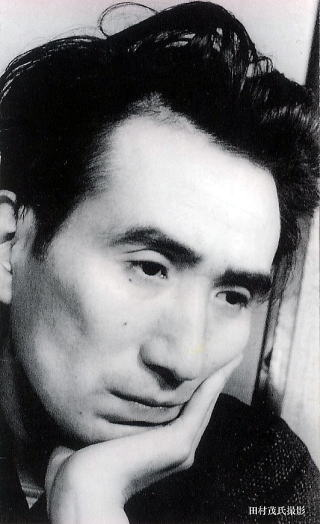

<!-- # 文人之殇——以“临终的眼”看待日本文化之精魂 -->

**内容提要**：“在世界文化史上，日本文化有着自己独特的历史和独特的性格”[1]，著名的日本文化人类学家中根千枝指出，“日本文化不存在完全独自的的框子、形体和骨架”[2]，即其呈现出一种“中空均衡结构”，而“死亡哲学”显然在其中占据了一个举足轻重的地位。“死亡哲学”既作为一种世界观与深深影响着日本文化审美的“禅”融为一体，又作为一种人生观与延续近千年的“武士道”精神相连结。总而言之，“死亡”乃是构成了日本文化的一个关键要素，是日本文化之精魂。而通过日本近代以来的文人之殇——太宰治、三岛由纪夫与川端康成三位文学大师的“辞世”似便可一窥“死之义”对日本文化之巨大意义。

在日本近百年的历史进程中，文人自决似乎成为了日本文化界的一种普遍现象，其数量之多、影响之大，几乎构成了近代日本文化界的一种“独特景观”。据不完全统计，自1900年始至今，自杀的日本知名文学家近二十余人，其中包括了日本第一个文学团体砚友社成员之一的川上眉山、“白桦派”代表作家有岛武郎、《罗生门》的作者芥川龙之介、《夏之花》作者原民喜、《仁义的墓场》作者藤田五郎以及江户川乱步奖得主野泽尚等等诸多至今仍对日本文化界有着巨大影响的作家，而其中对日本各界震撼最大、影响最深的自杀作家，无疑是太宰治、三岛由纪夫与川端康成三人。

太宰治乃日本战后“无赖派”文学的代表作家，依据日本文学之划分，他的小说同时也属于“私小说”的范畴。“私小说”是日本近现代作家纯文学写作的主流模式，大致上有两种类型：一是指脱离时代背景，如实描写家庭和个人私生活的“私”小说；二是指彻底摈弃日常生活素材，集中描写观照人生时所浮现出来的某种心境的“心境小说”。平野谦在《私小说的二律背反》中指出，“直率地自白实际生活事件的作品是广义的私小说，进一步表现这种生的危机意识的作品是狭义的私小说，属于‘破灭型’；叙述克服这种危机而达到更高的精神安定过程的心境小说属于‘调和型’。”[3]而太宰治明显属于前者。“从这位作家的内在精神气质、创作经历或文体风格上看，他的确就是一位极其典型的破灭型‘私小说’家”[4]。无独有偶，对太宰治的这种“破灭”批判最为猛烈的日本文学家之一便是两度入围诺贝尔文学奖、被誉为“日本的海明威”的三岛由纪夫。大学时代的三岛由纪夫因为周围的太宰热潮而读了《斜阳》，认为此虚构作品中贵族的言谈和日本现实贵族相差甚远，贵族出身且曾研读于旧制学院的三岛为此感到难以苟同。之后，三岛在矢代静一邀请下出席以太宰治为首的一次会议，竟直言“我讨厌太宰文学”，对此太宰用一副被骗的表情，以不对特定对象的方式回答道“就算这样说，还是来了啊！应该还是喜欢吧，喜欢吧！”但也对同场的野原一夫吐出“讨厌的话就不要来啊！”一句话后随即撇过脸去。即使在二十年后三岛仍然指出，“我对太宰治文学所抱有的厌恶情绪是异常强烈的——第一，我讨厌这个人的脸。第二，讨厌这个乡下人“洋气十足”的趣味。第三，讨厌这个人扮演了一个与自己不合适的角色，一个想和女人“情死”的小说家，总得多少有点严肃的风貌才行啊！”[5]但是在其晚年与友人村松刚的交谈中又曾坦言“对啊，我和太宰治一样，是一样的人哦。”可以说三岛在精神上尤其是在对于美的极端追求方面是与太宰存在着某种相承之处的。相对的，与三岛、太宰两人恶劣的私人关系不同，三岛与川端康成可谓是日本文学界少有的挚交。1946年，时年21岁的三岛在当时日本文学巨擘川端康成的推荐下于镰仓文库杂志《人间》第一卷第六期上发表文章《烟草》，从而获得进身日本文坛之地位，两人亦师亦友的关系始终持续直至三岛生命的终点。对三岛有着“知遇之恩”的川端康成是在日本乃至亚洲文学史上都有着极其崇高的地位的一位大师，“是继泰戈尔后第二个获诺贝尔文学奖的东方作家，他们率先将东方文学推向世界”[6]，而奇怪的是，在就此的获奖感言之中，川端康成对于此前的日本文人的自杀行为持一种反对与批判的态度的：“一九二七年，芥川三十五岁就自杀了。我在随笔《临终的眼》中曾写到：‘无论怎样厌世，自杀不是开悟的办法，不管德行多高，自杀的人想要达到的圣地也是遥远的’。我既不赞赏也不同情芥川，还有战后的太宰治等人的自杀行为。”[7]但是，三岛自杀仅仅17个月后，川端亦含煤气管辞世，不难想见三岛之死必然对川端康在思想上产生了巨大的冲击。

太宰治、三岛由纪夫与川端康成，三人因缘际会，或赞或争，又无一例外选择了以自杀的方式结束自己的生命。他们为何自杀？这种现象出现的原因何在？当然，“日本作家自杀是个复杂的问题，不能简单的归纳为‘逃避现实’、‘走投无路’等等，这其中的确反映出他们的死的艺术观、宗教观，抑或一种美的追求”[8]，这种自杀行为不仅仅只是他们的一种个人或集体性行为，更是对日本文化中死亡哲学的一种直接展现。而这种死之学又与日本文化的三大要素——“耻感”、“禅”与武士道密切相关，此三者的共融共生影响和形成了“日本文化登峰造极的‘死亡美学’”[9]。

最后，需要格外指出的是：笔者并不是仅仅只要探求这三位大师的自杀，而是试图通过他们的死，探求现象之后隐藏在日本社会与文化之中的精神根源，即日本民族的“精魂”所在。

**

一.太宰治——“耻感文化”的直接表白**

对于日本文化模式研究的相关论著可谓是浩如烟海，而在非日本的外国学者著作中最值得注意的便是美国著名文化人类学家鲁斯·本尼迪克特的大著《菊花与刀》。“本尼迪克特将日本文化定义为‘耻的文化’，西方文化是、‘罪的文化’，对于义理、义务、恩惠等概念进行考察，这些成果带给后续的日本人论极大启示”，“本尼迪克特以文化人类学的方法剖析了连日本人自己也没注意的地方，因此，《菊花与刀》可以说是外国人写的日本人论中最杰出的一本。”[10]当然，这种强调“耻感”在文化中地位的思想并非本尼迪克特首创，在其之前，已有诸多思想家提出了类似得观点。《孟子·公孙丑》曾云“羞恶之心，义之端也”，卡莱尔则认为“羞耻是一切德行、善良风度以及高尚道德的土壤”[11]。而本尼迪克特的贡献在于不仅仅将“耻”置于日本文化精神层次上进行了考察，更在于其赋予了“耻”以日本特色——即“带上日本人的‘眼镜’考察日本的耻文化”[12]。她认为控制日本人的日常行为的规范是“耻辱感”，包括“情义”、“恩”、“义务”，而“真正的耻感文化依靠外部的强制力来做善行。”[13]针对此，以内沼幸夫为代表的日本学者在80年代提出了独具特色的理论——在“给与被给的相互性对羞耻”、“自律性对耻辱及疑惑”和“自发性对罪恶感”的三层对立模式框架内，认为日本文化中的“耻”实际上是以羞耻为主要构成要素，且涵盖了另外两个层面即耻辱和罪恶感具有多重性特点，显然，第一层面的羞耻仍然在日本文化及日本人的行为方式中占据主导作用，因此日本人习惯于根据他人定义自己。[14]

将太宰文学与日本“耻文化”联系到一起，并非笔者一时兴起之乱语，而是在其作品之中，“耻”字的出现频率竟然达到了一种不得不令人注意的程度。下面这个不完全统计后得到的表格大概可以作为笔者此言的论据：

作品名称

数

具体语句

页码

《皮肤与心》

3

身子羞耻地被转来转去，一下朝东，一下朝西。

4

他那样在意，我反而觉得羞耻。

12

但突然对于他搭在我右肩的手感到羞耻。

17

《叶樱与魔笛》

1

在极度的羞耻中，我好想把这封信撕成碎片。

38

《灯笼》

1

耻辱还不止是那样，附近的人开始徘徊在我家四周。

50

《蟋蟀》

4

让我羞耻得觉得全身仿佛要燃烧起来。

58

你开始对公寓的小房间感到可耻。

64

常会因为太过羞耻而无法站立。

66

我在附近觉得羞耻得不得了。什么孤傲！

70

《等待》

0

无

无

《阿三》

0

无

无

《货币》

4

实在让人感到羞耻，好泄气。

108

请为此感到到羞耻！如果还是人的话，请为此感到羞耻，因为羞耻是人才会有的感情。

108-1

109

《羞耻》

4

这就是大羞耻的源头。

124

太可耻了，请还给我。

128

老师会不会写来可以挽救我羞耻的箴言？

130

结果什么都没有写，这个羞耻，你知道吗？

130

《女生徒》

3

但我真的很讨厌这狡猾，每天重复着失败，真是可耻，也许以后我也会变得稳重些。

144

尽管当时我是那么的心情激动，觉得痛苦、羞耻，但时过境迁，这些却又像说那么都没发生一样。

151

但我好讨厌好讨厌今井田夫妇的厚颜无耻。

169

《千代女》

2

如果以后写了差劲的文章，被大家耻笑，那会有多丢脸啊、多痛苦啊！

190

终于发生了满是痛苦、羞耻的事。

191

《招待夫人》

0

无

无

《十二月八日》

我浑身如羞耻般地战栗着，好想感谢大家。

232

《人间失格》

13

我过的是一种充满耻辱的生活。

7

正是这种性格作为一个重要的因素，造成了我自己所谓的那种“充满耻辱的生涯”。

14

我总是这样蔑视他，耻于与他交往。

37

谁知她却厚颜无耻地欣喜若狂。

48

一种比羞耻更为凄烈的情愫一下子攫住了我。

57

这令我感到可耻，不，毋宁说是滑稽。

64

为了适应眼前的需要，我多少学会了一些厚颜无耻。

88

过去那些耻辱与罪恶的记忆又在脑海里复苏了。

97

耻辱的反义词是什么？

101

我还没有像你那样蒙受过当罪犯的耻辱呐。

101

只是把我视为一个自杀未遂的、不知廉耻的愚蠢怪物

102

那真可谓无耻至极。

119

只会在污秽的罪恶上增添可耻的罪恶，让烦恼变得更多更强烈。

119

（按：此表系笔者个人制作，并无转引[15]）

笔者认为太宰治对于“耻“的理解从其作品来看可以归纳为五个层次：1.“耻”是人之为人的关键要素——“为此感到到羞耻！如果还是人的话，请为此感到羞耻，因为羞耻是人才会有的感情。”[16]2.“耻”的直接来源在于他人而非自己，即“耻”是由于外在的眼光、观点与评论所致，自我批判并不能产生“耻”——“以前的自我批判，实在没什么意义，批判后一旦注意到讨厌的软弱部分，马上又对此感到心痛、怜恤，最后做出不必小题大做的结论，使得批判变成不了了之。”[17]3.“耻”与“罪”是深深联系为一体的，只有感到羞耻才会理解自身的“罪”，即“耻”是“罪”的源。4.性格是“耻”出现的根源（与第二条叙述之“来源”不同），即引起他人侧目的“行为”的根在于性格——“正是这种性格作为一个重要的因素，造成了我自己所谓的那种‘充满耻辱的生涯’”。[18]5.“耻”的形容词是污秽与恶，即有“耻”存在于身的人是污秽的——“只会在污秽的罪恶上增添可耻的罪恶，让烦恼变得更多更强烈。”[19]在太宰最重要的作品之一《女生徒》中有这样一段话“‘我好爱这世界！’我热泪盈眶地想。注视着天空，天空慢慢改变，渐渐变成了青色。我不停地叹息，好想褪去自己的衣裳。就在这时候，树叶、草变得透明，已看不见它们的美丽，我轻轻触摸着草地。好想美丽的活下去。”[20]对于这段话的传统理解认为此乃太宰“欲蹒跚生存之语”，即“想活下去”，这种看法使得“美”成为了活下去的状态，是“附属品”。而我的观点与之恰恰相反。我认为，这段话实则道出了太宰九年后自杀的一个重要原因——他想美丽的活下去，活下去的一个重要条件是“我”要是“美的”，即“美”乃是“我”活下去的必要前提。若联系太宰带有自传性质的绝笔作《人间失格》我们不难发现，以太宰为原型的主人公叶藏显然已经因“耻”而“不美丽”。“他既无力反抗，又无法超脱，必然要顺从，扮演滑稽角色逗笑，成了‘我对人类最后的求爱’，保持住与人类的一丝联系。”[21]“滑稽角色是叶藏对自我社会形象的理想塑造，其本质是个人与社会、个体与自我相分离的境况下寻求存在的安全感，避免打破内心的平衡，暴露自己的本来面目，惧怕别人的蔑视、讽刺和侮辱而使其自尊心受伤害。”[22]然而，他的这一面具又被无情的打碎了，故而转求庇护却导致了与其共同自杀的花柳女子的死亡，这更加增添其罪恶意识，亦愈发令其“羞耻”——

“本来太宰治就是一个天生背负着种种债务感的人。无论是出生于他的那种家庭，还是生来不是长子而是第四个儿子，也无论是被赋予了那种充满自恃与矫饰的纤柔感受性，还是被负债感所折磨以致于三番五次企图自杀并将女人卷入其中，这一切的一切对于太宰治来说，作为原罪式的自卑感都是刻骨铭心终生难忘的。”[23]最终，在作为主人公最后“美”的羁绊的纯洁的凉子被商人奸污后，“他已彻底变得不是一个人了”[24]。“耻”如潮水般涌来，最终导致了“美”的破灭，也就最终导致了太宰之殇。

关于太宰，最后值得一提的在于：无论是不是出于他的主观意识，他的“私小说”都已经深深地烙上了时代的印记。“战败这个现实，直接或间接地反映在许多文学作品里。不过，太宰治的《斜阳》和《丧失为人的资格》也许是最尖锐的象征”[25]，“战败后不久，帝国的太阳行将沉没的时候，太宰治写了《斜阳》，当日本失去了独立的国家资格的时候，他写了《丧失为人的资格》。”[26]

而与太宰“近亲相争”的三岛由纪夫，则是真正主观性地把自己的死同那个时代紧紧联系在了一起。

**

二.三岛由纪夫——“武士道”的绝唱与序曲**

在众多关于日本的词汇中，“武士道”大概是出现频率最高、传播度最广的一个词汇，这恰恰证明了武士道在日本文化与民族精神中得重要地位，正如新渡户稻造所言，“（武士道）不是保存在我国历史博物馆中得已经干枯的古代美德的标准，而是依然生动地体现于我们现实生活的力与美之中。”[27]同时，他又指出：“（武士道）就是‘武士的训诫’，就是与武士阶层身份相称的义务与责任。”[28]因此，欲考察武士道，必应先理清日本武士阶层之源于变。

从词源学的角度讲，“武士”一词最早的出现于日籍乃是在宝龟二年（公元771年）“其明经、文章、音博士、明法、算术、阴阳、天文、历术、货殖、恪勤、工巧、武士，总十五人或丝十恂。”[29]不过此时“武士”与我们今日之理解明显不同。今所谓“武士阶级”的形成有着明显的阶段性：8世纪末至9世纪初，即平安时代乃是武士阶级形成的阶段，“征夷”的需要加速了一些通晓骑射武艺之术的地方豪族兴起，是为武士之雏形；至9世纪中叶，地方领主开始构建具有强烈从属关系的地方武装，并逐渐发展为一种专业化军事组织；至10世纪，朝廷为镇压地方叛乱而承认并开始借助这支力量，“武士（武艺之辈）由此诞生。”[30]

而一个新的阶级登上历史舞台后必然要发出他们的声音，一种新的文化便由此而生，武士阶级亦是如斯。镰仓时期，“至尊的天皇与至强的将军并立”这样一种在日本延续了8个世纪之久幕府体制建立，它“打破了平安时代贵族文化一统天下的局面，形成了传统的公家文化与新兴的武家文化并存的局面”[31]，而《御成败式目》[32]则作为最初的武家法典成为了后世武士政权制定法律之范本；在经历了室町、战国时代与传统公家文化、大陆的禅文化的交融后，武家文化于强调“文武不歧”的德川时期形成了所谓儒学武士道，《武家诸法度》的第一条规定“左文右武，古之法也，不可不兼备焉”[33]使“习文”成为武士传统，“因此奠定了既是政治统治着又是行政管理者的近世武士的重要基础”[34]；明治时期，1882年颁布的《军人敕语》和1890年颁布的《教育敕语》则标着武士道的最终形成。

有学者认为，这一时期的武士道的嬗变主要表现在四大方面：（1）效忠天皇一人（2）“士魂商才”思想成熟（3）成为对外扩张的军国主义思想的精神支柱（4）由武士的道德规范和行为准则发展为全体日本国民的道德与行为标准。[35]

然而在日本战败后，日本的社会结构发生了一次前所未有的、根本性的改革，“天皇的人格宣言，举国一致开始建立体制。”[36]这种前所未有的改革极大地破坏了原有武士道生存土壤，“传统日本精神几于崩溃”，而三岛之死正是在这种背景下“应运而生”的。

三岛及其死亡在日本所引起的轰动，可谓是空前的，“没有一个作家，能像三岛这样持续不断的成为有‘轰动效应’的‘新闻中心’的作家”，[37]而日本内外对于三岛由纪夫的思想研究亦是至今仍未降温。上述现象出现的原因有二：一是由于三岛文学的复杂性，“他作品的多义、繁复的象征主题, 直接给予读者体验上的障碍和刺激, 在把握他的思想和作品主题时, 又往往有莫衷一是的困惑感，同时三岛的难以评论也来于他从来不能被当成一个文学集团或是文学思潮的代表, 他既不能被界定“属于”某一个特殊阶级的产物, 也不完全服从某种文学流派的划分, 要简单地归结他为什么主义是很犯难的事，三岛实际上更像一个游离在外的个别的灵魂”[38]；其二便在于他那颇有冲击效应的自杀，“他早已逝去，他的创作和行动却让他像得了失语症的逸平(《兽之戏》中的人物)一样，成为一个沉默而坚固的存在者，‘一根优雅的刺’(三岛对《春雪》主人公形象的概括)，刺向社会的禁忌，如果三岛由纪夫多活十几年或者三十年，是否会拥有较大的影响力?大江健三郎在《别了，我的书》中暗示了否定的答案，但也显示出三岛由纪夫的幽灵确实出没于人间。”[39]

学术界对于三岛的研究多将其文学创作分为两个时期，“大致上以上世纪60年代为界，前期唯美主义色彩较浓，后期的几部代表作，以政治狂热和愚忠的气节为特征宣扬血淋淋的美，血脉源于武士道精神。”[40]如果意图全面理解三岛之死，便绝不能完全只从其后期“狂躁”的作品中去寻找原因，其前期作品所反映出得三岛的美学追求对于他选择死、选择死的方式亦是有着深刻影响的，武士道在作为其自杀的动因的同时，更是他的一种目的。三岛在回忆其创作初衷时曾说：“我是企图从深藏在内心里的那种可怕的情绪中摆脱出来，才开始从事文学创作的。我还不懂得明确的、肉眼瞧得见的、明朗而有序的美，我仿佛油然生起一种威胁着自己日常生活的、不知从哪儿袭来的恐惧。这种恐惧驱使着我走向文学。”[41]这段话使人不由得想起三岛的成名作《假面告白》。这是一部情节并不复杂的小说，男主人公“我”在二战期间初识一位少女，经历着一种“说不清道不明”的朦胧之恋，作为一名处于性萌动与对异性怀有神秘感的青春期男生，“我”对此明显展现出一种莫名的恐惧与彷徨，最终如同带着假面一般拒绝了女友园子家人的谈婚论嫁，并果断将这种情感扼杀于摇篮之中。[42]这部小说意义在于：它完整的展示出了三岛式的人生观——从人类的“基本焦虑”中逃脱并进入畸形又唯美的“密室”[43]之中。“儿童以及后来的成人能够采取三种主要的方式努力克服他们的虚弱感和在一个险恶的世界里安身立命，他们可以采用一种谦卑的或顺从的处世方式迁就人们，他们也可以采用一种攻击性的或自大的处世方式并和人们对着干，或者他们可以超脱或与世无争并远离人们。”[44]标志着三岛文学巅峰的《金阁寺》更是将这种“游离于密室”的美发挥的淋漓尽致。1950年，僧徒林养贤纵火烧毁鹿苑寺内日本国宝金阁，而当时大多数人倾向于从伦理道德出发，认为这是一场心理病态引发的罪恶与悲剧。然而三岛的作品中却显然没有追随这种潮流。主人公沟口自幼口吃，这显然阻止了他与他人的正常交往——“结巴, 不消说在我和外界之间设置了一道屏障，一般人通过自由操纵语言, 可以敞开内心世界与外界之间的门扉, 使它通风良好,可是我怎么也办不到。我这把钥匙完全生锈了。”[45]因此沟口成为了“一个结巴而寡言的暴君，还乐于幻想成为内心世界的国王, 成为冷静观察的大艺术家。”[46]而金阁正是这名“大艺术家”封闭内心的囚笼，“金阁总是横现在女人和我以及人生和我之间。”[47]可以说“《金阁寺》整个故事不过是一个具有象征意义的符号系统, 引起三岛兴趣的是符号系统可以展示的美学体现”[48]——一种“游离”与“密室”之美。但是三岛的生活方式与这种审美显然是相违背的——“三岛恐怕是最彻底地利用了大众社会的商业主义的作家，也是最彻底的被利用的作家”[49]，这种矛盾始终困扰着他并不断加重他的“死之决意”。大概正因为或多或少地理解到了这种痛苦，三岛的母亲倭重文才会对带白玫瑰前来吊唁的朋友说：“你应该带红玫瑰申贺才对，因这是公威(三岛由纪夫原名为平冈公威)毕生想做而到如今才完成的事，所以你该为他感到高啊。”[50]

然而，最终促使三岛的天平倾向死亡一端的却无疑是三岛所极力倡导的日本传统武士道精神——这并不与其前期的文学思想相矛盾。“游离”促使三岛寻找属于自己的“密室”，而这个“密室”所应属于的精神时代被三岛定位于天皇权威的时代，“在对整个社会体制的批判中，明了地表现了‘过去好’主义的是三岛由纪夫，三岛的‘过去’，就是天皇是神的三十年代，以及天皇漠然的是‘文化性’统一中心的时代。”[51]因此，强调忠君思想的武士道在战后的日渐没落显然夺走了三岛的生存之根本。1967年，三岛在其散文《我与“叶隐”的密码》中高呼：“出鞘的日本刀在不曾砍过什么东西和什么人之前不应该入鞘。”[52]同年，他接受了自卫队为期一个月的秘密训练，并于次年成立了百余人的私人武装“楯之会”。1970年11月25日《天人五衰》终章完成后，三岛与其亲信4人进入自卫队东部军总部进行“兵变”。三岛在挟持师团长后，于总部阳台向在场的约800名自卫队士官发表演说，呼吁其推翻否定日本拥有军队的宪法，重新回到“天皇权威”的时代。然计划40分钟的演讲仅仅10分钟（一说为5分钟）便被打断而无法进行，于是三岛毅然退入室内，在头上缠绕“七生报国”头带后剖腹自杀。由于介错人森田必胜没有经验，纵使是手持名刀“关孙六”仍在数刀之后仍未将三岛头颅斩下，痛苦不已的三岛试图咬舌自尽，最终由学习过居合道的“楯之会”成员古贺浩靖执行并在第四次挥刀时斩下了三岛的头颅。

三岛死后，日本国内掀起了一场轩然大波，作家兼评论家矢桥英夫等极端民族主义分子甚至成立了三岛由纪夫研究会，该会在发起书中写道：“日本历史已退无可退，传统遭到忽视，武士精神丢失殆尽，在这种前所未有的堕落的时代，日本民族在隐忍这么多年后，终于要爆发了。”[53]而这种“爆发”无疑意味着一种武士道与军国主义“重生”，新加坡驻日大使李炯才指出：“三岛没有白死，他的自杀在许多日本人心中点燃了对日本重新武装起来的渴望，他的自杀提醒年轻人不要被传统的西方文明软化，他的死在想复活军国主义的精神的人们中间产生了深远的影响。”[54]因此，三岛由纪夫确实是日本“最后一位武士”，又是新时期的“第一位武士”。

三岛死后，众多作家赶赴现场，但只有川端康成被批准进入，却未见到三岛的尸身，震撼不已的川端对学生说：“被砍下脑袋的应该是我。”如果说太宰治的死直接导致了其弟子田中英光的自杀，那么三岛之殇显然亦从某种程度上导致了他的师友——川端康成的死亡。

**三.川端康成——“禅”与“虚无”的一抹挽歌**

在日本京都市内，有一处很是不同的墓地：两块未经人工雕琢的天然石头作为墓碑，上面没有有关墓主的只言片语，只是分别刻着“空”与“寂”两个汉字——这便是日本近代著名文学家谷崎润一郎与其妻子的墓。谷崎润一郎用他的墓向世人展示了他自己、也是绝大多数日本文学家的一种价值倾向——“虚无”。

这种虚无主义的传统深深植根于日本社会与文化之中，它的出现与衍生和佛教禅的思想紧密相关。“在影响日本民族具有的代表性的世界观中”，“首先是大乘佛教及其哲学”[55]，而佛教在日本演变经历了十分漫长的过程。传统上日本历史学界将佛教传入日本称之为“公传”并认为其具体时间是在钦明十三年（公元552年）或钦明戊午年（公元539年），但这种说法已经收到当今学者的诸多质疑[56]佛教大规模传入日本并得到统治阶层的认可是在飞鸟时代，尤其是在继苏我氏“崇拜蕃神”之后的以圣德太子为代表的推古朝改革时期，这一点是毋庸争议的。在这种浓重的佛教文化影响下，“飞鸟文化”与“白凤文化”应运而生，而奈良时代的天平文化继其后，形成了日本佛教所谓的“奈良六宗”（一曰“南都六宗”）；步入平安时代后，“唐风文化与国风文化的共存共荣”[57]使得日本佛教有了独具特色的发展，形成了天台、真言“平安二宗”，与之相对应得则是同一时期日本“以‘真实’和‘物哀’为代表的古代审美主体的完成”[58]；镰仓时代则“是日本佛教史上最重要的阶段”[59] ，“镰仓新佛教”迅速兴起与日本旧佛教的改革并行不悖，构成了延续至今的日本佛教的基本雏形，而禅宗开始亦开始在日本大放光彩；室町时期，“禅”的思想最终与日本文化紧密融合并成为了其中不可分割的一部分。

值得一提的是，“物哀”作为日本古典文学审美的三大支柱之一确是“与佛教的无常观密切关联”[60]。“物哀”

日语写做: “物の哀”，它的根源在于日本独特的自然地理风貌以及在对自然的崇拜中产生的原初美意识的萌动[61]，其特征包括以下三点：（1）是客观对象(

物)

与主观感情(

哀)

一致而产生的一种美的情趣；（2）这种感动或反应所面对的对象, 不限于自然物, 更主要的是人，就算是自然物, 也是与人有密切关系的自然物, 具有生命意义的自然物；（3）从对自然物、对人的爱恋的感动到人生世相的反应, 是从更高层次体味事物的哀的情趣, 并用感情去把握现实的本质和趋势。[62]“日本学者村岗典嗣指出:《源氏物语》中的‘物哀’,流现着一种悲哀、空寂的情调, 其中有的平安朝文化的伴随享乐而生的空虚, 也可看出佛教无常观和厌世观的影响。”[63]这种包含着“禅”思想的“物哀”精神一开始便与佛家的“虚无”联系在了一起，“虚无必定导向感伤，感伤进一步加深虚无”[64]，而这两种思想相互激荡，深深地影响到了秉承了日本传统文学理念的川端康成。

“川端康成的文学不仅同包括中国在内的东方古典。平安朝以后的日本文学的传统相结合，在‘新感觉派’起步之初，它同包括现代派在内西欧文学也有很深的关系。”[65]至于东西方要素在川端文学中的关系，笔者认为可以一言以蔽之——用西方的“瓶”装日本的“酒”，即其采取西方文学的表现手法表达了日本的审美意识。正如诺贝尔文学奖评选委员会主席安德斯·奥斯特林在授奖辞中所强调的那样：“川端先生明显地受到欧洲近代现实主义的影响，但是，川端先生也明确地显示出这种倾向：他忠实地立足于日本的古典文学，维护并继承了纯粹的日本传统的文学模式，在川端先生的叙事技巧里，可以发现一种具有纤细韵味的诗意……这份奖状，旨在表彰您以卓越的感受性，并用您的小说技巧，表现了日本人心灵的精髓。”而这种禅式“物哀”与虚无主义构成的“心灵的精髓”在川端文学中的直接载体便是那些处于故事中心的女性们，“川端喜爱少女和陶瓷”[66]，少女乃川端“哀”的“物”，川端正是通过其笔下女子的美展现着他虚无主义的美学世界。

《伊豆的舞女》是川端的成名之作，虽然只是一篇讲述“我”在旅行途中与舞女相处的数日的短篇小故事，但川端美学笔法在已然其中初现端倪：首先，大量的对于女性美的细节描写几乎全部都是那种稍纵即逝的“瞬间雕塑似的美”——“

她赤裸裸的，身上连一条手巾也没有，那是舞女，她伸长了双腿，洁白的裸体犹如一株小泡桐似的”[67]，“舞女果然轻快地靠到我身边，我一开始读，她就把脸凑过来，几乎贴到我的肩膀，表情十分认真，闪闪发亮的眼睛一眨也不眨，专注地凝视着我的额头”[68]；其次，作者抓住了“部分美”，或曰“美的部分”——“

她那美得有些不自然的黑发几乎触到我的胸脯”[69]，“她那双又黑又亮的大眼睛，闪动着美丽的光芒，这是她全身最美的地方。双眼皮的线条美得无法形容”[70]；最终，在小说的结束部分，“我”如梦似的心理将那种虚无之美展露无遗——“我自始至终一直凭栏远眺着海上的大岛，我觉得，与舞女的别离似乎已经是很久以前的事了”[71]，“我产生了一种美妙而又空虚的情绪，无论别人对我怎么亲切，我都可以非常自然地接受”[72]。至于《雪国》，“显然是川端的最高杰作”[73]，在这部作品中，禅式的“物哀”与“虚无”之美几乎达到了日本近代以来同类文学的顶峰，因为叶子与驹子两位“模特”的出现终于使川端的美得到了淋漓尽致的表达：在全文的开始便出现了这部作品最为经典的场景之一——“当他无意识地用这个手指在窗玻璃上划道时，不知怎的，上面竟清晰的映出一只女人的眼睛。他大吃一惊，几乎喊出声来……玻璃上映出姑娘的一只眼睛，她反而显得更加美了。”[74]与之对应的，全文的结尾亦是以对叶子的描写收场的——“她那副样子却像玩偶似地毫无反抗，由于失去生命而显得自由了，在这瞬间，生与死仿佛都停歇了……不知为什么，岛村觉得叶子并没有死，她内在的生命在变形变成另一种的东西。”[75]通过对叶子“生时”和“死时”之美的描写，最终实现了两者的内在统一，生唯一瞬，死方永恒，生死本无明确界线，都是美的表现形式，而生正因为是“虚无”的方是美的，美的才是永恒的，这与《源氏物语》中“人命原本不长，即使余生只有一两日，亦得善待之”[76]是异曲同工的——“找出人命的‘有限性’与‘一两日’的永恒性。”[77]驹子在《雪国》之中则是与叶子完全相反的存在，如果说叶子与其他川端作品中的女子一样是被作者鉴赏的“陶瓷”[78]的话，驹子却有着比她们强烈的多的存在感，他对主人公岛村的爱是如此炽热、如此充满激情，但是，这只是川端康成虚无主义从另一个角度的体现。对于她的任何努力，无论是自幼便苦练琴艺、抄写谱子，还是三番五次的表达自己的爱意，川端对她的感受都已经通过岛村道出了：“徒劳，一切都是徒劳。”[79]在川端康成创作的后期，尤其是在他的数篇遗作中，其美学思想达到了一种极端以至稍显偏执的地步，不过“有的论者对这类作品只片面的列举表面情节就简单化的加以鞭挞，其实文学都是文化的复合体，如果不从多角度多层次的挖掘其文化的深层次内涵，包括其传统的审美意识，是很难把握其真髓的。”[80]《蒲公英》中描写“妖精般的少女”在肉体上爱到极致时看不见对方的身体（人体欠视症），女人纯粹是被看的东西，而非看者，少女作为“陶瓷”只是被鉴赏对象的审美方式臻至化境了；《睡美人》中老人最大的幸福便是在裸体睡着的少女身边静静死去反映出川端对于那种感官上的“瞬间的雕塑美”的极致追求；而在《一只胳膊》中，“完整的女性”已经消失了，“情欲”的对象集中在了女性的一部分，这反映出对“部分美”的深沉的爱——这三篇作品，实则是对《伊豆的舞女》的最后阐释而已。

最终，川端康成以自杀的方式结束了自己“虚无”的生命，他的晚年在盛誉与不理解中度过。他的死与三岛是有着相似与相通性的——三岛以他的死捍卫的是他精神归宿的传统武士道，而川端则以他的死实现了他毕生追求的日本传统的美学价值。“再也没有比死更高的艺术了，死就是生”[81]，川端康成之殇，象征着以禅式“物哀”和“虚无”为代表日本文化传统并没有在西方文化的大潮中沦丧，而是依然坚挺。

太宰之殇源于“耻”文化，三岛之殇在于武士道，川端之殇归于禅与虚无，而三者又并不是互相独立的——“死”既是这三种思想的连接点，又是这三位大师的共同归宿。武士道的思想源泉诸多，而新渡户稻造唯独“想从佛教说起”，足可见佛教与禅对武士道的巨大意义[82]，有武士道“圣经”之称的《叶隐文书》言曰“武士道即向死之道”，而“禅宗生死如一、寂死为乐、生死轮回的思想显然给予了驰骋疆场之武士以理念支持”[83]；武士道与耻则是整体与部分之关系，“耻”文化本即武士之精神，“耻的文化若仅用于指武士阶级或许并无不可”[84]，而武士雪耻之重要方式之一便是自杀，“死，是摆脱耻辱的可靠之途”“在涉及到荣誉时，许多武士愿意选择死”[85]。“死”，作为日本人精神世界的核心要点，无疑是日本文化之精魂所在。

注释：

*

* *

[1] 叶渭渠：《日本文化史》，北京理工大学出版社，2010年，第301页

[2] 冯玮：《日本通史》，上海：上海社会科学院出版社，2010年，第167页

[3] 焦欣波：《太宰治战后小说的自杀意识》，《海南大学学报人文社会科学版》，2008年6月第26卷第3期

[4] 魏大海：《私小说》，济南：山东文艺出版社，2002年，第167页

[5] 三岛由纪夫：《太阳与铁》，唐月梅译，北京：中国文联出版社，2000年，第157页

[6] 叶渭渠编：《川端康成文集

雪国·古都》，北京中国社会科学出版社，2005年，第5页

[7] 川端康成：《我在美丽的日本》，叶渭渠、唐月梅译编译，《川端康成文集-美的存在与发现

》北京：中国社会科学出版社 2005年版，第215页

[8] 古爱萍：《“绚丽至极，归于平淡”——从几个日本作家的自杀管窥日本人的生死，《临淄师专学报》，1994年12月第4期

[9] 李兆忠：《暧昧的日本人》北京：九州出版社，2010年，第149页

[10] 南博：《日本人论：从明治维新到现代》，邱淑雯译，广西师范大学出版社，2002年，第

170页

[11] 冯玮：《<菊花与刀>精读》，复旦大学出版社，2010年版，第249页

[12] 参见鲁斯·本尼迪克特：《菊花与刀——日本文化的诸模式》，孙志民等译，宋铮等编：《菊花与刀》，北京：九州出版社，2010年版，第11-12页

[13] 鲁斯-本尼迪克特：《菊与刀——日本文化的类型》，吕万河、熊达云、王智新译，北京：商务印书馆，1996，第113页

[14] 金赢：《“世界中的日本文化研究”国际学术研讨会综述》，《日本学刊》2004年6月第2期

[15] 此次不完全统计主要依据：

太宰治：《女生徒》，李桂芳译，聂文聪编，长春：吉林出版社，2010年版

太宰治：《人间失格》，杨伟译，北方联合传媒出版股份有限公司，2010年版

[16] 太宰治：《货币》，李桂芳译，聂文聪编：《女生徒》，长春：吉林出版社，2010年，第108页

[17] 太宰治：《女生徒》，李桂芳译，聂文聪编：《女生徒》，长春：吉林出版社，2010年，第144页

[18] 太宰治：《人间失格》，杨伟译，北方联合传媒出版股份有限公司，2010年，第14页

[19] 太宰治：《人间失格》，杨伟译，北方联合传媒出版股份有限公司，2010年，第119页

[20] 太宰治：《女生徒》，李桂芳译，聂文聪编：《女生徒》，长春：吉林出版社，2010年，第

158页

[21] 焦欣波：《太宰治战后小说的自杀意识》，《海南大学学报人文社会科学版》，2008年6月第26卷第3期

[22] 葛鲁嘉、陈若莉：《文化困境与内心挣扎——霍妮的文化心理病理学》，武汉：湖北教育出版社，1999年，第118页

[23] 平野谦：《太宰治论》，唐先容译，《外国文学》1998年1月版第16-18页

[24] 太宰治：《人间失格》，杨伟译，北方联合传媒出版股份有限公司，2010年，第122页

[25] 加藤周一：《日本文学史序说（下卷）》，叶渭渠、唐月梅译，北京：中国社会科学出版社 2005年，第455页

[26] 加藤周一：《日本文学史序说（下卷）》，叶渭渠、唐月梅译，北京：中国社会科学出版社，2005年，第451页

[27] 新渡户稻造：《武士道》孙志民等译，宋铮等编：《菊花与刀》，北京：九州出版社，2010

年，第256页

[28] 新渡户稻造：《武士道》孙志民等译，宋铮等编：《菊花与刀》，北京：九州出版社，2010

年，第256页

[29] 冯玮：《<菊花与刀>精读》，复旦大学出版社，2010年，第13页

[30] 佐佐木润之介：《概论日本历史》，吉川弘文馆，2000年，第42页

[31] 叶渭渠：《日本文化史》，北京理工大学出版社，2010年，第140页

[32] 此处为日文，“成败”即“处分”，“式目”即“法律条文”。具体可参见坂本太郎：《日本史》，汪向荣、韩铁英译，北京：中国社会科学出版社，2008年，第180-181页

[33] 日本学研究会编：《日本史史料》第三卷《近世》，岩波书店，2006年，第68-70页

[34] 冯玮：《<菊花与刀>精读》，复旦大学出版社，2010年，第16页

[35] 冯玮：《<菊花与刀>精读》，复旦大学出版社 2010年，第16-17页

[36] 吉田茂：《激荡的百年史》，陕西师范大学出版社，2010年，第77页

[37] 加藤周一：《日本文学史序说（下卷）》，叶渭渠、唐月梅译，北京：中国社会科学出版社，2005年，第460页

[38] 魏荣婷：《游离状态的三岛由纪夫——议<金阁寺>》，《文学研究》，2006年10月上旬刊

[39] 杨增艳：《追逐与逃遁——三岛由纪夫与其幻想统一体》硕士学位论文，华东师范大学比较文学与世界文学专业，2007年，第5页

[40] 李德纯：《抱残守缺的“武士道”说教——三岛由纪夫论之二》，《中国社会科学院研究生院学报》，2003年第5期

[41] 三岛由纪夫：《残酷之美》，唐月梅译，北京：中国文联出版社，2004年，第5页

[42] 参见三岛由纪夫：《假面的告白》，唐月梅译，北京：中国文联出版社，2003年

[43] 关于日本战后文学的“密室化”特点，参见加藤周一：《日本文学史序说（下卷）》，叶渭渠、唐月梅译，北京：中国社会科学出版社，2005年，第458-460页

[44] 伯纳德·派里斯：《与命运的交易》，叶兴国译，上海：上海文艺出版社，1997年，第

24页。

[45] 三岛由纪夫：《金阁寺》，唐月梅译，北京：作家出版社，1995年，第5页

[46] 三岛由纪夫：《金阁寺》，唐月梅译，北京：作家出版社，1995年，第20页

[47] 三岛由纪夫：《金阁寺》，唐月梅译，北京：作家出版社，1995年，第121页

[48] 魏荣婷：《游离状态的三岛由纪夫——议<金阁寺>》，《文学研究》2006年10月上旬刊

[49] 加藤周一：《日本文学史序说（下卷）》，叶渭渠、唐月梅译，北京：中国社会科学出版社，2005年，第459页

[50] 廖枫模：《评三岛由纪失之死》，《中山大学学报》，1992年第3期

[51] 加藤周一：《日本文学史序说（下卷）》，叶渭渠、唐月梅译，北京：中国社会科学出版社，2005年，第461页

[52] 冯玮：《<菊花与刀>精读》，复旦大学出版社，2010年，第21页

[53] 冯玮：《<菊花与刀>精读》，复旦大学出版社，2010年，第22页

[54] 李炯才：《日本：神话与现实》，张卫、傅光明译，海南出版社，1999年，第313页

[55] 加藤周一：《日本文学史序说（上卷）》，叶渭渠、唐月梅译，北京：中国社会科学出版社，2005年，第20页

[56] 参见韩昇：《东亚世界形成史论》复旦大学出版社，2010年，第149-160页

[57] 参见吉川真司主编：《日本的时代史》第五卷《平安京》，吉川弘文馆，2002年，第270-271、293-294页

[58] 参见叶渭渠：《日本文化史》，北京理工大学出版社，2010年，第131-138页

[59] 参见叶渭渠：《日本文化史》，北京理工大学出版社，2010年，第145页

[60] 紫式部：《源氏物语（上卷）》，郑民钦译，北京：北京燕山出版社，第1页

[61] 叶渭渠：《日本文化史》，北京理工大学出版社，2010年，第26-31页、第131-138页

[62] 周萍萍：《追寻“物哀”——对日本文学传统理念的解读》，《文化论苑》，2007年1月版

[63] 周萍萍：《追寻“物哀”——对日本文学传统理念的解读》，《文化论苑》，2007年1月版

[64] 李兆忠：《暧昧的日本人》北京：九州出版社，2010年，第90页

[65] 叶渭渠、唐月梅编译：《川端康成文集

雪国·古都》，北京：中国社会科学出版社，2005年，第1页

[66] 加藤周一：《日本文学史序说（下卷）》，叶渭渠、唐月梅译，北京：中国社会科学出版社，2005年，第416页

[67] 川端康成：《伊豆的舞女》，蒋义家译，第12页

[68] 川端康成：《伊豆的舞女》，蒋义家译，第20页

[69] 川端康成：《伊豆的舞女》，蒋义家译，第20页

[70] 川端康成：《伊豆的舞女》，蒋义家译，第20页

[71] 川端康成：《伊豆的舞女》，蒋义家译，第34页

[72] 川端康成：《伊豆的舞女》，蒋义家译，第34页

[73] 加藤周一：《日本文学史序说（下卷）》，叶渭渠、唐月梅译，北京：中国社会科学出版社，2005年，第418页

[74] 川端康成：《雪国》，叶渭渠、唐月梅编译：《川端康成文集雪国·古都》，北京：中国社会科学出版社，2005年，第5页

[75] 川端康成：《雪国》，叶渭渠、唐月梅编译：《川端康成文集雪国·古都》，北京：中国社会科学出版社，2005年，第123页

[76] 紫式部：《源氏物语（下卷）》，郑民钦译，北京：北京燕山出版社，第968页

[77] 加藤周一：《日本文学史序说（上卷）》，叶渭渠、唐月梅译，北京：中国社会科学出版社，2005年，第181页

[78] 所谓川端文学的“陶瓷”性可参见加藤周一：《日本文学史序说（下卷）》，叶渭渠、唐月梅译，北京：中国社会科学出版社，2005年，第417-419页

[79] 这句话在《雪国》中是反复出现的，具体可参见川端康成：《雪国》，叶渭渠、唐月梅编译：《川端康成文集雪国·古都》，北京：中国社会科学出版社，2005年

[80] 叶渭渠、唐月梅编译：《川端康成文集美的存在与发现》，北京：中国社会科学出版社，2005年，第5页

[81] 川端康成：《临终的眼》，叶渭渠、唐月梅译，《川端康成文集美的存在与发现》，北京：中国社会科学出版社，2005年，第82页

[82] 新渡户稻造：《武士道》孙志民等译，宋铮等编：《菊花与刀》，北京：九州出版社，2010年，第259页

[83] 杨薇：《解读“日本禅”》，《日本研究集林》2008年下半刊，第67页

[84] 柳田国男：《普通人的人生观》，转引自冯玮：《<菊花与刀>精读》，复旦大学出版社，2010年，第4页

[85]新渡户稻造：《武士道》，孙志民等译，宋铮等编：《菊花与刀》，北京：九州出版社，2010年，第282页

（采编：彭程；责编：彭程）
