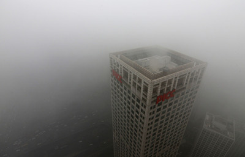
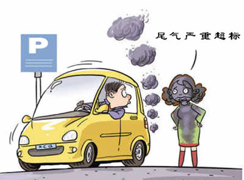
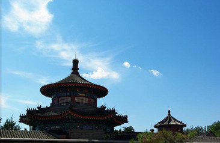

<!-- # ＜七星说法＞第六十三期：自强不吸，厚德载雾？ -->

**灰霾又来了。**

2013年一开年，中国大地便被浓重的雾霾所笼罩。环保部卫星中心的遥感监测显示，1月29日上午，我国灰霾面积达到了130万平方公里，这样面积的灰霾天气几乎占到了我国国土面积的百分之七。这已经是**今年短短一个月以来第二次全国范围内的严重雾霾天气**，而我们的首都北京，**2013年的第一个月里甚至4次遭受雾霾袭扰**。

### 我们的空气怎么了？

其实对于灰霾天气，我们早就已经不陌生了。早在2011年的年末，我国便遭受过一次大范围的灰霾天气。那是中国第一次这么刻骨地尝到空气污染的滋味。一时间大众像无头苍蝇一样地发问，我们的空气到底是怎么了？

是啊，我们的空气到底是怎么了。2011年年末，我们弄清的问题就是这个。那一年，我们认识到了一个名词——**P.M. 2.5。**

P.M.2. 5是极微小颗粒物的简称。这样级别的颗粒物，对于光线折射和环境观感的影响最大。因此一旦空气中的P.M.2.5超标或是存在过多，便会最为直观的影响空气质量，进而影响大众对于环境的印象。不仅如此，P.M.2.5因为其颗粒物的直径之微小，最容易进到肺泡的最末端而无法像其他相对较大的颗粒污染物一般随肺部分泌物排出体外，因此对人的健康影响最大，也最为大众所重视。

当然，这些都是我们去年看着灰蒙蒙的天安门时知道的知识。时至今年，当我们又一次遇到这样的灰霾天时，单纯地说说什么是P.M.2.5已然没办法平息我们对于白做“人肉吸尘器”的苦愤了。于是今时今日，我们再一次面对又不见了的天安门，问的最多的问题，从我们的空气怎么了，变成了这到底是怎么回事？

要说祖国大地的空气到底是因为什么原因变成这太虚幻境般的模样，那还真是一言难尽。不过总的来说，可以归结为这么几个原因：**尘土颗粒；工程排放；能源排放**；以及最为重要的——**尾气排放**。

科学松鼠会关于P.M.2.5的文章中，关于其成分的介绍便有这么一段：“2000年，有研究人员测定了北京的P.M.2.5来源：尘土占20%；由气态污染物转化而来的硫酸盐、硝酸盐、氨盐各占17%、10%、6%；烧煤产生7%；使用柴油、汽油而排放的废气贡献7%；农作物等生物质贡献6%；植物碎屑贡献1%。”这个数值，是十多年前的成分构成，到现在已不尽准确，但是或许在数值的排名上会有些变化，可总的来说成分构成变化是并不大的。

看到这里，你或许不仅已知道了什么是科学意义上的灰霾天，也知道了灰霾天到底是怎么来的。可是等等，这不是七星说法吗？怎么变成科学松鼠会了？说了这么多空气污染，我们到底该怎么让这该死的灰霾天不要再遮住祖国的万里晴空？而它们，和法律又有什么关系呢？

**恩哼，他们和法律还真的有很大的关系。**

### 不只是空气质量标准

现在一说起今天又是灰霾天，大家或许第一个想到的是去看看美国大使馆的机器人有没有爆表。这个我们第一时间关心的数值，便是环境法对于空气质量控制的第一个节点。SOHO中国的潘总每天在微博公布的空气质量，在大多数人看来是一串两位或者三位的数字，但这些数字，都由一个统一的法律标准——空气质量标准——所左右的。我们生活的城市空气差到了什么程度，自然不是真的由我们的肺说了算，而是由这些由法律统一规定的标准来衡量的。**因此空气质量的标准制定得严苛与否，是不是真实的反映了空气的污染状况，便成为了影响空气污染程度和人体感观是否一致的最关键因素。**

我国现行的空气质量标准，确切的说应该叫**环境空气污染标准（API）**。监测指标包括二氧化硫、二氧化氮和可吸入颗粒物（P.M.10）。大家如果仔细看看现行的空气标准，或许会发现这一份标准测量指标只有可怜的几样，并没有我们已经熟悉的P.M.2.5的身影。是的，它确实不在现行的环境空气污染标准中，这也是为什么在去年的此时，我们站在天安门广场上都已经看不见毛爷爷了，环保部公布的北京空气污染程度仍然是“良好”或是“轻度污染”的原因。

**好在环保部已经意识到了这一点，最新修订的《环境空气质量标准》征求意见稿（第二版）已经将包括极细微颗粒物P.M.2.5、强致癌物苯并芘和氟化物在内的众多污染物纳入了环境质量标准。**这份标准中的P.M.2.5含量与世界卫生组织的一期标准——也就是最为宽松的标准——持平，24小时平均值上限为每立方米0.035（一级）和0.075（二级）毫克。

虽然这份空气质量标准只是向国际通行的最低标准看齐，实施的时间也被定在了看上去遥遥无期的**2016年1月1日**，但是一旦这份空气质量标准获得通过，便就意味着那时每天的空气质量如果再像如今一般，分管环保的地方长官便要对灰蒙蒙的空气负责了。

修订了环境空气质量标准，看上去我们似乎可以放心的躺在家里等着重现碧水蓝天了，可是单单只确定环境标准，对于空气污染的治理，却才刚刚开始。空气质量标准的指定，为的是有一个统一可行的数值告诉公众空气质量的好坏。但是单单只修订这个标准，只是既不治标也不治本的笨办法。如果你只看着空气质量标准制定好便觉得可以高枕无忧，那便真的是大错特错了。

我们刚才已经分析了空气污染的问题到底是从何而来的，我们不妨也看看和这些污染相关的**控制标准**表现如何。

首先是最重要的**汽车尾气污染**。环保部2012年12月底发布的《2012年中国机动车污染防治年报》显示，我国已连续三年成为世界机动车产销第一大国，2012年，1亿辆机动车排放的氮氧化物占全国排放总量的1/4左右。机动车污染是造成灰霾、光化学烟雾污染的重要原因，也已成为我国空气污染的重要来源。要控制汽车尾气排放的污染，关键在机动车尾气排放控制标准和成品油质量标准。可是我国的这些标准仍然落后的可怜。虽然北京地区现行标准是相当于欧V排放标准的国标V成品油标准，对于汽油硫含量的限值为低于10ppm，但是目前我国大多数地区使用的仍然是国III车用汽油标准。大家想不想知道这个标准对于汽油硫含量确定的数值是多少？

**是低于150ppm。**

不过最新的消息是，**2月6日，也就是昨天，国务院召开的常务会议终于对油品质量继续升级做出了规定。**决定在已发布第四阶段车用汽油标准(硫含量不大于50ppm)的基础上，由国家质检总局、国家标准委尽快发布第四阶段车用柴油标准(硫含量不大于50ppm)，过渡期至2014年底。2013年6月底前发布第五阶段车用柴油标准(硫含量不大于10ppm)，2013年底前发布第五阶段车用汽油标准(硫含量不大于10ppm)，这两项标准的过渡期均至2017年底。

于是乎，这个最新的全国性的阶段标准对于汽柴油质量的规定，**终于达到了北京正在使用的欧V标准水平**。虽然和空气质量标准一样，完全实现这一标准时我们的孩子说不定都能打酱油了，但是这样的变化仍然是积极的。我们也不吝于将这样的好消息加班加点的补充到文章里。可除了这样的好消息外，其他的问题仍亟待解决。

其次，是困扰整个中国的**能源结构问题**。中国的能源结构以燃煤为主，不管是遍布各地的燃煤发电厂还是整个北方到了冬天无法离开的供暖锅炉，使用的燃料都是基于煤炭和燃油在内的传统能源，好一些的，或许会用到天然气。而对于这些能源污染物排放进行控制的环境标准规定之宽松，简直已经到了不忍直视的程度。2012年1月1日开始实施的火电厂大气污染物排放标准，对于大气污染物排放的标准是这样规定的，燃煤或燃油锅炉，烟尘排放标准是每立方米30毫克，燃气发电厂烟尘排放标准是每立方米5~10毫克。至于锅炉的烟尘排放限值，则是每立方米50~350毫克不等。

这两个标准，是治理我国空气污染问题最重要的两个标准，我们已经看到了它们对于空气污染的控制在一个什么样的标准上。如果各位还记得我们前面提到的新修订的空气质量标准对于P.M.2.5的规定限值，那再看完了这些之后，您作何感想？您觉得如果只关心空气质量标准，还有用吗？

### 除了口罩，你还可以想到更多

上面这些，只是标准的问题。如果我们要从根本上治理空气污染，仅仅制定好这些标准，其实还是远远不够的。**空气污染的问题，是涉及各方面的综合性问题，不仅包括了各行各业排放到大气中的污染物，也涉及到了环境法中众多的法律法规协同作战的问题。**这些协同作战的法律，对于大气的污染控制是至关重要的。虽然我们不得不无奈的说他们表现的还不够好，但这不妨碍我们简要的提起几部。

最为重要和最为基本的，当然是《环境保护法》。**我国的《环境保护法》上一次修订还是1989年。现行的《环境保护法》按兵不动的这24年，是中国环境状况恶化最为严重的24年**，我们可以说《环境保护法》的修改已经迫在眉睫了。但是2012年最新公布的《环境保护法》修改草案，却并没有体现出这份法案修改的先进性。在这里，我们只举一例。

我们都知道，大气的污染，有一部分原因是工业企业的污染超标排放导致的。而对付这些超标排放的企业最为有效的措施，便是按日记罚。顾名思义，也就是这些违法企业超标排放一日，便罚款一日，直到它停止违法行为为止（这里当然有一个最高限额，在此按下不论）。这样的处罚措施，比起在法律中确定相对固定的处罚金额范围，显然更能有效的起到保护环境的作用。但是在新公布的环境保护法草案中，我们没有看到这一制度。

大气污染第二个不能不提的法律，是**《大气污染防治法》**。我国的《大气污染防治法》是2000年修订通过的，距今已经12年。这份大气污染防治提纲擘领的法律，对于大气污染的防治只规定了三章：防治燃煤产生的大气污染、防治机动车船排放污染、防治废气、尘和恶臭污染。如果大家有兴趣去浏览一下这部法律，便会发现这部法律不仅在污染防治的章节分布上简单得已经不能够适应我国的大气污染现状，而且在法律责任的规定上甚至已经到了寒酸的程度。（最高罚款额不超过五十万元）虽然早在2005年大气污染防治法的修正案草案就已经经环保部审议通过（当时仍是国家环保总局），但是这部法律的修正案直到现在仍然压在全国人大的案头。想必2013年的全国两会，乘着这段时间空气污染舆论声势高涨的势头，这部法规有很大的可能会修订通过。但是最终呈现在我们面前的会是一部怎样的法律，还需要我们再耐心的等待。

除了上面这两个和大气污染治理关系最为密切的法律外，我们还想讨论一下另外两部法律：**《清洁生产促进法》和《环境影响评价法》。**

《清洁生产促进法》是2012年修改通过的新法。法律中规定了许多清洁生产的鼓励和促进措施，因为法律的修改时间较新，所以其中也包含了很多对于空气污染治理有所促进的法条；而《环境影响评价法》，2003年通过。不用多说，所有在建设过程中会对环境有所影响的工程都要受到环境影响评价法的控制。这些工程自然也包括影响空气质量的相关工程在内。这两部法律在保证空气质量的中所起的作用显而易见，虽然我国环境法律的实施情况从来也不容乐观，但是我们仍然希望这些体现着先进性的法律能够拥有一个美好的应用前景。

### 结语

要说起中国的环境状况，那真是几天几夜也说不完。要说起保护环境和法律之间的关系，那更加值得说上几天几夜。虽然我国的空气污染防治法规经过这么多年的发展，是取得了长足进步的。但是我们不得不无奈的说，这些法律的进步显然跟不上中国大地污染加重的脚步。环境的污染，和我们每一个人都有关系。我们在灰霾天出现时曾经无奈的调侃，空气是不能特供的。可是在调侃过后，我们更应该知道，在治理环境污染的道路上，没有什么比法律更可靠。同样的，也没有什么比我们每一个人在面对环境污染时心中记挂着法律更可靠。虽然我们现在说起控制大气污染的法律，仍然有这么多的不如意和需要修改的地方，但是这不是我们因此就不依靠法律解决环境问题的理由。

**也许你在看这篇文章之前根本就不知道万里无云的蓝天和法律有什么关系。但是或许在看完这篇文章后你能够理解，我们在下一次再面对隐藏于云雾中的天安门时，可以不只靠着西伯利亚吹来的北风，而是努力的煽起法律的北风，吹散这片污染的灰霾。**

当然，我们还有另一种办法来立竿见影的改善空气。因为数据显示，吸烟形成的P.M.2.5物质，占到了总污染物质的1%。所以除了法律之外，我们或许还可以**戒烟**~

【深入阅读】

重点区域大气污染防治”十二五“规划 [http://www.mep.gov.cn/gkml/hbb/gwy/201212/W020121205566730379412.pdf](http://www.mep.gov.cn/gkml/hbb/gwy/201212/W020121205566730379412.pdf)

环境空气质量标准征求意见稿（第二版） [http://www.mep.gov.cn/gkml/hbb/bgth/201111/W020111121388004546031.pdf](http://www.mep.gov.cn/gkml/hbb/bgth/201111/W020111121388004546031.pdf)

火电厂大气污染物排放标准 [http://www.zjep.org/manage/UploadFiles/201110814559248.pdf](>http://www.zjep.org/manage/UploadFiles/201110814559248.pdf)

锅炉大气污染物排放标准 [http://szems.szhec.gov.cn/hjbz/200907/P020090708508736307530.pdf](>http://szems.szhec.gov.cn/hjbz/200907/P020090708508736307530.pdf)

《中华人民共和国环境保护法》 [http://www.law-lib.com/law/law_view.asp?id=6229](http://www.law-lib.com/law/law_view.asp?id=6229)

《中华人民共和国大气污染防治法》 [http://www.law-lib.com/law/law_view.asp?id=141](http://www.law-lib.com/law/law_view.asp?id=141)

《中华人民共和国清洁生产促进法》 [http://www.law-lib.com/law/law_view.asp?id=376820](http://www.law-lib.com/law/law_view.asp?id=376820)

《中华人民共和国环境影响评价法》 [http://www.law-lib.com/law/law_view.asp?id=41954](http://www.law-lib.com/law/law_view.asp?id=41954)

环保部回应雾霾防治 [http://www.zhb.gov.cn/zhxx/hjyw/201302/t20130201_245846.htm](http://www.zhb.gov.cn/zhxx/hjyw/201302/t20130201_245846.htm)

七星说法NO.63（责编：陈澜鑫）

**P.S.加入“七星说法读者群”，我们一起说法！群号：262980026。**
