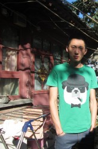

<!-- # 后海驻唱歌手生存样本   ——专访张天野：“我想要一种真实” -->

_后海，酒吧，光影，梦想，夜。_

_张天野，在后海酒吧坚持梦想的年轻人。他怎样看待音乐、怎样看待摇滚、怎样看待真实、怎样看待生活。

_

_-----

**瓢虫君特约独立媒体团队“豆花纽”，展现年轻乐手的纯味生活。从他生活的剪影，看到他跳跃着的心。**_

清爽的黑色短发，松柏绿的T恤上印一只叼烟的熊猫，没有刺青和镶铆钉的衣饰。张天野坐下点了支烟，“我们声音小点，别吵到隔壁邻居”。

午后阳光正好，北京二环附近的四合院树影交错，投射的光斑在这二十平米左右的单间游走。淡黄色的墙面装饰着卡板纸做的星星月亮。五只猫在地上打滚，抓挠床单，张天野时不时得停下对话，把它们抱开。

**落脚**

不同于大多数的北漂一族，尽管张孤身来自千里之外的黑龙江，但与“茫然”“碰壁”“蚁族”“闯荡”这些北漂青年的固定设置绝缘。相反，借北京亲戚之便，大学刚毕业的他初到这座灯红酒绿的大都市，便有了舒适的落脚处。

经他父亲的安排，张顺利地进入一个剧组当演员助理，剧组不开钱但管吃管住，工作算不上苦，权当过渡。很快，他又在一家传媒公司找到了工作，但终因“在同一个平台上竞争不过别人，也不喜欢”，结束了一年多西装革履的生活。

何去何从？这个深埋许久的问题以前所未有的严肃姿态横亘在张天野面前。最后，他想到了：唱歌。

**音乐**

在高中时期，张天野组过乐队。于他，音乐就和初三时染上的烟瘾一样，“一开始觉得好玩，后来就上瘾了”。他也不是为吸引女孩子注意，只是随了性子想做就做，不觉间成了生活作息里的固定一环，以至于到高考填志愿的时候，除去唱歌，便再也想不出其他热衷的专业了。

“从小学到高中这十二年，我都在做我不喜欢做的事，到大学了，我只想学我热爱的。”张天野的坚持和母亲的开明最终让家里的意见来了个大反转，他也如愿考上了沈阳音乐学院沈阳分校的流行音乐系。

**遇见**

选择并不难，难的是坚持。有时候唱着唱着，张天野就会忘了当初选择这条路的初衷，但好在每每失掉了信心、意志，他总能遇到感动、激励他的人。

一次在草莓音乐节上，张初识了二手玫瑰的音乐，那是由东北二人转改编来的摇滚。但震撼他的并不是独特的形式，而是“这东西有内涵”。“音乐有时候就像宗教，去表达一些东西，让被人信奉”，那种感觉正是张希望去追求的。

再后来，张接触了常石磊、林宥嘉的作品，那时他正遭遇些感情问题，下班回家能有这样的音乐陪伴让他感觉是莫大的庆幸。“这音乐太伟大了，怎么能这么贴切地表达自己的感受”，张压低了声音，表情顿时严肃起来，语气有些凝重：“一个人终日不快乐也不失落的时候是不真实的，当心情低落，才是面对真实自我的时候”。而在他看来，好的音乐，就是有这种

因为“真实”而生的力量。

**真实**

对于“真实”的追求源于张的职业经历。“现在这个社会，不是买就是卖”--

张曾经的工作就是不断向顾客介绍公司产品信息，但他不知道从公司培训中获知的信息是否真实，而卖的时候还要隐藏弊病，夸大优点。尽管张深谙工作就是工作，但这样的虚假使他厌恶。

对于新闻，张也是避而远之。从前遇到令人气愤的消息，他会转发、会评论，后来他开始质疑这些新闻的真实性。“什么是真什么是假？不知道真相很难做出评论，否则就是不负责任”。张说，除非他知道真相，有不得不做的事情，有责任需要他担，不然“就不要瞎掺和”。

**表达**

从高中起，张天野就会自己写写歌，那时住校，每到周末回家就写一首，一直到现在。平时他还是会有感而发写一些，但自知还远没到原创的级别。“原创就是写出只符合我嗓音气质的作品，像许巍朴树，歌本身并不难，但别人唱就是没感觉”。张告诉记者，歌曲的难度并不在旋律，而是词，“写歌必须表达什么”。

“歌没有好坏之分”，张天野又拿出一包烟，利索地拆开。对于音乐，他只认定有境界高低之说，但觉得也不必纠结于此。“好听就行，唱到心坎里的歌不一定唱的有多好境界有多高，只是和你的频率是一样的”。

**摇滚**

在北京这两年，张天野接触了不少音乐人，起初他们给张留下的印象是“凶神恶煞”、“脾气很躁”、“说话带很多脏字”，可接触多了，“纯粹”“真实”“快乐”这些标签就开始在他们身上闪现。他们有些到了三十岁仍默默无闻，没钱也没结婚，在张眼里：“这都很公平，我挣得少，但很快乐；挣得多了，也可能不快乐”。

北京做摇滚的人多，张偶尔也会去听。有人嫌摇滚太吵太闹，他觉得这是种误解，“摇滚也有不躁的”，更重要的是，每个人的精神里都有摇滚的一面；中国的所有流行音乐形式都是从西方传来，包括摇滚；先天不足，在短时间内也导致了摇滚一直未能进入主流的视线，但随着二十多年前，崔健为中国摇滚开山，如今，摇滚乐已经培养了相当一批的固定听众。“中国的摇滚其实挺精彩的”，张对记者说，每个人都有不满、看法，或者真实的话。“这些东西需要被说出来”。

**乐队******

决定用唱歌来谋生后，张天野组过一个乐队，在一家上座率不高的酒吧演出。

在张的眼里，这段经历可以用“痛苦”来形容。“我们尽量表现出最好的状态，但老板不懂音乐，不会经营”。张有些无奈，最初他演出的酒吧很大，总共六个音箱，前四后二，到后来前面竟然有三个都坏了，只剩下一个高音，低音效果几乎没有，乐队的效果也无从谈起。“搞音乐，挣钱是一回事，更重要的是从音乐中得到快乐。”于是乐队散了，张决定去后海试试。

**后海**

在后海，歌手可遇到的机遇比乐手多得多，但作为酒吧核心竞争力之一，歌手在方方面面也受着严酷的检验。这里的新陈代谢悄无声息却又异常剧烈。

但在张看来，那都是酒吧之间的较劲，落到歌手身上的压力微乎其微。“歌手都是和自己比，客人多了，也是自我价值的体现”。

现在工作的这家“年子”已经是张在后海唱的第二个酒吧了。老板年子从前是个厨师，转做歌手三年后买下了这间酒吧。

在后海，驻唱歌手可以很随性，很少会有老板对他们的演唱曲目作出限制，不管是原创还是copy。因为唱自己喜欢的歌，歌手一般能有更好的表现。

初到“年子”，张还只是被安排唱清晨四点半到七点半的早场，现在他被提到了晚场。前半夜自然是听客最多的时候，张的价值也在一点点被放大，常常一曲终时会响起齐刷刷的掌声和女性顾客的尖叫。这时张只是匆匆调好吉他，偶尔会与台下互动，但也不过一两句话。很快，他点头示意乐队，一曲又起。张是个安静的人，在“年子”，晚场是他和老板年子轮流上台；休息的时候他披上外套，喝几口茶，静静地待在角落。

如今，张天野在年子酒吧已有四个多月的光景了，但他还是个“临时工”：没有签约，甚至连工资也是日结。他讨厌被合同拴住，惟命是从的感觉。放之整个后海，签约的人也很少，“开心就干，不开心就撤”是这里歌手的共识。

**作息**

酒吧有着极不规律的营业时间，一般只要还有顾客就不会关门。张的时间安排相比这下则显得规律得多：晚上十一点半下班，吃个饭，回到家约摸两三点，十二点左右起床，吃饭运动，下午两三点练歌，五六点钟有时吃个饭有时直接去上班——“没什么应酬，一天大部分时间就是自己对自己”。

**工资******

除了作息，同样规律的还有收入。在“年子”，一天的工资是两百，一周会有三四天能多五十块钱。偶尔会给小费点歌，但在“年子”这样的情况很少发生。如此算下来，一月七千左右，这差不多也是后海的平均水平。对于一个大学刚刚毕业两年的人来说，这样的工资已然不低，但是对于张天野，却只刚刚抵过支出：房租（二环附近）每月一千四，一月其他花销五千左右；家里的母猫产仔后，每月又得多挪出一千来照顾这五只猫。“猫还小，要注意营养，喂点好的”。

张说自己其实不爱猫，当初是他女友养的，如今她去了英国，也只好他来照顾这五只小家伙了。

对于钱，张还有着自己的认识，“在后海就是这样，200也好，甚至300也罢，不都是小钱吗？一个月挣三千，挣一万都一样，关键在于你自己的含金量”。张天野认为当下不过是在“过生活”，他还在积累自己的价值，等到时候来一个机会，“签一单就是十来万”，那才叫“挣钱”。

**大学******

“什么年龄就做什么事——”，大学生活结束不过两三年，张天野回忆起来已然是“过来人”一副看透世事的口气。他顿了顿，吸了口烟，挑落长长一截烟灰：“大一大二就别愁找工作买房买车，该玩的时候就好好玩。”

其实，异于旁人想象中的大学里的张天野：狂野潇洒，众人追捧，那时的张也有过迷茫，甚至经历过一段时间的抑郁。

“于是看哲学”，张的父亲是大学语文老师。耳濡目染，张天野在情绪至低谷时，常常到书中寻找慰藉。从《苏菲的世界》到各位名家的专著，“的确看不懂，但这东西即使不懂看着也挺有意思的，真的看懂了吧反倒不见得有什么意义。都是别人怎么看世界的，你读了能吸收点东西，但世界到底什么样子是没有个答案的。”

**独立******

也许是受哲学的熏陶，张极力推崇“作为一个独立的个体去面对这个世界”。在和朋友、和女友交往过程中，他厌恶扯进太多别的东西，比如金钱，“那就不纯粹了。”

和很多怀揣音乐梦想的年青人一样，张天野也参加过选秀，“唱歌的不都想出名吗，出名是价值的体现，但关键是以什么途径出名”。出名要付出代价，如果这代价违背良心原则，张自认是接受不了的。但他也宽容地看待一些人

“搏出位”的行为：“你可以骂，但你得尊重别人的选择，也许你在他这个位置你也会这么做”。

**未来**

关于未来的规划，张天野也只能说个大框：25岁或者30岁之前有个风格定位，要真觉得行，就再去选秀，去尝试；也可能签公司，尽管会被公司牵制，但“如果你的作品牛逼，有固定的观众，那就走上了良性循环”，所以“能签一定签”。

但现在的张天野，用他自己的话说，还处在“修炼”当中。“每天练固定小时的歌，每天都在研究这事。我努力在做自己。”张觉得只要每天在进步，结果有可能会超出自己的预期，但也有这样的可能：几年后自己忽然喜欢另一样事物了。“那就顺其自然，去做”。他说。

张天野有些回避“音乐梦想”这个词。他觉得做音乐并不神秘，各行各业都不容易。就他而言，自己也没有遭遇物质匮乏、精神困苦，相反因为有音乐相伴，“生活很好很幸福”。

不过，在他心底一直有个最浪漫的梦想，那就是：哪天听众听到自己的歌，会赞叹原来歌还可以这么唱。

就像他在微博里写下的：“有些人会用生命追随着理想”。

“总有一天，我保持了我的棱角，不惧怕这个世界，尊重这个世界，改变这个世界。”

感谢豆花纽记者

黄泽民

吴桐

责编

郑萃颖
