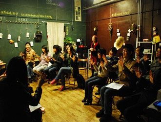

<!-- # 人文价值能估几个钱 -->

北斗网，是一个在大学生为主的青年群体中传播的一个小众思想网站。主打大学生原创文摘和栏目。北斗网的特殊之处在于，它是完全由大学生自发参与组织并进行运作的网站，完全志愿性和公益性，而且青年视野内比较好的全国性思想网站也只有这一家。我是从北斗08年创立就参与直到现在成为北斗网掌舵者，目睹了北斗网一小步一小步坚持并且扩大的过程。但是北斗网通过志愿性并且基本零经费运行得很吃力，当有人建议我们去和资本接触的时候，我们总是苦笑：人文价值到底能估几个钱呢？的确，一个没有任何卖相，比如流量、盈利模式、多元架构的小网站，可能基本不会引起任何资本的兴趣。但这是不是说，由青年人自发创造的人文精神产品，在所有领域的消费方式都能线上重新整合并推送的时候，因为没有显而易见的商业价值而依然得不到推力和空间呢？网络时代，就没有给人文价值更多的机会吗？

**从杂志到“门户”**

人人网上的一个大学生自创的电子杂志。当时依托于人人网——那时候还叫校内网——的主页发布内容。当时的电子杂志分七个板块，涉及时评、杂文、深度、文艺、生活、情感等各类文章。《北斗》电子杂志的撰稿人都是大学生当中文学和思想功底比较优秀的，所以很多代表性的文章流传很广。“北斗”也渐渐成了一个在大学生中传播的有价值内涵和立场语义的品牌。后来我们把电子杂志搬出了校内网，做了一个小网站。网站是用wordpress做的，功能很简单，可以实现文章的分类，因为这个时候文章从体裁到内容上都丰富起来。我们也打出了“华语大学生人文思想平台”的口号。最近我们又进行了改版，重新编排了文章分类体系，在板块分类之外增加了标签分类体系。重要的是，增加了线下沙龙信息列表一个板块。网站是参照小网站流行趋势改的，这时候我们觉得网站定位应该跳出大学生的圈子，于是我们把口号改成了“青年人文生活门户”。虽然网站作为一个文章发布系统的痕迹还比较明显，但是我们实际已经在社交网络中运行多种平台，包括文章平台、沙龙活动分享平台、新闻转载平台等。我们希望能以后把这些内容也都整合到网站中，形成一种既有时效性和精品性阅读内容，也有筛选过的活动服务信息这么一种格局。

**大社团小网站**

北斗网虽然商业价值不显著，但是有一定品牌价值。敢于叫“门户”也是体现我们对自己品牌价值的一种自信。事实上，在青年人舆论圈子中，“北斗”这个名称比北斗网更为熟知。“北斗”这个品牌被赋予了青年理想抱负、深刻思考和行动力的内涵。参与北斗网运作的一直是一个范围很广又流动性很强的志愿者群体。由这个群体推广出去形成了一个在社交网络中非常庞大的圈子。而又有一个更大的圈子就是北斗网的受众群体，也就是潜在的用户群。比如我们在人人网的青年舆论圈中还保持着很大的话语权。像我本人和其他两位志愿者就入选人人网2012年鉴人物。而且这个年鉴中其他人物我们也大都相识。除了这些，北斗的圈子也涉及全国各大高校的学生社团、学生舆论中的活跃领袖、各种线下人文活动。北斗的野心就是把这些群体产生的优秀的文章、活动都整合到一个网站上，是故自称“门户”。但是我们网站还很小，很简单。没有背景的青年人进行互联网创业往往都是技术导向性。但是我们的活跃成员多为人文社科类学生，基本没有专业的互联网技术背景，所以在网站搭建上比较弱势。但是，北斗所处的是一个隐现的广泛的人文思想青年圈，北斗网多与他们生活的某个方面比如阅读偏好、舆论议题、线下活动的取向相关。这背后就是一个广阔的生活领域和网络空间。

**有了豆瓣就没有别的人文空间了吗**

也许豆瓣已经在这个领域中圈占了很大一块地盘。豆瓣是国内少有的原创性的网络社区。大家对豆瓣有一个印象就是文艺小清新。但是我们知道文艺和消费并不互斥。书籍、电影、音乐都是重要文化消费品。而且豆瓣的文艺小清新style的一些关键词，都是和消费品味联系起来的。这些关键词的流行，就会和一些商家比如时尚、旅行周边、咖啡馆业等的潮流联系起来。我觉得甚至可以说，很多用户进入豆瓣，就是本着文艺消费的目的来的，他们需要豆瓣社区的文艺消费氛围提供的指引。所以豆瓣离生活和市场一样近，这也就是其商业价值所在。

之前我最早与朋友分享做一个线下沙龙活动平台的想法的时候，别人就会问我，那这个跟豆瓣同城有什么区别。意思是大家从豆瓣同城上找活动就是了，干嘛还要来你的网站。我觉得，豆瓣的存在不代表没有其它人文领域的空间，就像淘宝的存在不代表其它电商不能活了。首先并不是所有人都有用豆瓣的习惯，况且豆瓣的内容都是自发布，用户被指引到哪个活动除了个人根据自己偏好的检索，也靠整个网络社区的潮流和氛围。这个时候，我们就需要一些编辑分类过的活动信息列表。现在所有的商家都已经OTO化了，但是网络中，还少有精致的信息全面的人文类活动入口。大部分这些活动，都是私下联系和推广的。这里面就有一个组织、推广和场地的市场。我觉得肯定有人在小打小闹地进行一些这方面的尝试，比如肯定会有人有想法来做一个同城高校社团活动的信息分享，但是我们缺乏一种更大的想象力，那就是对人文生活领域的设想。

**“人文生活”的用户习惯**

我之前一直谈的人文，可能和大家口中的文艺一样，但是又不一样。我先给人文进行一种定义。我所说的人文生活领域，是一个有别于工作和消费之外的一个生活领域。我们生活中工作领域和消费领域是最明显的，比如学生读书上课，白领工作赚钱，就是人们生活的工作领域；吃饭娱乐购物，就是消费领域。文艺的一些东西，或者兴趣爱好，也可能是被消费的。但是我所说的人文生活，就是人们为纯粹的知识追求或者美学欣赏而进行的活动，而不是消费性的。具有一定智识水准的人群中广泛存在这种需求，比如读书、欣赏音乐和影像、讨论分享等等。但是在消费社会，这些东西已经和消费不可能完全剥离开。但是人要是不想沦为消费世界的机器，必须保持一定的人文价值。我们首要的议题就是人文生活的概念化，其次是培养人文生活的用户习惯。所谓的概念化是指，对人文价值的理念培育，人们要对自己的生活有审慎态度，并且执着于自己发自本心的浪漫的兴趣。而用户习惯的培养，要基于一种刚性需求。我们现在都有用手机的习惯，那是因为我们有作为一个终端接入信息网络的刚性需求。但是这些用户习惯，是要靠技术和产业的进步推动的。但是现状就是，资本如果不对人文价值的创意和可能性产生兴趣，也就没有技术和产业背后的动力了。

所以本文的题目“人文价值能估几个钱”里面有两种内涵，人文价值估不了几个钱，这是一种辛酸，但是还希望待价而沽，则是一种面对强硬规则而不得不采取的妥协和挣扎了。

（采编：吴子衿；责编：欧阳银华）
