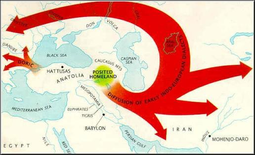
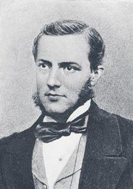
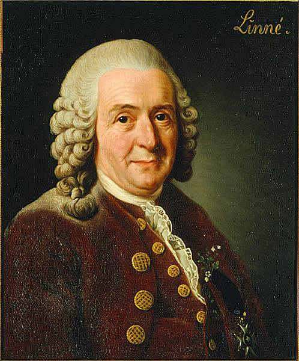
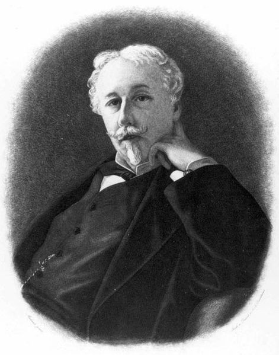
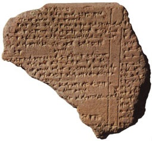
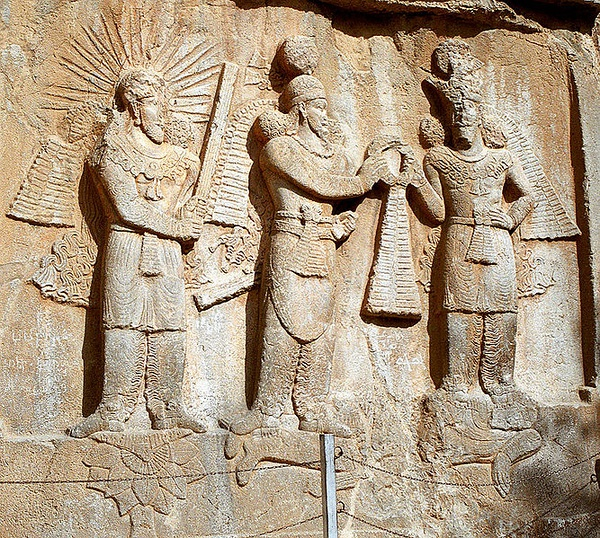
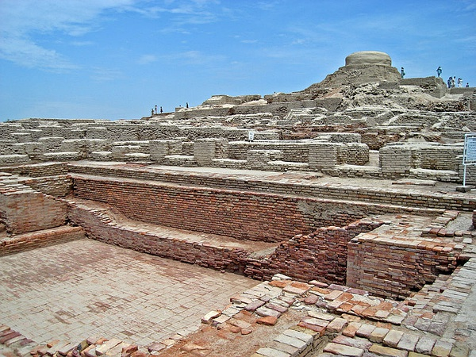
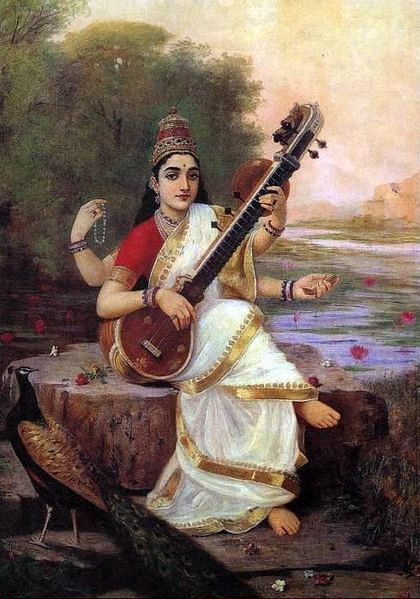
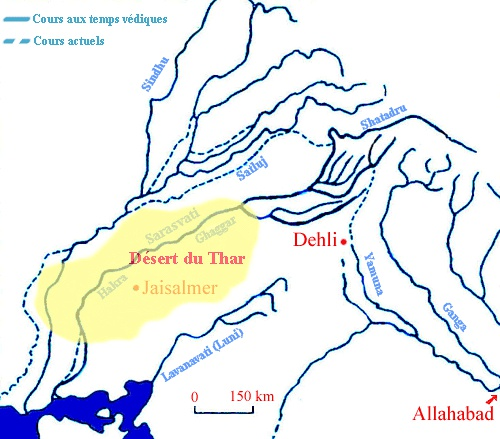

<!-- # 八一八“雅利安人” -->

LZ过去学世界历史和地理，对两个问题无法理解，也没人能给出令人信服的答案：

一是地理课本把印度人归为白种人……老师的回答是，丫是晒的。我表示很崩溃。二是说“纳粹”自称“纯雅利安人”，而且“纯雅利安人”的特点是金发碧眼；书上还说，雅利安人在公元前1500年入侵了印度南亚次大陆。那么，今天的印度“雅利安人”后代和那些金发碧眼的“纯雅利安人”是亲戚？我表示很崩溃，很费解，我估计和我存有同样疑问的大有人在。LZ试图搞清楚了这个问题，下面开始给大家八：

翻开随便一本历史书上是这样形容雅利安人的。他们是生活在中亚的古代游牧部落，他们驯养马匹，他们驾驶马拉战车像世界各地迁徙，公元前2000年左右，他们中的一支迁徙到小亚细亚，建立了文明古国赫梯，这个国家在世界历史上延续千年，在公元前1400年开始于埃及的第18王朝到20王朝长期对峙，展开对叙利亚的拉锯式争夺，并且，他们被认为是世界历史上发明并最早使用铁器的民族。

公元前1500年，他们的另一支越过白雪覆盖的帕米尔高原进入南亚次大陆，征服了古代印度达罗毗荼人建立的文明，开创了灿烂的古代印度吠陀文明。几乎与此同时，他们的另一支占领了伊朗高原，称为米底人、波斯人的祖先，是他们终结了文明古国巴布伦，并开创了历史上第一个世界意义上强大的帝国，波斯帝国。比这更早的时代，他们还从小亚细亚进入爱琴海创造了迈锡尼文明，并随后开创了古希腊文明的辉煌时代，并通过罗马帝国达到了他的最高峰。

他们中相对较晚的一群人，从公元前2世纪左右进入欧洲北部，并最终征服了不列颠……

读到这里，乃们已经发现，这群人足够牛逼了，几乎世界文明史上大半的古代文明都跟他们有关，或者是他们创造的了，但是这仅仅是事情的一半。

_雅利安的迁徙_

另一半就是，20世纪40年代，一群自称最纯粹的雅利安人的后裔发动了有人类历史以来最残酷最大规模的人类灾难——第二次世界大战，并且有计划有组织的对与“雅利安人”对立的“劣等种族”的代表犹太人进行种族灭绝！而一直延续到上个世纪80年代的南非，包括上世纪60年代以前的美国在内的所谓白人世界，白人至上主义与种族隔离、种族歧视种种表现中，都有“雅利安人”的阴魂！估计看到这里大家已经晕菜了，但是这个事情却不是几句话能够说清楚的，为此LZ要迂回前进，给大家做一些必要的知识储备和铺垫。如果你足够牛逼，可以跳过第一部分直接看第二部分。

**一、****前传**

为了便于大家理解LZ先从解剖一只跟雅利安人类似的麻雀。这只麻雀的名字做“吉普赛人。”

早期欧洲历史中出现的吉普赛人是酱紫的：

1417年的一天，德国卢尼堡的居民发现了一群奇特的不速之客，为首的骑着高头大马，手牵猎犬，服饰华丽，一副贵族模样，一大群衣衫褴褛的人徒步紧随其后，队伍的末尾，是一些坐在大篷车里的妇女和小孩。

这些人自称来自埃及，正要去罗马朝觐教皇。他们的首领自称“公爵”和“伯爵”，并讲述了他们曾经遭受的不幸经历：他们世代居住在北非，安分守己。很久以前，他们被一些基督徒征服，因此受洗信仰基督教，但后来他们穆斯林征服，被迫改信伊斯兰教。欧洲基督教界为此极为震怒，兴师征讨，认为这些人离经叛教，必须举族迁往罗马，得到教皇赦免后，才能重新获得土地，否则只能永远漂泊下去。故事让卢尼堡人同情，他们盛情款待了这批虔诚的忏悔者。离开卢尼堡后，这支队伍继续在欧洲漫游，一路上重复自己的悲惨故事博取同情和支持，同时靠给贵族算命和偷盗来维持生计。

也许是受这个朝圣故事的影响，从那时起，许多欧洲人便称他们为“吉卜赛人”（Gypsy），可以看出，这个词与“Egypt”一词的亲戚关系。这一称谓被越来越多的人所接受，逐渐成了世界上大部分国家对他们的称呼。

一些吉卜赛部落至今流传着这样一个传说：相传在古埃及，吉卜赛人与犹太人共同生活在尼罗河畔。犹太人一心想要离开那里，可执拗的上帝却故意使法老的心变得冷酷异常，不允许犹太人离开，但是，在吉卜赛人的劝说下，法老最终同意了他们的迁徙。可是让法老意想不到的是，犹太人在上帝的启示下，偷偷地将全部财宝席卷一空。幸灾乐祸的上帝又去嘲笑法老的粗心大意，这使法老怒不可遏，于是迅速集合军队，亲自带兵追赶犹太人。

吉卜赛人对法老说：“不要白费力气了，上帝跟犹太人一条心，谁同上帝好，谁就总有理，再说也总该留个人在家里照看炉火。”但这并没能劝回恼羞成怒的法老。于是灾难发生了，当犹太人走到红海边时，就像圣经描写的那样，摩西用一根树枝抽了抽海面，海水就让出了一条路，使得犹太人从海底穿了过去，可就当法老的追兵赶到海底中央时，摩西又用树枝轻轻一拂，海水便顷刻问吞没了法老的军队。吉卜赛人在岸边幸免于难，准备返回家园。然而，上帝却又刮起了狂风，将吉卜赛人吹得七零八落，遍及世界各个角落。

由于长期以来对这个民族的起源、历史不了解，人们往往给其冠以不同的名称，例如，法国人就称他们为“波西米亚人”（Bohemian），在西班牙，他们被称作希腊人（Greeks）、波西米亚人（Bohemians）、佛兰芒人（Flemings）、新卡斯蒂恩人（New Castilians）等；在荷兰，他们被称为希腊人、希登人（Heidens）等；在北欧，他们被称作鞑靼人（Tartars），摩尔人（Moors）；在波兰，他们曾被称作扎拉西人（Szalassi）、菲利斯蒂尼人（Philistines）等；在斯拉夫语国家中，被称为茨冈人（Zigani）等等。

对于他们来自哪里，一直没有统一的答案，直到1763年的一天。当时，学神学的匈牙利学生斯特劳.瓦累认识了三个印度马拉巴的学生。在交谈过程中，瓦累发现他们所讲的语言同匈牙利当地吉卜赛人的语言非常相似。于是，他整理了一份马拉巴语词汇表，交给当地的吉卜赛人，惊奇地发现他们可以说出词汇中的大部分的意思。随后的学者，通过对威尼斯吉卜赛人方言的细致梳理，发现了吉普赛语包含的外来词汇比例，包括意大利语词36个，英语词150个，来自波斯至威尼斯间各种语言词汇共有430个，而源出自印地语词汇达到518个。

欧洲吉卜赛人最通行的自称是“罗姆”（Rom），叙利亚和波斯吉卜赛人的“多姆”Dorn），在梵文中对应是“Doma”，现代印地语是“Dom”，意思是“靠歌舞为生的下等人”。

在印度北部就存在着这样一个古老的民族——多姆族，无论是在语言、习俗还是性格特点方面，都与吉卜赛人极其相似。印度古历史学家加尔哈纳在其《克什米尔大年代纪》中，也有关于这个民族的记载。通过这些为数不多的记载，我们略可窥见多姆人的风俗习惯。他们善歌舞，但多将此作为卖艺的本领来维持生计，他们生活在社会底层，大部分从事简单而低贱的工作。由于居无定所，职业低贱。可能是艰难困苦的反复锤炼，他们有极强的生存能力，对于居所、饮食等没有太高的要求，随遇而安。

英国学者对现代印度多姆人又这样的描述：“他们是生活在贝哈和西北省邦的流浪民族，许多生活习性与吉卜赛人一致，他们随身携带着破烂不堪的芦苇帐篷，四处游荡，在邻近村落的地方安营扎寨……有些多姆人会编织篮子、垫子等诸如此类的物品。在达蒂斯顿，多姆人口众多，但仍然置身于社会下层，充当乐师、铁匠和皮革工人。”

同吉卜赛人一样，印度多姆人也有相当一部分人当炉匠，他们带着很简陋的工具走街串巷，给人修理焊接器具，他们使用的工具都可以在吉卜赛人的历史中找到痕迹。

通过比对分析，学者得出结论，吉普赛人的祖先就是印度北部的多姆人。对吉普赛人的起源发现过程不难发现，对比语言的相似性是发现吉普赛人起源的钥匙。

这个钥匙的学名叫做——“比较语言学”。这个学问是近现代欧洲人文学科的重要组成部分，档次很高。但是这门学科在中国却鲜为人知，中国最著名的一位从事与比较语言学研究相关联的学者就是季羡林先生，不过戏剧性的是，同季先生的巨大名气成反比的是，很少有人确切的知道他到底是干什么的。

这样一门重要学科在中国灰常冷门，而更大的问题在于中国人对它的原理也很难理解。造成这种理解障碍的主要原因是我们的汉字。

汉字是世界上唯一一种还在使用的象形文字或者叫做表意文字。除此之外其他文字都是拼音文字或者叫做表音文字。这个表意文字有一个巨大的优势，就是它可以无视语言的不同而独立存在。神马意思呢？我们知道中国的方言千差万别，北方方言的代表普通话与江浙的吴音、广东的粤语、福建的闽南话、客家话有多大的差别呢？其差别远远大于意大利语与西班牙语的差别！但是我们却可以无视方言的存在而都称为——汉语。

总面积与中国相当的欧洲怎样呢？大小语言有400多种。同样，与中华文明历史悠久、程度相当的印度，有200多种语言，官方语言18种，有16种文字要印在钞票上！

对于语言问题，老外倒是比中国人看得清楚：

Chinese is not really one butseveral languages held togetherby a common script .

汉语实际上不是一个语言，而是同一文字形式掩盖下的若干种语言

可以想象的是，如果没有汉字，我们也采用拼音文字的话，像差别比较大的普通话代表的北方方言和吴音、粤语、客家话、闽南话，必然是不同语言，这个时候大家都不会因为自己只会一两种语言而自卑了，掌握五六种语言的“语言天才”，我们中国人也可以有哦。

即使像普通话、湖南方言这种比较接近的方言也会渐行渐远，最终成为不同的“语言”。比如我们知道，湖南话是“h”“f”，还有“n”“l”不分的，这样汉字“湖南”，用拼音表示，湖南人会拼写为“fulan”，与普通话的“hunan”是不是就是两回事了呢？

如果不幸，他们采用的是不同的字母体系，就像同为蒙古语的内蒙和外蒙，内蒙语采用的是传统的藏语、满语采用的八思巴文字母，而外蒙受苏联影响采用的是俄文字母，那么，外蒙内蒙同是操一种语言的蒙古族，也互相看不懂对方的文字，如果加上年代久远，变音就会更明显。我们知道如今的汉语跟几百年前差别很大，有学者认为客家话才是1500年前的普通话，那么现在有几个人能听得懂呢？如果没有汉字的存在，客家话早就会变成像“梵语”一样的一门单独古老语言被研究学习了。

这时候大家可以发现了吧，比较语言学为什么会在西方如此盛行而在中国无人问津，因为有汉字存在，即使汉语读音发生了天翻地覆的变化，但是文字3000年来却变化很小，沟通无障碍，大家本就是一家，何须多此一举呢？

但是，“比较语言学”对于采用拼音文字的世界，就太重要了，谁跟谁是近亲，或是远亲都存在于这千差万别的发音和变化的语法之中！

了解了比较语言蕴含的奥妙，我们可以回到正题，开始了解“雅利安人”究竟是怎么回事了。

同发现吉普赛人的来源一样，“雅利安人”也是从比较语言中被发现的。发现之后呢，由于西方世界的不冷静和自我膨胀的种族主义，“雅利安人”问题很快就脱离语言学的范畴转向了“人种学”。今天呢，过去盛极一时的“人种学”被完全推翻，被认为是没有任何科学内容的错误理论。

但是在很长一段时间呢，“人种学”主导的“雅利安人”问题实际上是先确定金发碧眼的北欧人是

所谓的“纯雅利安人”，然后根据这个命题去寻找论据，这跟先认定一个人有罪，然后围绕罪名去罗织罪证，是一个道理。但是在当时呢，也就是19世纪到二十世纪，西方文明全世界牛逼到家了。人发达了有些自我膨胀这跟很容易理解哈，所以这个时候，很少有人在乎这些理论有什么不“科学”的地方。就像有些暴发户写自传，我为什么能这么牛逼？因为我从还没生下来就天降祥瑞，如此这般，等等等等……怎么说都是人家的理，谁让人家牛逼呢！

西方人的这种自我膨胀式的得瑟却最终酿成了巨大杯具，也就是第二次世界大战，这之后呢，因为被纳粹德国用烂了，“雅利安人”这个词就像我们很多的文革用语，被认为是不合时宜，而被其他词所取代。同时呢，过去那些不被重视的反对声音开始成为主流，研究后很容易发现那些漏洞百出的种族主义“科学”是多么荒谬可笑。

但是无疑的，这部分不光彩的历史，也是“雅利安人”问题很重要的一部分不能回避。

但是话说回来了，“雅利安人”被希特勒搞臭了，但是它真的就没有“科学”的那部分吗？全部是错误吗？也不是。里面仍然蕴含着很多神奇的地方，但是因为现在发现的考古资料并不充分，很多事情还是处在迷雾之中，却也足够勾勒和展现它的神奇。下面LZ正式开讲了：

**二、****“****纯粹的****”****雅利安人从哪里来？******

雅利安人，虽然这群人如此牛逼，但是在漫长的人类文明史中的绝大多数时间，我们却并不知道他们的存在，人们对他们的“再发现”是在公元1786年的事情。

1784年，英国人威廉琼斯爵士受命担任加尔各答法院大法官，此前，琼斯已经是一位资深的东方问题专家，曾经将一些波斯语、阿拉伯语和突厥语作品翻译成英文。这人是个语言天才，他一生共学习过包括汉语在内的28种语言，精通希腊语、拉丁语、波斯语、阿拉伯语、英语、法语、意大利语。其早期著作有《波斯语法》，并翻译《穆罕默德的继承法》。琼斯赴任的时候，英国东印度公司正与莫卧儿帝国争夺孟加拉省。

莫卧儿帝国的创始人，太祖巴布尔是帖木儿大帝的直系6世孙，而母系是成吉思汗的后代，如果算上帖木儿自称是蒙古大汗的合法继承人这一层，巴布尔应该是正牌蒙古人的后裔，只是，是信奉伊斯兰教并且突厥化的蒙古人。不过这个莫卧儿帝国却是采用波斯语作为王朝的官方语言。琼斯正是因为精通波斯语才被委以重任的。因为当时，莫卧儿帝国势力仍然凌驾于英国东印度公司之上。但是，琼斯到了印度以后很快发现多数印度人的语言属于各个印度地区的土语方言，包括印地语、乌尔都语、孟加拉语，而且多数人口信奉印度教的各个支派，他们的宗教语言是梵语。也就是说，他精通的诸种东方语言仍不足以应付印度的语言环境。因为多数印度婆罗门教知识分子通晓波斯语和梵语，琼斯开始学习梵语，并创立了著名的“亚洲学会”。琼斯深入研究梵语文献，他翻译的《摩奴法典》（Dharmashastra）成为英国殖民者统治印度的法律根据。

_威廉.琼斯爵士(Sir William Jones 1746-1794)_

1786年2月2日，他在亚洲学会成立三周年上发表了著名的三周年讲话，这个讲话是具有划时代意义的。下面这段话引用率极高，LZ也在这里重复一下：

“梵语不管多么古老，它的结构是令人惊叹的，它比希腊语更完美，比拉丁语更丰富，比二者更精练，但是与它们在动词词根方面和语法形式方面都有很显著的相似性，这不可能是偶然出现的，这种相似性如此显著，没有一个考察这三种语言的语言学家会不相信它们同出一源，这个源头可能已不复存在；同样有理由（虽然这理由的说服力不是特别强）认为，哥特语和凯尔特语尽管夹杂了迥异的文法，还是与梵语同源；假如这里有篇幅讨论与波斯的历史有关的问题，或许能把古波斯语加入同一个语系。”

琼斯的这段话把古印度的梵语和欧洲的希腊语、拉丁语拉上了关系，我们知道，拉丁语是欧洲语言之母，而希腊是欧洲历史和文化的源头，欧洲语言的词汇源自希腊语的词汇数不过来。而哥特语和凯尔特语跟欧洲文化圈的关系更近了，英格兰人、德国人的祖先都可以追溯到哥特人，而法语可以看成是拉丁语和凯尔特语的混合物……那么，琼斯认为，梵语不但比拉丁语和希腊语更古老，还更完美、更丰富和更精练，那能说明什么呢？那又预示着什么呢？故事的序幕拉开了，我们继续八。

琼斯的这次讲话被认为是LZ强调的，灰常重要的“比较语言学”诞生的标志。琼斯英年早逝，他的研究只是提出了一个命题，怎么解释要后人继续书写。问题摆在西方世界面前，梵语，印度人的语言，不但比所有的欧洲语言更为古老而且还更好，这怎么解释呢？十八世纪的欧洲，无论是日不落的大帝国英国，还是新兴的强国德意志，他们都是源于日耳曼人，在公元前后，日耳曼人还是蛮荒部落，如何跟拥有辉煌灿烂古代文明的印度相提并论呢？它就像一个暴发户富人家突然闯进了一个来认亲的穷亲戚，落魄但是辈份极高。他的背景和辉煌家世是这个暴发户富人所羡慕的，承认他是自己的长辈的话，无疑会给自己加上贵族头衔，让自己身价倍增，但是现今这位穷亲戚实在是过于落魄了，让自己怎么好意思说他是自己的长辈呢？况且他还长得那么难看！！！到底认还是不认，这是个问题！！

围绕梵语认亲的问题，欧洲人形成了三派观点：一是认祖归宗派，承认梵语、印度人是欧洲文化和种族的源头。二是拒不承认派，你想当我祖宗？放屁，我才是你祖宗，你N多年前逃出家门在外面跟人鬼混搞得人不像人鬼不像鬼，现在看我发达了跑过来还想当我祖宗，可能吗？谁知道这么多年你跟多少人鬼混搞成今天这个样子！！三是和稀泥派，只承认穷亲戚家混的还算看得过去的那一小部分人是亲戚，其他大多数都算成亲戚家的佣人奴隶，而且还要说清楚的是——你认亲可以，我也承认，但是我辈分比你大，你要承认，否则算我没说，我们心照不宣啊，哈哈哈。

下面我们就具体八一八这三派的观点哈。最先粗现的就是认祖归宗派：

“所有事物，是的，所有事物，无一例外，都源于印度。”

——弗里德里希.施莱格尔

需要注意的是在琼斯的时代，“雅利安人”一词还没有出现。这个词汇的出现要归功于德意志浪漫主义文学运动的先驱之一，诗人学者，弗里德里希.施莱格尔。

1808年，施莱格尔从古罗马著名的独裁者裘里斯.凯撒的《高卢战记》中，找到的一个日耳曼国王——“阿里阿费斯塔斯”（Ariovistus）。施莱格尔认为“Ariovistus”中的

“Ario”这个词根在希腊语中有荣誉的意思，可以和梵语中的“arya”对应。在梵文中“arya”一词意思是高贵、高尚的意思，那么这个“阿里阿费斯塔斯”中的“ario”应该是日耳曼王族的一种荣誉头衔。需要特别提醒一下，这个梵文形容词“arya”（高贵的、高尚的）的名词形态就是著名的“aryan”雅利安了！“aryan”终于粗现了，欧也！！！！施莱格尔由此用这个“aryan”雅利安，来称呼印欧语的共同祖先，欧洲人和印度人都是“雅利安人”的后代！

客观地评价施莱格尔的观点，认为“ario”与“arya”存在对应关系是有争议的，不过“aryan”一词确实存在与梵文和古波斯文献，比如《梨俱吠陀》、《阿维斯塔》、以及大流士的《贝西斯登铭文》等，在这些文献中“aryan”一词被作为第一人称使用。（这方面内容，LZ还会在下一部分仔细介绍的，这里略过）

但是，这些古代文献中，并没有特定人种和部落的指代。注意！！！问题从这里开始就偏离了正确的轨道了，这是祸根的最初源头。由于当时的“比较语言学”还处于萌芽状态，对于“语言”和“种族”之间的关系，学者都没有明确和清晰的概念，加上施莱格尔等学者对于《梨俱吠陀》的偏颇解释，使得很多人都相信，这个世界上存在一个“雅利安种族”，而他们就是雅利安语最早的使用者。

由此施莱格尔认为：梵文就是人类最古老的语言，而印度则是人类文明的发源地。

这种观点应该说是相对客观理性没有偏见的，但是即使是事实人们情感上也无法接受。就比如，如果有人在豆瓣发一个朝鲜半岛是中华文明的发源地会是神马结果……只是类似的沙文主义情绪在我们这里表现出来的是中华帝国的民族主义，而在西方世界表现出来的则是白人至上的种族主义。那些西方种族主义者，跟我们这里扬言“核平日本”的脑残民族主义愤青本质上是一类人。

施莱格尔的观点不能被白人至上的种族主义者所容，需知道，在那个时代种族主义是西方世界的主流思想，即使像托马斯.杰斐逊和林肯这样的人都是这么想的。

“黑人不管是起初就是一个不同的种族，或是因时间和环境造成了不同，身心两方面的天赋都比白人低等。”

——杰斐逊

“我相信白人种族和黑人种族之间的体质差异将禁止这两个种族能在社会和政治平等之下共同生活。既然他们不能共同生活，他们在一起时就必须有上等和下等之分，而我和其他任何人一样，赞同把上等位置划归白人种族。”

——林肯

可以想象，施莱格尔这种欠扁的观点会招来多少口水。于是一种弥合矛盾的抹稀泥观点出现了。这种观点的创造者是威廉.琼斯之后最有影响的梵文学者——马克斯.穆勒。有人把中国家喻户晓的季羡林大师称为“中国的马克斯.穆勒”，不过这位世界的马克斯.穆勒在中国还真没什么人知道。不过这并不影响他的最著名假说家喻户晓——就是雅利安入侵假说。今天的世界历史，这个假说还是作为与印度相关部分的正史被载入史册的。

_马克斯.穆勒(Friedrich Max Müller 1823-1900)_

这位德裔的英国著名学者是通过他对印度最古老的一部吠陀《梨俱吠陀》的释读得出的。《吠陀》的本意是知识的意思，是古代印度的思想智慧总结，古代印度文明又被称为吠陀文明，文明的精华就是四部《吠陀》，其中最为古老的是《梨俱吠陀》，意思是智慧之诗。

《梨俱吠陀》里面，那些自称雅利亚（Arya）的人，也就是之前的施莱格尔指出的雅利安人，这些自诩高贵的人，在战神因陀罗、火神阿耆尼的帮助下，水淹或者火烧“没鼻子”、黑皮肤的野蛮人“达萨人”、“达休”人的城市，并把它们变成奴隶。《梨俱吠陀》中，这些高贵的雅利亚人已经懂得使用青铜等金属，驯养牛、绵羊、山羊、马和狗。懂得使用马拉战车。

由此，穆勒提出了著名的雅利安人入侵的假说：公元前1500年，一支自称雅利安（aryan）的部落越过喜马拉雅山入侵了南亚次大陆，由于他们懂得使用马拉战车，拥有先进的青铜武器，因此他们摧毁了古代印度达萨人建立的文明，给原始蛮荒的印度带来了文明的曙光，开创了灿烂的古代印度吠陀文明，并建立了延续几千年的印度种姓制度，把被征服的达萨人变成贱民达罗毗荼人。

穆勒出生于德国，十八世纪30年代之后在牛津大学担任比较语言学教授。缪勒生活的时代，正是英帝国在印度统治最为辉煌的时期，但是他本人从未前往印度了解过印度文化。他认为，印度人的语言从梵语演变而来，因此印度人与欧洲人的知识水平相当，或者比欧洲人还聪明，他们与欧洲人应当来自同一个种族，因此印度人和欧洲人应该是“雅利安兄弟”。印度知识分子多半属于高级种姓，很痛快地接受了穆勒的理论，因为这个理论将他们置于与他们的统治者至少在智力上平等的地位。这个假说尽管千疮百孔，但是至今在印度仍然不乏支持者，这也是它到现在还能留在世界历史教科书上的原因

穆勒认为他的聪明观点，可以弥合西方世界在梵文祖先问题上的鸿沟，拉拢印度上层的同时，让英国对印度的殖民合法化，因为早在公元前1500年，高贵的雅利安人就征服了印度，今天只是再度征服而已。但是穆勒的想法显然太过一厢情愿了。毕竟种族主义才是主流思潮，穆勒的抹稀泥思想在欧洲没人买账。

不过比起施莱格尔，穆勒的观点已经向种族主义又靠近了一步，因为在《梨俱吠陀》中找到的论据，被“雅利安人”所征服的达萨人是“黑皮肤”的。那么，就反方向的证明了雅利安人拥有白皙的皮肤了。但是，无论是施莱格尔还是穆勒，都没有提到过雅利安人是

“金发碧眼”的。那么这个“金发碧眼”是从何而来呢？

我们刚才提到过，对于梵语的态度，还有一个最为主流的拒不承认派。LZ一直最难理解的问题是：古老的文献中没有一个字提到“雅利安人”的“金发碧眼”这个特征。但是在LZ看来最需要论证的这一点问题上，在十八世纪欧洲主流思想看来，这是最无需讨论的，雅利安人就应该是“金发碧眼”的，剩下的就是如何“科学的”证明它！（在后来的DNA染色体抽样中发现，浅色头发，蓝眼确实是印欧语民族“雅利安人”中的一个主要特征，Y染色体的DNA为RIa1，但是这种DNA存留人群最高的是被纳粹认为劣等的斯拉夫人，还有北印度人，而被纳粹认为纯粹的北欧人水平很低，而英国等西欧更是低得可怜，这是后话，后面会介绍）傻眼了吧，就这么强盗逻辑，这就是殖民主义的本色。听上去有没有觉得有些似曾相识呢？当人们集体干一件罪恶的事情的时候，这个错误会是惊天动地的，德意志出了希特勒，中国有了文化大革命。

言归正传，我们知道，北欧斯堪抵达维亚人，特征高大而“金发碧眼”，但是同样具有这个特征的斯拉夫人由于被西方世界视为下等人而自动被忽视。西方的比较语言学，要做的的就是如何把雅利安人的故乡“放到”北欧了。而所用的工具当然还是比较语言学了。于是，就有了著名的关于“鲑鱼”和“山毛榉”的论证，这种理论影响甚广，观点也十分有趣，LZ仔细给大家八一八：

鲑鱼，也就是三文鱼，基本上都吃过吧，大家都知道挪威三文鱼，可以想见，这是一种生活在北欧波罗的海的鱼。

在挪威、丹麦、瑞典、冰岛等北欧语言中，被称作“Laks”或者“Lax”基本是一回事。但是在梵文中呢，是没有鲑鱼这个词的。但是我们知道在佛经中有“落叉”一词，这个词像著名的“刹那”一样都是梵文音译词，“落叉”是指“十万”，是一个表示数量巨大的词，它的梵文的拉丁文拼写可以拼写成“laksla”。这种类比其实并不少见，我们今天不是也会把数量巨大的屌丝称为“蚁族”，说明这种指代是有迹可循的。欧洲学者认为，这表示古代印欧人在长期迁徙过程中已经忘记了Laks，鲑鱼的本意，而只记住了它多代表的数量巨大的引申意义。

同样的例子还有“山毛榉”这个名字在汉语中好怪啊，说明这在我们中国人的生活中，并不是一种常见的树，但是在欧洲语言中它的表示非常简单，说明这是一种很常见的树种，英文中的山毛榉是“beech”。但是在古英文中则被称作“boc”或“bece”或“beoce”，在德文中被称作“buche”，在瑞典语种是“bok”，同样，它也有一个梵文对应“boco”，于是，比较语言学者推断，鲑鱼和山毛榉的故乡就应该是印欧人的故乡，而这个故乡就指向一个地方，那就是北欧。

所实话，LZ还是很佩服这些引人入胜的观点，相信这之中也会蕴含着古老世界一些无法厘清的内在联系。但是以此推断北欧是雅利安人的故乡是在是无法让人接受的。

因为，古代梵文中存在的“鲑鱼”和“山毛榉”是不是就是今天欧洲语言中所指的那些物种，其实并不能确定。比如，在欧洲的“robin”知更鸟，在美国人那里却指得是另外一种像知更鸟的鸟类。那么在梵文那里所说的“山毛榉”会不会是另外一种像山毛榉的树呢？况且几千年来沧海桑田，地理环境变化显著，也无法用现在的动植物生态分布来说明古代的事情，所以说，“鲑鱼”和“山毛榉”的论断是严重证据不足的。

但是，尽管推论千疮百孔，“金发碧眼”的“雅利安人”还是这样诞生了。并且从比较语言学迅速转向了人种学。

人种学起源早于比较语言学，目前被公认为伪科学。最早准备用“科学”的方法划分人类的是瑞典博物学家林耐，他最早将动植物分类为林氏24纲，曾经非常流行，并且为物种起源的发现打下了基础。在对自然界分类之后呢，这位先生的兴趣自然转向了人类。

_林耐(Carl Linnaeus 1707-1778)_

他把人分成了四个地理亚种：红种的美洲人，白种的欧洲人，黄种的亚洲人和黑种的非洲人。这样的划分法似乎很顺理成章，合乎“常识”，直到今天，在一般人的心目中，人种大抵也是分成这四类。林耐对他鉴定的人种都有一个简单的描述：

美洲亚种：红肤色，坏脾气，受抑制。头发黑、直、粗；鼻孔宽；脸粗糙，胡须少。顽固，易满足，散漫。身上涂抹红条。依照习惯统治。

欧洲亚种：白肤色，严肃，健壮。头发金黄、飘垂。眼睛蓝色。活泼，非常聪明，有创造力。穿紧身衣服。依照法律统治。

亚洲亚种：黄肤色，忧郁，贪婪。头发黑色。眼睛黑色。严厉，傲慢，充满欲望。穿宽松外套。依照舆论统治。

非洲亚种：黑肤色，冷漠，懒惰。头发卷曲。皮肤光滑。鼻子扁平。嘴唇厚。女性外阴下垂；乳房大。狡诈，迟钝，愚蠢。身上沫油。依照怪想统治。

林耐的本意可能是对人类进行不偏不倚的分类，但是在他的笔下，不知不觉地根据自身的审美标准对欧洲人进行“美化”而对其他种族进行“丑化”，尽管只有少数欧洲人是金发碧眼，“金发碧眼”却成了欧洲亚种的特征，而欧洲人体毛较浓密这一

“原始”特征就不提了。欧洲人当然最聪明，性格也最无可挑剔，其他人种要么愚蠢，要么让人讨厌。对社会制度的描述最能反映出当时的欧洲人对人种等级高低的看法：依照法律统治的欧洲人胜过依照舆论统治的亚洲人，后者又胜过依照习惯统治的美洲人，而最低级的当然是依照怪想统治的非洲人了。之后各个“人种学家”都刻意强化欧洲白人的“金发碧眼”这一特征，直到“雅利安人”被发现而移植到了雅利安人的身上。

在1853-1855年，法国贵族高比诺（Joseph-Arthur Gobineau）伯爵出了一部四卷本的著作《论人类种族的不平等》，试图从人种学的角度解释人类社会的退化。在研究了希腊、罗马和日耳曼民族的兴衰之后，高比诺确信种族问题盖过了其他历史问题，是解决其他历史问题的关键；组成一个民族的各个种族的不平等，足以解释这个民族的命运。高比诺认为在世界历史上总共存在十种文化，每一种文化的兴起都是因为“雅利安人”给当地人民带去了高贵的血液、艺术和知识的天赋。按照这种说法，在世界各地都应该曾经存在过雅利安人，而高宾诺也的确到处发现了雅利安人。随着雅利安人的血缘被稀释，人种即退化，而文明也就开始没落。文明创建者中雅利安血液的纯粹程度，决定了一个文明的兴衰。在这些高贵的血液被外来的元素稀释、冲淡，不再能发挥作用之后，文明也就必然灭亡。这样，在他看来，所有伟大文明的衰亡，并不是由于人们经常提及的那些腐败因素（“奢侈，政府管理不善，宗教狂热，道德败坏”），而是因为人种的退化。

_高比诺伯爵(Arthur de Gobineau 1816-1882)_

高比诺在十九世纪影响巨大，音乐家瓦格纳就是他的粉丝，而瓦格纳的女婿豪斯顿.张伯伦，更是继承发扬了高比诺的观点，创作了另一部纳粹经典《十九世纪的基础》。值得一提的是，这位张伯伦（不是那位绥进的英国首相）不但是发动两次世界大战的元凶，普鲁士皇帝威廉二世和希特勒的精神导师，而且对希特勒还有知遇之恩。张伯伦在希特勒有望上台之前很久就遇见：这个奥地利下士是“上帝派来领导德国人民走出荒野的人”。因此，希特勒把张伯伦当成先知。

其实，说“雅利安人”引发了种族主义并导致了希特勒上台，进而引发第二次世界大战和屠杀犹太人，不如说是“雅利安人”被种族主义所利用，可以想象，即使没有“雅利安”这个名词的出现，还是会有其他东西被这些人所用的，因为只要他们想要，世界就会按照他们想象的样子被解释。而且重要的是，还必须披着“科学”的外衣。

此后呢，人种学还发明了诸如测量不同人种脑容量的统计学方法，以及测量头颅长度来区分不同人种优劣的方法，最后都被证明是在统计样本上做了手脚。但是，在纳粹时代，测量头颅长度却是与“金发碧眼”一样衡量“纯雅利安人”的重要指标。

之后，纳粹为了追寻这种虚幻的“纯雅利安人”指标，对肤色、发色，眼色，头颅长度都有严格的量化指标，屠杀犹太人、吉普赛人和斯拉夫人只是其中的一个环节，还有征召符合雅利安条件的男女非婚生育纯种雅利安婴儿。为了防止“雅利安人”与其他人种性爱导致血统劣化，还发明了充气娃娃帮助解决生理问题。

_纳粹的小儿书插画,犹太人是如何让纯净的雅利安血统劣化的_

而今天西方世界尤其是德国人对西藏充满浪漫的说不清道不明的情感，也是因为，这里是世界屋脊，离上帝最近的地方，“应该是”最初的雅利安人居住之地。

关于“雅利安”引发的种族主义，可以看做是西方社会的通病，而纳粹德国只是最厉害的一种精神病爆发罢了。

在世界的其他地方也是影响巨大的，在波斯，巴列维王朝在英国扶植下建立，直接把国名从波斯改为伊朗（Iran），这个词即为雅利安人之地的意思。而巴列维王朝以雅利安人自居，亲西方而打压伊斯兰教的行动最终导致了1980年的伊斯兰革命，当年的两伊战争、让美国总统里根蒙羞的伊朗门事件，和今天的伊朗核危机都是这一事件的后遗症。

而美国的3K党，电影史上第一位大导演格里菲斯拍摄的臭名卓著的但是相当经典的大片《一个国家的诞生》无疑都是雅利安种族主义的产物，在南非，荷兰殖民者后代搞的种族隔离直到上个世纪八十年代末才寿终正寝，而诺贝尔奖获得者，DNA双螺旋结构的发现者之一，著名生物学家詹姆斯.沃森几年前还因为他的种族主义言论声名扫地……

_一个国家的诞生(电影海报)_

如今，“雅利安人”作为一个种族主义词汇，很少被西方世界提及，所谓“金发碧眼”的“纯粹雅利安人”在远古历史上是否是个真实的存在，现在也没有定论，但是它却真实的存在于近现代历史上，给世界带来巨大灾难，它其实还潜伏在西方那些傲慢的骨子里坚信白人至上的人群的内心深处，就像一个幽灵，一旦土壤合适，它将再次复活。

**三、****“****雅利安人****”****到底是怎样？******

抛开纳粹和西方种族主义心中那个雅利安，综合比较语言学与考古，以及历史文献，“雅利安”神话是否完全是编造的呢？如果你读到这里以为事情已经搞清楚了，其实才刚刚开始……

LZ在上一部分中讲到了威廉.琼斯的发现，印度梵语与希腊语、拉丁语以及哥特语凯尔特语的内在联系，还认为梵语与波斯语也许有一定关联。而后来的研究表明，这种也许的相似性似乎相似得不像话了。

LZ在上一章中同样提到了一本印度最古老的书《梨俱吠陀》，这本书被认为是公元前1000年以前创作的。但是在古代波斯，同样有一本古代经书叫做《阿维斯塔》，这是一种古代宗教的圣经，这种宗教叫做祆（音仙）教，在中国曾有广泛的信徒，中国历史上家喻户晓的安禄山和方腊都是祆教徒。而金庸小说《倚天屠龙记》中，著名的明教，其实是由祆教发展而来的摩尼教。

祆教的因为供奉圣火坛的特点又被通俗的称为拜火教。它是由古代波斯的先知琐罗亚斯德创立，所以这个宗教的学名其实是叫琐罗亚斯德教。这个琐罗亚斯德也被称作苏鲁支或者查拉图斯特拉，最后一个名字可能呢最为著名，因为尼采曾假托这位波斯先知之口，写了一本《查拉图斯特拉如是说》而被人们熟知。

问题就出在这个琐罗亚斯德身上，在祆教圣经《阿维斯塔》中间，有17章的赞美诗（亚什特yasht）内容与其他的内容在语言风格上差别很大，被认为来源于更为古老的波斯语，现在被称为阿维斯塔语，这部分内容被认为是琐罗亚斯德亲授的，而正是这部分琐罗亚斯德亲传的内容，几乎都能在古印度的《梨俱吠陀》中找到对应文本，除了一些发音不同，几乎没什么区别。

学者威廉.杰克逊在1892年出版的《阿维斯塔语语法与梵文比较》一书中，曾举出了一段阿维斯塔中的密特拉神颂辞与《梨俱吠陀》的内容相比较，即使对两种语言都不懂，也不难看出二者到底有多像：

《阿维斯塔》：

_tam amavantam yazatam_

_suram damohu savishtam_

_mithram yazai zaothrabyo_

《梨俱吠陀》：

_tam amavantam yajatam_

_suram dhamasu savistham_

_mitram yajai hotrabhyah_

汉语翻译：这是强有力的密特拉神，是所有创造物中最强大者，我谨以酒献上。

学者根据《梨俱吠陀》的成书时间，推算琐罗亚斯德的生活年代大约也在公元前1000年前左右。

这只是事情的一部分，在1906年开始，德国学者胡戈•温克勒对土耳其的北部的博兹柯伊村进行了长达6年的挖掘，在这里发现了大约1万快用楔形文字写成的泥板文献，大部分是一种与当时已知的古老语言都完全不同的语言。到了1915年，捷克学者赫罗兹尼破译了这些文字，从而揭开了一个圣经中多次提到的古老帝国的真相。这是一个延续近千年的文明古国，鼎盛时期与古埃及长期对峙，并且是铁器的发明和使用者，有这样一种流行的说法，公元前1400年，这个国家就进入铁器时代，把它用于战争，并严格保守铁器冶炼的秘密，由于这个技术优势使得它在最埃及的战争中长期处于优势地位，而当这个国家崩溃之后，铁器制造才流散到世界各地……这个国家完全有资格成为古代世界的文明古国，这个国家就是赫梯。

但是这些并不是LZ要讲的重点，重点在于捷克学者赫罗兹尼在破译赫梯语的时候，同时宣布，赫梯语属于印欧语其结论是根据名词和动词的词形变化作出的。如，名词主格以－s结尾、宾格以－n结尾；动词现在时第三人称单数用－ti，复数用－nti等等，这些特征都证明它们与其他印欧语同源。

_赫梯文献_

同时，在释读这些泥板上的文字信息的时候，学者发现了一块赫梯与叙利亚地区的另一个古国米坦尼王国签订的和平协议。这份协议是公元前14世纪签订的，协议上面，提到了米坦尼人崇拜的五位大神的名字：密特拉、伐楼那、因陀罗和双马童，其中双马童是两个人所以总共是五位大神。

但是问题是这些大神全部都是古印度所崇拜的大神，在《梨俱吠陀》中都能找到对应关系，其中因陀罗是战神，《梨俱吠陀》中的众神之首。佛教经典中称之为帝释天。而密特拉是契约之神，“mitra-”可解释为“契约”或“同伴”之意（词根“mi-”表示“约束”，后缀“-tra”表示为“工具”。这个“密特拉神”在米坦尼人信仰中是第一大神，而在琐罗亚斯德教中是仅次于主神阿胡拉马兹达的第二大神。而更有趣的是“密特拉”神崇拜在公元后的罗马极为盛行，多为罗马皇帝曾皈依密特拉教，是曾是基督教的最有力竞争者。而我们熟知的圣诞节，12月25日，其实并非基督生日，而是这位密特拉神的生日。

_波斯萨珊帝国沙普尔二世浮雕(自左向右分别为:密特拉神,沙普尔二世,拜火教大神阿胡拉.马兹达)_

伐楼拿是天空雨水和天海之神，与密特拉同时出现，他们在佛教都属于阿修罗。

双马童同样是个神奇的大神，他们是一对孪生兄弟的形象，音译为阿湿波，字面意思为“驯马者”，

双马童的主要功德是救苦救难，尤其能治病，被认为是佛教观世音菩萨的原型。在中国西北的阴山贺兰山岩画、黑海沿岸的游牧部落墓葬以及波斯帝国的波斯波利斯遗址中，存在大量的双马图腾，被认为是双马童崇拜的延续。

那么在赫梯和米坦尼的契约中最早出现了这几位起源于印度的大神，或者说，因为这几位大神最早出现在这里，而《梨俱吠陀》成书还要晚，是不是可以说明，古代雅利安人的迁徙先征服到达了中东呢？事实上，存在于公元前15世纪到13世纪的米坦尼王国，人民的主体是胡里安族，并不是雅利安人，但是它的王族，根据姓名推断，来源于雅利安人。

学者统计印欧语中存在的共同词汇，通过这种方法可以找出原始的雅利安人在迁徙之前的一些状况，统计发现，印欧语共同词汇中，有数词、与草有关的词汇，但是没有跟海洋相关的词汇，饲养的家畜有，马、牛、羊和狗，知道的野生动物有狼和熊，并且已经有了王室，知道金属铜……

举两个个简单的例子，我们知道英语中，向前的词根是“pro-”，而梵语是“pra-”，古斯拉夫语、希腊语和拉丁语也是“pro-”。

举两个个简单的例子，我们知道英语中，向前的词根是“pro-”，而梵语是“pra-”，古斯拉夫语、希腊语和拉丁语也是“pro-”。

五角大楼的英文“pentagon”原意是五边形的意思。它的希腊语源头是“pentagônon”拉丁语是“pentagônum”，后缀“-gônum”或者“-gônon”是形状的意思，但是他们的共同前缀“penta-”是代表5的意思，我们来看看这个词在梵文中和古阿维斯塔语中的对应——“panca”。

而比较有趣的还有印欧语的共同词根，“medhu-”蜂蜜，和“*ek*wo-”马。前者被认为是汉语中“蜜”的来源，后者与中国历史和地理上的两个地方相关，一个是今天新疆哈密附近的伊吾，另一个先秦的古代少数民族国家“义渠”戎国。关于中国古代的雅利安痕迹问题，LZ将在下一篇中介绍，本文只是引出一个开头。

_英特尔pentium处理器,pentium一词的词根pent代表"5",最先用来取代"586"，来自印欧语共有词根_

通过共同词汇的统计，大致可以描述出原始雅利安人在迁徙之前的情况——是一个远离海洋的游牧部落。沿着这个思路，我们现在可以从比较语言学转而进入考古学和DNA遗传学了。

随后继续……

**四、****考古学与分子遗传学下的****“****雅利安人****”****大迁徙******

上篇我们说到通过比较语言学发现的印欧语民族之间存在的神秘而神奇的内在联系，但是到这个时候比较语言学已经显示出了它的无力，它只能为上古雅利安人的迁徙指出研究方向却不能下最终的定论，因为我们很清楚，语言的迁徙并不能代表种族的迁徙。近代以来，大量非洲人以黑奴的身份被贩卖到美洲，他们的后代操英语、法语、西班牙语、葡萄牙语等等，而祖先的语言则遗忘殆尽，但是我们并不能因为他们操印欧语言就认定他们的雅利安种族身份。所以，这个时候需要有新的学科进入来推进研究。

首当其冲的当然是考古学。我们的常识知道，判断一个人的种族民族，往往身高体貌肤色并不能加以判断，而语言、服装风俗习惯则更能反映出民族种族的特征。在考察有文字记录以前的人类部落属性的时候，他们的墓葬形式和生活用具、饰品、武器样式等等就成为区分人群的主要特征。这些方面的可靠性其实可以与通过服饰和风俗区分民族。而它们的变迁很可能是反映了古代部落的迁徙和征伐等重要事件。

在纳粹的雅利安学说破产之后，上个世纪50年代，由美国加利福尼亚大学考古学研究所的德国女学者金布塔斯（M.Gimbutas）率先提出的雅利安人“黑海-里海起源学说”逐渐被学界所接受。她提出，印欧语系最初起源于乌拉尔山南部到伏尔加河中下游的草原地带（即里海北岸）。这是一种主要基于考古发现而确立起来的理论。金布塔斯认为，在原始印欧语文化中，最具代表性的特征是他们的葬俗。他们将死者埋于地下的墓穴中，一个墓穴可能就是一个家庭，里面所埋的一般为一个妇女加一两个孩子，或一对成年男女加几个孩子；墓室用石头或木头筑成房屋状，可能表示墓穴即为死者之住房，然后再在墓顶上建造一个圆形的小坟丘。由于这种坟丘在俄语中被称作“кургáн”，意思是“坟冢”。所以，吉布塔在1956年出版的《东欧史前史》（The Prehistory of Easten Europe）中将原始印欧语文化称作“Kurgan Culture”，可以译为“坟冢文化”。由于发掘工作比较充分的颜那亚墓地最具特色，也被称为“颜那亚文化”(Yamnaya Culture)。时代大约在公元前3600年—前2200年。

金布塔斯的墓冢理论得到比较语言学的佐证，印欧语在亲缘关系上与乌拉尔语系的芬兰—乌戈尔语族最为接近，这个语系最主要的代表语言是匈牙利语和芬兰语。这种语言起源于乌拉尔山的中部地区，这一地区与印欧语系的发源地里海北岸草原地区又是相邻的，因此印欧语系与乌拉尔语系具有密切的联系。

金布塔斯认为，生活在里海北岸的原始印欧语居民后来逐渐向外扩展。在里海东部，形成以米奴辛斯克盆地为中心的阿凡纳谢沃文化（Afanasevo Culture，约公元前3500年至前2500年），进而发展成为安德罗诺沃文化（Andronovo Culture，约公元前2000年至前900年）。这些遗迹都是伏尔加河流域原始印欧语文化向东扩张的结果。根据金布塔斯的说法，原始印欧语居民向西共有3次大的扩张运动。第一次向西扩张发生在公元前4500年至前4300年前，他们在现在的第聂伯河-顿涅茨河流域，也就是乌克兰南部草原获得了统治地位，创造出了斯莱德涅•斯多格（Sredny Stog）文化；他们还进而向西渗透到摩尔多瓦、罗马尼亚，影响一直波及到巴尔干半岛北部。

值得一提的是，在第聂伯河西岸，距离基辅250公里的属于斯莱德涅•斯多格文化的遗址德列夫卡，发现了被马嚼子磨伤的马牙和鹿角做马嚼子，这个遗迹时代在距今6000年前，属于“斯莱德涅•斯多格文化”的遗迹，这是迄今发现的最早的人类驯养马匹的证据。

马的驯养在人类迁徙和战争史上具有非常重大的意义。原始的雅利安人还被认为是轮辐战车的发明者。这两项重要发明使得原始的雅利安人不但迁徙范围空前广阔，而且在对非雅利安民族的征战中具有强大的优势。

原始雅利安人的第二次扩张发生在公元前3500年至前3000年前，雅利安人的文化一直延伸到意大利北部及波罗的海南岸，而多瑙河流域的土著文化则由于与原始印欧语文化相结合，演变成为全新的文化。第三次扩张发生在公元前3100年至前2900年前，印欧语居民来到希腊，同时中欧与北欧也被“印欧语化”。

而我们熟知的通常意义上的一次“雅利安人大迁徙”，发生在公元前2000年-公元前1000年这一时期，赫梯帝国、米坦尼王国，和雅利安入侵南亚次大陆都发生在这一时期。这一时期雅利安人或张对应的就是“安德罗诺沃文化”。它因为上个世纪20年代，苏联考古学家根据最初在叶尼塞河流域的克拉斯诺雅尔斯克边疆中心阿钦斯克附近安德罗诺沃村发掘的墓地而定名。安德罗诺沃文化的考古遗迹分布非常广泛，从我国的新疆西部一直延伸到东欧。南部可达到阿富汗北部。

在金布塔斯看来，进入新石器时代后，欧洲实际上就可以分为两大区域，一个是原始印欧语雅利安文化区，另一个则由非印欧语居民占据的古欧洲。原始雅利安文化的基本特征是：讲原始印欧语，过着游牧或半游牧的生活，实行父系家长制统治，崇拜太阳神，好战，熟练驾驭马及车子，制陶及建筑技术都不发达。与此相反，“古欧洲”的非印欧语居民则是过着定居的农业生活，实行母系统治，崇拜月神及死亡女神，崇尚和平，建筑、制陶及艺术发达。因此，这“两个欧洲”在社会制度、意识形态及宗教信仰上都不相同。发源于伏尔加河中下游地区的原始印欧语居民，凭借着技术优势，（马和轮辐战车），逐步征服了非印欧语居民，使欧洲“印欧语化”（二战之后，由于“雅利安”一词的纳粹色彩，加上金布塔斯的德籍身份，她在自己的书中避讳使用“雅利安”一词是可以理解的，但是她所指的“印欧语”文化，和“雅利安化”实质相同）。在这个“印欧语化”的过程中，欧洲从母系社会转变为父系社会，从和平的社会转变为尚武的社会，同时，原先非印欧语文化的一些因素也被吸收到印欧语文化中。所谓的西方文明，实际上来源于印欧语文化与非印欧语文化的融合。

早期，金布塔斯的“坟冢假说”只是关于原始雅利安人迁徙的众多理论中的一种，但是随着上个世纪80年代以来，DNA分子遗传学被应用到古人类研究之中，金布塔斯的理论的到分子遗传学的印证而被广泛接受。

1953年，DNA双螺旋结构被发现，这是20世纪最伟大的科学发现之一，标志着分子生物学的诞生。上个世纪80年代，DNA遗传学研究被应用到了古人类学的研究领域。取得了对古人类研究的众多颠覆性成果。其实，早期的分子遗传学被应用到古人类研究之中并非为了发现雅利安人迁徙的证据，而是更为宏大的目标——揭开人类起源之谜。

直达现在，我们的中学历史教科书还会告诉我们，华夏的祖先起源于周口店的“北京猿人”，过去说是50万年以前，现在重新修订了年代，可以上溯到70万年以前。而就在周口店的同一地点，又发现了距今仅仅2万年的山顶洞人，于是人们很自然的认为他们之间存在着传承关系。

但是通过上个世纪80年代开始一直持续到今天，世界范围内对于各个种族民族的DNA基因遗传学研究的跨国研究却显示出，北京猿人跟我们今天的中国人没有任何关系，他们在地球最近的一次距今10万年的冰河期来临之前已经灭绝，而所有现代人都来自于15万年前的非洲智人。

从考古学上的佐证是，在距今10万年，到四万年这个区间段的文化层中，中国各地都没有原始人类活动的证据。当然这并不是最主要的证据，最主要的证据来自分子遗传学，而这也是解释雅利安人迁徙的最有力的证据。

我们知道，人类的DNA染色体有23对46条，其中22对44条为常规染色体，而特别的一对是性染色体。XX为女性，XY为男性。而研究针对的就是这条最为特殊的Y染色体上。由于他只存在与男性身上，所以可以描绘出父系遗传和迁徙的脉络。

在DNA上，A\G\C\T四种功能性的脱氧核苷酸的排列不同组合，代表了不同的遗传密码，会形成不同的遗传性征。这个比较容易理解。而在这四种功能性核苷酸之外，还大量存在着非功能性核苷酸，性质类似DNA分子里的填充物。它们的排列是自由的。它们过了几千几百年会自由地发生一次变化，例如原本A的地方出现C。这种变化不受任何外界因素影响，不承担自然选择的压力。这种变异被称为单核苷酸多态性(single nucleotide polymorphism，SNP)，正是这种SNP单核苷酸多态性记载了人类遗传和迁徙的信息。

根据数以十万计的抽样统计，包括中国人在内的全世界现代人，都是15万年以前的非洲智人的后代，因为大家都有共同的基因突变特征。

而随着这项研究的深入细化，学者们发现了各个种族、民族之间存在的相同或不同的特别突变。而根据不同年代的古人类基因分析，这些不同突变的发生时间也逐渐被勾勒出来，构成了不同的种族人群特征，学名叫做“人类Y染色体DNA单倍类群”（Human Y-chromosome DNA haplogroups）。例如，我们汉族和藏族在M122位置上以及它的分支M134位置上都有相同的突变，而分化时间是大约5000年前，这说明汉族和藏族具有最近的亲缘关系。当然这里面也包括我们要讨论的雅利安人。

与雅利安人迁徙密切相关的遗传特征标记是R1a1-M17,M198的突变特征，单倍类群为“R1a1”。“R1a1”单倍类群被认为出现在距今1.3万年到7600年前，在第聂伯河-顿涅茨河流域，也就是乌克兰南部草原地区，也就是坟冢文化的发源地。

在对“安德罗诺沃文化”的墓葬中的人体DNA检测中发现早期的青铜时代的遗骸，几乎完全属于单倍型类群R1a1，如果算上铁器时代的遗骸，R1a1的比例是77%。同时DNA鉴定他们大部分是眼睛蓝色或绿色、浅肤色、浅髪色。我们刚才说过，“安德罗诺沃文化”被认为是雅利安人大迁徙留存下来的遗迹。那么，DNA的检测似乎印证了纳粹对于雅利安人“金发碧眼”描述。

但是问题并不是这么简单的。因为通过DNA检测确定那些群体带有“R1a1”单倍类群的特征明显，可以确定现代人那些是原始雅利安人的后代。这个检测结果令人瞠目。

结果显示，其中：位于阿富汗北部和塔吉克斯坦南部的伊什卡希姆人(Ishkashimi)的“R1a1”单倍类群的比例最高，达到68%，塔吉克斯坦的古盏(Tajik/Khojant)，比例是64%，索布人（Sorbs），63%，（索布是一个分部很小的西斯拉夫民族，在今天的德国萨克森和勃兰登堡，人万人口5、6万人），吉尔吉斯人63%，（想不到以国家为单位的雅利安特征最明显的竟然是李白先生的故乡哈，李白的问题LZ以后会八），匈牙利人，60%，（把匈牙利人跟匈奴扯上关系的这次可以闭嘴了），波兰人，56%，乌克兰人，54%，阿尔泰人（俄罗斯阿尔泰共和国）38%-53%，俄罗斯人47%，阿富汗普什图人，45%，白俄罗斯人，39%-46%。

这个统计表明：中亚的部分民族的“R1a1”单倍类群的比例最高，而欧洲比例最高的是斯拉夫人和匈牙利人。

_RIa1a单倍类群高发分布区域_

值得注意的是，这个统计中，北印度的“R1a1”比例也很高，在婆罗门种姓中高达40%，吠舍中的比例也达到了30%，反倒是曾被纳粹认为最纯粹的雅利安人，北欧的斯堪的纳维亚诸国，比例都不高：最高的挪威只有23.6%，瑞典18.4%，16.5%。而德国更是只有12%，甚至低于我们新疆维族的14%。

而与R1a1单倍类群相对的是R1b类群，R1b被认为是R1a的亲戚，但是形成时间要古老的得多，大约在距今三万年前，发现于欧洲和北非，是老牌的欧洲人的祖先，代表人群是出现在欧洲的晚期智人克罗马农人，因为这种古人类发现于法国克罗马农山洞的化石而得名。而克罗马农人的单倍类群是R1b。

我们再来看看现在的欧洲人，R1b的分布比例：比例最高的是西班牙的巴斯克人，高达89%！

提到巴斯克人，可能它最大的名气就西班牙著名的恐怖组织“埃塔”，巴斯克分离主义组织的简称。巴斯克人的语言是西欧唯一一种非印欧语，服饰和习俗也不相同。这个小小的民族在历史上就表现出强烈的内聚力，从不甘于外族的统治，并且勇猛善战。巴斯克人对西哥特人、罗马人和摩尔人的入侵，都曾殊死抵抗，是伊比利亚半岛上最后被征服的民族。从19世纪起，巴斯克人的民族主义情绪高涨。佛朗哥独裁政权时，靠武力维持了表面的“平静”。佛朗哥去世以后，巴斯克极端组织“埃塔”在西班牙各地制造恐怖事件，使数百名军警丧命。1998年，还发生了第三次刺杀国王未遂事件。卡洛斯国王在严惩恐怖分子的同时，多年来对巴斯克民族采取安抚政策，使矛盾逐渐缓和。1997年国王的小公主嫁给了巴斯克人，被认为有利于缓解巴斯克的民族情绪。

现在，一个事实正在慢慢浮出水面，我们继续八：

下面先看看西欧的R1b分布情况，英国，我们刚才说过英国的R1a是7%，而它的R1b则平均在70%-到75%，最低值在60%，而最高竟能达到91%！而德国的R1b也达到39%，远远高于它的R1a，12%的水平。

我们现在分析一下这些数字背后蕴藏的内涵：我们知道，R1a代表入侵的雅利安人，其种族代表是斯拉夫人，这是尚武的古老游牧民族，拥有马拉战车，操印欧语言。而R1b是最古老的欧洲土著，爱好和平，是农耕民族。从公元前3000年开始，R1a的雅利安人不断通过各条路径吗，迁徙到欧洲西部，从而挤压了欧洲土著R1b人的生存空间，他们中的大部分被征服，称为了说印欧语的R1b，这里请特别注意——一般侵略者奴役被侵略者的最主要手段就是让他们学习自己的语言，比如日本占领台湾的时代，强迫台湾人学习日语，如果没有二次大战日本战败，其结果谁能设想呢？！于是，大部分欧洲土著R1b人群忘记了他们的被奴役的本来身份，还把自己假想成为侵略者R1a，就像发生在英国，和德国的情况。而他们中间坚贞不屈的极少数，就是巴斯克人，生存空间被R1a统治势力不断压缩，到现在在欧洲只有巴斯克自治区的7000多平方公里的狭窄面积，而谁能想象，他们曾经是这片大陆的主人。

所以，所谓雅利安人大迁徙的真相应该是，少数雅利安部落征服了欧洲，强迫他们学习自己的语言，而他们本身的血统，则被大多数的欧洲原住民所同化。

但是，在关于雅利安人的所有真相中，还有一个到现在无法解开，而且充满了自相矛盾吧，这就是他们对南亚次大陆的“雅利安入侵”。这部分我们还是下回分解。

**五、雅利安入侵学说在印度******

我们前面提到，19世纪德裔英国著名梵文学者马克斯.穆勒提出了著名的“雅利安入侵”假说：公元前1500年，游牧的操印欧语言的游牧民族雅利安人翻越喜马拉雅山入侵了南亚次大陆，他们拥有驯养马匹，拥有马拉战车和先进的金属武器，征服了印度河流域的古印度土著，给这里带来了文明的曙光，建立起了印度的“吠陀文明”，同时推行“种姓制度”，把被征服着达罗毗荼人变成“首陀罗”——贱民。

LZ前面说过，这是一个漏洞百出的假说，但是尽管它千疮百孔，但是在修修补补后，仍然高悬在印度历史的首页。因为，一旦这个学说破灭，就不仅仅是印度一个国家历史的改变，对于西方学者300多年建立起来的雅利安迁徙和印欧语言学说的会是灾难性的毁灭。而另一方面，印度本土的印度教民族主义者利用最新的考古学证据和对《梨俱吠陀》、《摩诃婆罗多》等文献史诗的解读企图从根本上否定雅利安入侵，这不仅仅可以为几百年屈辱的殖民历史出一口恶气，更重要的是这意味着印度文明对全世界的影响——如果雅利安人的入侵不存在，那么自然意味着印度语言，梵文和印度精神对世界的输出。你们，洋洋自得的欧洲人，都是我们印度人的子孙和学生，而印度则当仁不让的是对世界文化贡献最大的文明（印度为什么状况如此却又优越感如此，其内心自信源于这里）。印度学者们自信满满，踌躇满志。“雅利安入侵假说”，就像是一个兵家必争的要塞，守方一旦失守，将全线溃败，所以誓死背水一战，而攻防虽然自信满满，但是却经验不足、自信过头，而搞得漏洞百出。

而LZ越了解的深入，越发现印度实在是个神奇的国家，文献和考古的矛盾，各种无法自圆其说的千奇百怪，加上看上去荒诞不经的史前核战争、上古飞行器等狗血的外星理论插科打诨，还有学术争吵与血腥政治糅合在一起，把整件事情搞成了一出后现代的荒诞喜剧，如果您看完LZ八的东西，仍然是一头雾水，不知多云，那么恭喜您，您发现了“雅利安入侵

”这个问题的真谛！

今天我们谈论“雅利安入侵学说”这个问题，既不说语言学，也不说考古学，首先要说的是政治，对，是政治！因为在当今的印度，无论你承认或是否认“雅利安入侵理论”，即使你是一个不相干的外国人，在印度人看来，都是一种政治上的表态，核心内涵是：你是站在哪个立场上讲话！

2004年5月13日，印度政治的一个转折点。如日中天的印度人民党在印度大选中意外出局，执政六年的瓦杰帕伊政府下台。导致人民党垮台的导火线是2002年发生的一起教派冲突：

2002年2月27日，在印度西部古吉特拉邦，穆斯林暴徒纵火焚烧一列火车，58名印度教徒被烧死，这批活跃教徒是从北方邦阿约提亚镇回家，列车途经穆斯林区时，他们高呼反穆斯林口号受到袭击身亡。印度教徒随即实施报复，在古吉特拉邦首府艾哈迈达巴德市，焚烧住宅、车辆，杀害平民。4天暴乱后，到3月3日止共有489人丧生，死者大多是穆斯林，包括众多的妇女儿童。

这次暴力冲突怎么会导致人民党征服垮台呢？这要提到一个地方，印度北方邦的阿约提亚。在印度，这个是非之地就像耶路撒冷一样。这里被认为是大神罗摩的出生地，罗摩，是史诗《罗摩衍那》的主人公，被尊为神，对罗摩的崇拜在印度民间非常流行。印度教徒说阿约提亚那里原先有一座供奉罗摩的神庙，而16世，莫卧儿王朝建立后，拆毁了罗摩神庙并在原址上修建了巴布尔清真寺。

_被毁前的巴布尔清真寺___

为了避免冲突，当地政府下令关闭了清真寺，穆斯林同印度教徒在这个问题上相安无事保持了30多年。但是，上世纪八十年代，印度人民党的崛起使得这个事件激化。1986年，当地法院裁决打开寺门，不限制信徒的出入。1989年6月8日，印度人民党要求国大党政府把清真寺交给印度教徒。1990年10月，印度人民党领袖阿德瓦尼在印度北方组织“战车游行”，号召教徒10月30日去阿约提亚“为神服务”，在巴布里清真寺原址上建造印度教庙宇。当“战车”逼近阿约提亚时，国大党政府逮捕了阿德瓦尼，印度人民党当即在议会中撤消了对国大党的支持，导致维•普•辛格政府的垮台。1992年5月，印度人民党和“世界印度教大会”号召教徒到阿约提亚再次“为神服务”，要拆毁清真寺建罗摩神庙。

1992年12月6日，20多万人聚集在阿约提亚召开群众大会。印度人民党领袖阿德瓦尼出席了大会。大会原定于中午１２点１５分开始，但１１点４５分，一些印度教徒冲破警戒线，爬到寺顶，拆毁了清真寺圆顶，清真寺被毁。随即一场自１９４７年印度独立以来最严重的教族冲突就此爆发，印度一半以上的邦相继发生了流血冲突、罢工罢市、纵火焚烧寺庙、残杀对立教派信徒的事件，两三周内全印度有２０００多人丧生。

而2002年，爆发的穆斯林暴徒焚烧列车事件，其实是1992年流血冲突的延续。因为，当时火车上被烧死的人，是到阿约提亚，在巴布尔清真寺废墟上重建罗摩神庙“为神服务”的狂热印度教徒。尽管瓦杰帕伊的人民党政府执政的6年间，印度经济保持高速增长，综合国力增强，国际地位显著提高。但是，2002年的暴力事件，让印度人重温了1992年的可怕一幕，想起了印度人民党当年的所作所为，从而对人民党的本质是否真的改变产生了怀疑。

那么，这个印度曾经的第一大党，印度人民党的本质到底是神马呢？

这个要引入一个新的词汇，印度教民族主义。

自20世纪80年代以来，印度社会的一个突出变化就是具有强烈教派色彩的印度教民族主义逐步在印度政治中占据重要位置。特别是通过印度人民党1996年、1998年和1999年的三次组阁，印度教民族主义已经逐步摆脱了政治边缘化状态，实现了主流化。

印度教民族主义的组织根基，可以追溯到1914年成立的印度教大斋会，是最早代表印度教徒利益的教派组织。1925年，国民志愿服务团成立，这个组织现在在印度，仍然是一个具有很大影响力印度教教教派组织。1951年，一批成员退出国民志愿服务团，成立了一个教派政党，印度人民同盟。人民同盟带有很强的印度教宗教色彩，反对印巴分治，主张通过和平方式统一成大印度。

1977年，印度第六届大选前夕，印度人民同盟出于大选的需要，便与其他五个党派合并，组合成一个新党——人民党。在这次大选中该党获胜，组成了联合政府。1979年，人民党的领导为了向表明他们不是宗教政党。宣布党议员不能参加印度教国民志愿团的活动。这个举动导致了老人民党的分裂，以前总理瓦杰帕伊为首的一部分人退出人民党，组建新党，这就是后来执政6年的印度人民党。

但是1980年的时候，瓦杰帕伊实行的温和路线导致了1984年他们在大选中惨败，只获得议会两个席位。１９８５年，激进的鹰派人物阿德瓦尼执掌印度人民党，发起恢复“罗摩盛世”的运动，“推倒清真寺，重建罗摩庙”，

阿约提亚清真寺被毁和之后的自印度独立以来最大的规模的教派冲突，都跟印度人民党有直接关系，或者说得直接一些，1992年和2002年的教派冲突，其实就是印度人民党一手策划的！

印度的穆斯林占少数，但是也有1亿2千万以上。长期以来，国大党奉行圣雄甘地的民族和解政策，对处于弱势群体的穆斯林奉行倾斜照顾的政策。但是印度人民党的做大使得这种平衡发生了改变……

[http://movie.douban.com/subject/1947858/](http://movie.douban.com/subject/1947858/)

这部纪录片《最终解决》Final Solution讲的就是发生在2002年暴力事件的前前后后。这部片子在国际上拿了不少纪录片奖项，但是在印度却备受争议。原因是它把“印度教原教旨主义”隐喻为“纳粹”，要对印度的穆斯林，相当于犹太人，进行“最终解决”，要为2002年的暴力事件，甚至是1992年的暴力事件负全部责任。

此片一出，在印度社会激起激烈争论，其中支持者认为，像人民党这样的印度右翼和原教旨主义，不仅仅是直接暴力攻击穆斯林少数，还重新解释印度的历史文化，让他们的暴力政治具有“正当性”。他们就跟“纳粹”一样，虚构语言和历史文化，高举种族主义式的雅利安种族观念，自诩为“优秀民族”(MasterRace)的化身，对于任何可能破坏其高贵血统的威胁采取隔离或消灭的政策。

但是，诡异的是，这部片子的反对者，也就是人民党代表的那些印度民族主义者同样抛出了“纳粹”一词还击。民族主义者说：你们说我们是“纳粹”，你们才是“纳粹”！

“雅利安人入侵论”这种观点是谁提出来的？提出来和维护它的人才是“纳粹”！是坚持“雅利安入侵论”的你们！而我们是粉碎这种“纳粹”理论的人，我们让印度神圣的真实的历史和光荣拨开了殖民主义的阴云，重见天日！你们是“纳粹”，因为你们跟“纳粹”坚持同一种理论！“雅利安入侵论”。

一时间，不但“纳粹”成了热门的政治术语，而无论如何看待“雅利安入侵”论，都会被贴上政治标签。

反对“雅利安人入侵论”的人，会被贴上原教旨主义或教派主义乃至纳粹的标签；而支持“雅利安入侵论”的则被贴上了“殖民傀儡”(ColonialStooges)或者“庸俗的马克思主义者”的标签。

殖民傀儡好理解，但是这个跟马克思主义有毛关系呢？因为根据雅利安入侵理论，包括之后的印度历史不断被各种外来势力征服，关于印度的历史被解释成类似马克思所说的阶级斗争的历史，只不过在印度变成了种姓之争，还有入侵者和被压迫者之争。所以，民族主义者称那种按照征服理论解释印度历史是“庸俗的马克思主义”。

平心而论，也不能全怪民族主义者攻击，这种理论确实是破绽百出，我们具体八一八：

最开始由穆勒提出的时候是在18世纪中，我们说过穆勒本人从未到过印度，他对于印度和印度人有叶公好龙式的热爱。穆勒认为的入侵印度的雅利安人，是像英国殖民者一样的高贵、先进、优秀的征服者，他们科技先进，有金属武器和马拉战车、他们语言先进，操梵语，人种先进，区别于达萨人的“没鼻子”、“黑皮肤”，雅利安人当然是白皙而鼻梁高挺的了。

但是1922年，一切发生了改变。这一年，英国考古学家在印度河流域旁遮普地区的哈拉帕发掘出一座古代城市遗址,出土了许多古物和印章。1923年，在距离哈拉巴西南590公里巴基斯坦信德省的摩亨佐.达罗，发现了另一座城市遗址。随后，大约200多处属于同一类型文化的城市和村落遗址，陆续被发掘出来。这种古代文明被称为“印度河流域文明”。按考古学界以首次发现的地名命名的习惯，被称做“哈拉帕文化”。哈拉帕文化中尤其以摩亨佐.达罗，最为著名。跟据碳14测定，这座城市建于大约公元前2600年。

这是一座非常先进的城市，那个时候在中国，还都是一些半地穴式的窝棚村庄，我们来看看这座城市先进到神马程度吧：

摩亨佐•达罗可说是土木工程中的一项伟大成就，很多人称它是“青铜时代的曼哈顿”。

城市整个被分为好几个部分，包括一座位于高处的“城堡”和地势较低的城区。一条宽阔的大马路自北向南纵贯城市，每隔几米就有一条东西向的小街垂直相交。此外，还有小巷组成的不规则的路网与小街相连，大的住宅是二、三层的楼房,有开阔的庭院和水井。房间分卧室、起居室、储藏室、厨房、浴室和厕所等等。浴室的地面不漏水,有坡度使水流向一个角落,并通过管道流入室外的水道中。小的住宅仅有一、两间房间，有的甚至是简陋的茅草房。

房屋是用烧制的砖块建成的，考古学家说，“砌砖的精细程度几乎无法再提高了”。大多数住宅的底楼正对马路的一面是毛坯，没有窗户——

这种防止恶劣天气、噪音、异味、邻人骚扰和强盗入侵的习惯至今还是中东建筑的特色。通常房屋正门位于后面的小巷，对着一个宽敞的门厅，向前是一个院落，房屋的采光、通风很好。

当雅利安还是野蛮人的时候，摩亨佐达罗人已经住上了阿拉伯式的楼房。不但如此，摩亨佐达罗拥有当时世界最先进的供水和排污系统，水井网络为每个街区提供方便的淡水来源。

城中还有一个范围广大的排水系统将多余的水带走。城市的正中心是一个大浴池，被一个大建筑群包围的砖砌大水池。它在当时是一个技术上的奇迹。

_摩亨佐达罗的大浴池_

学者认为大浴池不仅仅是一个公共洗浴区。大浴池和众多的沐浴平台暗示洗礼仪式在当时的社会中非常盛行，这种仪式今天在巴基斯坦和印度还是很普遍的。哈拉帕文化的摩亨佐达罗发现之后，被“雅利安入侵论”拿来作为雅利安人摧毁城市的证据。

在摩亨佐•达罗下城南部的一所房屋里，发现十三具骨骼，横躺竖卧，杂乱无序，有的手骨上还有手镯、戒指和串珠环。这些人可能是突然遭到杀害的。城市的街头、水井旁也发现一些遗骨，有的上面有明显的刀痕。

考古学者还在哈拉帕的卫城（卫城是一种防御的堡垒，一般建在地势险要的山上，规模比城市本身小很多，遇到战争外敌入侵的时候，城市居民避难和防御用的），在卫城的上层发现具有外族风格的陶器。这类陶器在另外两座哈拉帕文化的城市遗址上也被发现了。

问题随之而来，如果这些城市的废弃是因为雅利安入侵的话，面对如此古老而先进的文明，“雅利安人”就是茹毛饮血的野蛮人。“入侵论”因此被迫修正，雅利安人作为文化优越的入侵者显然不够格了，于是他们变成了野蛮、残暴、文化低劣但战术高超的中亚游牧民族。这样一来，他们的语言和文化，梵语和《吠陀》似乎也好不到哪儿去了。

而且，考古学者在摩亨佐达罗花了9年只找到了37具遗体，只有一部分能肯定是属于哈拉帕时期的，那么，只这点儿人，显然够不上雅利安人的“征服”啊。

但是随着研究的深入学者发现，哈拉帕文明的这些城市被遗弃的下限是公元前1900年。而雅利安入侵的时间是公元前1500年，也就是说，在雅利安人到来之前，这种本地文明已经衰落了，所谓的入侵也不能成立了。

于是学者进一步修补，“入侵”论，变成了“迁徙”论——其实没有大规模的战争和杀戮，雅利安人是在哈拉帕文明衰落之后，分期分批进入的。

上个世纪50年代，考古学者在印度首都新德里东北300公里，恒河上游的诃斯提那普尔进行考古发掘，发现了大约公元前1200年的灰色彩陶文化，这些遗物包括大米、泥巴筑成的小屋、铁以及牛、猪、绵羊、马等家畜的骨头。马来自中亚草原，印度河流居民不知到马，所以这些这种文化被人为是雅利安人的遗迹。而诃斯提那普尔（Hastinapur）直译为“象城”。这个地名是史诗《摩诃婆罗多》中两大王国之一的，代表正义一方的般度族的都城，而且年代也能对应得上，考古学者受到启发，便有步骤地发觉了《摩诃婆罗多》和其他传说中所列举的三十多个地方，在几乎每一处相对应的文化层中都发现了灰色彩陶。这种灰色彩陶是在公元前1100年开始从恒河上游到中游依次展开一直到公元前500年，时间跨度达到6、700年。

另一处被认为是“雅利安人”的遗迹是在巴基斯坦的白沙瓦西靠近阿富汗边境的帖木儿城。白沙瓦古称犍陀罗，所以这处遗址被称为“犍陀罗墓穴文化”。这里的古人是从事农业的居民，从公元前1400年到500年，在那里生活了一千年。这些居民使用红色的或灰色的陶器，其中最引人注目的是那些形似人面、上有三孔的水罐。他们畜养牛、马并掌握炼铜技术。他们被认为在文化和人类学上，他们与哈拉帕文明无关而与西亚和欧洲有联系。由于所处的特殊位置，这些人被认为是雅利安人翻越喜马拉雅山进入印度的地方。但是“犍陀罗墓穴文化”与同时期的中亚的雅利安文化代表“安德罗诺沃文化”还有刚才我们提到的灰色彩陶文化都不相同，甚至同属“犍陀罗墓穴文化”的其他一些遗迹彼此之间也有差异，因此，对“雅利安入侵学说”深信不疑的那些学者认为，雅利安人进入南亚是“分期分批”进行的。

在印度西北与巴基斯坦接壤的拉杰斯坦沙漠，有一条干涸的河流，上世纪末，通过利用卫星遥感技术，印度科学家捕捉到了这条河流的全貌，这是一条宽度从3公里到10公里巨大河流。这条干涸的河流被包括马克斯.穆勒在内的众多学者认为是传说中的萨拉斯瓦蒂河（Sarasvati river）。

佛经中有一个名字叫做“辩才天女”或者叫做“妙音天女”的护法女神。

辩才天女护持佛法之事迹，记载在《金光明最胜王经》中。依经文记载，凡是宣讲《金光明经》的，都能得到她的护持而增进智慧、具足言说辩才。凡忘失经文句义者，也可能得到她的帮助而忆持开悟。一般众生如果听到这部经书，因为受到她的加持而能得到不可思议的捷利辩才，与无尽的大智慧，甚至于善解众论及诸技术；能出生死，速趣无上正等菩提。

_辩才天女__---__萨拉斯瓦蒂___

在印度教中，“辩才天女”就是“萨拉斯瓦蒂”（Saraswati），四只手臂的女性形象，被认为是印度教大神梵天的妻子。梵语是她所创造。她更是文艺和科学的保护神。文青们可以多拜拜了。

在最古老的《梨俱吠陀》中，她是一条人格化的河流之神，萨拉斯瓦蒂河。萨拉斯瓦蒂河在《梨俱吠陀》中的地位相当重要，她被称为河流七姐妹（都是她的支流）中最伟大者。地位远远超过今天的圣河恒河，因为，在里面有60处提到这条萨拉斯瓦蒂河，而仅仅有一次提到恒河，《梨俱吠陀》专门有三首赞美诗是赞颂萨拉斯瓦蒂河。在这些颂歌中说她能赐人以子孙、财富和长寿。]她还治愈过受伤的因陀罗，我们前面提过，因陀罗是《梨俱吠陀》的第一大神，甚至有一句颂诗认为是她杀死了因陀罗的死敌弗栗多。可见这条河流的地位如何尊崇。

_干涸的萨拉斯瓦蒂河___

1974到1977年斯间，印度考古学者组织了一次沿这条干涸的河流进行的大规模发掘调查。考古工作者在这条河两岸发现了174个遗址哈拉帕文明成熟期就是公元前2500年和之后的遗址。而公元前1900年左右的遗址锐减到50个。学者由此推断认为，哈拉帕文明的衰落原因在于萨拉瓦斯蒂河的干涸，而干涸的年代就在公元前2000年左右。而这个时间段也与摩亨佐达罗的被废弃时间相近。也就是说，这条传说中的“萨拉斯瓦蒂河”的干涸时间最晚也就是摩亨佐达罗的被废弃时间，公元前1900年。那么，问题出来了，我们来看看梨俱吠陀对萨拉斯瓦蒂河的一段赞美诗：（Rigvedas 7.95.1-2）

_This stream Sarasvati with fostering current comes forth, our sure defence, our fort of iron._

哺育我们的萨拉斯瓦蒂洪流滚滚向前，我们钢铁般坚固的堡垒；

_As on a chariot, the flood flows on, surpassing in majesty and might all other waters._

洪流倾泻，犹如驾驶战车，无比壮丽，任何河流望尘莫及！

_Pure in her course from mountains to the ocean, alone of streams Sarasvati has listened._

径直越过高山奔向大海，独自纵横，萨拉斯瓦蒂在倾听；

_Thinking of wealth and the great world of creatures, she poured for Nahusa her milk and fatness._

为了世间的灵长和他们的财富，她用奶水和油脂哺育了纳胡萨！

这分明是一条波涛滚滚的母亲河啊，用“奶”和“油脂”无私的哺育了纳胡萨人民，但是如果这条河在公元前1900年前就干涸了，那么写下这些诗篇的是谁呢？肯定是亲眼见过萨拉斯瓦蒂河波涛汹涌的人吧。应该是哈拉帕文化的城镇居民，而不可能是500年之后到来的雅利安人啊！

因此，持印度民族主义观点的学者由此认为，从来没有外来雅利安人“入侵”或“迁徙”发生，“雅利安”也不是一种对于种族身份的称呼，而“雅利安人与达罗毗荼人二分法”更是一种纯粹的人为建构，今日印度文明的发展传承可以上溯至公元前6500年，世界上最为古老且从无间断，梵文与吠陀也都是这个悠久文明的产物。

同时，他们通过质疑马克斯.穆勒的人品，并且凸显穆勒的基督徒身份，把“雅利安入侵”描绘成为基督教神受思想下的殖民主义的阴谋诡计。

更进一步，印度民族主义学者认为吠陀经典博大精深，蕴含着N多现代科技，十进制数学、“都瑞米法搜拉稀”的音阶这些发明都是小儿科了，他们甚至认为,无论是道尔顿的原子论、牛顿的运动定律或爱因斯坦的相对论等等，都可以在《梨俱吠陀》中找到原型版本。由于本土文明拥有极为悠久的历史与前后连贯的传承，包括梵文又是具有本土根源，印度民族主义学者暗示，印度才是整个印欧文明的起源！

当然这里面也有欧洲人的推波助澜，这里LZ提一个有趣的人物，瑞典畅销书作家，埃里希.冯.丹尼肯，他以把人类起源归结为外星人而著名。他写了一本非常有名的畅销书《诸神的战车》，认为人类的史前文明毁于核战争。而核战争就记录在印度史诗《摩诃婆罗多》中，同时在摩亨佐达罗发现了核爆炸的痕迹，证明哈拉帕文明毁于核战争，甚至不惜捏造知名大学研究数据支持他的观点，一些科学家批评他的说法让人们信以为真，误人子弟。这位仁兄因此荣获1991年“搞笑诺贝尔文学奖”。现在网络盛行的史前飞行器，和《摩诃婆罗多》核战争都跟他有关。

_搞笑诺贝尔文学奖获得者__----__埃里希__.__冯__.__丹尼肯___

但是很难讲瓦杰帕伊的人民党党政的时候，是否是受了这种《摩诃婆罗多》史前核战争的说法影响，冒天下之大不韪，悍然进行多次核试验，也许在他们看来这只是发扬祖先的光荣传统而已了。

引申出来的插科打诨式的搞笑研究就不提了。哈拉帕古老文明确实灿烂悠久，但是仅仅因为萨拉斯瓦蒂河的干涸就能断定《梨俱吠陀》的作者就是哈拉帕文明的创造者呢？这方面证据同样不足：

首先，《梨俱吠陀》描写的雅利安人是游牧民族，但是哈拉帕文明是一种定居文明。

其次，雅利安人是尚武的部落，以战功为荣，但考古发现来看，哈拉帕文明的武器装备非常落后，在许多遗址，发现了作为兵器的三角形和球形的石块或陶块。摩亨佐达罗出土的长矛很简陋、矛头单薄、易弯。弓箭的箭头也很小。这样简陋的装备，显然不是尚武的民族所应该具有的。

再有，《梨俱吠陀》的雅利安人已经进入青铜时代，后期拥有了铁器。而哈拉帕人虽然青铜冶练技术达到相当高的水平。工匠掌握了溶解矿石、锻冶、铸造焊接金属器具的技术。但是哈拉帕人的主要工具还是以石器为主。摩亨佐•达罗城东北发现有较大规模的石刀制作作坊，这里生产的石刀在许多地方都有发现。

最后，印度没有马，就像印第安人不知道有马和车轮一样，如果没有外来的雅利安人游牧民族，吠陀经典中的马从何而来呢？

除了考古证据外，分子遗传学的统计也是支持“雅利安入侵学说”的。北印度是R1a1，Y染色体单倍类群的除了东欧之外的第二个大面积高发区，中亚的吉尔吉斯、阿富汗、塔吉克斯坦虽然纯度高，但是分布面积小，R1a1高发的原因被认为是闭塞造成的。如果真的没有发生过“入侵”或者“迁徙”，这些雅利安的遗传特征又是从何而来的呢？

这个问题到现在没有统一的答案。但是最新的考古学有了有趣的发现。

2009年，考古学者对《摩诃婆罗多》中讲述的水下圣城杜瓦尔卡进行了水下考古，打捞上来一些城中的文物。

传说中的海上圣城杜瓦尔卡在印度有特殊的地位，在《摩诃婆罗多》中，海上圣城杜瓦尔卡是至尊人格神克里希那建造的。克里希那（Krishna）一词的梵文意思是黑色，中文也把他的名字翻译称为“黑天”。他是大神毗湿奴的第八个化身。其实这些都不足以解释这位“黑天”的来历。我们提一本书《薄伽梵歌》，（Bhagavad Gīta）直译为“世尊（指黑天）之歌”。这本书太有名了，以至于我不用怎么解释了。

这位黑天在《摩诃婆罗多》中是主角，般度五兄弟之一的阿朱那的谋士兼车夫，在最终决定般度族和俱卢族命运的俱卢之野大战前夕，阿朱那面对敌人阵营中有自己的长辈和老师，犹豫不决，不愿与他们为敌。黑天对阿朱那说的一番话，就是这部《薄伽梵歌》了。

而这个杜瓦尔卡城，则是讲黑天的身世。黑天使是雅杜王国的王子，雅杜国被独裁者康萨统治，黑天杀死了康萨，拥立自己的祖父为国王，但是遭到康萨岳父的疯狂报复——17次率兵攻打雅杜王国。为了躲避侵袭，黑天率领族人长途跋涉迁徙到西海岸，在这里祈求海神，让出一块四周环海的岛屿建造了金碧辉煌的杜瓦尔卡城。而几十年后，当黑天清除了邪恶力量，带着族人离开这里的时候，杜瓦尔卡也随之被海神吞噬。

今天，在印度西海岸的坎贝湾旁的古吉拉特半岛上，还有一座后修的杜瓦尔卡城。城中有一座气势恢弘的神庙，供奉着黑天。慕名朝拜的人络绎不绝。

1980年，一支为不列颠天然气公司服务的科学考察队在距离古吉拉特半岛上的杜瓦尔卡城40公里的地方发现了两座巨大的水下城市。人们认定这就是传说中被海神吞噬的“杜瓦尔卡城”。

经过十多年的水下考古，发现这是两座沿河修建的城市，一座长达8公里，另一座9公里。从里面打捞的文物，最早的一件居然是公元前7500年，距今9500年的历史。

LZ说过，印度是个神奇的国度，到底是雅利安人入侵了印度还是印度人将文明曙光普及全世界，LZ没办法给出答案，到这里“雅利安人”的迁徙对世界的影响，就接近尾声了。还有一部分赛西安人（Scythian），另译为斯基泰人，中亚雅利安人后裔的部分，我们留到下一篇，《雅利安的中国印迹》部分再继续八，多谢大家辛苦支持，算了一下全篇小3万字，各位辛苦^_^

原文链接：[http://www.douban.com/note/205320843/](http://www.douban.com/note/205320843/)

[http://www.douban.com/note/205865434/](http://www.douban.com/note/205865434/)

[http://www.douban.com/note/206664079/](http://www.douban.com/note/206664079/)

（采编：彭程；责编：彭程）
