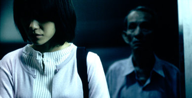
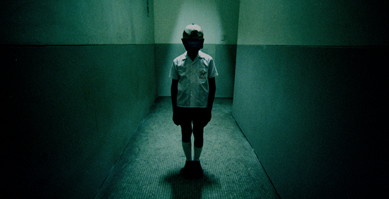

<!-- # 揮之不去的殖民鬼魂：從《見鬼》談香港身分認同問題 -->

香港在九七回歸以後的電影多半會直接或間接處理到香港人的身分認同問題。這個問題就像是文化潛意識（cultural unconscious），就算導演編劇不刻意處理這個主題，它都會透過這種形式出現在電影中。香港電影與文化研究學者羅永生在分析香港臥底電影時就指出「佔據香港電影創作人心目中一個重要地位的，當然是香港人的身分政治，以及身分政治相互緊扣的幾個課題，其一是時間，其二是記憶。」[詳細分析請見羅永生〈作為政治寓言的「無間道」系列〉。]

香港長期受到英國殖民，在九七回歸以後卻又被迫要認同中國。原先深度西化且現代化的香港，彷彿在回歸中國的那一刻被強迫認同一個「前現代」的中國父親。這種身分認同的尷尬如同鬼影一般，在香港二十一世紀初的電影中徘迴不去。若臥底電影如羅永生所說，以「偽裝」來點出香港人民的身分政治，那麼鬼片則是以「鬼魂」作為隱喻，反映出香港歷史的前世今生。香港在2002年最成功的鬼片《見鬼》（The Eye）就是一例。

以鬼魂作為歷史的隱喻並不少見。美國知名黑人小說家童妮摩理森在其1987年最著名的小說《寵兒》（Beloved）中，就以黑人歷史改寫歌德文學傳統，以鬼魂作為隱喻，反映出黑人在美國白人奴隸制度下揮之不去的創傷與回憶。這樣看來，鬼魂往往不只是一個恐怖的來源，更帶有歷史的刻痕與意義。由彭氏兄弟執導、兼具票房與掌聲的《見鬼》，就以陰陽眼與鬼魂這兩個鬼片中常見的主題作為隱喻，反映出香港人矛盾的身分認同與獨特的歷史過往。

《見鬼》以換眼角膜手術作為故事開頭，這是非常有趣的切入點。眼睛是文學中最常見的隱喻，從《伊底帕斯王》開始，乃至摩里森《最藍的眼睛》，眼睛往往暗示一個人的身分與主體性。更有趣的是，英文中Eye發音等同於I，再再指出眼睛與身分之間的強烈關聯。故事中失去視力的阿汶，透過重獲視力的過程，試圖一點一滴重建自己的身分與主體性，卻發現事情沒有那麼單純，因為新的身分與過去的身分正緊密的交纏著。

電影裡，眼睛與身分的隱喻不停重現，並與鏡像高度相關。阿汶起初在鏡子中看不清自己的面貌，代表她尚未完全重建自己的主體性，也因此她在明亮的空間中仍然充滿害怕與焦慮。這邊導演聰明地把亞洲人住在擁擠狹小的都會空間所患有的集體幽閉恐懼症帶入電影，以經典的電梯飄浮阿伯鬼魂一幕反映出香港人對於狹窄的生活空間所感到的焦慮與壓力。阿汶因為重獲視力而感受到新的壓力，象徵她面對新的身分充滿恐懼與焦慮，也因此電影中期，阿汶會試圖假裝失明、回到黑暗卻熟悉的環境中，寧可放棄自己的主體性，也不要一再面對新身分所帶來的恐懼。

這樣的焦慮與恐懼若放到香港的歷史脈絡來看，則更可以精確地進行解讀。香港人在九七回歸後看似「重見光明」，重獲主體性，擺脫殖民的傷痛，但中國這個「舊父親」是香港真的想認的嗎？從英國回歸到中國，從現代過渡到前現代，究竟是重見光明還是走入黑暗？這種焦慮與不確定性被反映在《見鬼》中，以阿汶的害怕與恐懼表達出來。

電影最經典的一幕就在於阿汶體認到一直以來「錯認」自己的那一刻。與瑛瑛的合照中那個阿汶，原來不是鏡子中看到的女子。阿汶開始問自己：「我到底是誰？你又是誰？」這種身分認同的焦慮、雙重身分的弔詭，就是香港人在九七回歸時所面臨的問題。羅永生指出《無間道》這類的臥底電影反映出香港人在捨棄或重新取回過去身分與記憶之間的兩難抉擇，則《見鬼》這類的鬼片拍出香港人在雙重身分之間擺盪與轉換之間的多重焦慮。

故事中揮之不去、到處現影的鬼魂，就是殖民鬼魂的體現。回歸中國以後，過去的殖民痕跡仍然到處都是。於是阿汶獲得一雙新的眼睛，看到的卻不是新的天地，而是舊的鬼域。到處都是過去的鬼，到處都是回憶的魂。燒臘店一幕最為明顯，老闆堅決不賣出自己的店鋪，抵抗新政府的土地收買政策，而他的妻小鬼魂縈繞燒臘小店不去，每天回歸舔舐燒臘，更是香港過去的鬼魂來回盤旋的最好隱喻。這樣看來，故事中強制把鬼魂帶走的黑衣死神代表的就是中國，在回歸以後試圖把香港的過去抹清，但它帶不走的是人們的回憶。

阿汶前往泰國尋找華僑趙惠玲的旅程，是尋找香港前世今生的比喻。泰國在《見鬼》中，巧妙地扮演了香港的一個個過去，包括被殖民的過去與前現代的過去。事實上，泰國與香港之間的關係相當有趣。在二次大戰期間，香港曾短暫受到日本殖民三年，而泰國（當時仍稱暹羅）在當時支持日本帝國，簽訂了「日泰攻守同盟條約」，而後對英美宣戰。所以泰國對於香港來說是個弔詭的存在，雖同是亞洲國家，但泰國可說是殖民香港的共盟者（日泰同盟），又可說是對其殖民者的敵人（對英國宣戰）。泰國和香港之間的關係雖然並不直接明顯，卻彼此糾纏環繞，代表了一段段亞洲被殖民的過去。

另外，泰國被再現為一個「前現代」（pre-modern）的過去。《見鬼》中的泰國和香港相比之下，顯得落後而傳統。不管是醫院一幕還是村莊一景，泰國在螢幕上的意象都非常「前現代」。這或許和泰國在兩次大戰間躲過西方列強殖民，身為亞洲少數未被殖民的國家，因此較晚進行現代化有關。這也同時反映出香港自十九世紀中就受到英國殖民，因此很早便西化／現代化的事實。前現代的泰國在此扮演著香港的另一個過去，是香港的前世。

《見鬼》中，趙惠玲的過去與阿汶的現在互相交纏，泰國的房間也與阿汶的房間互相重疊，兩者之間的糾纏透過時間與空間的隱喻不停再現。尋找趙惠玲的過去，就是尋找香港的過去。於是，解決趙惠玲過去的糾結，就是解決香港人的身分認同危機。故事結尾阿汶被趙惠玲附身，兩人靈魂交疊，阿汶差點自殺而死，最後卻成功被泰國母親所救，兩人進行和解，象徵著不只是泰國與香港的和解，更是香港與自己過往的和解，對自己前世今生的擁抱。

這樣複雜的身分認同與殖民過往，究竟能不能在不同的文化背景下再現呢？答案是，不能。2008年好萊塢翻拍這部電影成《變眼》（英文片名仍是The Eye），劇情幾乎和港版一模一樣，經典片段一個也沒少，醫院阿婆、衝刺女鬼、飄浮阿伯、尋找前世、結局大火，幾乎是全本照抄。但這次的改編在我眼中卻相當失敗，原因是只有語言翻譯，卻沒有作好「文化翻譯」，以及好萊塢死性不改的白人中心與英雄主義作祟。先不論潔西卡艾芭演技過差完全無法跟華人鬼后李心潔相比好了，光是亞洲集體幽閉恐懼症就無法準確被再現，電梯飄浮阿伯一景相當可笑，電梯那麼大一台，哪來的恐懼？

在這次改編中，我們同樣看到美國白人社會的文化潛意識：只要是白人無法處理的、破舊的、骯髒的過去，全都丟給「非白人」去消化。於是白人的「過去」成為了墨西哥。在《變眼》中的墨西哥，不只是一個「前現代」的社會，更被再現為一個蠻荒、危險、充滿迷信的巫蠱之地。安娜是墨西哥巫婆，最後被席妮所救（而非原版中與母親和解），象徵著白人對墨西哥這個蠻荒之地的拯救。在這個尋找過去的旅程中，白人要的不是和解，而是透過拯救一個前現代的社會，來加深自己的白人優勢身分。席妮在電影結尾說：「我給了安娜她從未擁有過的平靜。（I give Anna the peace she never found in life.）」這也可以解釋為什麼同樣的結尾大火，可以被好萊塢改寫成《絕命終結站》式的預言與大拯救，令人著實傻眼。

有趣的是，香港原版《見鬼》也成為好萊塢改編《變眼》的某個「過去」，這個「過去」在《變眼》中也隱約徘徊，只是受到白人中心視角所囿，成為一個刻版印象化的負面過去。《變眼》中的中國元素出現兩次，一次是席妮路過的、曾被燒掉的中國城餐廳，另一個是害死兒子的中國虎媽。《見鬼》中燒臘店與找成績單的小孩是美國人無法處理的兩個元素，於是透過刻板化與負面化，丟給中國人去消化這兩個元素即可。於是中國人在美國電影中要不是中國餐廳的餘灰，就是汲汲營營的虎媽。看完這個改編，內心吶悶：還真是見鬼了！

採編：Vanessa 責編：余澤霖
