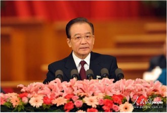

<!-- # 谢幕十年 交接一刻 -->

昨日的政府工作报告，是温家宝任内最后一次。为十年总理之路画上一个句号，因而对于本人和这个国家而言，都是有着别样的意义。正因如此，以三鞠躬谢幕——这一往届总理所未有的行动，使之更富意义，也成为媒体关注的重点之一。

有港媒大公网撰文的《温家宝三鞠躬象征性告别十年总理生涯》，被中新网摘编后，获得合法身份，旋即被门户跟进置于重要位置。凤凰还曾将其列入头条。

“感情是复杂的。应该讲，既有全心全意为了老百姓而做出了自己的努力。另一方面，又会觉得自己的努力跟老百姓的期望和要求还是有差距的。最终，他应该讲很沉重，不是很轻松的”，在搜狐网解读政府工作报告的社科院社会政策研究中心副主任杨团如是说。

相比内地媒体，港媒凤凰网邀请国家行政学院教授汪玉凯的解读，则尺度更大。这位教授在解读并不讳言对温的赞赏，将温的壮志未酬归咎于他所处的体制，“从温家宝的个性来讲会突出改革，一直是过去他多少年来呼吁，从个人来讲也并不尽人意，也不满意，这也不是他能决定的……中国的这个体制大家都很清楚，在国务院他的权力边界也会受到其它权力的制约，不是他随心所欲的。甚至在中国的体制下用人可能他都没有很大的决策权，一个总理对各部部长没有很大的主导权的话，这对他运行起来就会遇到很多问题”。

“平民化总理”的形象被汪玉凯视作温家宝的最大政治遗产。确实，即便人们对其有“影帝”与“作秀”的议论，但是并无碍其成为一个有政治魅力的总理。今日中青报评论《越具象的政治越有感染力》即由政治魅力切入。“

政治因人而鲜活。抽象的政治理念，是通过个性化的政治人物来传达的。……开放的政治，需要有个性魅力的政治人物。”

《真诚为人民效力，历史会公正对待》，南方都市报以此深情题目送别温总。“

十年的岁月，不同的个体有不同的经历和感受。轻者不过宇宙之一瞬，重者或将铸就人生之轨范，择。……尽管温家宝总理曾经真诚希望，“我，连同我这一生，给人民做的有益的事情，人民都把它忘记，并随着我日后长眠地下而湮没无闻”，但在这长达十年的总理历程里，他以其鲜明的个人风格留下了深深的印记，人民又怎么能够轻易遗忘？……而今修史的权力早已从孔子移到了人民手中，所有真诚为国家和人民效力的人都会被历史公正对待，而历史之值得敬畏，原本正在于此。”

另一值得被注意的瞬间则是温李两代总理的握手，像《南方都市报》、《中国青年报》等报纸的编辑愿意将此列为头版的图片，寓意浓重的交接时刻。确实如此，虽然温家宝的卸任时间应在选出新总理之时。不过两会会场可以算作他象征性的谢幕。而此前，吴邦国与张德江、贾庆林与俞正声亦有类似的握手瞬间。

“让人民看到希望”，这一来自政府工作报告的话被视为这位总理最后的寄语与承诺。而民生也是这份任内最后的政府报告中的重点。凤凰评论频道的头条就是以此入题由三篇评论组成，《华西都市报》

、新京报《“民生数据”引领中国前进路径》以及同城京华时报的《改善民生需站在更高纬度上》。民生是改革的重点，是上述报纸的共识所在。

华西都市报将民意是做改革的试金石，“时下的中国，正处在高速发展期，也处于改革攻坚期。发展过程中积累的有些问题，必须正视。在“摸着石头过河”的改革实践中，有些“硬骨头”，亟待通过深化改革，去循序“啃掉”。而改革步伐的行进，当以民意为原点。能否承接民意，也是检验改革成效的试金石。”

京华时报则要呼吁延展民生投入的范围，“民生投入，不仅包括财政的倾斜，还应该包括范围的拓展。在环境污染成为重大公共命题之时，减轻民众的环境付出成本，就是民生；在城镇化进程中“人的城镇化”诉求趋于高涨之时，提高民众的权利均衡程度，同样是民生投入。更为广泛的民生概念和追求，既是民众的冀望，也是民生作为政府一切工作的出发点和落脚点的要求。”

虽然鲜亮的民生数据已经昭彰了政府努力下的改变，但是也并不影响社会弥漫着戾气与怨气。这是为何？《为什么享受了“红利”还要骂娘》，这一来自中青报评论员曹林的评论或做了某种解答。“更关键的问题出在分配不公上。多重不公的存在，让实际上的受益者也涌动着一种“相对被剥夺”的郁闷，总是觉得自己未能受益，甚至是受害者。……相比数字的增长，人们也许更看重公平的增长。……应该读懂人们对公平的期待，确实，中国每个人至今都仍在分享着改革的红利，我们都是受益者，但赢得民心，还必须让人们‘公平地受益’。”

公平并非一簇而就，当民众们抱怨改革不够快的时候，人民日报则要提个醒，控制节奏——《发展，在奔跑中调整呼吸》。“如果把中国的发展比喻成赛跑，现在已进入最考验耐力的相持阶段。这个时候，调整呼吸、保持节奏至关重要。政府工作报告划定重点、制定规划，就是为了能让偌大的中国，在奔跑中不断调整呼吸，最终跑得更稳、跑得更远。……现在，整个中国发展的劲头很足、步子很快，‘一万年太久，只争朝夕’。公众对政府的工作期待很高……然而，分析这些政府工作报告也可见，发展不能一蹴而就，想在朝夕之间解决问题更不现实。……在面对问题时，需要砥砺前行，同样需要时间、需要耐心，需要更多理解和支持”。

“PM2.5”这一词汇首次被列入政府工作报告。这一在美国驻华大使馆推动下被普及的概念终于获得官方最隆重的重视。虽然“要顺应人民群众对美好生活环境的期待，用实际行动让人民看到希望”。不过这样的承诺依然不能掩盖现实的惨淡。》，“北京风光，千里雾霾，万里尘飘……空气如此糟糕，引无数美女戴口罩”，这一被政协姚檀改变的《沁园春·霾》，被他当着前来驻地看完委员的习近平诵读。

“自由迁徙”这一同样首次出现在政府工作报告中的词汇倒是撩拨了不少人的心思，这其中就包括钱江晚报的评论员董碧辉。“在报告里，民众第一次看见了自由迁徙这四个字。它从一堆堆数字、一项项成就里面挣扎出来，努力要摆一个灵动的POSE……

通过制度上的改革，给予民众自由迁徙的种种保障和便利，也就赋予了他们不受限制地追求个人发展和享受幸福生活的权利。”

（责编：马特；采编：佛冉）
