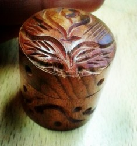

<!-- # 沉默的青草 -->

过了六点，天就这样自顾自地黑下来。在图书馆手脚冰凉地坐着，也并不做自己应该做的事，面前摆着德国老太太从印度贩回来的小木盒子，图书馆的白炽灯打在木纹上，泛着并不精细却好看的光。

这样的时候就总想写点什么。什么都可以。每次去那个印度小店的时候我都想象这些花花绿绿的东西在摆在印度白花花的太阳下集市上的样子。东方来的布料与羊毛，拿到手上，总是还带有一些极其熟悉但又没法描述的香味。

像小时候奶奶藏蓝色的褂子，或者埋着草灰的炕上放着的簸箕，或者打开那个沉甸甸装满了麦子的柜子，突然漫出来的味道。奶奶的厅堂里总是清冷的，夏天最热的当午，那种清冷依然散着森森的凉气，即使是在西北难得的有水流淌的村子，但是因为更强势的总是黄土高原上来的风，这清冷于是丝毫不带粘稠与潮湿，像挂在树荫里的一件简简单单的棉布衫，被风吹的微鼓，不阴不寒。太阳挂在大空中的时候，我总是习惯屈着腿坐在厅堂的门槛上，面前摆个稍高的凳子当桌子，写我的暑假作业。作文日记什么的，都还算好编的，一天总能编出十天的日记来。头疼的总是数学作业，一打开数学作业的本子，时间就好像被谁给关了阀门，流的又稠又慢，怎么样都过不去。面前的太阳晒在眉脚上，刺啦啦的格外的滚烫，背后的厅堂伏在我驼着的背上，又丝丝的格外的透凉，我坐在厅堂的门槛上，视觉一片模糊，听觉格外灵敏。一时间某棵树上的啄木鸟开始敲敲打打，一时间又有哪个邻居家的两只公鸡开始斗仗，然后就是玉红和小兵的笑声，好像总是隔着一墙之远，听得我挠心挠肺的想撕了作业本跑出去玩。

那时还年小，我想，什么都好玩，什么都比呆坐在门槛上算四则运算好玩。有姐姐在奶奶家陪我的话还好，没有姐姐的日子，连门外慢吞吞的走过一只拉屎的牛，都能恨不能引得我去看半宿。一听见玉红和小兵的声音，更是魂魄都不留一丝儿的都被勾搭走了。

玉红和小兵是亲戚家的小姐弟。我管他们的爹叫大爷，但是具体是怎么个辈分，我从来就没搞清楚过。只记得那个大爷和善，眼睛黑黑圆圆的，笑起来还有酒窝。玉红和小兵都从那个大爷那里得来了黑黑圆圆的眼睛和浅浅的酒窝。那时我生的又黑又长又瘦，一头单薄稀疏的黄毛，对自己单眼皮的小眼睛颇为介意。玉红不同，她有两汪小水井一样深深的亮亮的眼睛，一圈睫毛根根笔直而茁壮，小村的水好，姑娘们个个都是健康而饱满的粉红色脸蛋，但即使如此，玉红的脸总还是让我觉得格外的耐看，那种粉扑扑，有种格外饱满的生命力。她梳两个麻花辫，但梳得懒散，绕着她的鬓角和光亮亮的额头，就总还是有些细碎散乱的“丫丫毛”，她的头发不是纯黑的，有点棕，在暴晒的太阳底下甚至会有点金黄，但是辫成粗粗壮壮的两条麻花辫，我每次跟在她的屁股后头田头地尾的钻，看见她肩头上一跳一跳沉甸甸的那两条辫子，就很惆怅，觉得自己一辈子都长不出这么多头发来。

其实小兵长得更好看，是很讨人喜欢的男孩模样，又带一点点女孩子的害羞，特别是笑起来的那两个深深的酒窝，这么多年过去，那副憨憨的让人欢喜的样子都还是活脱脱在我脑海里。我打小在爷爷奶奶身边长大，和玉红小兵也算是一起玩大，只要一回到老家，从来都小兵哥哥长小兵哥哥短的想要找他们去玩，但是慢慢长大一点点，老家的姑姑婶婶们，就总是拿年纪相仿的我和他开玩笑，总说等我长大了让我给他当媳妇儿。于是慢慢的我就不好意思多看他。但心里某个角落又偷偷摸摸喜滋滋的想，小兵哥哥长的那样好看，就给他当媳妇儿也不是坏事。

那时在乡下，读书是娃们自己的事，只要他们每天背着书包进了学校，当父母的职责就尽了大半。但放了学，该锄草的锄草，该喂猪的喂猪，多小的孩子都好，总是有能分配到的活。读书读坏了不见得会挨打，但若是谁家的孩子忘记了锄草喂猪，少不了一番皮肉之苦。每天村里就都有女娃男娃被他爹他妈揍的鬼哭狼嚎，边儿上说不定还有邻居叼着烟锅子，说活该，就要让他皮疼才知道长进。所以被表扬众多的孩子，总是那些又知道乖乖上学，又知道放了学乖乖干活的——就像玉红姐姐那样的。她话少，却礼数周全，学校里成绩也好，回到家还总懂得体贴家里。每次走在路上遇见了我和奶奶，她都笑意盈盈的向我和奶奶打招呼。她还有顶顶让我羡慕的一项，就是她妈会做酿皮。农闲的时候，她妈妈，也就是我大娘，做好了酿皮，做好了蘸料，放在藤条编织的簸箕里，五花大绑的捆在自行车的后座，然后就骑着车子在午后的村子里走街串巷的卖酿皮，吆喝的声音清脆尖细。每次还隔着好几户，我就能听见她尖尖细细的吆喝声，口水瞬间三尺长，立马就央求奶奶备好钱，恨不能将那一簸箕的酿皮全盘买下然后吃一整个夏天——这也是我对玉红和小兵羡慕得肝颤的原因，我以为，他们的夏天，便是可以这么过的。每天都能在家吃到酿皮该是多好啊，我一定是曾经对玉红姐姐说过这样的话，她是如何回应的，我却怎样都想不起。只记得某些午后，她也会笑意盈盈的端着一个粗瓷碗来，一边交给奶奶，一边说，慧子喜欢吃，我妈就让端来些。小兵哥哥总是跟在她身后不远处，憋着红扑扑的一张脸，就知道憨笑，话从不多说。

我真喜欢看到他们。

玉红的手还很巧。七月日头最晒的时候，大人们都收了工具在家里午睡，总算没人监控的小孩子们就得了空闲到处乱窜。那时包谷成熟，随便谁家的包谷地，钻进去摸到一折，个个都是膀大腰圆的一个包谷棒子，带着植物特有的清甜和一鬃包谷特有的棕色穗子。村里的路上，随处可见四散的包谷杆，包谷叶和包谷穗子。包谷杆括了皮，里面脆生生乳白色的杆儿，一股脑塞进嘴里嚼着吃，那些甘甜的汁液立马抹了满嘴满嗓子，就嚼到后来只剩下干巴巴一嘴老渣也不打紧，一整根玉米杆，还会疼惜这一口？吐了渣子继续嚼一段新的——是到好几年后，在城里第一次吃到南方来的甘蔗，从长相到吃法都让我讶异——这货不就是紫色的玉米杆子么，稍微粗点罢了，还没嫩生生的玉米杆子好吃呢。顶顶好玩的是包谷穗子，成熟的包谷，露在包谷叶外面的穗子总是已经焦枯干黄的了，但是还藏在包谷叶里面，紧紧缠绕在包谷身上的那些，却还是嫩嫩的，青青的，泛着偏银色的好看的光。玉红的手巧，巧在她最会把这些包谷穗子不露痕迹地辫进我稀薄的两小根辫子里去，青青嫩嫩的部分被她一编，都不知给藏到了哪里，剩下的就只是足以以假乱真的深棕色穗子和我的头发缠绕在一起，乍一看，我还真是有了梦寐以求的两根粗辫子。那种时候我就高兴的连名带姓都能给忘了，跟着玉红和小兵一时上山捉鸟，一时下水摸鱼，直到天色渐黑，奶奶喊我回家吃饭的声音明显透露出回家没有好果子吃的威慑力，我才磨磨蹭蹭的进家门，再摸我梦寐以求的玉米穗大辫子，早都散了架，没了形，捏在手里的，重又是两根有气无力的稀薄卷毛。想来我的玉米穗辫子，许是几丝儿挂在了偷黄瓜的架子上，几丝儿散在捉蚂蚱的洋芋地里，还有几丝儿顺着那条永远都摸不到鱼，却永远都诱惑我去摸鱼的小渠里，飘到很远很远的地方去了吧。

再大些，我的个子窜的飞快。每次回老家，都被邻里乡亲一顿围观，说是怎么样都认不出是当年的我，每次回去，乡下的伙伴们都得花些时间，来适应和消除被分离的岁月所筑起的陌生感，这陌生感一旦被消除，我们就又都像石头里蹦出来的野孩子一样，一模一样的爱玩爱闹爱淘气——好像来自一模一样的家，有着一模一样的爸妈，从来也没分开过一样。但每长大一岁，这个适应和消除陌生感的时间，就变长一点，六七岁时需要一瞬间，八九岁时一整天，十岁时候需要三五天，十二三岁时便要八九天。我和他们的不同，变得越来越明显，让我和他们都手足无措。小时候说的地地道道的临洮话忽然有一天就蹩口得怎么都说不好了，而让爷爷奶奶很有面子的一嘴普通话，跟玉红小兵一开口，就好像拿金箍棒自画一圈一样，我出不去，他们进不来。而连自己都赧于承认的是，就在那么年轻的心里，还是长起了结结实实的一层优越感：我是城里人——即使这个”城里“，在兰州人的眼里又是个乡下，而我的“城里”兰州，和遥远的只在新闻联播里见过的北京比，又沦为乡下了吧。

但在那个小村，我长大的小村，我的存在，渐渐变得不一样了。我是坐着四个轮子的车来的，即使大多数时候是爸爸托人情才能坐上的单位顺车，但是拐过山拐过水的到了奶奶家门口，总是能引起好一阵子围观。村里人会不无羡慕的跟奶奶说，看你儿子多有出息啊，都坐着车来看你的，看你孙女多有出息啊，都会说普通话的。那些围观的人里有时会闪过玉红和小兵的脸，我下了车，非常非常想到他们跟前去，觉得有非常非常多的话想跟他们说，但是不知怎么的，就没能走过去，没能说出一句话来。我只记得玉红姐姐还是笑意盈盈的，只是笑的非常拘谨和害羞了，而小兵哥哥，他一直都那么害羞的，一直那么好看的，而我一直不好意思看他。

我觉得终于有一天，不知道是谁，也可能是我们很默契不约而同地，就放弃了那个所谓适应和消除陌生感的时间。张牙舞爪的陌生感，在时光的土壤里狠狠的吸足了肥料，飞扬跋扈地长起来，长得那么高，那么粗，那么壮，终于任是谁，都不能把它拔出，把它砍断，把它消除了。

对于玉红和小兵最后真切的印象，停留在我在老家度过的最后一个春节，那时奶奶已病了，爸爸将离家八年的二爸叫回家过年，因为对这悲伤的根由并不知所以，我只是格外开心那年春节的人声鼎沸，热闹非凡。按照老家的传统，大年初一的早上，各家的小辈们都要挨家挨户给自己家的长辈亲戚拜年，像以往的所有年一样，玉红和小兵也一前一后的出现在我家门口。我清晰的记得他们都略有些拘谨地坐在炕头，彬彬有礼的回答着我家一大帮长辈们的各种问题，玉红姐姐还是那样笑意盈盈的招呼着我，慧子你都长这么高了，小时候最爱吃我家的酿皮你还记得么。小兵哥哥在不远处低着头，垂着小树丛一样浓浓密密的一层眼睫毛，笑的时候露出浅浅的酒窝。

那是我最后一次印象深刻的偷偷想：他们真好看，我真喜欢看他们。

13岁的时候我初一，那年奶奶走了。好像是剪断了我这风筝和小村之间最紧最壮的那根线，虽然还有丝丝缕缕的牵绊在，但是在一阵比一阵更野的风里，我知道自己越飘越远了。

之后有些事情再继续，继续疯长个子，继续讨厌数学作业，继续说不好临洮话又说不好普通话；有些事情在开始，开始喜欢干干净净幽默大方的城市男孩子，开始觉得白皙而不带红二团的城市女孩才是真的好看，开始喜欢定西多汤料而较稀薄的酿皮子，开始吃不惯临洮多干料而厚墩墩的酿皮；有些事情顺理成章而出乎预料的发生，比如升学，再升学，忽然就进了大学，忽然就去了北京。

我忘记了是几年前的事，应该是在大二还是大三的假期在家，有一天有老家的亲戚来访。我客客套套地打招呼，敬茶水，递水果，然后就赶紧溜进自己的房间里自娱自乐去了——如此，我就已算是尽了我对那个小村的本分吧，在我与乡下来的亲戚身上，我实在也想不出还有什么能让我停留的联系了。客厅里的谈话声时高时低，爸爸和临洮来的亲戚说话时临洮话会格外标准，好像那些故乡来客会重新唤起某部分已被他淡忘的自己。亲戚走后，我钻出房间来，爸爸默默地坐在客厅，似乎都没有意识到我的存在。不知道是什么原因我忽然觉得爸爸很孤独，虽然孤独得不明所以。

过了些时间，爸爸长长地出了一声气。然后不知道是对着我还是对着妈妈说，那个娃，真可怜，何苦要走这条路。

是玉红。她自杀了。

她嫁了人，嫁了一个打她的男人。不知道在被打的第几年，她终于忍受不了，喝了药，就去了。

我忽然发现我对于长大后的玉红一无所知。她是在哪年停止求学的，为什么？她是在什么时候嫁人的，嫁了谁？她受了几年的苦，是否也曾想过离婚，或者走出那个小村，是否也曾想过自己还会遇见一个很好的男人，过很好的生活。

为什么不能出走？为什么不能离婚？为什么不能告他？为什么不能反抗？

我脑子里闪过了好多好多的为什么，但我什么都没问。因为隐隐约约的，我知道答案。

那里是乡下。那里是最美好的乡下，那里是最残忍的乡下。

那个乡下生了那么美的一个她，然后杀死了那么美的一个她。

那里的乡下满山遍野长满了青草，从未有人想知道他们怎样生长，怎样死去。

从未有人真正听过它们喧哗，然后连它们自己，也终于相信自己本不可喧哗。

前几天我看美剧

《绝望主妇》。Susan得了病，需要别人捐给她一个肾。她在极短的时间内幸运地得到了匹配的捐助，而同时，被同样的病缠身多年一直在等待匹配的捐助源的病友，却最终未能等到幸运降临的那一刻，抱憾闭眼。Susan对她的朋友哭着说，我无法接受这个捐助，因为我无法理解上帝为什么会这样对我，为什么他把这样的幸运独独给这样糟糕的一个我，却不肯给那样好的一个人，在我理解他的用意之前，我无法接受这个赐予。

我一向都觉得Susan矫情得有点烦人。然而这段矫情之至的话却忽然让我有些动容。

因为有些事情，我有相同的疑问。我不在意头顶深深的高高的苍穹尽头，那个执掌着众生安排着轮回的人究竟叫上帝还是圣母还是释迦穆尼或者真主阿拉。无论他是谁，我都想知道他的用意。为什么一起吸着鼻涕玩着泥巴长大的孩子们，有一天会拥有那样不同的命运；为什么有些美好会那么丑恶地死去；为什么有些丑恶还那样光鲜地活着；为什么我，成为我，而她，成为她。

而为什么，我们的人生只有这一次，有时甚至来不及去问为什么。

如果，在深深的高高的苍穹尽头，真的有那样一个他存在，如果他真的如人们所说的那样，慈祥，悲悯，怜爱众生，就让他超度那些此世渺小而悲苦的灵魂，在下一世，享有与她相配的幸福与幸运。

而我，将在这些温暖和悲伤里，永不妥协地记录与思考，永不妥协地发问和寻找。

只要那是美的，即使是无用的。

（采编：周凌希；责编：孙梦予）
