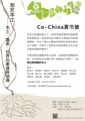

<!-- # ：始于本土——本土、国家、世界的冲撞与协商 -->

**本土实验一：慢城运动**

自上世纪末开始，意大利、西班牙、挪威等欧洲国家的一些城镇兴起「慢城运动」，慢食、慢交通、慢生活、慢教育，与今日世界所鼓励的快速与高效不同，他们倡导「慢」。因为「慢」，所以无需让流水线作业的快餐店取代本地传统小食店；因为「慢」，可以为自行车和行人保留更多的公共空间；同样因为「慢」，学校可以不

用恶性竞争的教学方式，给学生更多自由空间。

**本土实验二：碧山共同体计划**

因对过度城市化的批判和农业传统发展模式的忧虑，艺术家

欧宁、左靖发起碧山共同体计划。他们邀请艺术家、建筑师、作家、导演、音乐人、学者等知识人来到碧山，一方面尝试互助和自治的小区实践，同时也充分利用在

地资源，比如碧山的历史遗迹、乡土建筑、族群文化、民间戏曲等，与当地村民一起合作，推动碧山的经济、文化发展，希望为乡村带来新的复兴机会。

**本土记忆一：香港故事馆**

在都市更新过程中，承载无数人过往与记忆的旧区逐渐被簇新的高楼取代，原本街坊、邻里间的生活方式亦随之消失。香港一民间机构设立香港故事馆，透过展览、小区文化游和民间学堂的方式，让小区文化得以保存。在这里，传统工艺技师、有机农夫、家庭主妇成为了讲师，带领公众认识丰富的小区历史与多元的小区文化。

**本土记忆二：恩宁路档案**

07 年底广州恩宁路被政府纳入旧城改造计划，180余户居民联名上书反对此计划，反对终无效。一群年轻人来到恩宁路，他们用文字和影像记录下恩宁路的最后时

光：有人以恩宁路即将拆除的建筑为背景拍摄影片；有人到尚未拆迁的老房子里为居民拍摄全家福；还有人走访小区居民，记下他们的个人史、家族史，希望藉此重构整个小区的历史。这群年轻人令发生的一切留下痕迹。

**本土方法一：黄声远的宜兰**

耶鲁大学毕业的台湾建筑师黄声远20年来只做距离宜兰车程30分钟以内的项目，就地取材，同建筑的建造者和使用者生活在一起，随时根据需要调整设计，让人与建筑、与土地产生联系。他拆除围墙、缩小道路，

将城市空间打通，营造友善城市。在黄声远看来，要从生活细节入手，城市才不会无序扩大，而只有「在地」，才可能打磨出符合理想城市的生活细节。

**本土方法二：用音乐介入小区**

90 年代初台湾政府决定在高雄美浓兴建水库，为了保护当地的环境和原本的生活形态，美浓村民纷纷站出来反对。诗人钟永丰与乐手林生祥一起用音乐介入了这场抗

争。他们以山歌为原型，用客家方言进行创作，歌唱客家人在美浓安家立业的历史，歌唱美浓反水库运动现场的群情激昂，歌唱乡亲去立法院请愿的心情。后水库项目暂停，但他们仍继续用音乐参与小区的构建，用客家话唱出家乡的故事。

**本土冲突一：以民粹作为手段**

近些年来愈来愈多的大陆人来香港旅行、购物、工作、生活，香港人的不满也随之增加：将大陆人比作「蝗虫」，反对大陆新移民享受同港人一样的福利，抗议大陆学生占用过多宿位，抱怨自由行客人增多后城市环境恶化，反对大陆孕妇来港产子……虽都是资源之争带来的矛盾，但不乏有人以民粹作为手段，刻意挑起族群冲突，以此确立香港人的主体身份认同。

**本土冲突二：狭隘民族主义下的国族认同**

2012年9月，因钓鱼台归属问题的争议，中国爆发大规模反日游行。北

京、上海、沈阳、西安、成都等地有数千至数万人走上街头。示威者打出「凡日必反」、「日本人滚出中国」、「哪怕华夏遍地坟，也要杀光日本人」的标语口号，

后演变为打砸抢烧日系车、日式餐馆、日资企业的行径。疯狂背后是狭隘民族主义下建立起的国族身份认同。

**本土论述一：好的本土不该封闭**

台湾文化人张铁志成长的年代即是台湾本土化的年代，他认为「本土的重要就是重新站在自己的土地上，从滋养我们的文化中受益。但台湾本土化亦有其黑暗面，比如

狭隘的族群主义和排外。今天我们应该更认真地思考本土带给我们的究竟是什么，好的本土应该有吸收和包容能力，而不是封闭的排斥」。

**本土论述二：本土意识彰显人的主体性**

香港学者罗永生认为香港的本土意识，并不是「大香港主义」，更非「城邦自治」，而是根植于本土生活、历史经验和小区文化传统的主体性。本土并非必定排外，它

可以包容，可以发展，可以有自省空间，但归根结底是以共同的生活经验、价值和情感为基础，并彰显生活在本土空间的人的主体性。

以上诸种皆为「本土」的面向，挂一漏万的例子除了说明在全球化浪潮席卷下本土的价值与可能，也想进一步探讨如何在守护本土价值的同时能够开放、多元；建立主

体身份认同的时候怎样可以不封闭、不排斥；面对外来的族群和文化又能否做到理解与宽容。

若您对此议题有深入思考，也做过些相关的事情，欢迎加入我们，一起**寻找更开阔的本土****。**

【**主题**】

始于本土——本土、国家、世界的冲撞与协商

【**营期**】 7月28日-8月3日

【**营地**】

香港中文大学

【**费用**】主办方会承担最终入选者在营期间的食宿费用，参加者只需负担往返香港的交通费及个人在港支出，无需缴纳任何其他费用。

【**申请条件**】1、年龄在18-25岁；2、对「本土」议题有深入思考并做过相关的事情。****

【**申请需要文件**】**：******

1、个人简历。

2、请提交一篇和「本土」议题有关的论述文章，字数在2500-5000字。****

3、两封推荐信。推荐人包括但不限于了解您的老师、同学、同事、朋友、合作伙伴。

【**截止时间**】**：**2013年4月20日晚11时

注：4月20日晚11时是最终截止时间，申请材料和推荐信都会在此时间停止接收，所以即便您是在4月20日晚11时正提交申请材料，也需在此时间点或之前请推荐人发送推荐信。

【**主办机构**】：一五一十基金会、香港中文大学公民社会研究中心

【**活动详链接**】：[请点击这里](http://blog.renren.com/blog/342593159/898838534)

(编辑：周凌希）
