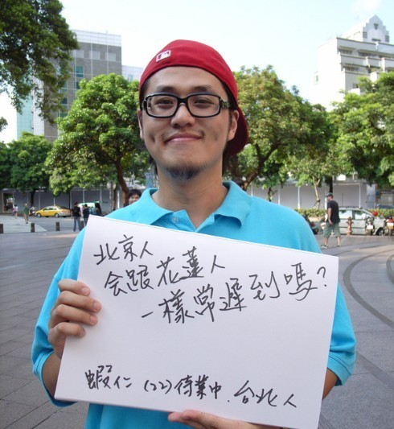
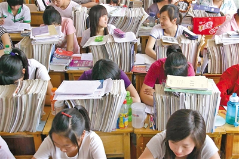
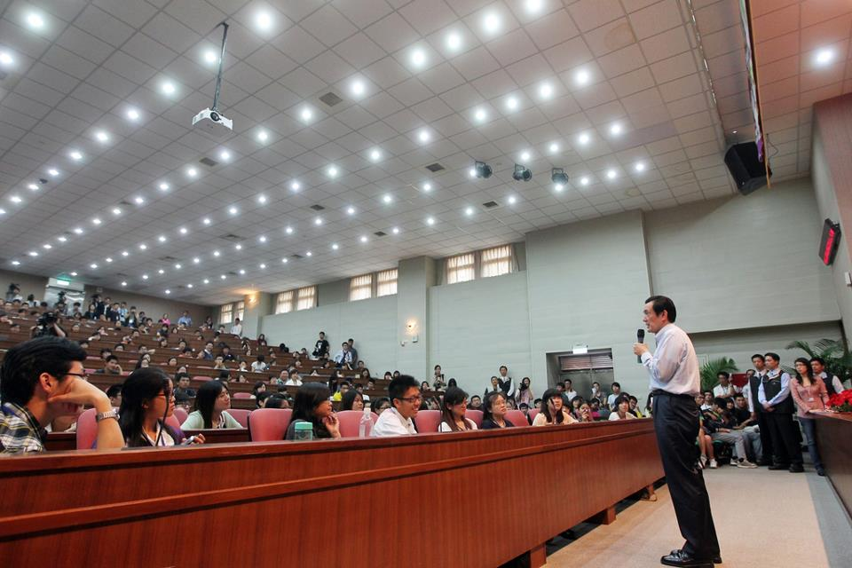

<!-- # 更好的你，更好的我，更好的社會 -->

前注：在語彙的對應使用上，台灣的“新世代”約等於中國大陸的“新生代”。

1.

對於不同國家、地區之間新世代來說：交流的基礎在於和而不同；其動力在於存異求同。

前者解釋了為什麼十數年前的中國大陸和台灣、至今的朝韓之間，在青年層面的交流約等於零；因為不和，是政治上的尖銳對立。後者解釋了為什麼中美交流風生水起，京滬交流、中蒙交流卻鮮少被提及；因為交流要求差異足夠明顯，求同意願足夠強烈。

由此看來，“不對立、不一樣、想知道”，三條特點共同促成了交流的常態化。以此檢視中國大陸和台灣的政治關係和新生代情況，全都匹配。這印證了中台新生代交流當前的興盛，並對可預見的未來給出了一個溫暖的期待。

然而，這並不是一篇討論從實際層面如何促進交流的文章，但若想讓交流長盛不衰，從保護“不對立”和促進“想知道”兩個層面入手，應當會有思路。

2．

兩岸新世代有哪些“同”與“不同”；而這些相似與相異又為什麼產生呢？

前一個問題要求的回答是描述性的；後一個問題則需要分析性的解釋。對後者的回答，更能幫助我們進一步辨析這些“同”與“不同”。因此，這裡集中討論為什麼的問題。

這大約可以從四個方面來看：

首先，經濟。

台灣自上世紀六十年代出口擴張起，歷經七十年代第二次進口替代，八十年代產業升級與國際化，於九十年代起正式跨入經濟發達地區，電子工業和國際貿易成為台灣的經濟命脈，台灣成為成熟的經濟體，這是“台灣經驗”。而近年來，台灣經濟受到多次沖擊，增長逐漸放緩，去年GDP是否能保持1%的增長更引起廣泛關注。薪資連續多年的停滯，房價物價的上漲，以及貧富差距的逐漸擴大正在破壞台灣人民對未來的信心。

中國大陸改革開放至今三十五年，經濟持續的高速成長舉世矚目，一躍成為世界第二大經濟體，人民生活水平的整體改善有目共睹。但飛速擴大的貧富差距，分配正義的全面缺位，以及對環境的驚人破壞，讓這樣的經濟成長功難抵過。而遲遲完不成的產業轉型和人口紅利的正式結束更讓人對中國大陸經濟前景本身充滿悲觀。

台灣的新世代生長在父母輩努力打拼所營造出的安逸社會環境中，自由、單純，從小到大一帆風順，卻在大學畢業時面臨巨大的就業壓力，薪資與發展前景明顯輸給周邊其他發達經濟體。這是幸福的第一代，也是失落的第一代。

中國大陸的新世代生長在經濟快速崛起的大環境中，從小到大面臨激烈的競爭，高度緊張，經歷在原始叢林中般的優勝劣汰，承擔過度的家庭期望和社會壓力。物質主義盛行，價值觀相對單一，賺錢至上（如同GDP至上），缺乏社會責任感和對人的關懷（如同…）。甚至對於社會最為期待北大學子，錢理群先生有言：“警惕精緻的利己主義”。這是不幸福的第N代，也是過渡的第一代。

其次，政治。

毋庸置疑，對於華人世界的民主燈塔這一稱號，台灣名符其實。自八十年代末民主化以來，台灣社會全面轉型。台灣社會對轉型正義的重視，性別平權的推進，人和人之間的平等意識，政治參與的開放，公民社會壯大與成熟，對同性戀愛的接納，以及新聞獨立和言論自由，讓台灣人真正過上了有安全感、有尊嚴感的生活。台灣的人類發展指數高居全球前列。

相對比的，中國大陸仍停留在威權政體階段，民主化難以預期，法治仍然落後，連憲政都成為敏感話題。龐大的國家機器對社會的全面控制仍然遠遠未鬆動。國家對民族主義情緒的挑撥，對信息自由流動的限制，以及對人民參政議政的控制，塑造了兩種人，他們不是少數，甚至是絕大多數：一種對政治冷漠與無知，逃避政治，害怕政治，不公共利益和自身利益的緊密聯繫；另一種對政治無知，但有非理性的狂熱，自大又自卑，把政治當作情感發洩的工具，見於令人羞恥的反日遊行和充斥戾氣的網絡討論。

台灣的新世代，在政治快速轉型的時期成長，自由與平等深入人心；人權，環保，多元價值，創意，公民參與等等後現代的理念逐漸實踐。這是一個自由的世代，真誠的世代，包容的世代，承載價值的世代。從樂生療養院到紹興社區，從反媒體壟斷到反核大遊行，台灣青年一代對社會公共議題的關注和參與令人動容。我永遠也不會忘記，去年深冬裡行政院前冒著大雨守夜抗議的那近百張清晰、堅定、稚氣的青年臉龐，那是光，那是華人世界的希望。

中國大陸的這一代，由於政治參與的空間受限，自身政治參與的意願和能力均不足；又成長於網絡快速發展的時期，線上對政治議題的調侃、諷刺和娛樂性的消費很大程度上解構了討論公共事務原本應有的理性、嚴肅和深入。這種對嚴肅討論的解構是可怕的：它反對一切，消解價值；自詡中立客觀，實則走向犬儒和虛無；這裡沒有價值攻防堅守，只有無釐頭的娛樂，沒有是非對錯辯論，只有敵我站隊兩分。

整體來看，我很難對大陸這整個新世代保持樂觀，他們有太多令人失望的特點，儘管失望大概是歷史的常態；但從小處看，卻令人欣喜，日益廣泛的青年自我啟蒙，與日俱增的社會參與意願，公益組織的發展與壯大都讓人看到了星星點點的自由火種。北斗網，706青年空間，iJoin社會創新咨詢，風致會社等中國青年自發創立的公益組織，都為青年的自我啟蒙作出了可見的貢獻。這束光現在還很弱，可等它真正亮起來，會照得更廣，更遠。

再次，大學教育。

這一點兩岸新世代所面臨的境況相似，接受大學教育後對就業的高期望和進入社會後實際就業的情況有很大落差，這種落差帶來了巨大的心理壓力和不幸福感。

這是由於兩岸都經歷了或者正在經歷大學的全面擴招，文憑貶值了。大學專業結構設置的變化遠遠滯後於社會需求的變化，精英教育和技能教育的渾殽和比例的失調，則是背後結構性的原因。

傳統東亞社會認為讀書是改變社會地位的直接手段，接受更好的教育、通過更高等級的考試意味著出人頭地，進階人上人。這種想法在當今社會的體現，就是認為文憑學歷和收入直接掛鉤。可是，在如今的商業社會，有著細緻的分工和對專業化技能的要求，文憑本身很多時候並不直接發揮作用；而在東亞的“關係”社會，加之契約法治、社會正義和公益觀念的缺位，家庭背景關係對就業公平公正性的破壞隨處可見。一紙文憑，從北大清華到哥大哈佛，都不能許諾給一個溫暖光明的未來，這讓人心酸，儘管這個許諾本不應期望。

我把這稱作傳統儒家文化和現代市場經濟社會對讀書理解的錯位，這種扭曲的張力還將持續困惑我們整整一代人。這裡並沒有龍門可躍，甚至我們原本就不是那金色的鯉魚。

大學學什麼？大學教育是為了誰，又為了什麼？

我認為，這些問題迫切地需要被重新審視，在台灣，也在中國大陸。

最後，人口地理稟賦。

這條很簡單：台灣小，中國大陸大，大很多；台灣人少，中國大陸人多，多很多。大與小是最為基礎的性質，卻構成了理解兩岸差別的關鍵。

小，安逸，溫柔，單純，信任，真誠，自我局限。

大，艱苦，大氣，複雜，多疑，世故，視野廣闊。

我想這兩組詞大約可以試圖概括兩岸新世代各自的基本特點。這或許是我的偏見，但來源於我切實的觀察和思考。

3.

兩岸新世代交流，彼此學習什麼？

我認為，有三點：

1. 中國大陸青年向台灣青年學習對價值的堅守，對理念的珍惜，學習公共參與的意識和經驗。

2. 中國大陸青年向台灣青年學習人與人之間的溫情和信任，學習愛人愛己。

3. 台灣青年向中國大陸青年學習寬廣的視野，良好的抗壓能力，堅毅的吃苦能力，和開闊的國際思路。

4.

然而，交流，有時候，並不一定是互相理解與學習，反而是看清彼此之間邁不過那條線會落在哪裡。透過對方這面鏡子，通過認識彼此的差異，進而更好地認識自己。

交流，歸根結底，不是讓我成為你，或者你成為我；而是讓彼此都成為更好的自己。

中國大陸和台灣的新生代，彼此都還有很長的人生路要走，還會遇到很多挫折和掙扎，也會迎來很多曙光和希望。

我祝願彼此，願心底希望不滅，願自由之花不敗，願價值理念長存。

在社會大轉型的時代，如何將個人利益和公共利益更好地結合起來？這是本文最後的問題，留給我自己，也留給中國大陸和台灣新世代每一位青年。

我相信，對這個問題的思考和解答，將幫助我們成為更好的人，也會幫助我們的社會變得更好。

更好的你，更好的我，更好的社會。

這一天終將到來，我毫不懷疑。

「本文首發在兩岸公評網四月號，取得作者授權轉載，有刪節」

歡迎關注北斗兩岸：[https://www.facebook.com/BeiDouLiangAn](https://www.facebook.com/BeiDouLiangAn)（facebook粉絲頁） [http://www.renren.com/601607819 ](http://www.renren.com/601607819 )（人人公共主頁）

採編：余澤霖

責編：余澤霖
