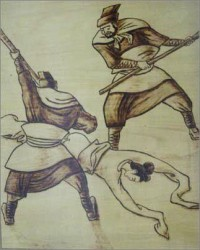

<!-- # 说历史——酷吏 -->

所谓酷吏，首先是吏，何为吏，官吏也，所以酷吏，必须有所职事。其次是酷，在于心狠手黑，酷吏，不是cool吏。

对酷吏的系统性记载，首见于《史记》，记述了十数名酷吏的行止。巧合的是，此十余人，多出现于汉景帝、汉武帝时期，比如郅都、张汤。后世酷吏黄金时期，首推武周，次即雍正，由此可见，酷吏多寡，是否盛行，与君主关系莫大，上有所好，下必投效。

汉武帝喜用酷吏，打击豪强，抑制商贾，惩治贵戚奸吏，以加强中央集权，聚敛财富，应对其挥霍和对外战争的需要。如此执政，一方面强化了皇权，维持了专制；另一方面严刑峻法、残酷杀戮，也使各阶层人民特别是普通百姓遭受意想不到的灾难，冤狱横生，社会不宁，出现了“法令滋章，盗贼（实际上多为官逼民反的起义者）多有”，“吏民益轻犯法，盗贼滋起”的局面。汉武帝想用酷吏维稳，但越维越不稳，官逼民反，群体性事件的滋生，多由于不公正或“认为不公正”，所以要消弭群体性事件，任用酷吏只可治标，不可治本。与其严刑峻法，不如反腐倡直。

兔死狗烹、鸟尽弓藏是封建时代的惯例，故而酷吏往往无有下场。吃惯了兔子肉，偶尔也来顿麻辣狗腿，换换口味。杀多了人，君主总不能承认主要责任在己，只好一推三六五，都是这些个奸佞蒙蔽了朕，我这就杀了他们。所以酷吏用完就该死，以死最后一次为主子谋福利。话说专制政体，该负责任的，都是这些狗脚朕，但狗脚朕们战无不胜、永远正确，黑锅，永远是能找到人背的。况且我们的百姓也只反奸臣不反天子，皇上都是圣明的，只是被几人帮哪里党忽悠了，所以犯了错误，但汉世宗也好，清世宗也罢，还有那些个谁谁，好像从来也没让别人越俎代庖，替他主持名器。正因为用酷吏永远有绩效，所以酷吏永远有市场，需求决定供给嘛。

不过话说回来，不管是过去还是现在，从来不缺帮酷吏说好话的，而且近来落马的某酷吏，还颇能得人心。酷吏的下场很惨，但酷吏的名声一直不坏。原因有三：

首先酷吏政绩都不错，但酷吏当政，并非好政府。行政不过两途，一是偏向于问题导向的改良，以解决实际问题，二是偏重于结果导向的变易，一切为既定目标服务。如果只看结果，酷吏的确不差，见效快，但不持久，容易复发反弹，酷吏的作法很简单，为了达到既定目标，一切不利于目标达成的人和事都要让路，但往往不仅仅是让你边去这么简单，少不了杀一批关一批。从系统论看，酷吏实现了短期系统收益最大化，但对于那些被迫让路的人来说，他们的效用是负数，诚然，要做事难免伤害到某些人的利益，但你不能说这正当。但总有些为酷吏张目的人出现，指责这些不愿让路的人自私，不顾集体利益，这种说法，看似大公无私，其实还是因为自己捞了好处，是最大的自私，当自私到自己都认为自己无私的时候，那就无耻了。发展当然是好事，你主动牺牲个人利益，我向你竖大拇指，我敬佩你，但没有谁有义务为之牺牲。况且，酷吏行事，有其利必有其弊，待到改弦易辙，又是一笔糊涂账。不讲公平的效率往往是无效率，而且效率和公平一定负相关么？这事谁论证了？你要非这么说，最好建个模型给我看。我始终信奉一点：好的政府千方百计解决人民提出的问题，不好的政府千方百计解决提出问题的人民。

其次酷吏都比较清廉。我从小经常听到一句话，用来评价女孩子，一白遮百丑，只要皮肤白皙，没啥大毛病，就能说过去。老百姓评价官员，往往是一廉压百弊，只要清官，肯定差不了，是这回事么？清廉是义务，不是可选项，正因为太多官员不清廉，所以格外推崇清廉。此外，清廉是私德，为政是公义，私德公义，从来两码事。汪精卫私德完美，严嵩身不二色，他俩就好了么？再进一步，不是所有坏人都贪财，有时候某些爱权的小人，比贪财的赃官能可怕，诸如温体仁，他就不爱钱，但他整起人来，又岂是祸国殃民可以道尽？

第三酷吏都喜欢向权贵阶层开刀。权贵阶层的确很多骄纵不法事，但为富未必不仁，贫贱未必居心就良。就算骄纵不法，也应该依法处置，而非滥施酷刑。酷吏打击权贵，半是执法，半是邀名，是民粹而非法治。国人不患寡而患不均，为何总感觉不幸福，是因为他们太想比别人幸福。“共同富裕”太难，还是“三大改造”短平快。既然无法让大多数人都小康，那还是把那些过的比他们好的统统打倒，让这些人过的比他们坏，在这个只有民没有人的制度下，那些也没咋把自己当人的民也挺乐呵。统治术，往往迎合人性的恶，而不需要弘扬人性的善。当过的较好的阶层被打倒，过上了任由民嘲笑指责的生活，民多是拍手称快，而非思忖他们冤不冤，因为这实在有种快感。民粹永远比民主来的便捷，酷吏喜欢以“均贫富”为口号，最后不可能均富，一定是均贫，使社会扁平化。比起统治者的好生活，被统治者更为厌恶其他被统治者的好生活，那干脆中间来一下，被统治者统统无产化，统治者反而更安稳。贫富差距很大的社会自然不公平，但没有贫富差距的社会也一定不公平，每个人应该获取与社会贡献相对应的价值回报，贡献大，回报大，而非无论贡献多少，谁有权力谁分的多，亦非无论贡献多少，分的都一样多。期望有大老爷均贫富，实则是懦弱无能，低级的仇富思想作祟。

归根到底，酷吏并非法治，而是人治，而且是不开明的人治。都什么时代了，对酷吏的追捧，可以休矣。

(采编：周凌希；责编：孙梦予)
