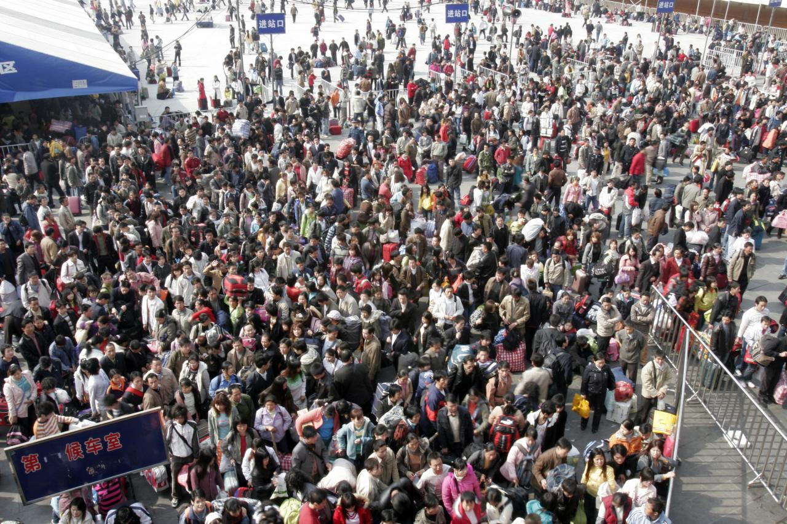
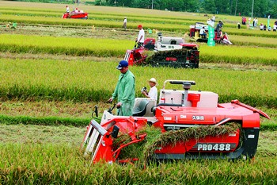

<!-- # 管制造成的烦恼 -->

刚刚结束的2013年春运，全国有34亿人次出行，其中许多是回家过年。这显然表明，虽然故土情在，但城市化进程已经不可逆转——除了春节那几天，人们都选择挤到城市里寻找更好的生活。什么是“更好”，当然是见仁见智，但人们的行为却是可以被观察和衡量的。不管人们脑子怎么想，嘴上如何抱怨，事实仍是越来越多人义无反顾地奔向城市。

这是好现象，但据说一些“烦恼”也日益凸显，例如城市用地短缺、土地财政面临困境、进城农民对社保基金带来巨大压力等。这些问题显然与城市化进程息息相关，而且往往被认为是城市化带来的代价，或是城市化进程中将要遇到的阻力，而我认为它们是人为管制带来的烦恼。

第一，城市化只会增加而不会减少空地。城市化本来就是土地集约使用的过程，越来越多人集中居住；而农业化生产，也随着技术进步变得越来越集中。这两个趋势的必然结果，是节省下来的土地越来越多。经常听到有人说“土地是有限的”，但你只要坐上飞机，几分钟后就会发现，下面大片空地，用之不竭而无人问津。有限的不是土地，而是位置。

集聚是全球现象。世界银行在2009年发布题为《重塑世界经济地理》的报告，描绘城市集约的大趋势。该报告以“每平方公里的经济产出”为指标，以坡度来形象地表示多国大城市的集约程度。以日本为例，它整片国土，也就隆起了东京、大阪、名古屋和札幌等四个山头；而美国，显眼的也就纽约、华盛顿、芝加哥、休斯顿和洛杉矶等十来个大城市。若以此方法来描绘中国，那恐怕也只有北上广深等几个沿海大城市能拔地而起。这就是说，世界各国的经济产出，都集中在为数甚少的几个大城市，集聚是一股不可抗拒的发展趋势。

假如你在美国是个穷人，那么你会有一幢房子，两辆汽车，住在阿拉巴马州；如果你在美国是个富翁，那你也会有一幢房子，两辆汽车，住在纽约或者旧金山。重要的不是那些有形的物质，真正有价值的是在什么时间、在什么位置、与什么样的人生活在一起。为什么人们愿意支付那么大的代价挤在大城市？根本原因就在于：必须要有好多人挤在一起，才能享受规模经济和细化分工所带来的种种好处。换言之，集聚能令个人生产力倍增。

那怎么会有“地不够用”之说？那是由于政府自作聪明的“用途管制”。政府先对土地施加了用途管制，才催生了种种自我解套的方案，如“集体建设用地指标”在区内流转、在省内流转以及人们期望进一步能在省际流转等问题。我的看法是，最初就不应该有这些管制，不过这些管制已经实施了相当长的时间，各种利益关系已经形成和固化，所以解除管制也不可能一蹴而就；但我们必须清楚地认识到，始作俑者是管制本身，改革才可能朝着正确的方向前进，否则就只会作茧自缚，越改越繁，越改越难。

第二，土地私有化只会增加政府收入。流行的误解，是说政府为了追求卖地收入，贪婪地推高了地价。但事实上，只有土地上各种活动的盈利机会增加，人们才会贪婪地争夺土地，而政府也才有可能把土地卖出高价。能使房价下降的，并不是政府停止拍卖土地，而是政府也允许农民拥有土地和出售土地。

产权越清楚，即个人拥有的使用权、收益支配权以及转让权越得到保护，资源就越有可能被推到高价值的用途上去，而产权的价值就越大。然而，我国农民所占有的土地，其使用权也仍然与集体、身份、户籍等因素有着密不可分的关系，由于集体要达成“一致意见”的成本极高，所以集体产权的流转，就会遇到极高的、甚至是令人望而止步的交易成本，对资源的有效配置，形成了天然的障碍。

更重要的是，这种集体所有制形式，也阻碍了“乡下农民”向“城市居民”乃至“国家公民”的身份转变，阻碍了农民的迁徙和就业。简单地说，它把农民绑在了原有土地上，剥夺了他们本来可以享受的自由。中国的现代化，必须逾越这个障碍；而要逾越这个障碍，就必须将使用权、收益权和转让权，干净清楚划一地落实到个人。

算大账，政府在计划经济时代也曾经支配着每个人的劳动力资源，给每个人分配和指派工作，貌似可以廉价乃至免费地占有劳动力资源，但与后来还劳动力的支配权于个人，让每个人随意对劳动力进行投资和出售，政府只从中抽取个人所得税相比，前者所占的便宜可谓九牛一毛。土地资源的道理也一样。政府吞吞吐吐地给出残缺的土地产权所能保有的利益，与完全地将土地确权给个人后通过税收所能得到的利益，前者也只能望后者之项背。

第三，社保宜走低调。我们必须先问：社保究竟是什么？一、假如社保是一种回报率有过人之处的理财方式，那进城农民就是借钱也要争着购买，政府根本不需要担心他们的缴款困难；二、假如社保是一种为人们提供回避不确定性的商业保险，那它还应该由互相竞争的民营保险公司来提供，所以也不构成担心无人购买的问题；三、如果社保是一种政府对穷人的补贴，那政府就更不应该逼穷人先交钱后领钱。

三者皆非。事实上，社保是一种靠收取当前年轻人的供款来补贴当前老年人的支出、投资回报率低于市场水平的财富转移机制。欧美的经验表明，随着年轻人逐渐减少，老年人日益长寿，这种机制的债务黑洞势必越来越大，最后将走向破产。如此体制，越小越好。如果说农民无力缴纳社保是他们进城的障碍之一的话，那最适当的解决办法，就是降低甚至免除他们缴款的义务，同时也缩小社保收益者的人群，还个人以自由支配收入的基本权利。

从大处看，土地不够、土地财政萎缩、社保供款不足，这些所谓“困难”，其实都是人为管制本身造成的。要改不容易，因为会触及太多既得利益，但我们至少要看清目前所谓“困难”的始作俑者。里根总统说过：“政府不是办法，政府本身就是问题。”不看清这一点，即使再成立一个改革委员会，结果也只会适得其反。

（采编：韩忠楠；责编：彭程）
