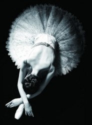

<!-- # 王晓华 -->

**0**

与王晓华关于死亡的问答

我出生于一九九二年，九六或九八年开始记事——具体哪年记不清了。可以肯定，这件事发生在公元一九九六年到一九九九年之间。那时我还是个熊孩子，甚至不一定上了学，王晓华，本文主人公，也就是我妈，事发时和她丈夫在朋友家打牌，她儿子在屋子另一边自己玩。我从小就有喜欢胡思乱想的毛病，注意力一分散脑子里就开始天马行空，那天不知道是想到了什么，在没有被任何人或事欺负的情况下，突然嚎啕大哭起来，哭得伤心欲绝，撕心裂肺。

牌打得好好的，儿子莫名其妙就哭了起来，王晓华自然要过来查看。她察问情况，儿子却带着哭腔，没头没脑地问了一个问题：

“妈妈，人死之后，是不是什么都不知道了？是不是什么都看不见，什么都听不到了？”

在这里我以人格担保，本文提到的都是真人真事，没有经过什么艺术加工。如果有人告诉我说，某某地方有哪个熊孩子，没有受什么刺激，突然有天提出这样一个问题，我一定不会相信。但这个熊孩子就是我自己。

人死后是否有知？全世界自以为聪明的人争论了几千年——如果考虑到石器时代是否有鬼魂崇拜，可能是几百万年——近期仍无希望得出公认的结论。这只能取决于你相信哪种说法。

“这个小朋友怎么突然问这个？”这种疑惑，我不比可能看到这里的任何人少。如果一定要解释缘由，身为最有发言权的当事人，我只能说：没什么理由，长那么大，总有一天会想到以前从没想到过的事：人死后会怎么样？得出一个自己可以理解但不能接受的朴素结论：两眼一抹黑，从此陷入永恒的寂静，看不到任何美的丑的，听不到任何好的坏的，不再呼吸，不再思考，甚至自己不知道自己已死的事实。就像以前有个叫乔达摩悉达多的官二代，坐在一棵树下七天，突然说自己想通了，又像那个叫达尔文的富二代，突然明白了：我们都是猴子变的。一句话就是：弱智儿童思维广。

对于我的问题，王晓华是怎么回答的呢？

回想起来，奇怪的是，王晓华似乎并也不奇怪儿子突然问出这样的问题。她没有问为什么，只是轻轻地抱住她的儿子，在耳边说：

“对啊，人死之后，什么都不知道了，什么都看不见，什么都听不到了。”

她的语气温柔而平静，好像这根本不是一件值得害怕或者流泪的事。

现在有一种观念认为人必须要有信仰，否则又可悲又可怕，中国很多问题都是因为中国人没有信仰。有时他们语境中的信仰不像是特指宗教信仰，似乎是某种理想/准则，有时又实在是直截了当，就差贴着你耳朵喊无神论是不对的。如果以这种观点，王晓华实在是一个既可悲又可怕的人，这句话是完完全全的死而无知论，连中国常见的泛信仰者那种模棱两可的态度都抛弃了。

但当时我不可能知道那么多。总之，经这么一说，她的儿子也好像明白了，就像玩不到大家都没有的玩具一样，似懂非懂地擦干眼泪，又跑到一边开心地玩去了。

****

**1**关于死亡问答的若干疑点

再回忆起，王晓华当时的温柔态度还是令我惊讶。当时在别人家，孩子哭起来既没有正当理由，又显得他们的家庭教育（一般认为母亲起更大作用）是培养出了一个爱哭鬼的失败教育，脾气再好也难免生气。而王晓华那次没有斥责一个字。

王晓华也不是一个脾气好到哪里去的人。她对儿子的要求非常严格，上学后既要学习好又要当班干什么培训都希望他参加包括音乐舞蹈奥数，要七点起床八点半睡觉每天午睡每餐都要吃完饭动画片只能看半小时不写完作业不能看动画片课余还要练字做课外作业。当然鄙人不负众望，最后还是长成了一个啥也不会的废物。而且按当时的教育思潮，小孩子哭起来是不能一味哄的，必须赏罚分明，该骂还是要骂，该晾着就晾着，她也是如此。我小时候性子软，实在有辱男子汉声名，为了一些千奇百怪的理由哭：不想起床不想睡觉不想吃饭不想上幼儿园想看动画片想吃零食出门想坐车不想走路玩捉人游戏捉不到别人被哥哥姐姐欺负了被弟弟妹妹欺负了……对于这些理由王晓华自然不能加以姑息，而是要严正批评。

但这些理由的荒唐程度，如今看来怎么都比不上那一次。

说起来，王晓华有时也会在一些莫名其妙的地方对儿子表现出过分的慈爱，如今想起实在是诡异。比如她要求我按时起床去上幼儿园，如果敢于恋栈从来不惮于掀被子骂人，每天只要眼前隔着眼皮一亮，就知道她拉亮了灯，接下来就是我痛苦地起床了。但有一天，隔着眼皮的亮光又降临后，什么也没发生，于是我又悍不畏死地睡了过去。这一夜似乎长了一点——结果我中午才醒。那是我小时候少有的几次工作日自然醒的经历之一。

开门声叫醒的我，王晓华上完上午班买菜回来了。她冲我一笑，我头皮发麻，只觉得山雨欲来风满楼，暴风雨前的平静已经被自己睡过去了，接下来少不得要脱层皮。

“醒了？我给你向幼儿园的老师请了假。”事情就这么过去了。

当时我身体好得很，为什么要请假？至今我仍不明白她中了什么邪。后来，以我有生之年有限的生活阅历，多角度换位思考多次，只得出过一个勉强能说通的理由：

那天这位年轻妈妈看见自己的独生儿子睡的正香，睡着的样子又太可爱，一时心软，不忍心叫醒他。

仔细想想这一可能性，实在是可怕极了。

****

**2**

我所知的王晓华其人生平

评价一个人的所言所行就必须结合她所处的社会大环境和时代背景，而关于王晓华的过去，我只能心虚的说我所知甚少。下面是我甚少的一点所知，全凭记忆、印象和他人转述，未经考证，在不能肯定的地方我会尽可能含糊其辞。

王晓华，女，一九七零年生，H省L县人。毕业于某师范类院校，似乎毕业分配时堪堪避过了某次政治风波，在H省Z水电站子弟学校任老师。

由于需要靠地形蓄水，靠势能发电，水电站地处深山很正常，周围穷山恶水很正常。带个电字，自然是国有企业，体制内的员工福利很好也很正常。一边是穷山恶水一边是体制内，贫富有了差距，产生矛盾也很正常。我出生在体制内至少一个小康之家，而周围的穷山恶水就是国家有名的贫困县，体制内与穷山恶水间难免发生一些关于用电、偷电的不友好磋商，我小时候职工家属生活区就修起了围墙门岗，防止外来人员导致的治安问题，近年还请来了武警驻扎维稳。上世纪九十年代，我站职工食堂、职工医院、子弟学校、幼儿园、粮食销售点、派出所等服务性机构一应俱全，俨然半个独立王国——可惜菜还是不能自己种，需要附近农户进来在菜市场集中出售。这不仅是由于我站地处深山交通不便，当时的国有企业都五脏俱全而且很多往深山搬迁，大概上面做好了准备，一旦核战爆发，每个国有企业都能作为人类文明的一个火种保留下来。

但第三次世界大战终究没有爆发，我出生的那年克林姆林宫顶的红星落地了，有个老人跑到南方转了一圈后，国有企业也渐渐不那么全能了。我站的幼儿园和粮食销售点消失了，职工医院变成了职工医务室，毕竟后来交通方便了，大家有什么病都喜欢往县城甚至省城的医院跑，倒是职工食堂和派出所一直保留，毕竟人类不能一顿不吃也不能停止犯罪。子弟学校也不例外，加上许多家长选择送孩子去省城的大学校读寄宿，生源越来越差。高中部、初中部相继停办，小学部开始停止招生，最后干脆连着没毕业的学生们整个停办了。现在的学校教学楼好像是住着一些外来民工，在电厂人手紧张时帮工，而综合楼成了维稳武警的营房，而操场则供他们日常训练。这不仅让我联想到大学军训时我们新生被组织前往图书馆参观，一群穿着军装的人在教官带领下在图书馆里横冲直撞，仔细想想，实在是可怕极了。

好像扯远了。其实上面只是为了向不了解的人介绍什么是所谓的职工子弟学校，不管后来如何，这在当时是名副其实的铁饭碗，而且教的学生不多，只有每年级一个班的职工子弟，还可以跟着放寒暑假。每当学校放假，王晓华可以回来带孩子，我可以不用上幼儿园。在学校她教的是语文，但不一定只教语文，小学校一些不太重要的副科由主课老师来上很正常。

在学校，王晓华认识了一位化学老师，就是我爸，两人后来结为夫妻并育有一子。后来学校高中部裁撤，化学老师转业到了电站生产部门成为了一名正式工人后来好像还当了小领导。祸福相倚，学校停止招生后王晓华没有再工作，这份工资养活了全家人。后来有同学问我家里人做什么生意，说到她时我想了半天只好说：“好像现在没做什么事……”对方一副很懂的样子：“哦，我明白，那种全职太太对不对？”那是我第一次听说我身边还有全什么这种人。

这大多是我记事前发生过的事，只能靠合理推断。比如两人的确是在学校认识的吗？父亲多次向我提及过年轻时的事，全都是他分配到学校前，没有任何提及王晓华的地方，多半如此吧。

完了。

王晓华不是什么传奇人物，如果要写她的简历几行字而已。那时她只有二十几岁，以前的人结婚早，二十几岁已经是这么大一个孩子的妈了，要是放在现在，这个年纪可能还是一个恨嫁的姑娘，整天说自己“老了老了完蛋了要嫁不出去了”，其实可以拿上教科书作为“年轻”一词的范例，现在不是有很多女士喜欢说自己是永远的二十九岁吗？

上面几件事发生时，王晓华只是快二十九岁了，对于很多人来说这正是对未来充满希冀的年龄。

当时没有现在令无数未婚男青年咬牙切齿的“买房”这一概念，只有“分房”，按照职工的工龄资历分配住房，就像游戏里达到一定经验值就能升级一样，员工达到一定的工龄和级别就能换上新房，由于父亲的努力工作（努力这个词是用来表示礼貌的，对于他具体多努力我没有概念，至少经常加班出差，家里常常只有我和王晓华两个人），我记忆中至少搬了两次家。

对于旧居的大小我已没有什么印象，只是理论上新房要比旧房更大更好，对于小孩子没有多大差别。小孩子唯恐天下不乱，总希望生活发生滔天巨变，一切不寻常的事都是好玩的，搬家也在其列，那时我对搬家还是像过节一样期待。王晓华呢，她也很期待新家吗？应该吧，新屋就像未来的生活一样充满未知，可以肯定的是会越来越好。

新房正在装修，王晓华已经开始和我分配房间了。

“卧室有两个，靠阳台的那个给你，我和爸爸住另一间。以后你不准进我们房间啊。”

“啊，凭什么？那你们也不准进房间。”

“不进你房间怎么上阳台晒衣服？”

“妈妈你欺负人！”

王晓华笑而不语。当时我真心觉得是妈妈欺负人，玩捉人游戏时的安全区可以不准对方进，他们的房间凭什么不让我进？现在想想，王晓华当时还不到二十九岁，她所说的话恐怕有一层不能对我细言的意味，仔细想想，实在是可怕极了。

****

**3**

一个难以证实的推论

当时的国企五脏俱全，其中包括自己出版的报纸刊物，以期核战之后社会主义文统不绝。我站就有一份厂报，上面有各种官样文章，还有各部门员工创作投稿，甚至有几个小学同学就靠发表他们优秀的小学生作文在上面拿过稿费，大概这样能体现电厂员工及家属的多才多艺，文化生活的多姿多彩吧。后来我穷极无聊时曾经找到过一本厂刊几十年的精选集，其中有几篇报告文学还是很有可读性的。就在这上面我见到了王晓华的名字。她曾经在上面发表过文章，名字还被框出来了非常显眼。

一个常常以钢笔字手写体出现在你身边的人名，以墨印的铅字出现在这里，让人既有点不舒服的陌生感又自然忍不住去关注。在认真研读全文后，我，用现在的话说，“吓尿了”。

好像回忆起关于王晓华的事总让我一惊一乍，还请大家见谅，新闻中战火连天少有人怕，视距内一点打架斗殴就让人紧张，因为无论什么方面越是切身之事越能触动人心。而王晓华对于我远远不止是切身之事可以形容了。

这篇文章以饱含深情的笔触，描述了作者在一个月夜听着周围山坡上竹林的沙沙声，心中的所思所想，以及对远方某人的思念，我不太确认是不是我爸。她把一件一两句话就能说清楚的事，成功扩写到了能够骗稿费的程度，因此，除非我站员工还有另一个王晓华，那么本文中的王晓华应该是一个当时我刚刚有所了解的生物——一个文青。

文青，全称文艺青年。简单地说，这种人对于一些一般人看来的小事过敏，可以从一朵花中看出一个世界，思路之广略逊于神经病，总之就是没有什么好人。现在这个词一般被用于骂人，更可悲的是使用者一般也是文青，因为正常人一般不知道文青是个什么东西。

就像魔女一般来自魔法少女，文青一般由文少转职而来，将来也会转职为文中、文老，前提是他（她）没有像海子顾城那样早死，因为他们大多精神状态不稳定。不过对于文青来说短命不算什么，他们不仅对日常世界理解得更深刻，还有一个甚至几个精神上的世界，可以把一辈子当几辈子过。

联系王晓华的生平，这个结论仿佛更加确凿了。她出生于七零年，接受教育时正好是梦幻般的八十年代，一个朦胧诗人、摇滚歌手、持不同政见者横行霸道，文青还是一个褒义词的年代；她是一名语文老师，被联合国教科文组织评选为当代最适合文青从事的职业；她给我起了个难以直视的名字，至今我羞于向别人自我介绍，但在九十年代初期，这个名字看起来“洋气”极了。

我的文青母亲——先假设我的猜想没错，她是不是会在给孩子换尿布之余，读读她从新华书店买回的那些盖着褪色红章的发黄诗集呢？考虑到这个被换尿布的孩子是我自己，这个想象实在不爽。文青都有或轻或重的神经衰弱，一点点风吹草动就能长吁短叹，我懵懂之时身边那个看起来风波不惊的人，是不是有着一个须弥纳于芥子的心中世界呢？是不是在我们没有察觉的时候，心中泛起过重重的涟漪呢？

于是那些奇怪的举动也可以解释了——那只不过是一个老文青在结婚生子后，在那些风花雪月已经被茶米油盐替代很久以后，突然有一天，有什么不为人知的小事，正中她的要害，令她的老毛病发作了。

但这都只是我的推论，如今已经没法证实了。为什么不直接问问王晓华本人呢？我就不卖关子直说了：她已经死了。

****

**4**

一九九九年的正月，新屋的装修将毕，如无意外就是我家在旧居的最后一个春节了。由于父亲经常加班出差，家里常常只有我和王晓华两个人。而这次好像是轮到了王晓华有什么事，似乎出去了很长时间，对此父亲的解释是：妈妈去医院了。

于是我就没担心了。小时候身体不好也是医院的常客，在当时的我看来：去医院而已，我长这么大（七岁），还没有得过什么病是治不好的。也许当时我觉得住院也是一件好玩的事吧。

旧居吃的最后一顿年夜饭，是我和父亲两个人。我毫不担心，小孩子才会害怕妈妈一去不回呢，她治好病不就会回来了？

过完年不久，父亲带我去县城的医院。她理论上还活着，躺在床上，闭着眼睛一动不动，和睡着了没有什么区别，好像没有什么可担心的。旁边有一个什么仪器在测量她的什么数值，液压管停在读数“0”一动不动。

再后来有一天，我一觉起来，发现她已经回到了家，躺在了自己床上。和她相熟的叔叔阿姨，大多是学校的其他老师，很多都来到我家，在商量些什么。她躺在床上，和睡着了没有什么区别。实际上我真的以为她是睡着了。

直到那时我还相信，妈妈睡醒之后，今后的生活也不会有什么不同。

然后就是大办丧事，前来吊唁的有她的亲戚、同事和学生，丧礼上他们说：“你哭啊！”于是我被吓哭了。很长一段时间我在袖子上带了一圈黑纱，感觉上和少先队的二道杠没有什么不同。

**5**

读碑

据我所知，我县虽然是国家级贫困县，人民生活水平还很低，但在国家推广火葬这一政策的过程中，群众却没有任何不支持、不理解的表现，我县干群在丧葬工作上没有任何矛盾爆发——因为整个县处于山区交通不便，方圆八百里没有一所火化场，根本没有实行火葬的条件。我站职工及家属多选择集中安葬一处山丘西坡上，如今那里已是密密麻麻挤满了半山的坟头，几乎每寸土都被见缝插针地利用了起来，但边上还有几小块菜田。

山上少有人来往一片宁静，山下就是吵吵嚷嚷的幼儿园和琅琅书声的学校——但如今都已空无一人，儿郎们进城读书，老人也多数进城养老，山上的坟丘也会很难继续生长吧。山上的死与山下的生，都开始寥寥了。

墓碑的格式多数是题头一个“流芳百世/流芳千古”，下面男的是“显考XXX老大人之墓”，女的是“显妣XXX老孺人之墓”，然后是生卒年月。墓中多少是寿终正寝的老人，所以往往夫妻并排，碑上列着长排的孝男、孝女、孝媳、孝孙的姓名。有一个得了白血病的中学生，对抗病魔的故事还上过厂报，最后不出意外地死了，墓碑上除了姓名什么都没有。

王晓华的墓碑介于两者之间，只有我一个孝男的姓名。地方上扫墓多选在正月过年时，每往扫墓，除了点香烧纸放鞭炮，最重要的是把坟头长满的野草拔干净。如刀的寒风猎猎作响，枯死焦黄的野草长得比碑还高，又硬又利，空手去拔只会割得一手血。这些草扎根这么深，是因为不想死吧。无论你拔得多干净，来年的坟头上总是会长满野草，和去年的那些看起来毫无区别。古人是不是看着这些坟头上的野草，发明了荒草凄凄这个词呢？

王晓华死于一个拗口的医学术语，我至今不明白那是什么病，如何引发的。

最近一次扫墓时，我又认认真真读了一遍碑文。生于一九七零年，死于一九九九年，正好二十九岁。这可真是一个不好笑的笑话，王晓华，语文老师，一个孩子的母亲，疑似前文青，一个热爱生活的人，像很多玩笑那样，永远活在了她的二十九岁。流芳百世。但如果不出意外，她几世就会被人所遗忘。

**6**

王晓华对我的影响

早年丧母的经历对我性格的行成和人生的经历产生了怎样的影响？我多次思考过，结论是：不知道。些微的偏差经过蝴蝶效应会成为巨大的不定影响，这件事可远不止些微可以形容。只有设置一个对照组，外在条件和我除了这一点外毫无区别，才能知道王晓华的早逝究竟造成了什么影响。也就是说，如果她还活着我会变成怎样一个人，更好还是更差，永远不得而知了。

先前有一点我猜对了，丧礼结束以后，今后的生活的确没有什么不同，只不过是桌子上少了一副碗筷，日子该过还是要过。大家都从悲伤中走了出来，地球离了谁都一样转。后来出版一本厂刊几十年的精选集时选到了她的文章，她的名字被黑框圈了起来非常显眼，惯例，意思是出版时此人已去世。

如果有什么不同，那就是我走到哪里都被贴上了一个“死了娘”的标签。休学典礼上，学校特别表扬我“在母亲去世后自强不息”，这是我第一次感觉被表扬了还这么不爽。后来子弟学校停止招生，我去外面读寄宿，如果别人知道了我母亲如何如何，都会对我投来同情的目光，对我生活上有所照顾。当他人有意无意问到我家里情况然后知道了这一点后，都会一脸肃穆的说：“我很抱歉。”我也得陪着摆出一副悲伤的表情才算是正常的反应。后来我才想明白：十多年的事了，我都没伤心了，你抱歉个什么！

为了避免麻烦，以后关于她的事我都尽量含糊其辞。比如有人问我家里人都在干什么，关于她我只好说：“好像现在没做什么事……”

至于影响最深远的一点，就必须说到她死后不久的一件事。那时我已经没带黑纱了，放学路上，撞见一群正在闲聊的老太太们。小地方大家都是熟人，连死亡都很稀罕，能作很久的谈资，她们认出了我：“你就是王晓华的儿子吧？”然后一脸怜悯的说：“不要恐慌（非原话，出自《银河系漫游指南》），以后你妈妈会在天上看着你的。”

在唯物主义教育如此昌明的我国，没有多少纯正意义的宗教信徒，用后来我了解的知识，她们是泛信仰者。我当时嘴上没说，心里很不以为然：“怎么可能，我记得有人告诉过我，

人死之后，什么都不知道了，什么都看不见，什么都听不到了。”

这根本不是一件值得害怕或者流泪的事。说这句话的人死于一九九年，所以可以肯定，那件事发生在公元一九九六年到一九九九年之间。

从那一天起，我再也没有怀疑过人死而无知，成为了一个至今没有动摇过的唯物论者。我没有宗教信仰，所以不太了解：是不是那些相信死而有知的人，永远不能接受死亡的可怕，永远是在自欺欺人？只有真正明白什么是死，才能真正为死者悲哀，为生命幸福吧。

如果王晓华相信人死而有知，她那时会如何回答我呢？人死之后，会上天堂/下地狱/再投胎/在天上盯着别人？如果那样，我会成长为怎样的人呢？人不能决定何时死，只能决定如何活，她离世无论对我造成了多大的影响也不是她自己能决定的，她在世时的那些话才是她对我真正的影响。作为母亲，王晓华没有多少教育我的机会，对我的期望如今多已落空。有什么关系呢？她的儿子继承了她的生死观，并以此自豪，其他的还重要吗？我好像明白了人类的传承是怎么回事了。

****

**7**

后话

刘铮同学以母亲为专题向我约稿，我却好像不小心写成了清明节专题。因为我想为王晓华认真作一篇文已经很久了。

以往每年三八或者母亲节，作文《我的母亲/妈妈》都是个固定题目，我却因为自身的特殊性不得不每年写一篇悼文，把王晓华从地里请出来，哭喊几句“你快回来，没有你我承受不来”，以换取一个高分。应试作文写多了，人一定会无情吧。

今天我已经很久没写过应试作文了，但我觉得自己欠王晓华一篇没有注水的文字，说说自己真实的想法，尽管她本人永远不会知道。她是我的母亲，但首先她是一个人，一个没有停止过热爱生命，也从没畏惧过死亡的人。为这样一位逝者记录我所知的一切，这才是这篇文字的目的。

王晓华死了，她什么都不知道了，什么都看不见，什么都听不到了。总有一天，写下这句话的我会死，看到这的你会死，请保持微笑，这根本不是一件值得害怕或者流泪的事。

****

（采编：刘铮；配图：季节扬；责编：刘铮）

[【母亲专题】妈，亲一下 ](/archives/32554)——”母亲突然发现自己得了急性脊髓性白血病，打乱了全家人的生活步调。在一家三兄弟轮班的医院照料时间，九把刀重新回顾检视从小到大关于母亲的点滴回忆，记录下了温馨感人的陪伴过程。”

[【母亲专题】万婆](/archives/32634)——”关于久病床前无孝子，最残忍的不是儿女的孝心被繁琐与负担越磨越薄，而是老人在孤独与病痛中积起厚厚的自责与谅解，在对儿女的思念中设想他们忙的理由。”

[【母亲专题】葬礼](/archives/32787)——“在最苦难的年代，老人让小孩活着成人便是巨大功德，完全可以不选择饿着肚子赶孩子去念书，不选择用肌体健康来换地里的粮食。我们到过的很多地方老人一辈子都没到过，看过很多书老人一辈子都没看过，但我们会要用一辈子去学会老人的极端坚强、极端勤劳、极端的爱。”

[【母亲专题】一双线拖鞋](/archives/32838)——”有一个缝补浆洗的妇人在家里，孩子寒酸的衣裳也会干净暖和。有一个问问叨叨的妇人在饭桌上，日复一日的单调生活也会安心舒适。有一个昂首盼望的妇人在村口，在外打拼的游子才能记起回家的路。”
