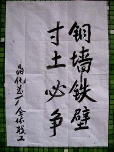
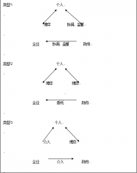

<!-- # 谈谈拆迁——论中国政府对人民权益的“合法”侵害 -->

**（一）序**

对于笔者而言，关于拆迁的这篇文章从一开始就是一个纠结的问题。

首先，作为一名刚刚步入大学校园的新生，我在学力的不足与思维上的不成熟使我并不具备足够的能力以独立对这样一个复杂问题进行深入而又生动的解析——我甚至没有自信能够保证使各位读者保持一种盎然的兴趣读完这篇粗制滥造的文章。退而求其次，我试图通过阅读、总结其他相关文章对“拆迁”这一问题进行研究，却发觉关于此问题的文章评论虽数量众多，然质量着实参差，纵偶有精彩者，亦是以散文式的气势修辞见长，少有理论分析与制度解刨。因此，在这篇文章的写作上，我从一开始便陷入了深深地窘境之中。

但是，我不得不写这篇文章。这不仅仅是因为我曾亲身经历拆迁并作为一名独立的个体参与其中，更是源于一种责任感。正如卢梭所言，“我深信只有有道德的公民才能向自己的祖国致以可被接受的敬礼”，而关注社会、关注政治不正是今天中国公民最应具备的一种道德吗？更何况，作为一个复旦的大学生，更应当对此有着一种敏锐的感知与高度的热情。

这便是我撰写此文的根本目的——关注拆迁这样一种社会现象，并对此提出自己虽不成熟但确为心中所想的看法——这是作为一名现代公民的责任所在。

至于此文本身，我则遵循了陈云老师的建议。正如老师课上所言，“一定的政治制度是以一定的理念为支撑的”，因此此文的前半段会首先在理论上对“拆迁”问题进行适当的分析——我认为这是必要的，因为只有先行从道理上“论证”后方可在制度层面进行“论争”。文章的后半段则会结合从二十余个案例中筛选出来的三个，从制度层面对拆迁进行解构与分析。

最后是关于视角的选择，拆迁作为一种大现象，其反映出的社会问题是诸多的，我则选择了其中“强制拆迁”的个案进行考察——这并不说明我故意试图揭露社会阴暗面，在建党九十周年的时候奏出什么不和谐的乐章——我只是认为，强制拆迁的案例可以更好的、更加鲜明的反映出当今我国社会存在的诸多问题而已。

综上所述，诚如我所言，我只是一个大学生，一个现代公民，有理想，但不够成熟。

因此，文中幼稚、纰漏之处，还望老师大度谅解。

以上是为序。

**（二）“拆而不迁”——论不合理拆迁透射出的行政理念**

“谁握有国家的立法权或最高权力，谁就应该以既定的、向全国人民公布周知的、经常有效的法律，而不是以临时的命令来实行统治；应该由公正无私的法官根据这些法律来裁判纠纷；并且只是对内为了执行这些法律，对外为了防止或索偿外国所造成的损害，以及为了保障社会不受到入侵和侵略，才得使用社会的力量。而这一切都没有别的目的，只是为了人民的和平、安全和公共福利。”

这是300年前洛克在《政府论》中的一段话，他为我们从根本上界定了一个好的政府的应有之义——为了人民。因此，政府一切行为的出发点与立足点都应当是人民的利益。而强制拆迁过程之中政府的两个“合理”理由——（政府）拥有人民主权与（政府）代表人民根本利益——却反映出政府是在以捍卫人民利益的借口，侵害着每一个人民的利益，或者说，政府是在以代表国家权力为旗帜，妨害了每一个人民的权利。

那么，政府的这种理念是否合理则成为了我们看待拆迁现象时所要解决的首要问题——我们只有先在价值判断上下一个定论，才能对其进行系统的分析。

首先，人民主权与人民关系如何？所谓代表人民主权的政府其职权界究竟应当以何为限？

“主权权力虽然是完全绝对的、完全神圣的、完全不可侵犯的，却不会超出、也不能超出公共约定的界限。”以此为据，卢梭论述了人民主权的超然与神圣（当然，如梭并不是为政府辩护，而是在捍卫“人民主权”的尊严）。可是历史并未如卢梭假象的那样发展，雅各宾专政的恐怖统治与路易·波拿巴的“合法”登台将这种人民主权理念下建立的政治模式的弊端暴露无遗，这也是以霍布斯、洛克、卢梭为代表的契约论派（权利自由主义）的理论局限的表现。他们先是在理论上构建出了一个所谓的自然状态——而这是不证自明的，并在其中讨论人的各种权利与一个社会应有的各种规则，随后再将其“平移”到现实之中，使之成为社会应有之义，这种对于权利的讨论一开始便脱离了社会关系。正如密尔所言，“对于洛克而言, 即使单独的生存在一个孤岛上的人也对他的劳动具有一种权利, 并且可以通过他的劳动获得对物品的所有权。”因此这种一开始便脱离了社会关系的理论一旦应用到社会之中，必然引起其意料之外的问题。正如贡斯当认为的那样，并不存在的、抽象的人民主权需要转交给一个实际的、普遍的权力，而“实际上，它以人民主权的名义所要求的权力，并不是那种主权的一部分，它不仅是对现有权力的非法置换，更是创造了一种根本就不存在的权力。”对此，密尔有着更为经典的论述：“所谓人民意志，实际上只是最多的或者最活跃的一部分人民的意志，亦即多数或者那些能使自己被承认为多数的人民的意志。”所以说，所谓的“人民主权”是不可以统治人民的——或说，那些宣布代表人民或人民意志的团体与个人，其对人民的统治是不具备合法性的。

其次，集体与个人的关系如何？所谓代表公共利益的政府能否以公利为由干涉个人私益呢？

在个体利益与公共利益的关系上，思想家们地看法是大相径庭的。卢梭认为个体利益与公共利益是相统一的，“集体在接受个人财富时远不是剥夺个人财富，而是保证他们自己对财富的合法享有，依据有变成为一种真正的权利，使享用变成为所有权。”托克维尔与密尔则强调防止“社会的暴虐”，“我们在书中担忧，社会平等和代表公众舆论的政府将不可避免的出现，这会把划一的言论和行动的枷锁加在人类的头上。”.但是，无论哪种观点，其立足点并未偏离个人，“近代政治思想的一个基本出发点是对个人利益的保护”，即保障每一个人的权利才能最终保障所有人的权利。因此，保障个体利益成为西方政治演变的主流——而这今天也日益成为了国际社会的价值取向。

综上所述，不合理拆迁所投射出的乃是当代中国政府的一种“与民争利”的偏执理念，或者说：在强制拆迁这一问题上，政府是在打着人民利益这一抽象的旗号，损害了每一个人民的具体利益。政府的两个理由——人民主权论与集体利益论都是托辞而已。

**（三）“拆而后迁”——论不合理拆迁投射出的制度缺陷**

在结合具体案例分析前，我先先就这次案例收集情况进行一次总结。

这次论文附录案例只有最具代表性的三个个案，但笔者在此前近一个月的时间里收集、分析了约二十余个案例，因此，我想就这些案例，首先对中国的“拆迁”进行一个独创性的系统分类——这亦是稍后制度分析的一个小小的铺垫。

拆迁作为一种企业、个人与政府否认“较量”，实际上可大致分为三种类型（见下图）

其一（类型1）是以企业为主导、政府为监督的拆迁，这以企业用地需要导致的拆迁为代表（如案例一），企业出于用地需要与个人进行交涉，而政府的功能在于为这一过程制定规则（立法或制订相关条例）、维系秩序（监督），并在必要时充当裁判（仲裁）。其二为政府公共设施建设需要（如案例二、三），包括两大类型（类型2、3），之一为政府委托企业，企业作为市场主体与个体进行谈判，实际上政府幕后进行操盘，实为政府与公民的博弈；之二为政府直接出面与公民交涉，而企业出于参与利益分配介入双方竞争之中。

案例一的郑恩菊案作为第一种类型的拆迁，反映出政府权力的缺失，面对记者质询，政府部门的回答是“目前有关城市房屋拆迁的规定在有些地方和有些单位并没有得到完全意义上的落实，具有比较大的随意性”，政府指定的条例却得不到自身的遵守，这导致了政府在企业与个人博弈过程中的“仲裁者”身份的丧失，而导致这种条例失效现象出现的最大原因则是缺乏一个有效地力量（部门）对政府进行有效地监督，正是权力的过分集中（尤其是行政权力的膨胀与司法不独立）如此。案例二的田文海案与案例三的钟家案则是第三种类型拆迁的典型代表——强制拆迁的暴力性与黑暗性在其中表露无遗——而这体现了政府权力的滥用，或说过度膨胀。《物权法》明确规定：“国家、集体、私人的物权和其他权利人的物权受法律保护，任何单位和个人不得侵犯”而政府这种超越法律的行为无疑为我们敲响了警钟。行政权、立法权与司法权的“一党独揽”必然导致人事败坏政事，利益压倒法律。“记者在调查过程中发现，若拆迁协议谈不拢，一些拆迁方连房地局裁决、法院强制执行判决都没有，就先行强制拆除拆迁户的房子，致使拆迁户流落街头，时间之长可达两、三年。”《城市房屋管理条例》规定：“拆迁房屋的单位取得房屋拆迁许可证后，方可实施拆迁。”这难道不是政府在自己打自己耳光吗？

对于上述案例分析后不难看出，权力的过于集中既导致政府各部职能划分不明确进而导致权力缺失，又导致政府权力的过度膨胀致使政府权力的滥用。但问题的核心在于：这过于集中的全力究竟集中在哪里。有人指出是人大的这种集行政、司法、立法于一体的“一元”模式导致的，我对此无法苟同。以英国为例，议会多数党领袖组阁，行行政权，议会与首相共享立法权（首相具有立法创议权），上院为最高法院行司法权——亦是一元化，但却未曾出现中国的这种权力过于集中导致种种问题出现的现象。

究其原因在于：中国的最高权力被“置换”了，即党政不分导致权力实际上过于集中到了一党的手中。联系越南政治改革可以断言，只有从党入手，分离党政，才能真正解决中国当今权力过于集中导致的种种弊端。‘

当然，这只是其中的一点原因，正如我开始所言，拆迁，是一个反映出了社会各维度现象的问题结晶，笔者也仅仅只能在此选择其中一个角度，稍加论证而已。_

_

__

**参考文献：** 1、卢梭：《论人类不平等的起源和基础》，高煜译，广西师范大学出版社，2009年，第61页 2、

洛克：《政府论》，

叶启芳、瞿菊农译，北京：商务印书馆，1981年，第80页 3、卢梭：《社会契约论》，何兆武译，北京：商务印书馆，2002 年，第41页 4、转引自靳继东：《从经济正义到政治正义》，《石家庄学院报》，2008年7月刊 5、贡斯当：《古代人的自由与现代人的自由——贡斯当政治论文选》，阎克文译，北京：商务印书馆，1999年，第65页 6、密尔：《论自由》，许宝骙译，北京：商务印书馆，1982 年，第4页 7、卢梭：《社会契约论》，何兆武译，北京：商务印书馆，2002 年，第29页 8、密尔：《约翰·穆勒自传》，郑晓岚、陈宝国译，北京：华夏出版社，2007年，第147-148页 9、唐士其：《西方政治思想史》，北京大学出版社，2008年，第3页 10、详见案例1 P2 11、《物权法》

总则

第一章

基本原则

第四条 12、《城市房屋拆迁管理条例》

第二章

拆迁管理

第六条

（采编：韩忠楠；责编：彭程）
