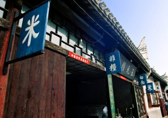

<!-- # 侠客行 -->

推门走进店里，一股湿漉漉的葱花味儿热气扑面而来。

尘封的玻璃上到处贴着房屋招租的帖子，像眼睛上的白翳一样。

老板同往常一样，坐在柜台后面，守着一方小小的电视机，电视机里放着《刀神》。1979年的古装剧，画面质量极差，人物的面貌隐藏在一堆粗糙的颗粒里，若没有了侠客手上那柄粗侉的弯刀，根本分不清谁是刘松仁谁是赵雅芝。

电视剧恰好放到了结尾，终于听到甄妮唱出那句“独剩凄风吹冷肝胆，陪伴那春雨密绵绵”，老板长长地舒了一口气，问我今天要吃什么浇头的面。

我每次到这家小小的面馆吃面，老板都会在看《刀神》。

老板年轻的时候也是写过武侠小说的，用蓝圆珠笔写在草稿纸上，写罢，把稿子攒一攒，用针线缝成一册，老老实实的署上自己的名字。他没有冯唐之类的促狭鬼的聪明劲儿，起个笔名叫做“古龙巨”，在小说的封面上写上“古龙巨著”。

老板那时候穷极，圆珠笔漏油，草稿纸发臭，连订书机都买不起。且他写出来得故事毫无想象力，高大全的男主人公总有一个作恶多端的同门师弟。

所以老板的小说是无人问津的。

所以老板总在看《刀神》，刘松仁满足了他全部的幻想，那种苦大仇深的，眉宇间有一种浓浓的“体制内”气质的大侠风范。

其实老板对于《刀神》的执念，还有另一个缘故。他曾耗费一个漫长的苦夏，写了一个刀客的故事。年轻气盛的刀客争夺武林盟主不得，反遭暗算，历遭坎坷大仇得报，最终堪破世事，封刀远去的故事。

写完之后，他才发现，这个故事早已有人写过了，叫古龙的胖子，写了《圆月弯刀》。感觉像中了化骨绵掌似的，周身的骨骼酥酥脆。胸中憋着一顾悲怆的气流，丝丝缕缕溢出来，汇成一句感慨，“原来有人写过了啊。”

后来老板盘下了这家面馆，卖面，兼卖黄泽豆腐馒头。说是馒头，其实是小笼包子，包拌着猪油的碎豆腐馅儿，很贱很平常的一味乡下点心。我偶尔回老家，买一笼来吃。馒头的皮极薄，极透，有时和蒸笼里铺着的白纱布黏在一起。我看老板用很粗的竹筷把馒头从笼屉中夹出来，总揪着心，怕碰破了馒头皮。

我的手很拙，分寸拿捏差了些许，馒头便碎成一碗豆腐面片汤。老板的手则很巧。

我说不清这其中的关窍，只觉得这举重若轻的技艺很迷人似的，一夹一放，非胸中有大沟壑者，难以为之。

我说，老板，你这是桃花岛传下来的兰花拂穴手啊。

老板听我又提武侠小说的事，很不满，“侬勿要讲”，他把一碟馒头顿在我的面前，走回柜台后面坐下，看下一集《刀神》。

每次回嵊州，都是清明前后。

这儿是古越之地，四面环山，水系纵横，自有风流气韵团聚于此。只是世事更迭，灵气渐渐散失，如今这儿和全中国所有的县城一样，在大城市和农村之间扮演着一个无所适从的角色。有很多五金店，有很多暗娼和赌档，马路上从来没有什么交通规则可言，一辆超载的摩托车轰然驶过，上面层层叠叠挤着四个俗气的姑娘，大腿叠着大腿，莺歌燕语，大概刚去了公共浴室，头发还未干。

县城里有一曲剡溪，穿城而过。我有时饱食，饭气攻心，在溪上终日久坐。

春困，朦胧间灵魂出窍，有本欲言说、偏又消散的淡淡情感。路尚远长，昼夜轮回之间，不知何时，眼前的这一瞬间也会成为梦。如奇迹，又平常。梦里冲着山石草木间仅剩的一点儿古人的灵气而去。古人很笨，可开朗，浑然天成，更有人味儿。

西施的纱，范蠡的舟，越女的剑，曹娥的碑。

伍子胥离楚过昭关，一夜白了头。

眉间尺的头和楚王的头，在大锅里煮了三天三夜。

就在这半梦半醒间，我抬头看天，神鬼昧然，孤云无依。我想，还有什么故事，是没有人写过的呢？

今日容颜老于昨日，古往今来，尽须如此。阳光下再无新鲜事。

没有人写过的故事，大概已经不多了。

温伍德·瑞德说，每个人都是个难解的谜，可人类的共性却是永恒的。这句话说出来真鸡巴文艺，像洪水似的，把人的脑袋当内裤洗。你以为你看破生命中最伤心的瞬间，你以为这是绛珠仙草的泪珠，其实这是内裤上的精斑，人人都有，都一样，一抠就掉。

面馆老板说，写刀客的故事，他用了一本珍藏已久的革面儿的工作笔记。

浙东山区里酷暑煎熬，老板席地而坐，趴在一把竹椅子上写他的故事，竹篾缝隙夹住了胳膊肘，火辣辣的疼。老板的奶奶坐在老板身后，她缠小脚，赤裸着上身，一手托起干软的乳房，一手给乳房下的红色褶皱皮肉扇着凉。老板的奶奶很高兴。他的孙子要有大出息，不下剡溪里玩水，倒在家里做学问。

我在心里笑话老板。不敢说出来，说出来叫老板生气，在我的汤面里放好大一勺味精，吃的我头皮发麻。

我也写故事，写许多长长的擦屁股纸。生出一股“纵横家气”，做大梦，醒大觉，想拽着自己的头发从地球上飞起来，看身前身后江湖五百年。

每个人都知道，我飞不起来，也看不清楚。

既然如此，这故事写还是不写，就是个值得商榷的问题了。虽然矫情的很，还是要问问。

其实在问出口之前，就知道还是得写。

若是不写，就像李逵扮了哑子，就像鲁智深戒了酒，就像马夫人想起了那年洛阳花会乔峰没拿正眼瞧她，一日两日都无事，但总有一天，要憋得经脉逆流，活活憋成一个神经病，在大街上狂奔三天三夜，被疾驰的车流碾成薄薄一片。

那个让人心碎了无痕的炎夏之后，老板就封了笔。封笔后的老板已经有憋出病的迹象，知道治不好，看高度像素化的刘松仁，就像打吗啡。老板真想不开，应该学陶渊明，欲仕则仕，欲隐则隐，入世则包豆腐馒头放猪油，出殼则写江湖文章万古流。其实陶渊明也算没看开的。撅屁股采菊，抬头看山，总还觉得自己寂寞，常有寂气流露。

南山只是尘世的镜像而已，他永远也跳不出去。

我笑话老板，笑话陶渊明，就是笑话我自己。

吃完了一碟豆腐馒头，老板还在看《刀神》。我在他身边坐下，陪着他看，一边看，一边耐心的剥我手指上的倒刺。

一刀劈过，发出呼呼呵呵的破空之声。一使劲，倒刺连着一小块皮肉，硬生生的从手指上被剔了下来，殷红一粒血珠，痛的很。

明知道痛，还是要剥，还是要写，还是要十步杀一人。

我低下头，看着我的双手。十根手指，如葱如玉。十把剑，十根阳具。

我还年轻，生机勃勃，肉体和心智还不需要可持续性规划，还能写很多很多的故事。古人写过的，古人没写过的，都要写。写下来留给后来人看，后来人看罢仰天长叹：为什么我要写的故事，已经有人写过了。

直到我再也写不动了，我也就不再需要我的十指，我的阳具。死之将至，我要啮指而歌，精血喷射在古人的墓碑上，一头一脸，灿若流星。

真是恨他妈古人不见吾狂尔！

老板把面煮好了，端上来，红红白白一大碗。走江湖的人，总是吃这么大的一碗面。

一口锅能煮多少碗面条，一卷太玄经能抵过扬雄多少根白发，你知道吗？

天地间所有的故事在多少年后重现，你知道吗？

北宋有个邵雍，他算过，要整整十二万九千六百年。

终于我也成为历史，而历史成为灰烬，被种种猜测取代。我的故事，和古往今来所有的故事，浮现在同一张纸之上。就像眉间尺的头和楚王的头，在同一口大锅里煮了三天三夜，煮成一锅肉泥。

爱乎呜呼兮呜呼阿呼，阿呼呜呼兮呜呼呜呼。

你中有我，我中有你。

胡天胡帝，去你妈逼。

（采稿：吴子矜；编辑：刘铮；配图：季节扬；责编：刘铮）
